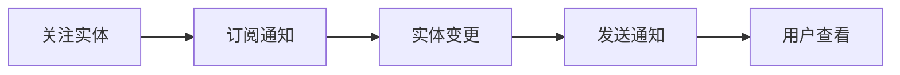

# COMMON-F04 订阅和关注

> **功能编号**: COMMON-F04  
> **功能名称**: 订阅和关注  
> **所属能力域**: 通用功能  
> **主要用户**: 所有用户  
> **页面类型**: 通用组件 + 关注页面

---

## 一、功能概述

### 1.1 功能定位
订阅和关注功能允许用户关注Epic/Feature/SSTS等实体，当实体状态变更、有新评论、有新评审时自动通知用户。

### 1.2 核心价值
- **信息跟踪**: 跟踪关注实体的动态
- **及时通知**: 及时收到关注实体的通知
- **个性化**: 个性化信息流
- **协作效率**: 提升协作效率

### 1.3 关注流程



---

## 二、页面布局

### 2.1 关注按钮组件

```
┌─────────────────────────────────────────────────────────────┐
│ 关注按钮 (FollowButton)                                     │
│ ━━━━━━━━━━━━━━━━━━━━━━━━━━━━━━━━━━━━━━━━━━━━━━━━━━━━━━━ │
│                                                             │
│ 未关注状态:                                                 │
│ [👁️ 关注]                                                  │
│                                                             │
│ 已关注状态:                                                 │
│ [👁️✓ 已关注] [取消关注]                                    │
│                                                             │
└─────────────────────────────────────────────────────────────┘
```

### 2.2 我的关注页面

```
┌─────────────────────────────────────────────────────────────┐
│ 面包屑导航: 工作区 > 我的关注                               │
├─────────────────────────────────────────────────────────────┤
│ 页面标题: 我的关注                                          │
│ [全部] [Epic] [Feature] [SSTS] [筛选] [刷新]              │
├─────────────────────────────────────────────────────────────┤
│ 关注列表                                                    │
│ ┌─────────────────────────────────────────────────────────┐│
│ │ Epic (2个)                                              ││
│ │ ─────────────────────────────────────────────────────── ││
│ │                                                         ││
│ │ ┌─────────────────────────────────────────────────────┐││
│ │ │ [P0] ADAS-E001                                       │││
│ │ │ 智能驾驶辅助系统（ADAS）                             │││
│ │ │ 📊 进度: ████░░░░░░ 40%                            │││
│ │ │ 📅 状态: 进行中  |  最后更新: 2小时前                │││
│ │ │ 🔔 通知: 3条未读                                    │││
│ │ │ [查看详情] [取消关注]                                │││
│ │ └─────────────────────────────────────────────────────┘││
│ │                                                         ││
│ │ ┌─────────────────────────────────────────────────────┐││
│ │ │ [P1] 座舱-E001                                       │││
│ │ │ 智能座舱系统                                         │││
│ │ │ 📊 进度: ███░░░░░░░ 30%                            │││
│ │ │ 📅 状态: 已批准  |  最后更新: 1天前                  │││
│ │ │ 🔔 通知: 1条未读                                    │││
│ │ │ [查看详情] [取消关注]                                │││
│ │ └─────────────────────────────────────────────────────┘││
│ │                                                         ││
│ │ Feature (5个)                                           ││
│ │ ─────────────────────────────────────────────────────── ││
│ │ ...                                                     ││
│ └─────────────────────────────────────────────────────────┘│
└─────────────────────────────────────────────────────────────┘
```

---

## 三、数据字段

### 3.1 关注关系字段

| 字段名 | 字段类型 | 说明 |
|--------|---------|------|
| id | String | 关注关系ID |
| userId | String | 用户ID |
| entityType | Enum | 实体类型: epic/feature/ssts/mr/task |
| entityId | String | 实体ID |
| notifyOnStatusChange | Boolean | 状态变更时通知 |
| notifyOnComment | Boolean | 有新评论时通知 |
| notifyOnReview | Boolean | 有新评审时通知 |
| createdAt | DateTime | 关注时间 |

### 3.2 关注实体信息字段

| 字段名 | 字段类型 | 说明 |
|--------|---------|------|
| entity | Object | 实体信息（Epic/Feature/SSTS等） |
| unreadNotificationCount | Number | 未读通知数量 |
| lastActivityAt | DateTime | 最后活动时间 |

---

## 四、交互设计

### 4.1 关注操作

- **关注**: 点击[关注]按钮关注实体
- **取消关注**: 点击[取消关注]取消关注
- **关注确认**: 关注时显示确认对话框，可选择通知偏好

### 4.2 通知偏好设置

- **状态变更通知**: 设置是否接收状态变更通知
- **评论通知**: 设置是否接收评论通知
- **评审通知**: 设置是否接收评审通知

### 4.3 我的关注页面

- **分类展示**: 按实体类型分类展示
- **筛选**: 按实体类型、状态筛选
- **排序**: 按最后更新时间、未读通知数排序
- **批量操作**: 支持批量取消关注

---

## 五、API接口

### 5.1 关注实体

**请求**:
```http
POST /api/v1/follows
Content-Type: application/json

{
  "entityType": "feature",
  "entityId": "feature-001",
  "notifyOnStatusChange": true,
  "notifyOnComment": true,
  "notifyOnReview": true
}
```

### 5.2 取消关注

**请求**:
```http
DELETE /api/v1/follows?entityType=feature&entityId=feature-001
```

### 5.3 获取我的关注列表

**请求**:
```http
GET /api/v1/follows/my?entityType=&page=1&pageSize=20
```

**响应**:
```json
{
  "code": 200,
  "data": {
    "follows": [
      {
        "id": "follow-001",
        "entityType": "epic",
        "entityId": "epic-001",
        "entity": {
          "id": "epic-001",
          "code": "ADAS-E001",
          "name": "智能驾驶辅助系统",
          "status": "in-progress",
          "progress": 40
        },
        "unreadNotificationCount": 3,
        "lastActivityAt": "2025-01-15T12:00:00Z",
        "createdAt": "2025-01-10T10:00:00Z"
      }
    ],
    "total": 7,
    "page": 1,
    "pageSize": 20
  }
}
```

---

## 六、集成位置

### 6.1 Epic详情页
- 在Epic详情页添加关注按钮
- 显示关注状态

### 6.2 Feature详情页
- 在Feature详情页添加关注按钮
- 显示关注状态

### 6.3 SSTS详情页
- 在SSTS详情页添加关注按钮
- 显示关注状态

### 6.4 工作区
- 在工作区添加"我的关注"入口
- 显示关注实体列表

---

**设计版本**: V1.0  
**最后更新**: 2026-01-17
