# 整车软件研发端到端协同平台 - 业务方案

> **面向智能驾驶、智能座舱、电子电器、底盘架构、新能源等领域的端到端研发协同平台**
>
> **版本**: V7.2 (Enterprise-Grade Business Solution Edition)  
> **日期**: 2026-01-18  
> **设计理念**: 价值流驱动 + 领域模型 + 流程协同 + 资产复用  
> **核心目标**: 构建高效、透明、协同的端到端整车软件研发管理平台
> 
> **修订说明**: 
> - V7.1: 修正需求模型为三层，Task为工作项；补充C0核心能力
> - V7.2: 补充C4-C7能力流方案；新增5个核心流程（Sprint执行、需求评审、版本管理、基线管理、变更管理）

---

## 文档导航

- [一、问题域与业务场景](#一问题域与业务场景)
- [二、平台业务架构](#二平台业务架构)
- [三、研发价值流设计](#三研发价值流设计)
- [四、需求与资产模型](#四需求与资产模型)
- [五、能力架构与核心设计](#五能力架构与核心设计)
- [六、流程定义详解](#六流程定义详解)
- [七、能力域集成与联通](#七能力域集成与联通)
- [八、角色协同与职责](#八角色协同与职责)
- [九、平台核心价值](#九平台核心价值)

---

## 一、问题域与业务场景

### 1.1 整车软件研发核心挑战

**设计说明**: 从需求管理、多域协同、资产复用、质量保障、交付效能五个维度系统梳理整车软件研发面临的核心挑战与痛点。

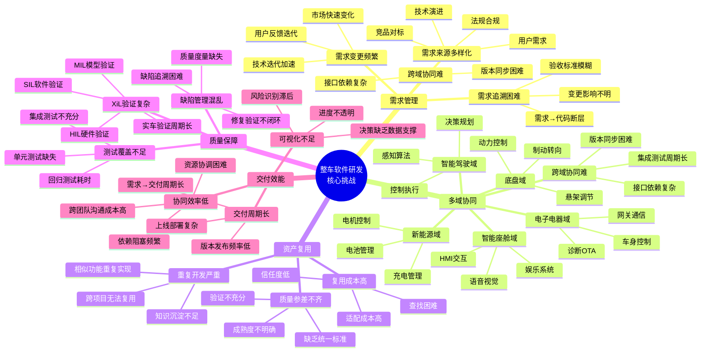

### 1.2 典型业务场景

#### 场景1: 智能驾驶功能开发

**设计说明**: 展示智能驾驶从用户需求到OTA发布的完整开发流程，以及算法迭代快、集成测试复杂、合规追溯困难三大核心痛点。

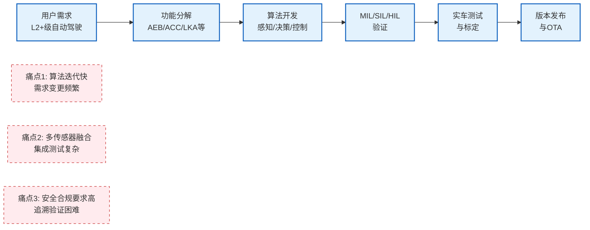

**平台解决方案**:
- ✅ **需求追溯**: 四层需求模型 + 完整追溯链
- ✅ **V型验证**: MIL/SIL/HIL/实车验证流程
- ✅ **合规管理**: 功能安全追溯 + 审计报告

#### 场景2: 智能座舱多项目复用

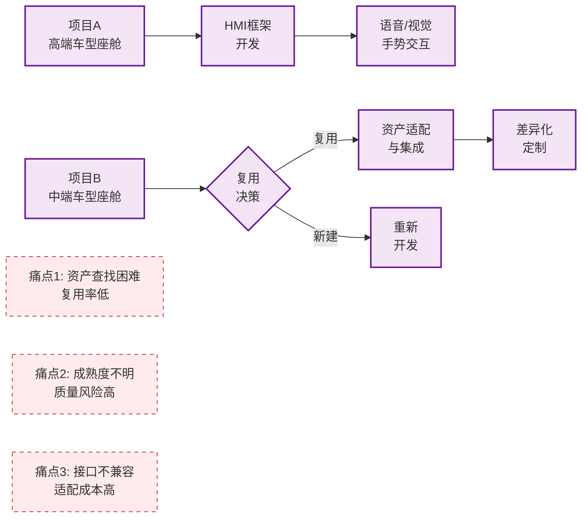

**平台解决方案**:
- ✅ **AI推荐**: 语义搜索 + 智能匹配
- ✅ **成熟度评估**: TRL等级（L1-L5）+ 质量门禁
- ✅ **复用决策**: 兼容性评估 + ROI计算

#### 场景3: 多域协同开发

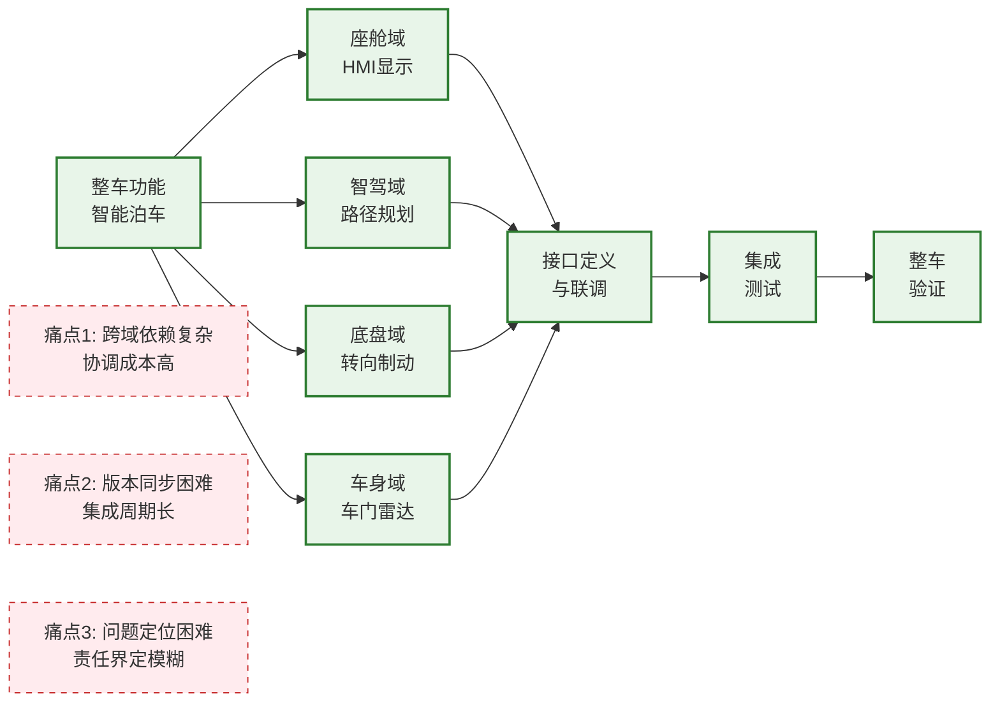

**平台解决方案**:
- ✅ **依赖管理**: 依赖识别 → 依赖跟踪 → 冲突检测 → 协调机制
- ✅ **版本同步**: 基线管理 + 集成计划 + 集成看板
- ✅ **接口管理**: 接口定义 + Mock服务 + 契约测试

#### 场景4: 敏捷迭代与持续交付

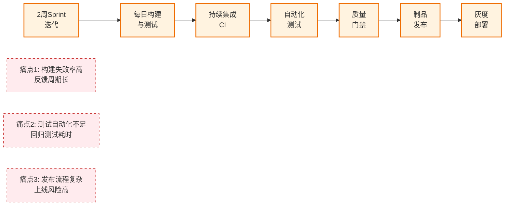

**平台解决方案**:
- ✅ **CI/CD流水线**: 自动触发 + 并行执行 + 快速反馈
- ✅ **自动化测试**: 单元测试 + 集成测试 + 回归测试
- ✅ **灰度发布**: 分阶段发布 + 自动回滚 + 监控告警

### 1.3 平台定位与目标

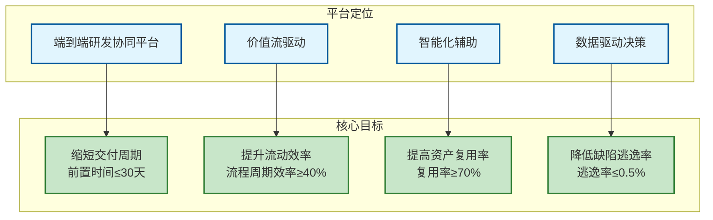

**平台核心价值主张**:

| 维度 | 现状问题 | 平台方案 | 预期收益 |
|------|---------|---------|---------|
| **需求管理** | 需求追溯困难，变更影响分析耗时 | 四层需求分解 + 完整追溯链 | 需求变更响应时间缩短50% |
| **规划协调** | PI Planning耗时长，容量评估不准 | 智能分配 + 可视化规划 | PI Planning时间从5天缩短至2天 |
| **迭代执行** | 团队进度不透明，协同效率低 | 实时看板 + 燃尽图 + 日报 | 团队速率稳定性提升30% |
| **资产复用** | 资产查找困难，复用率低 | AI推荐 + 智能匹配 | 资产复用率从30%提升至70% |
| **价值交付** | 交付周期长，效能指标缺失 | 价值流度量 + 持续改进 | 前置时间缩短40% |

---

## 二、平台业务架构

### 2.1 四层整体架构

**设计说明**: 平台采用四层架构（管理框架层、价值流层、核心能力层、治理层），支撑从项目管理到价值交付的端到端研发协同。

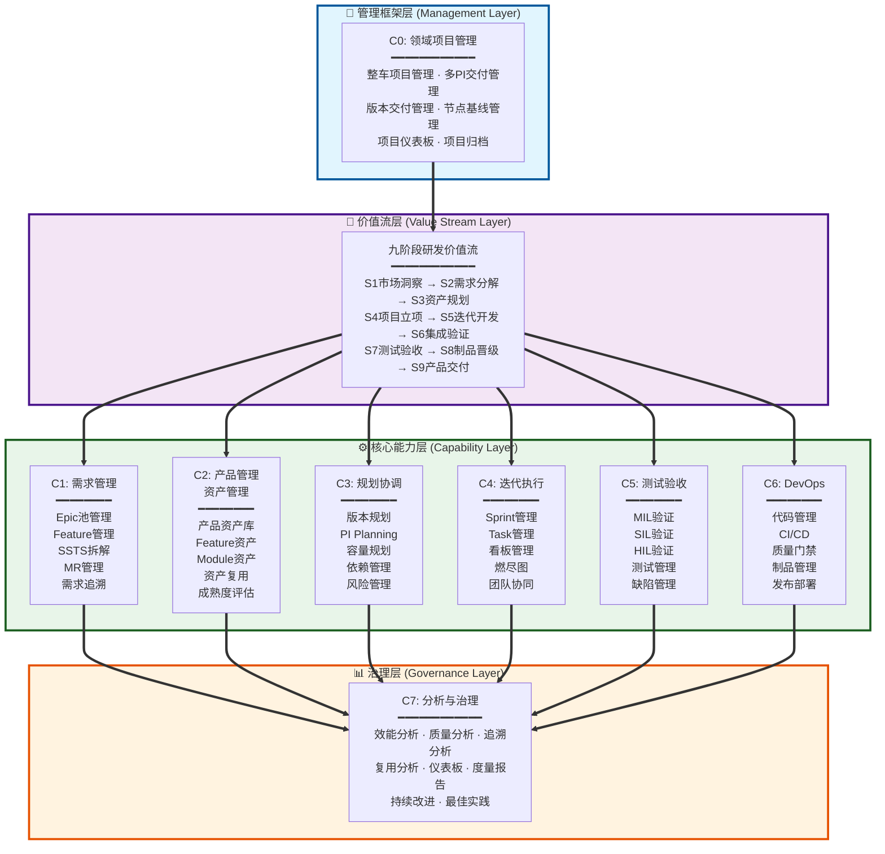

### 2.2 核心设计理念

**设计说明**: 平台基于五大核心设计理念（三层需求模型、三层资产模型、九阶段价值流、流程驱动、多角色协同）构建完整的端到端研发协同体系。

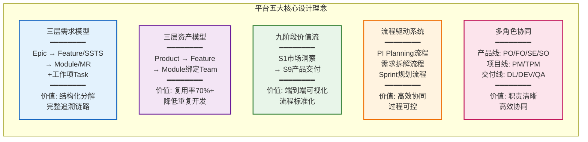

**设计理念详解**:

1. **三层需求模型**: Epic → Feature/SSTS → Module/MR 三层结构化需求分解，Task作为工作项支持计划和跟踪，确保需求可追溯、可验收
2. **三层资产模型**: 产品-功能-模块三层资产管理，支持跨项目复用和快速组装
3. **九阶段价值流**: 从市场洞察到产品交付的端到端价值流，识别瓶颈并持续优化
4. **流程驱动系统**: 关键业务流程模板化、自动化，提升协同效率
5. **多角色协同**: 清晰的角色定义和职责分工，支持矩阵式组织协同

---

## 三、研发价值流设计

### 3.1 九阶段价值流全景

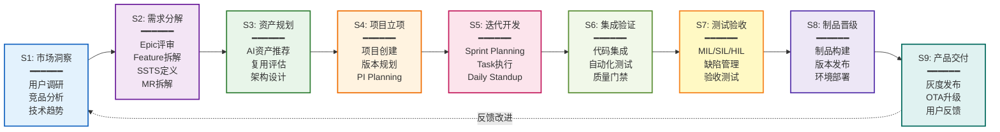

### 3.2 价值流关键指标

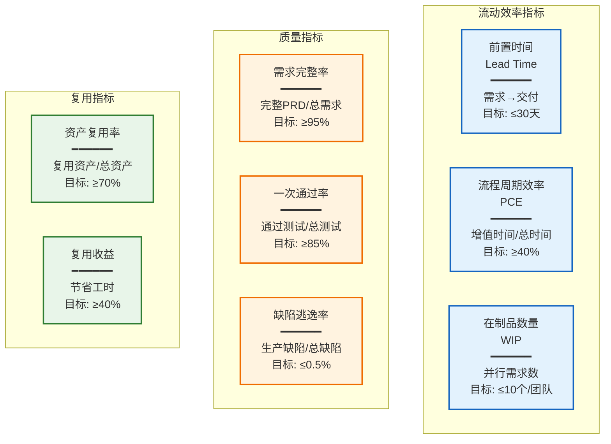

### 3.3 价值流分析方法

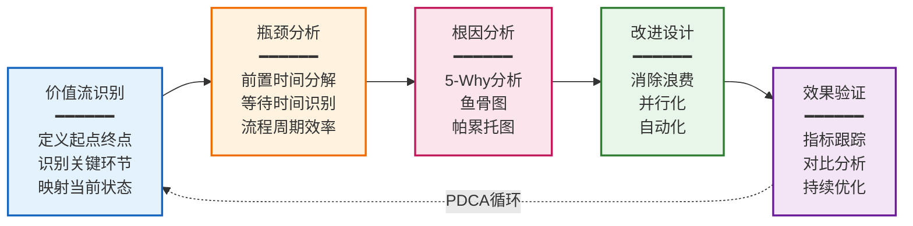

---

## 四、需求与资产模型

### 4.1 三层需求模型与工作项

**设计说明**: 定义三层需求模型（Epic → Feature/SSTS → Module/MR）实现需求层次化分解，Task作为工作项（非需求层）用于计划、开发、测试管理和跟踪，可完整溯源到需求链路源头。

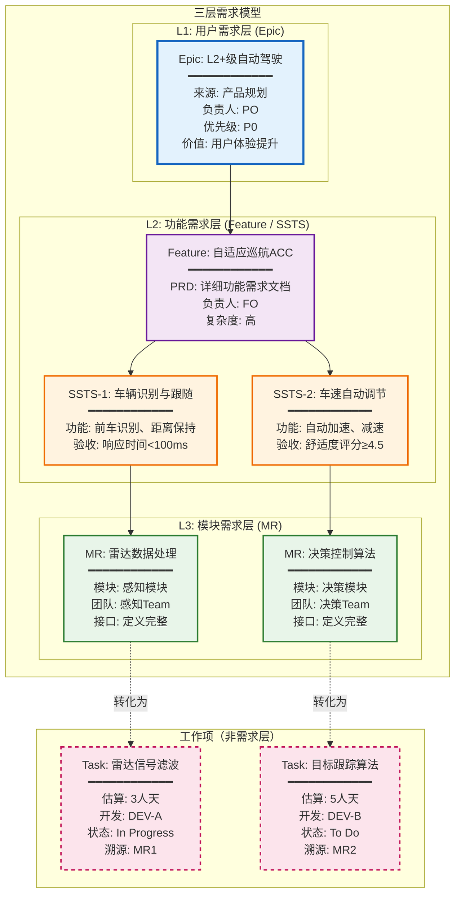

**需求层级与工作项说明**:

| 类型 | 层级 | 名称 | 定义 | 负责人 | 管理位置 |
|------|------|------|------|--------|---------|
| **需求层** | **L1** | Epic | 用户价值需求，来自市场、产品规划 | PO | 需求池（可编辑、评审） |
| **需求层** | **L2** | Feature | 产品功能，有PRD文档 | FO | 项目中（只读引用） |
| **需求层** | **L2** | SSTS | 软件系统技术规格，功能/技术/测试 | SE | 项目中（拆解自PRD） |
| **需求层** | **L3** | MR | 模块需求，分配给团队 | SO | 模块管理（Team视角） |
| **工作项** | - | Task | 可执行任务，2-8小时，用于计划和跟踪 | DEV | Sprint Backlog |

**说明**: 
- Task是工作项，不是需求层级
- Task从MR转化而来，用于开发、测试的计划、管理和跟踪
- Task可完整溯源到Epic → Feature/SSTS → MR的需求链路

### 4.2 三层资产模型

**设计说明**: 建立Product-Feature-Module三层资产管理体系，支持跨项目资产复用和快速组装，每层资产包含成熟度（TRL）、质量评分、依赖关系等关键信息。

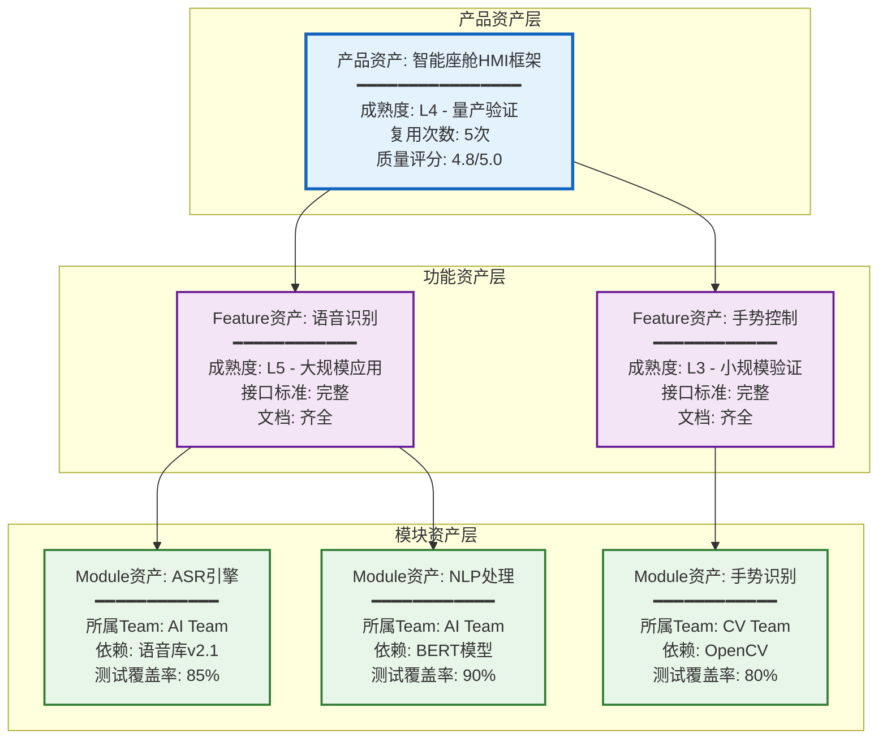

**资产成熟度等级（TRL）**:

| 等级 | 名称 | 定义 | 验证要求 |
|------|------|------|---------|
| **L1** | 概念验证 | 基本原理可行性验证 | 技术方案评审 |
| **L2** | 技术验证 | 关键技术点验证 | Demo演示 |
| **L3** | 小规模验证 | 单项目小规模应用 | 集成测试通过 |
| **L4** | 量产验证 | 多项目量产应用 | 实车验证通过 |
| **L5** | 大规模应用 | 5个以上项目复用 | 用户反馈良好 |

### 4.3 需求到资产的映射

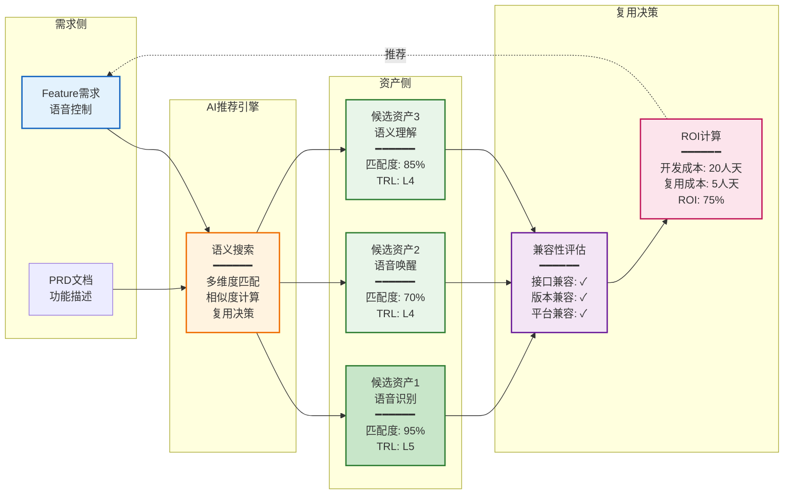

---

## 五、能力架构与核心设计

### 5.1 八大核心能力域

**设计说明**: 平台核心能力域划分为八大领域（C0-C7），覆盖从项目管理、需求管理、资产管理到开发测试发布的全生命周期能力。

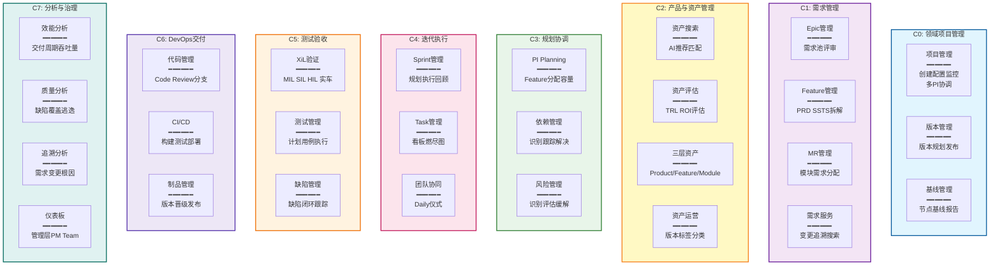

### 5.2 C0领域项目管理核心能力

**设计说明**: C0领域项目管理聚焦整车项目全生命周期管理，核心包括基于车型节点的产品版本规划、基线管理、多PI交付管理，以及为多团队多迭代提供的PI Planning协调能力。

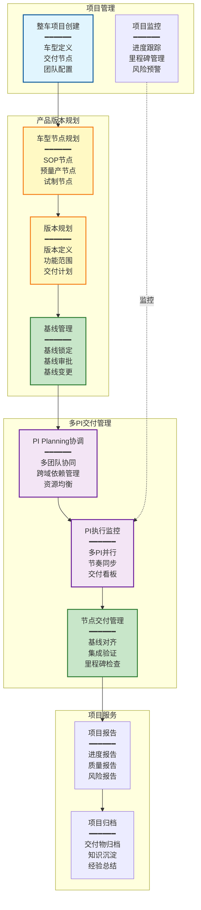

**核心能力说明**:

#### 1. 产品版本规划（基于车型节点）

**车型节点规划**:
- 定义车型关键交付节点（SOP、预量产、试制等）
- 节点与基线强关联，确保交付质量
- 支持多车型并行开发

**版本规划**:
- 版本与车型节点绑定（如：SOP基线版本）
- 明确版本功能范围和交付计划
- 支持版本依赖和版本演进

**基线管理**:
- 基线定义：车型节点对应的软件配置基线
- 基线锁定：节点前锁定基线，严格变更管理
- 基线审批：多级审批机制，确保基线质量

#### 2. 多PI交付管理

**PI Planning协调**:
- 多团队PI Planning统一协调（10-20个Team）
- 跨域依赖识别和管理（智驾、座舱、车身等）
- 资源容量评估和负载均衡

**PI执行监控**:
- 多PI并行执行（2-3个PI同时进行）
- 节奏同步：保持各PI同步节奏
- 交付看板：可视化PI执行状态

**节点交付管理**:
- 基线对齐：PI交付与车型节点基线对齐
- 集成验证：多域集成验证（HIL、实车）
- 里程碑检查：节点前质量门禁检查

#### 3. 项目管理价值

| 能力 | 价值 | 目标 |
|------|------|------|
| **车型节点规划** | 明确交付目标，对齐组织 | 节点达成率≥90% |
| **基线管理** | 配置可控，质量可追溯 | 基线变更<5% |
| **多PI协调** | 多团队高效协同 | PI Planning时间从5天→2天 |
| **节点交付** | 按时按质交付 | 按时交付率≥85% |

### 5.3 C1需求管理核心能力

**设计说明**: C1需求管理实现Epic-Feature/SSTS-MR三层需求分解，支持需求池管理、PRD编写、SSTS拆解、MR细化全流程。

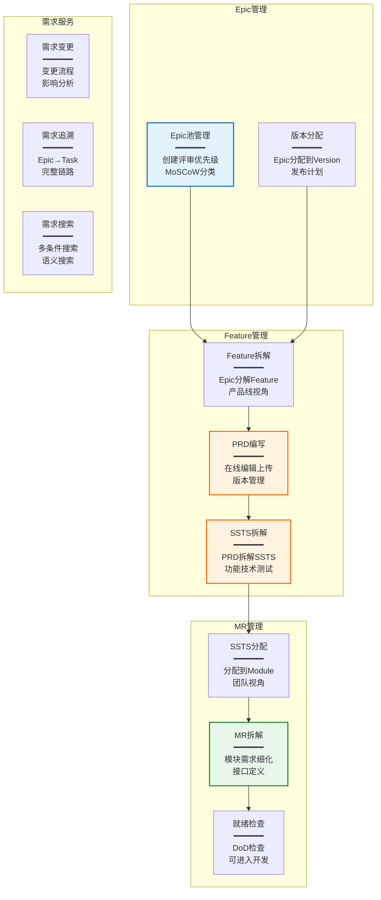

### 5.4 C2资产管理核心能力

**设计说明**: C2资产管理通过AI语义搜索和智能匹配实现资产推荐，结合TRL成熟度评估和ROI计算支持复用决策。

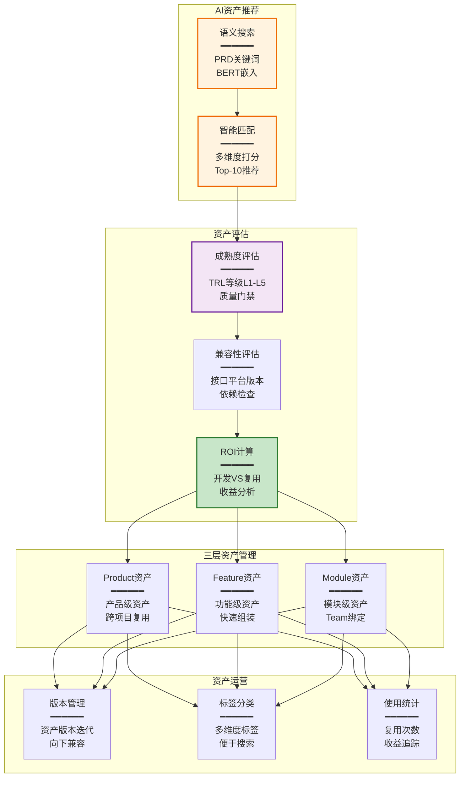

### 5.5 C3规划协调核心能力

**设计说明**: C3规划协调通过PI Planning、依赖管理、风险管理三大核心能力，实现多团队高效协同规划和执行监控。

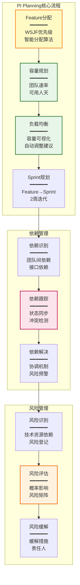

### 5.6 C4迭代执行核心能力

**设计说明**: C4迭代执行通过Sprint管理、Task看板、团队协同、进度跟踪四大核心能力，实现从Sprint Planning到Sprint交付的全过程管理。

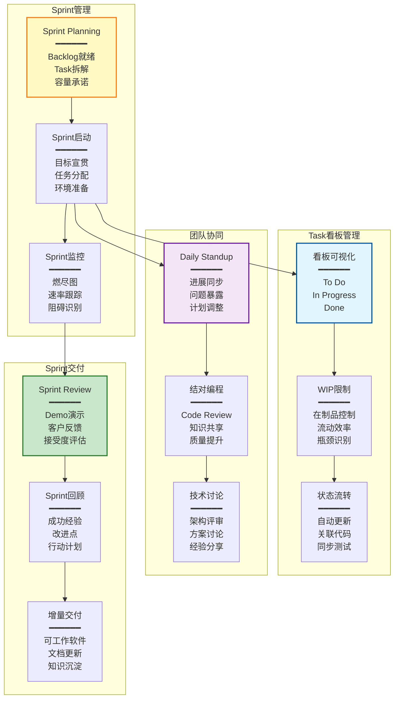

### 5.7 C5测试验收核心能力

**设计说明**: C5测试验收通过V模型验证（MIL/SIL/HIL/Vehicle）、测试管理、缺陷管理、质量门禁四大核心能力，确保软件质量和功能符合性。

```mermaid
graph TB
    subgraph V模型验证
        VM1[MIL验证<br/>━━━━━━<br/>模型在环<br/>算法验证<br/>功能正确性]
        VM2[SIL验证<br/>━━━━━━<br/>软件在环<br/>代码验证<br/>性能测试]
        VM3[HIL验证<br/>━━━━━━<br/>硬件在环<br/>集成验证<br/>实时性测试]
        VM4[实车验证<br/>━━━━━━<br/>整车测试<br/>场景验证<br/>用户体验]
    end

    subgraph 测试管理
        TM1[测试计划<br/>━━━━━━<br/>测试策略<br/>用例设计<br/>资源安排]
        TM2[用例管理<br/>━━━━━━<br/>用例库<br/>需求覆盖<br/>版本管理]
        TM3[测试执行<br/>━━━━━━<br/>自动化测试<br/>手工测试<br/>结果记录]
    end

    subgraph 缺陷管理
        DM1[缺陷提交<br/>━━━━━━<br/>缺陷记录<br/>严重级别<br/>复现步骤]
        DM2[缺陷跟踪<br/>━━━━━━<br/>状态流转<br/>修复验证<br/>关闭确认]
        DM3[缺陷分析<br/>━━━━━━<br/>根因分析<br/>趋势分析<br/>预防措施]
    end

    subgraph 质量门禁
        QG1[代码质量<br/>━━━━━━<br/>代码扫描<br/>覆盖率检查<br/>复杂度分析]
        QG2[测试质量<br/>━━━━━━<br/>测试覆盖率<br/>通过率<br/>缺陷密度]
        QG3[发布准入<br/>━━━━━━<br/>门禁检查<br/>准出评审<br/>发布决策]
    end

    VM1 --> VM2 --> VM3 --> VM4
    TM1 --> TM2 --> TM3
    TM3 --> DM1 --> DM2 --> DM3
    DM3 --> QG1 --> QG2 --> QG3

    style VM1 fill:#e3f2fd,stroke:#1565c0,stroke-width:2px
    style VM3 fill:#fff3e0,stroke:#ef6c00,stroke-width:2px
    style TM1 fill:#f3e5f5,stroke:#6a1b9a,stroke-width:2px
    style DM2 fill:#fce4ec,stroke:#c2185b,stroke-width:2px
    style QG3 fill:#c8e6c9,stroke:#2e7d32,stroke-width:2px
```

### 5.8 C6 DevOps交付核心能力

**设计说明**: C6 DevOps交付通过代码管理、CI/CD流水线、制品管理、发布部署四大核心能力，实现从代码提交到生产发布的自动化交付。

```mermaid
graph TB
    subgraph 代码管理
        CM1[代码仓库<br/>━━━━━━<br/>Git分支策略<br/>权限管理<br/>合并请求]
        CM2[Code Review<br/>━━━━━━<br/>评审规则<br/>静态检查<br/>评审通过]
        CM3[分支管理<br/>━━━━━━<br/>Feature分支<br/>Release分支<br/>Hotfix分支]
    end

    subgraph CI/CD流水线
        CI1[持续集成<br/>━━━━━━<br/>自动构建<br/>单元测试<br/>集成测试]
        CI2[持续部署<br/>━━━━━━<br/>环境部署<br/>自动化测试<br/>冒烟测试]
        CI3[质量门禁<br/>━━━━━━<br/>代码扫描<br/>覆盖率检查<br/>安全扫描]
    end

    subgraph 制品管理
        AM1[制品构建<br/>━━━━━━<br/>版本号<br/>依赖打包<br/>签名加密]
        AM2[制品存储<br/>━━━━━━<br/>制品库<br/>版本管理<br/>访问控制]
        AM3[制品晋级<br/>━━━━━━<br/>Dev→Test→Prod<br/>审批流程<br/>回滚能力]
    end

    subgraph 发布部署
        RD1[灰度发布<br/>━━━━━━<br/>金丝雀<br/>蓝绿部署<br/>A/B测试]
        RD2[OTA升级<br/>━━━━━━<br/>差分包<br/>断点续传<br/>回滚机制]
        RD3[监控告警<br/>━━━━━━<br/>性能监控<br/>日志分析<br/>异常告警]
    end

    CM1 --> CM2 --> CM3
    CM3 --> CI1 --> CI2 --> CI3
    CI3 --> AM1 --> AM2 --> AM3
    AM3 --> RD1 --> RD2 --> RD3

    style CM2 fill:#e3f2fd,stroke:#1565c0,stroke-width:2px
    style CI1 fill:#fff9c4,stroke:#f57f17,stroke-width:2px
    style CI3 fill:#fce4ec,stroke:#c2185b,stroke-width:2px
    style AM3 fill:#f3e5f5,stroke:#6a1b9a,stroke-width:2px
    style RD1 fill:#c8e6c9,stroke:#2e7d32,stroke-width:2px
```

### 5.9 C7分析与治理核心能力

**设计说明**: C7分析与治理通过效能分析、质量分析、追溯分析、仪表板四大核心能力，提供数据驱动的决策支持和持续改进。

```mermaid
graph TB
    subgraph 效能分析
        EA1[交付效能<br/>━━━━━━<br/>前置时间<br/>部署频率<br/>MTTR]
        EA2[流程效率<br/>━━━━━━<br/>周期时间<br/>流动效率<br/>瓶颈识别]
        EA3[团队效能<br/>━━━━━━<br/>速率稳定性<br/>产能分析<br/>负载均衡]
    end

    subgraph 质量分析
        QA1[缺陷分析<br/>━━━━━━<br/>缺陷密度<br/>缺陷趋势<br/>逃逸率]
        QA2[测试分析<br/>━━━━━━<br/>测试覆盖率<br/>自动化率<br/>测试效率]
        QA3[代码质量<br/>━━━━━━<br/>复杂度<br/>重复率<br/>技术债务]
    end

    subgraph 追溯分析
        TA1[需求追溯<br/>━━━━━━<br/>Epic→Task<br/>完整链路<br/>影响分析]
        TA2[变更追溯<br/>━━━━━━<br/>变更历史<br/>关联分析<br/>根因定位]
        TA3[复用分析<br/>━━━━━━<br/>复用率<br/>ROI计算<br/>收益评估]
    end

    subgraph 仪表板与报告
        DB1[管理驾驶舱<br/>━━━━━━<br/>高管视角<br/>战略指标<br/>决策支持]
        DB2[项目仪表板<br/>━━━━━━<br/>PM视角<br/>进度质量<br/>风险预警]
        DB3[团队仪表板<br/>━━━━━━<br/>Team视角<br/>速率燃尽<br/>任务状态]
    end

    EA1 --> EA2 --> EA3
    QA1 --> QA2 --> QA3
    TA1 --> TA2 --> TA3
    EA3 & QA3 & TA3 --> DB1 --> DB2 --> DB3

    style EA1 fill:#fff9c4,stroke:#f57f17,stroke-width:2px
    style QA1 fill:#fce4ec,stroke:#c2185b,stroke-width:2px
    style TA1 fill:#f3e5f5,stroke:#6a1b9a,stroke-width:2px
    style DB1 fill:#e3f2fd,stroke:#1565c0,stroke-width:2px
    style DB3 fill:#c8e6c9,stroke:#2e7d32,stroke-width:2px
```

---

## 六、流程定义详解

### 6.1 PI Planning流程（10步）

```mermaid
graph TB
    START([流程开始]) --> P1[P1: PI创建<br/>━━━━━━<br/>角色: PM<br/>输入: 项目Epic列表<br/>输出: PI实例]
    
    P1 --> P2[P2: 目标设定<br/>━━━━━━<br/>角色: PM+PO<br/>输入: PI愿景<br/>输出: PI目标]
    
    P2 --> P3[P3: Feature分配<br/>━━━━━━<br/>角色: TPM<br/>输入: Feature池<br/>输出: Feature分配方案]
    
    P3 --> P4[P4: 容量规划<br/>━━━━━━<br/>角色: DL<br/>输入: 团队速率<br/>输出: 容量评估]
    
    P4 --> P5[P5: 负载均衡<br/>━━━━━━<br/>角色: TPM<br/>输入: 容量数据<br/>输出: 调整方案]
    
    P5 --> P6[P6: Sprint规划<br/>━━━━━━<br/>角色: DL<br/>输入: Feature分配<br/>输出: Sprint计划]
    
    P6 --> P7[P7: PI Board<br/>━━━━━━<br/>角色: PM+团队<br/>输入: Sprint计划<br/>输出: PI看板]
    
    P7 --> P8[P8: 依赖识别<br/>━━━━━━<br/>角色: 全体<br/>输入: PI看板<br/>输出: 依赖列表]
    
    P8 --> P9[P9: 风险识别<br/>━━━━━━<br/>角色: 全体<br/>输入: PI计划<br/>输出: 风险列表]
    
    P9 --> P10[P10: PI承诺<br/>━━━━━━<br/>角色: 团队<br/>输入: PI计划<br/>输出: 团队承诺]
    
    P10 --> END([流程结束])
    
    style START fill:#c8e6c9,stroke:#2e7d32,stroke-width:3px
    style P1 fill:#e1f5fe,stroke:#01579b,stroke-width:2px
    style P3 fill:#fff9c4,stroke:#f57f17,stroke-width:2px
    style P6 fill:#fff9c4,stroke:#f57f17,stroke-width:2px
    style P10 fill:#c8e6c9,stroke:#2e7d32,stroke-width:2px
    style END fill:#c8e6c9,stroke:#2e7d32,stroke-width:3px
```

**PI Planning流程关键点**:

| 步骤 | 步骤名称 | 角色 | 关键活动 | 检查点 | 输出 |
|------|---------|------|---------|--------|------|
| **P1** | PI创建 | PM | 设置PI名称时间范围 | PI信息完整 | PI实例 |
| **P2** | 目标设定 | PM+PO | 讨论PI业务目标 | 目标SMART | PI目标 |
| **P3** | Feature分配 | TPM | WSJF排序分配到团队 | 容量不超载 | Feature分配方案 |
| **P4** | 容量规划 | DL | 评估团队可用人天速率 | 容量合理 | 容量评估 |
| **P5** | 负载均衡 | TPM | 根据容量调整Feature | 负载均衡 | 调整方案 |
| **P6** | Sprint规划 | DL | 将Feature分配到Sprint | Sprint可交付 | Sprint计划 |
| **P7** | PI Board | PM+团队 | 展示PI全貌团队计划 | 可视化清晰 | PI看板 |
| **P8** | 依赖识别 | 全体 | 识别跨团队依赖 | 依赖明确 | 依赖列表 |
| **P9** | 风险识别 | 全体 | 识别技术资源风险 | 风险已记录 | 风险列表 |
| **P10** | PI承诺 | 团队 | 团队确认承诺 | 承诺明确 | 团队承诺 |

### 6.2 需求拆解流程（4步）

```mermaid
graph TB
    START([流程开始]) --> R1[R1: Epic评审<br/>━━━━━━<br/>角色: PO+团队<br/>输入: Epic<br/>输出: 评审通过的Epic]
    
    R1 --> R2[R2: Feature拆解<br/>━━━━━━<br/>角色: FO<br/>输入: Epic<br/>输出: Feature列表+PRD]
    
    R2 --> R3[R3: SSTS拆解<br/>━━━━━━<br/>角色: SE<br/>输入: PRD<br/>输出: SSTS列表]
    
    R3 --> R4[R4: MR拆解<br/>━━━━━━<br/>角色: SO<br/>输入: SSTS<br/>输出: MR列表]
    
    R4 --> END([流程结束])
    
    style START fill:#c8e6c9,stroke:#2e7d32,stroke-width:3px
    style R1 fill:#e3f2fd,stroke:#1565c0,stroke-width:2px
    style R2 fill:#f3e5f5,stroke:#6a1b9a,stroke-width:2px
    style R3 fill:#fff3e0,stroke:#ef6c00,stroke-width:2px
    style R4 fill:#e8f5e9,stroke:#2e7d32,stroke-width:2px
    style END fill:#c8e6c9,stroke:#2e7d32,stroke-width:3px
```

**需求拆解关键规则**:
- Epic在需求池中可编辑评审，引入项目后只读
- PRD可以在线编辑或上传文档
- SSTS分为功能型、技术型、测试型三类
- MR需明确接口定义和验收标准

### 6.3 Sprint规划流程（5步）

```mermaid
graph TB
    START([流程开始]) --> S1[S1: Backlog准备<br/>━━━━━━<br/>角色: PO+Team<br/>输入: Feature/MR<br/>输出: 就绪Backlog]
    
    S1 --> S2[S2: Task拆解<br/>━━━━━━<br/>角色: DEV<br/>输入: MR<br/>输出: Task列表]
    
    S2 --> S3[S3: Task估算<br/>━━━━━━<br/>角色: DEV<br/>输入: Task<br/>输出: 估算工时]
    
    S3 --> S4[S4: Task分配<br/>━━━━━━<br/>角色: DL<br/>输入: Task+估算<br/>输出: 分配方案]
    
    S4 --> S5[S5: Sprint承诺<br/>━━━━━━<br/>角色: Team<br/>输入: Sprint Plan<br/>输出: 团队承诺]
    
    S5 --> END([流程结束])
    
    style START fill:#c8e6c9,stroke:#2e7d32,stroke-width:3px
    style S2 fill:#fce4ec,stroke:#c2185b,stroke-width:2px
    style S3 fill:#fff9c4,stroke:#f57f17,stroke-width:2px
    style S5 fill:#c8e6c9,stroke:#2e7d32,stroke-width:2px
    style END fill:#c8e6c9,stroke:#2e7d32,stroke-width:3px
```

### 6.4 Sprint执行与交付流程（承接PI Planning）

**设计说明**: Sprint执行与交付流程承接PI Planning，通过持续计划、每日协同、进度跟踪、Review和Retrospective实现2周迭代的目标交付。

```mermaid
graph TB
    START([Sprint开始<br/>承接PI Planning]) --> SP1[SP1: Sprint Planning<br/>━━━━━━<br/>角色: DL+Team<br/>输入: PI分配的Feature/MR<br/>输出: Sprint Backlog<br/>检查点: 承诺明确]
    
    SP1 --> SP2[SP2: Sprint启动会<br/>━━━━━━<br/>角色: DL+Team<br/>输入: Sprint目标<br/>输出: 任务分配<br/>检查点: 目标理解一致]
    
    SP2 --> LOOP_START{开始迭代循环<br/>━━━━━━<br/>持续2周}
    
    LOOP_START --> DS1[DS1: Daily Standup<br/>━━━━━━<br/>角色: Team<br/>频率: 每日15分钟<br/>内容: 昨天/今天/阻碍<br/>输出: 问题清单]
    
    DS1 --> DS2[DS2: Task执行<br/>━━━━━━<br/>角色: DEV/QA<br/>活动: 开发测试<br/>工具: 看板燃尽图<br/>输出: 增量代码]
    
    DS2 --> DS3[DS3: 进度跟踪<br/>━━━━━━<br/>角色: DL<br/>活动: 燃尽图更新<br/>监控: WIP/阻碍<br/>输出: 进度报告]
    
    DS3 --> DS4[DS4: 协同解决<br/>━━━━━━<br/>角色: Team<br/>活动: 技术讨论<br/>处理: 阻碍依赖<br/>输出: 问题解决]
    
    DS4 --> CHECK{Sprint结束?<br/>━━━━━━<br/>2周到期}
    
    CHECK -->|否| DS1
    
    CHECK -->|是| SR1[SR1: Sprint Review<br/>━━━━━━<br/>角色: Team+PO<br/>活动: Demo演示<br/>验收: DoD检查<br/>输出: 完成增量]
    
    SR1 --> SR2[SR2: Sprint Retrospective<br/>━━━━━━<br/>角色: Team+DL<br/>活动: 回顾改进<br/>识别: 成功点/改进点<br/>输出: 改进行动]
    
    SR2 --> SR3[SR3: 同步到PI<br/>━━━━━━<br/>角色: DL+PM<br/>活动: PI看板更新<br/>同步: 完成度/风险<br/>输出: PI进度报告]
    
    SR3 --> NEXT_CHECK{PI结束?<br/>━━━━━━<br/>所有Sprint完成}
    
    NEXT_CHECK -->|否<br/>继续下个Sprint| SP1
    NEXT_CHECK -->|是<br/>PI完成| END([PI交付<br/>节点验收])
    
    style START fill:#c8e6c9,stroke:#2e7d32,stroke-width:3px
    style SP1 fill:#fff9c4,stroke:#f57f17,stroke-width:2px
    style DS1 fill:#e1f5fe,stroke:#01579b,stroke-width:2px
    style DS2 fill:#fce4ec,stroke:#c2185b,stroke-width:2px
    style SR1 fill:#f3e5f5,stroke:#6a1b9a,stroke-width:2px
    style SR3 fill:#fff3e0,stroke:#ef6c00,stroke-width:2px
    style END fill:#c8e6c9,stroke:#2e7d32,stroke-width:3px
```

**Sprint执行关键活动**:

| 阶段 | 活动 | 频率 | 关键输出 | 检查点 |
|------|------|------|---------|--------|
| **Planning** | Sprint Planning | Sprint开始 | Sprint Backlog | 承诺明确、容量合理 |
| **执行** | Daily Standup | 每日 | 问题清单 | 阻碍及时暴露 |
| **执行** | Task执行 | 持续 | 增量代码 | WIP限制、质量门禁 |
| **执行** | 进度跟踪 | 每日 | 燃尽图 | 速率稳定、风险预警 |
| **Review** | Sprint Review | Sprint结束 | 完成增量 | DoD检查通过 |
| **改进** | Retrospective | Sprint结束 | 改进行动 | 持续改进PDCA |
| **同步** | PI同步 | Sprint结束 | PI进度报告 | PI目标对齐 |

### 6.5 特性需求评审流程

**设计说明**: 特性需求评审流程包含PRD评审（单个Feature评审）和SSTS批量评审（多个SSTS统一评审），确保需求质量和团队共识。

```mermaid
graph TB
    START([需求评审开始]) --> TYPE_CHECK{评审类型<br/>━━━━━━}
    
    TYPE_CHECK -->|PRD评审| PRD1[PRD1: PRD准备<br/>━━━━━━<br/>角色: FO<br/>活动: PRD编写完成<br/>检查: 完整性检查<br/>输出: PRD文档v1.0]
    
    PRD1 --> PRD2[PRD2: 评审准备<br/>━━━━━━<br/>角色: FO<br/>活动: 发起评审<br/>邀请: SE/SO/DL/QA<br/>输出: 评审会议]
    
    PRD2 --> PRD3[PRD3: PRD评审<br/>━━━━━━<br/>角色: 评审团队<br/>活动: 需求宣讲<br/>验证: 完整性/可行性<br/>输出: 评审意见]
    
    PRD3 --> PRD4{评审结果<br/>━━━━━━}
    
    PRD4 -->|不通过<br/>重大问题| PRD5[PRD修订<br/>━━━━━━<br/>FO修订PRD<br/>重新发起评审]
    PRD5 --> PRD2
    
    PRD4 -->|通过<br/>或小问题| PRD6[PRD6: PRD发布<br/>━━━━━━<br/>角色: FO<br/>活动: 状态设为评审通过<br/>触发: SSTS拆解<br/>输出: PRD v1.0正式版]
    
    TYPE_CHECK -->|SSTS批量评审| SSTS1[SSTS1: SSTS拆解<br/>━━━━━━<br/>角色: SE<br/>输入: PRD<br/>拆解: 功能/技术/测试型<br/>输出: SSTS列表]
    
    SSTS1 --> SSTS2[SSTS2: 评审准备<br/>━━━━━━<br/>角色: SE<br/>活动: 批量打包<br/>邀请: SO/DL/QA团队<br/>输出: 批量评审清单]
    
    SSTS2 --> SSTS3[SSTS3: 批量评审<br/>━━━━━━<br/>角色: 评审团队<br/>活动: 逐条评审<br/>批注: 通过/问题/退回<br/>输出: 评审记录]
    
    SSTS3 --> SSTS4[SSTS4: 问题处理<br/>━━━━━━<br/>角色: SE<br/>活动: 修订有问题的SSTS<br/>重审: 仅修订项<br/>输出: SSTS修订版]
    
    SSTS4 --> SSTS5[SSTS5: SSTS发布<br/>━━━━━━<br/>角色: SE<br/>活动: 批量发布<br/>触发: MR拆解<br/>输出: SSTS正式版]
    
    PRD6 --> MERGE([评审完成<br/>需求就绪])
    SSTS5 --> MERGE
    
    style START fill:#c8e6c9,stroke:#2e7d32,stroke-width:3px
    style PRD3 fill:#f3e5f5,stroke:#6a1b9a,stroke-width:2px
    style PRD6 fill:#c8e6c9,stroke:#2e7d32,stroke-width:2px
    style SSTS3 fill:#fff3e0,stroke:#ef6c00,stroke-width:2px
    style SSTS5 fill:#c8e6c9,stroke:#2e7d32,stroke-width:2px
    style MERGE fill:#c8e6c9,stroke:#2e7d32,stroke-width:3px
```

**评审关键检查项**:

| 评审类型 | 检查项 | 评审角色 | 通过标准 |
|---------|--------|---------|---------|
| **PRD评审** | 需求完整性 | SE/SO/DL/QA | 功能描述清晰完整 |
| **PRD评审** | 技术可行性 | SE/DL | 技术方案可实现 |
| **PRD评审** | 测试可验证性 | QA | 验收标准明确 |
| **PRD评审** | 接口依赖 | SO/DL | 接口定义清晰 |
| **SSTS批量评审** | 覆盖完整性 | SO/DL | 覆盖PRD全部条目 |
| **SSTS批量评审** | 拆解合理性 | SO/DL | 粒度适中、可实现 |
| **SSTS批量评审** | 模块分配 | SO | 模块责任明确 |
| **SSTS批量评审** | 验收标准 | QA | 可测试、可量化 |

### 6.6 产品需求版本管理与发布流程

**设计说明**: 产品需求版本管理流程管理产品下Feature和MR的版本定义、内容规划、评审发布、变更控制全生命周期。

```mermaid
graph TB
    START([版本规划开始]) --> V1[V1: 版本创建<br/>━━━━━━<br/>角色: PO<br/>输入: 产品路线图<br/>定义: 版本号/发布日期<br/>输出: 版本实例]
    
    V1 --> V2[V2: Feature规划<br/>━━━━━━<br/>角色: PO+FO<br/>活动: 选择Epic拆解Feature<br/>分配: Feature→Version<br/>输出: 版本Feature清单]
    
    V2 --> V3[V3: Feature评审<br/>━━━━━━<br/>角色: PO+TPM<br/>活动: PRD评审<br/>确认: 功能范围<br/>输出: 锁定Feature列表]
    
    V3 --> V4[V4: SSTS拆解<br/>━━━━━━<br/>角色: SE<br/>活动: 批量拆解SSTS<br/>评审: SSTS批量评审<br/>输出: SSTS清单]
    
    V4 --> V5[V5: MR分配<br/>━━━━━━<br/>角色: SO<br/>活动: SSTS分配到Module<br/>拆解: MR细化<br/>输出: MR清单]
    
    V5 --> V6[V6: 版本锁定<br/>━━━━━━<br/>角色: PO<br/>决策: 版本内容最终确认<br/>锁定: Feature/SSTS/MR<br/>输出: 版本Baseline v1.0]
    
    V6 --> V7[V7: 版本发布<br/>━━━━━━<br/>角色: PO<br/>活动: 状态设为已发布<br/>通知: 项目团队<br/>输出: 版本可用于项目]
    
    V7 --> V8{版本变更?<br/>━━━━━━<br/>开发过程中}
    
    V8 -->|需要变更| VC1[VC1: 变更申请<br/>━━━━━━<br/>角色: FO/SE/SO<br/>活动: 提交变更请求<br/>说明: 变更原因/影响<br/>输出: 变更申请单]
    
    VC1 --> VC2[VC2: 影响分析<br/>━━━━━━<br/>角色: TPM+团队<br/>活动: 评估影响范围<br/>分析: 工作量/风险<br/>输出: 影响分析报告]
    
    VC2 --> VC3[VC3: 变更评审<br/>━━━━━━<br/>角色: CCB变更委员会<br/>活动: 变更评审会<br/>决策: 批准/拒绝/延期<br/>输出: 变更决策]
    
    VC3 --> VC4{变更批准?<br/>━━━━━━}
    
    VC4 -->|拒绝| V8
    
    VC4 -->|批准| VC5[VC5: 版本更新<br/>━━━━━━<br/>角色: PO<br/>活动: 更新版本内容<br/>版本号: v1.0→v1.1<br/>输出: 新版本Baseline]
    
    VC5 --> VC6[VC6: 变更通知<br/>━━━━━━<br/>角色: PO<br/>活动: 通知相关团队<br/>同步: 计划调整<br/>输出: 变更通知]
    
    VC6 --> V8
    
    V8 -->|版本完成| END([版本关闭<br/>归档])
    
    style START fill:#c8e6c9,stroke:#2e7d32,stroke-width:3px
    style V3 fill:#f3e5f5,stroke:#6a1b9a,stroke-width:2px
    style V6 fill:#fff3e0,stroke:#ef6c00,stroke-width:2px
    style V7 fill:#c8e6c9,stroke:#2e7d32,stroke-width:2px
    style VC3 fill:#fce4ec,stroke:#c2185b,stroke-width:2px
    style END fill:#c8e6c9,stroke:#2e7d32,stroke-width:3px
```

**版本管理关键规则**:

| 阶段 | 活动 | 可变更度 | 批准权限 |
|------|------|---------|---------|
| **创建** | 版本定义 | 高 | PO |
| **规划** | Feature规划 | 高 | PO |
| **评审** | PRD/SSTS评审 | 中 | 评审团队 |
| **锁定** | Baseline锁定 | 低 | PO+CCB |
| **发布** | 版本发布 | 低 | PO+CCB |
| **执行中** | 小变更 | 中 | TPM |
| **执行中** | 大变更 | 低 | CCB |
| **完成** | 版本关闭 | 无 | PO |

### 6.7 项目基线管理流程

**设计说明**: 项目基线管理流程定义车型节点基线的设定、锁定、变更控制，基线关联产品版本、需求版本、代码版本，确保交付质量可控。

```mermaid
graph TB
    START([基线规划开始]) --> BL1[BL1: 车型节点定义<br/>━━━━━━<br/>角色: PM<br/>输入: 车型计划<br/>定义: SOP/预量产/试制节点<br/>输出: 节点时间表]
    
    BL1 --> BL2[BL2: 基线规划<br/>━━━━━━<br/>角色: PM+PO<br/>活动: 节点与基线绑定<br/>定义: 基线范围/内容<br/>输出: 基线规划]
    
    BL2 --> BL3[BL3: 产品版本选择<br/>━━━━━━<br/>角色: PO<br/>活动: 选择版本纳入基线<br/>确认: Feature/SSTS/MR清单<br/>输出: 需求版本清单]
    
    BL3 --> BL4[BL4: PI规划对齐<br/>━━━━━━<br/>角色: PM+TPM<br/>活动: PI计划对齐基线<br/>检查: 交付能力<br/>输出: PI-基线映射]
    
    BL4 --> BL5[BL5: 基线评审<br/>━━━━━━<br/>角色: 管理团队<br/>活动: 基线评审会<br/>确认: 范围/计划/风险<br/>输出: 基线评审通过]
    
    BL5 --> BL6[BL6: 基线锁定<br/>━━━━━━<br/>角色: PM<br/>活动: 锁定基线配置<br/>冻结: 需求/代码/文档<br/>输出: 基线Baseline v1.0]
    
    BL6 --> BL7[BL7: 基线发布<br/>━━━━━━<br/>角色: PM<br/>活动: 正式发布基线<br/>通知: 全员同步<br/>输出: 基线可用]
    
    BL7 --> BL8{基线执行<br/>━━━━━━<br/>开发测试中}
    
    BL8 -->|无变更| BL13[BL13: 基线验证<br/>━━━━━━<br/>角色: QA+PM<br/>活动: 基线验收测试<br/>检查: 完整性/一致性<br/>输出: 验证报告]
    
    BL8 -->|需要变更| BC1[BC1: 变更申请<br/>━━━━━━<br/>角色: PO/TPM<br/>活动: 提交基线变更<br/>说明: 变更原因<br/>输出: 变更申请CCR]
    
    BC1 --> BC2[BC2: 影响分析<br/>━━━━━━<br/>角色: PM+TPM+PO<br/>活动: 评估基线影响<br/>分析: 节点/质量/成本<br/>输出: 影响评估报告]
    
    BC2 --> BC3[BC3: CCB评审<br/>━━━━━━<br/>角色: CCB委员会<br/>活动: 基线变更评审<br/>决策: 批准/拒绝<br/>输出: CCB决策]
    
    BC3 --> BC4{变更批准?<br/>━━━━━━}
    
    BC4 -->|拒绝| BL8
    
    BC4 -->|批准| BC5[BC5: 基线更新<br/>━━━━━━<br/>角色: PM<br/>活动: 更新基线配置<br/>版本: v1.0→v1.1<br/>输出: 新基线版本]
    
    BC5 --> BC6[BC6: 产品版本更新<br/>━━━━━━<br/>角色: PO<br/>活动: 同步更新需求版本<br/>调整: Feature/SSTS/MR<br/>输出: 需求版本同步]
    
    BC6 --> BC7[BC7: 计划调整<br/>━━━━━━<br/>角色: TPM<br/>活动: PI/Sprint计划调整<br/>同步: 团队任务<br/>输出: 调整后计划]
    
    BC7 --> BC8[BC8: 变更通知<br/>━━━━━━<br/>角色: PM<br/>活动: 全员同步变更<br/>培训: 变更内容<br/>输出: 变更通知]
    
    BC8 --> BL8
    
    BL13 --> BL14[BL14: 节点交付<br/>━━━━━━<br/>角色: PM<br/>活动: 车型节点验收<br/>交付: 软件/文档<br/>输出: 节点完成]
    
    BL14 --> END([基线关闭<br/>归档])
    
    style START fill:#c8e6c9,stroke:#2e7d32,stroke-width:3px
    style BL5 fill:#f3e5f5,stroke:#6a1b9a,stroke-width:2px
    style BL6 fill:#fff3e0,stroke:#ef6c00,stroke-width:2px
    style BC3 fill:#fce4ec,stroke:#c2185b,stroke-width:2px
    style BC6 fill:#fff9c4,stroke:#f57f17,stroke-width:2px
    style BL14 fill:#c8e6c9,stroke:#2e7d32,stroke-width:2px
    style END fill:#c8e6c9,stroke:#2e7d32,stroke-width:3px
```

**基线管理关键要素**:

| 基线类型 | 内容 | 锁定时机 | 变更控制级别 |
|---------|------|---------|------------|
| **需求基线** | Feature/SSTS/MR | 基线锁定前 | CCB审批 |
| **代码基线** | 源代码/配置 | 集成测试前 | CCB审批 |
| **测试基线** | 测试用例/结果 | 验收测试前 | QA+CCB |
| **文档基线** | 设计文档/手册 | 节点交付前 | CCB审批 |
| **节点基线** | 完整交付物 | 车型节点前 | 高层审批 |

### 6.8 需求全生命周期变更管理流程

**设计说明**: 需求全生命周期变更管理流程覆盖从Epic接受到需求池、PRD/SSTS拆解、MR细化、计划执行、迭代开发全过程的需求变更控制。

```mermaid
graph TB
    START([需求变更触发]) --> TYPE{变更阶段<br/>━━━━━━}
    
    TYPE -->|Epic阶段| E1[E1: Epic变更<br/>━━━━━━<br/>触发: 市场/客户反馈<br/>位置: 需求池<br/>权限: 高<br/>影响: 需重新评审]
    
    E1 --> E2[E2: Epic变更评估<br/>━━━━━━<br/>角色: PO<br/>活动: 价值评估<br/>分析: 优先级/ROI<br/>输出: 变更建议]
    
    E2 --> E3[E3: Epic变更决策<br/>━━━━━━<br/>角色: 产品委员会<br/>决策: 接受/拒绝/延期<br/>输出: Epic更新]
    
    TYPE -->|Feature阶段<br/>PRD已拆解| F1[F1: Feature变更<br/>━━━━━━<br/>触发: 技术/市场变化<br/>状态: 已有PRD<br/>权限: 中<br/>影响: 影响下游]
    
    F1 --> F2[F2: 变更影响分析<br/>━━━━━━<br/>角色: FO+SE<br/>活动: 分析影响范围<br/>识别: SSTS/MR/Task<br/>输出: 影响分析报告]
    
    F2 --> F3[F3: 变更评审<br/>━━━━━━<br/>角色: TPM+团队<br/>活动: 评估工作量<br/>评估: 进度/成本影响<br/>输出: 评审建议]
    
    F3 --> F4{纳入版本?<br/>━━━━━━}
    
    F4 -->|纳入当前版本| F5[F5: 版本变更CCB<br/>━━━━━━<br/>角色: CCB<br/>决策: 版本内容调整<br/>输出: 版本变更批准]
    
    F4 -->|延期到下版本| F6[F6: 延期处理<br/>━━━━━━<br/>角色: PO<br/>活动: 加入下版本<br/>通知: 干系人<br/>输出: 变更延期]
    
    TYPE -->|SSTS阶段<br/>已拆解SSTS| S1[S1: SSTS变更<br/>━━━━━━<br/>触发: 技术方案调整<br/>状态: SSTS已评审<br/>权限: 中<br/>影响: 影响MR/Task]
    
    S1 --> S2[S2: SSTS影响分析<br/>━━━━━━<br/>角色: SE+SO<br/>活动: 分析MR影响<br/>识别: 受影响模块<br/>输出: 影响清单]
    
    S2 --> S3[S3: 团队评估<br/>━━━━━━<br/>角色: SO+DL<br/>活动: 评估工作量<br/>检查: Sprint影响<br/>输出: 工作量评估]
    
    S3 --> S4[S4: 变更批准<br/>━━━━━━<br/>角色: TPM<br/>决策: 批准/延期<br/>调整: 计划/资源<br/>输出: 变更批准]
    
    TYPE -->|MR阶段<br/>开发前| M1[M1: MR变更<br/>━━━━━━<br/>触发: 实现细节调整<br/>状态: 开发前/中<br/>权限: 低到中<br/>影响: 影响Task]
    
    M1 --> M2[M2: 团队内评估<br/>━━━━━━<br/>角色: DL+DEV<br/>活动: 评估技术影响<br/>评估: Sprint内可消化<br/>输出: 影响评估]
    
    M2 --> M3{影响范围<br/>━━━━━━}
    
    M3 -->|Sprint内| M4[M4: 团队内变更<br/>━━━━━━<br/>角色: DL<br/>决策: 团队内消化<br/>调整: Task<br/>输出: 内部调整]
    
    M3 -->|跨Sprint/团队| M5[M5: 上报TPM<br/>━━━━━━<br/>角色: DL<br/>活动: 上报变更<br/>协调: 跨团队<br/>输出: 变更升级]
    
    M5 --> S4
    
    TYPE -->|Task阶段<br/>开发中| T1[T1: Task变更<br/>━━━━━━<br/>触发: 实现问题<br/>状态: 开发中<br/>权限: 低<br/>影响: 团队内]
    
    T1 --> T2[T2: 开发者处理<br/>━━━━━━<br/>角色: DEV<br/>活动: 技术方案调整<br/>沟通: DL<br/>输出: 技术方案]
    
    T2 --> T3{需上报?<br/>━━━━━━}
    
    T3 -->|不需要| T4[T4: 团队内消化<br/>━━━━━━<br/>角色: Team<br/>活动: Daily同步<br/>调整: Task拆分<br/>输出: 继续开发]
    
    T3 -->|需要上报| M5
    
    E3 --> SYNC[变更同步<br/>━━━━━━<br/>更新需求<br/>通知干系人<br/>调整计划]
    F5 --> SYNC
    F6 --> SYNC
    S4 --> SYNC
    M4 --> SYNC
    T4 --> SYNC
    
    SYNC --> TRACK[变更跟踪<br/>━━━━━━<br/>变更记录<br/>影响跟踪<br/>经验总结]
    
    TRACK --> END([变更完成<br/>归档])
    
    style START fill:#fce4ec,stroke:#c2185b,stroke-width:3px
    style E3 fill:#e3f2fd,stroke:#1565c0,stroke-width:2px
    style F3 fill:#f3e5f5,stroke:#6a1b9a,stroke-width:2px
    style F5 fill:#fff3e0,stroke:#ef6c00,stroke-width:2px
    style S4 fill:#fff9c4,stroke:#f57f17,stroke-width:2px
    style M4 fill:#c8e6c9,stroke:#2e7d32,stroke-width:2px
    style END fill:#c8e6c9,stroke:#2e7d32,stroke-width:3px
```

**需求变更控制矩阵**:

| 需求阶段 | 变更触发 | 评估角色 | 批准权限 | 影响范围 | 控制级别 |
|---------|---------|---------|---------|---------|---------|
| **Epic** | 市场/战略 | PO | 产品委员会 | 全局 | 高 - 严格控制 |
| **Feature<br/>PRD已拆** | 技术/市场 | FO+SE+TPM | CCB | 版本/PI | 中高 - CCB审批 |
| **SSTS<br/>已评审** | 技术方案 | SE+SO+TPM | TPM | PI/Sprint | 中 - TPM审批 |
| **MR<br/>开发前** | 实现细节 | DL+DEV | DL/TPM | Sprint/Team | 中低 - DL审批 |
| **Task<br/>开发中** | 实现问题 | DEV | DL | Team内部 | 低 - 团队内消化 |

**变更管理原则**:
1. **阶段越早，变更成本越低** - 鼓励早期发现问题
2. **权限分层** - 根据影响范围确定审批权限
3. **影响分析必须** - 所有变更需先影响分析
4. **CCB机制** - 重大变更需CCB评审
5. **全程追溯** - 变更记录完整可追溯

---

## 七、能力域集成与联通

### 7.1 端到端业务流集成

```mermaid
sequenceDiagram
    participant C0 as C0-项目
    participant C1 as C1-需求
    participant C2 as C2-资产
    participant C3 as C3-规划
    participant C4 as C4-执行
    participant C5 as C5-质量
    participant C6 as C6-发布
    participant C7 as C7-分析
    
    C0->>C1: 1.创建项目<br/>导入Epic
    C1->>C1: 2.Feature拆解<br/>PRD编写<br/>SSTS拆解
    C1->>C2: 3.触发资产推荐<br/>AI语义搜索
    C2->>C2: 4.复用评估<br/>TRL等级评分
    C2->>C3: 5.Feature就绪<br/>可分配到PI
    C3->>C3: 6.Feature分配<br/>PI Planning<br/>Sprint规划
    C3->>C4: 7.Sprint开始<br/>Backlog就绪
    C4->>C4: 8.Task执行<br/>Daily Standup
    C4->>C5: 9.提交测试<br/>MIL/SIL/HIL
    C5->>C5: 10.测试验证<br/>缺陷跟踪
    C5->>C6: 11.测试通过<br/>可发布
    C6->>C6: 12.CI/CD构建<br/>灰度发布
    C6->>C7: 13.发布完成<br/>收集度量数据
    C7->>C7: 14.效能分析<br/>持续改进
    C7->>C0: 15.反馈改进<br/>下一迭代
```

### 7.2 需求到开发的联通

```mermaid
graph LR
    subgraph 需求阶段-C1
        A1[Epic评审通过]
        A2[Feature拆解]
        A3[PRD编写评审]
        A4[SSTS拆解评审]
        
        A1 --> A2 --> A3 --> A4
    end
    
    subgraph 规划阶段-C3
        B1[Feature分配到PI<br/>WSJF算法]
        B2[PI Planning<br/>团队承诺]
        B3[Sprint规划<br/>Task拆解]
        
        B1 --> B2 --> B3
    end
    
    subgraph 执行阶段-C4
        C1[Backlog生成<br/>自动同步]
        C2[Task分配<br/>团队视角]
        C3[开发执行<br/>看板管理]
        
        C1 --> C2 --> C3
    end
    
    A4 -.就绪.-> B1
    B3 -.触发.-> C1
    
    style A4 fill:#c8e6c9,stroke:#2e7d32,stroke-width:2px
    style B1 fill:#fff9c4,stroke:#f57f17,stroke-width:2px
    style C1 fill:#e1f5fe,stroke:#01579b,stroke-width:2px
```

### 7.3 资产复用的联通

```mermaid
graph TB
    subgraph Feature设计-C1
        F1[Feature创建]
        F2[PRD编写]
    end
    
    subgraph 资产推荐-C2
        A1[触发AI搜索<br/>语义匹配]
        A2[候选资产<br/>Top-10]
        A3[复用评估<br/>TRL+ROI]
        A4[推荐列表<br/>匹配度评分]
    end
    
    subgraph 方案设计-C2
        D1[选择复用资产<br/>3个资产]
        D2[适配性设计<br/>接口适配]
        D3[架构集成<br/>版本兼容]
    end
    
    subgraph 开发执行-C4
        E1[资产引用<br/>依赖配置]
        E2[适配开发<br/>接口实现]
        E3[集成测试<br/>兼容性验证]
    end
    
    F1 & F2 --> A1
    A1 --> A2 --> A3 --> A4
    A4 --> D1 --> D2 --> D3
    D3 --> E1 --> E2 --> E3
    
    style A1 fill:#fff3e0,stroke:#ef6c00,stroke-width:2px
    style A3 fill:#c8e6c9,stroke:#2e7d32,stroke-width:2px
    style D3 fill:#e3f2fd,stroke:#1565c0,stroke-width:2px
    style E3 fill:#f3e5f5,stroke:#6a1b9a,stroke-width:2px
```

### 7.4 质量闭环的联通

```mermaid
graph LR
    subgraph 开发阶段-C4
        D1[代码提交<br/>Code Review]
        D2[本地测试<br/>单元测试]
    end
    
    subgraph CI/CD-C6
        I1[自动构建<br/>代码扫描]
        I2[自动测试<br/>集成测试]
        I3[质量门禁<br/>覆盖率/缺陷]
    end
    
    subgraph 测试阶段-C5
        T1[XiL验证<br/>MIL/SIL/HIL]
        T2[缺陷提交<br/>缺陷跟踪]
        T3[验收测试<br/>UAT]
    end
    
    subgraph 分析改进-C7
        A1[缺陷分析<br/>根因分析]
        A2[质量报告<br/>趋势分析]
        A3[改进措施<br/>PDCA循环]
    end
    
    D1 --> D2 --> I1
    I1 --> I2 --> I3
    I3 -.通过.-> T1
    I3 -.不通过.-> D1
    T1 --> T2 --> T3
    T2 -.缺陷数据.-> A1
    A1 --> A2 --> A3
    A3 -.反馈.-> D1
    
    style I3 fill:#fff3e0,stroke:#ef6c00,stroke-width:2px
    style T2 fill:#ffebee,stroke:#c62828,stroke-width:2px
    style A3 fill:#c8e6c9,stroke:#2e7d32,stroke-width:2px
```

---

## 八、角色协同与职责

### 8.1 组织结构与角色定义

```mermaid
graph TB
    subgraph Product["产品线角色"]
        PO[Product Owner<br/>产品负责人<br/>━━━━━━━━<br/>定义产品愿景<br/>管理Epic池<br/>优先级排序]

        FO[Feature Owner<br/>功能分析师<br/>━━━━━━━━<br/>功能需求分析<br/>编写PRD/SSTS<br/>验收标准定义]

        SE[System Engineer<br/>系统工程师<br/>━━━━━━━━<br/>系统架构设计<br/>技术规格定义<br/>性能安全规格]
        
        SO[Software Owner<br/>软件负责人<br/>━━━━━━━━<br/>模块架构设计<br/>资产管理<br/>技术决策]
    end

    subgraph Project["项目管理角色"]
        PM[Project Manager<br/>项目经理<br/>━━━━━━━━<br/>整车项目管理<br/>多PI协调<br/>风险管理]

        TPM[Technical PM<br/>Feature负责人<br/>━━━━━━━━<br/>Feature交付<br/>跨团队协调<br/>依赖管理]
    end

    subgraph Delivery["交付团队角色"]
        DL[Development Lead<br/>开发组长<br/>━━━━━━━━<br/>Sprint计划<br/>任务分配<br/>团队管理]

        DEV[Developer<br/>开发工程师<br/>━━━━━━━━<br/>代码开发<br/>单元测试<br/>Code Review]

        QA[QA Engineer<br/>测试工程师<br/>━━━━━━━━<br/>测试计划<br/>测试执行<br/>缺陷管理]
        
        DevOps[DevOps Engineer<br/>DevOps工程师<br/>━━━━━━━━<br/>CI/CD管理<br/>环境配置<br/>发布部署]
    end

    subgraph Management["管理层"]
        MGT[Management<br/>管理层<br/>━━━━━━━━<br/>战略决策<br/>资源分配<br/>效能监控]
    end

    style Product fill:#e3f2fd,stroke:#1565c0,stroke-width:2px
    style Project fill:#f3e5f5,stroke:#6a1b9a,stroke-width:2px
    style Delivery fill:#e8f5e9,stroke:#2e7d32,stroke-width:2px
    style Management fill:#fff3e0,stroke:#ef6c00,stroke-width:2px
```

### 8.2 典型协同场景

#### 场景1: PI Planning协同

```mermaid
graph LR
    PM[PM<br/>━━━━━━<br/>发起PI Planning<br/>设定PI目标]
    PO[PO<br/>━━━━━━<br/>提供Epic列表<br/>业务优先级]
    TPM[TPM<br/>━━━━━━<br/>Feature分配<br/>依赖识别]
    DL[DL<br/>━━━━━━<br/>容量评估<br/>Sprint规划]
    Team[Team<br/>━━━━━━<br/>评估承诺<br/>风险识别]
    
    PM --> PO --> TPM --> DL --> Team
    
    style PM fill:#e1f5fe,stroke:#01579b,stroke-width:2px
    style PO fill:#f3e5f5,stroke:#6a1b9a,stroke-width:2px
    style TPM fill:#fff9c4,stroke:#f57f17,stroke-width:2px
    style DL fill:#e8f5e9,stroke:#2e7d32,stroke-width:2px
    style Team fill:#fce4ec,stroke:#c2185b,stroke-width:2px
```

#### 场景2: 需求分解协同

```mermaid
graph LR
    PO[PO<br/>━━━━━━<br/>Epic创建<br/>Epic评审]
    FO[FO<br/>━━━━━━<br/>Feature拆解<br/>PRD编写]
    SE[SE<br/>━━━━━━<br/>SSTS拆解<br/>技术规格]
    SO[SO<br/>━━━━━━<br/>MR拆解<br/>模块设计]
    DL[DL<br/>━━━━━━<br/>Task拆解<br/>开发安排]
    
    PO --> FO --> SE --> SO --> DL
    
    style PO fill:#e3f2fd,stroke:#1565c0,stroke-width:2px
    style FO fill:#f3e5f5,stroke:#6a1b9a,stroke-width:2px
    style SE fill:#fff3e0,stroke:#ef6c00,stroke-width:2px
    style SO fill:#e8f5e9,stroke:#2e7d32,stroke-width:2px
    style DL fill:#fce4ec,stroke:#c2185b,stroke-width:2px
```

### 8.3 角色责任矩阵（RACI）

| 活动 | PM | PO | FO | SE | SO | TPM | DL | DEV | QA | DevOps |
|------|----|----|----|----|----|----|----|----|----|----|
| **Epic管理** | I | A | C | I | I | I | I | I | I | I |
| **Feature拆解** | I | R | A | C | I | I | I | I | I | I |
| **SSTS拆解** | I | C | R | A | C | I | I | I | I | I |
| **MR拆解** | I | I | C | C | A | I | R | C | I | I |
| **PI Planning** | A | C | I | I | I | R | C | C | I | I |
| **Sprint规划** | I | C | I | I | I | C | A | R | C | I |
| **开发执行** | I | I | I | I | C | I | R | A | I | I |
| **测试验收** | I | I | I | I | I | I | C | C | A | R |
| **发布部署** | C | I | I | I | I | I | I | I | C | A |
| **效能分析** | R | C | I | I | I | C | C | I | C | C |

**图例**: 
- **R** (Responsible): 执行者
- **A** (Accountable): 负责人
- **C** (Consulted): 顾问
- **I** (Informed): 知情人

---

## 九、平台核心价值

### 9.1 业务价值

```mermaid
graph TB
    subgraph 需求管理价值
        V1[变更响应速度提升50%<br/>━━━━━━━━━━━━<br/>四层需求模型<br/>完整追溯链路]
        V2[需求质量提升30%<br/>━━━━━━━━━━━━<br/>结构化拆解<br/>验收标准明确]
    end

    subgraph 规划协调价值
        V3[PI Planning时间缩短60%<br/>━━━━━━━━━━━━<br/>从5天到2天<br/>智能分配算法]
        V4[PI承诺达成率≥85%<br/>━━━━━━━━━━━━<br/>容量评估准确<br/>风险识别及时]
    end

    subgraph 资产复用价值
        V5[资产复用率≥70%<br/>━━━━━━━━━━━━<br/>AI智能推荐<br/>成熟度评估]
        V6[重复开发减少40%<br/>━━━━━━━━━━━━<br/>三层资产管理<br/>快速组装]
    end

    subgraph 交付效能价值
        V7[交付周期缩短40%<br/>━━━━━━━━━━━━<br/>前置时间≤30天<br/>流程自动化]
        V8[团队速率提升30%<br/>━━━━━━━━━━━━<br/>协同效率提升<br/>阻塞减少]
    end

    subgraph 质量保障价值
        V9[缺陷逃逸率≤0.5%<br/>━━━━━━━━━━━━<br/>V型验证<br/>质量门禁]
        V10[测试覆盖率≥80%<br/>━━━━━━━━━━━━<br/>自动化测试<br/>持续集成]
    end

    style V1 fill:#e3f2fd,stroke:#1565c0,stroke-width:2px
    style V3 fill:#fff9c4,stroke:#f57f17,stroke-width:2px
    style V5 fill:#e8f5e9,stroke:#2e7d32,stroke-width:2px
    style V7 fill:#fce4ec,stroke:#c2185b,stroke-width:2px
    style V9 fill:#fff3e0,stroke:#ef6c00,stroke-width:2px
```

### 9.2 核心竞争力

| 维度 | 平台能力 | 行业水平 | 提升幅度 |
|------|---------|---------|---------|
| **需求管理** | 四层需求模型 + 完整追溯 | 二层需求模型 | ⬆️ 50% |
| **资产复用** | AI推荐 + TRL评估 | 手工搜索 | ⬆️ 70% |
| **规划协调** | 智能分配 + 容量优化 | 人工分配 | ⬆️ 60% |
| **价值流** | 九阶段端到端可视化 | 局部可视化 | ⬆️ 40% |
| **流程协同** | 流程驱动 + 自动化 | 手工协调 | ⬆️ 50% |

### 9.3 成功案例预期

```mermaid
graph LR
    subgraph 智能驾驶项目
        C1[3个月交付<br/>L2+功能<br/>━━━━━━<br/>原需6个月<br/>缩短50%]
    end

    subgraph 智能座舱项目
        C2[复用率75%<br/>节省80人天<br/>━━━━━━<br/>原需200人天<br/>节省40%]
    end

    subgraph 多域协同项目
        C3[依赖冲突<5个<br/>协调时间2天<br/>━━━━━━<br/>原需2周<br/>效率提升5倍]
    end

    style C1 fill:#e3f2fd,stroke:#1565c0,stroke-width:2px
    style C2 fill:#e8f5e9,stroke:#2e7d32,stroke-width:2px
    style C3 fill:#fff9c4,stroke:#f57f17,stroke-width:2px
```

---

## 总结

### 平台核心定位

**整车软件研发端到端协同平台**是一个价值流驱动、智能化辅助、数据驱动决策的企业级研发管理平台，专注于解决汽车行业软件研发的五大核心挑战：

1. **需求管理复杂**: 四层需求模型 + 完整追溯链
2. **资产复用困难**: AI推荐 + TRL成熟度评估
3. **多域协同低效**: 依赖管理 + 版本同步
4. **质量保障薄弱**: V型验证 + 质量门禁
5. **交付周期长**: 价值流优化 + 流程自动化

### 核心优势

- ✅ **业务架构清晰**: 四层架构 + 九阶段价值流
- ✅ **模型设计严谨**: 四层需求 + 三层资产
- ✅ **流程协同高效**: PI Planning + Sprint规划
- ✅ **智能化辅助**: AI资产推荐 + 智能分配
- ✅ **数据驱动决策**: 全方位度量 + 持续改进

### 预期收益

| 维度 | 目标 |
|------|------|
| **交付周期** | 缩短40%，前置时间≤30天 |
| **资产复用** | 复用率≥70%，节省40%重复开发 |
| **质量保障** | 缺陷逃逸率≤0.5%，测试覆盖率≥80% |
| **协同效率** | PI Planning从5天到2天，团队速率提升30% |

---

**文档版本**: V7.0  
**最后更新**: 2026-01-18  
**维护者**: 平台架构组
