# 整车软件研发端到端协同平台 - 业务方案

> **面向智能驾驶、智能座舱、电子电器、底盘架构、新能源等领域的端到端研发协同平台**
>
> **版本**: V6.2 (End-to-End Core Function Flow Edition)
> **日期**: 2025-01-14
> **作者**: 平台架构组

---

## 文档导航

- [一、问题域与业务场景](#一问题域与业务场景)
- [二、平台业务架构](#二平台业务架构)
- [三、端到端研发协同价值流](#三端到端研发协同价值流)
- [四、三层需求模型设计](#四三层需求模型设计)
- [五、能力架构与核心功能](#五能力架构与核心功能)
- [六、全量功能架构与功能列表](#六全量功能架构与功能列表)

---

## 一、问题域与业务场景

### 1.1 整车软件研发核心挑战

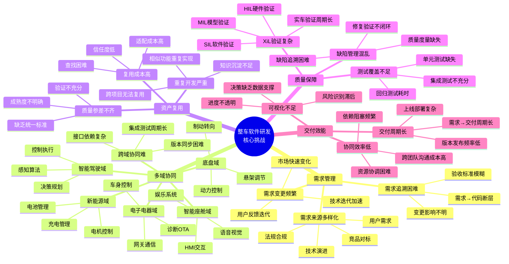

### 1.2 典型业务场景

#### 场景1: 智能驾驶功能开发

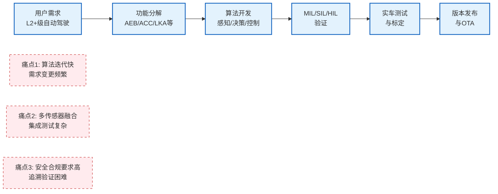

#### 场景2: 智能座舱多项目复用

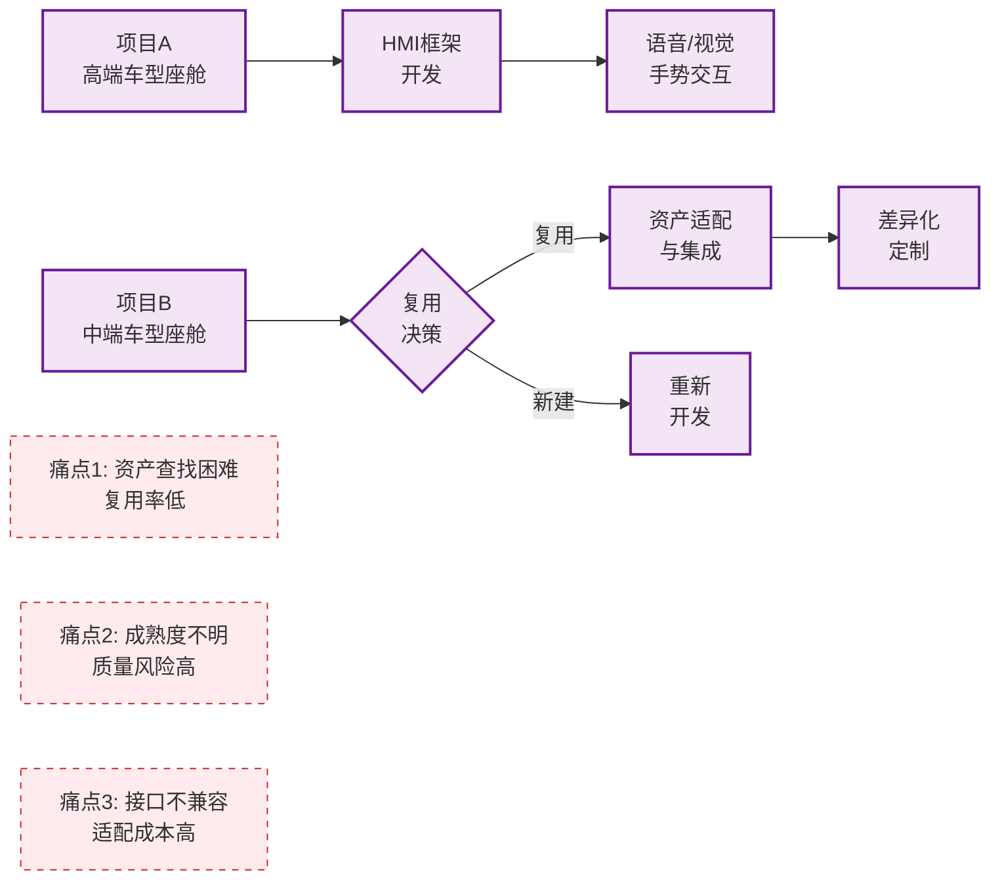

#### 场景3: 多域协同开发

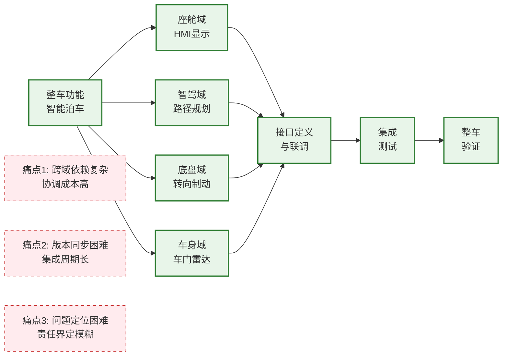

#### 场景4: 敏捷迭代与持续交付

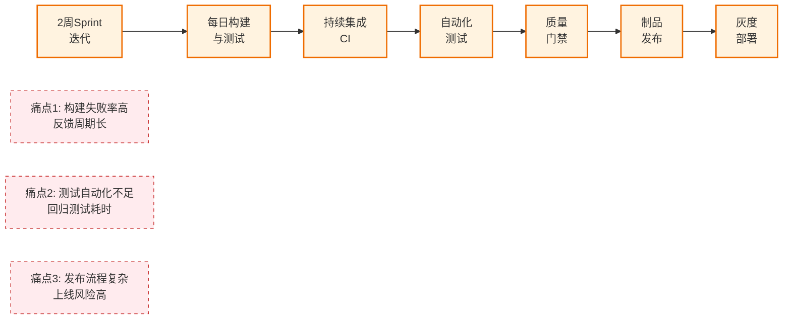

### 1.3 目标用户与角色

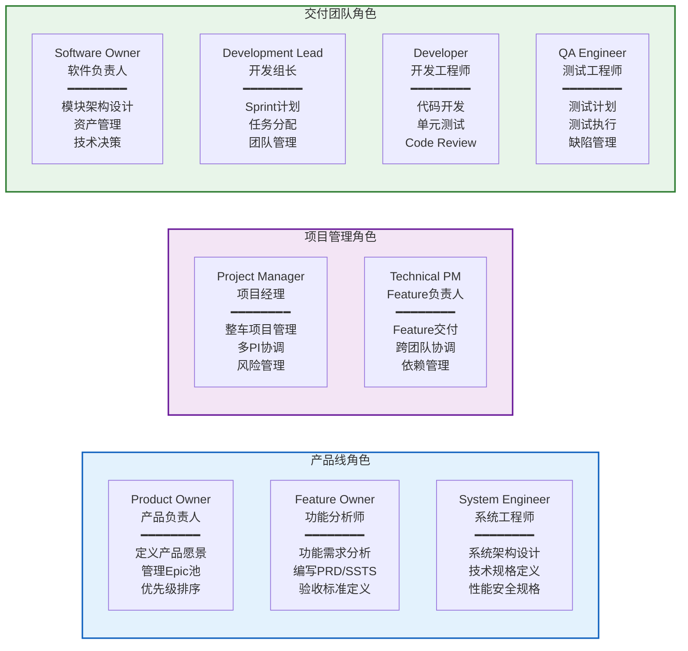

---

## 二、平台业务架构

### 2.1 整体业务架构

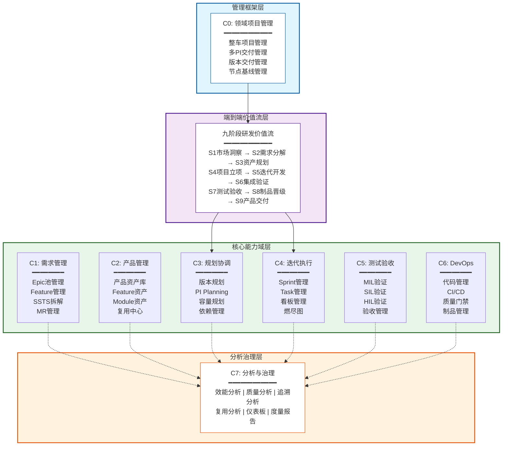

### 2.2 核心设计理念

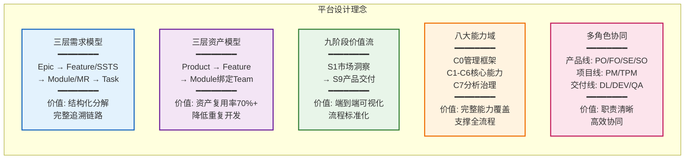

### 2.3 适用领域与场景

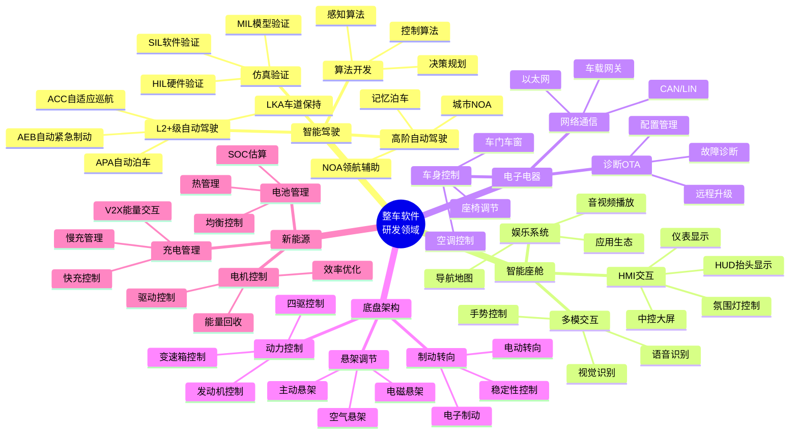

---

## 三、端到端研发协同价值流

### 3.1 九阶段价值流全景

```mermaid
graph LR
    S1[S1: 市场洞察<br/>━━━━━━━━<br/>用户研究<br/>竞品分析<br/>趋势洞察<br/>━━━━━━━━<br/>输出: 市场需求] --> S2[S2: 需求分解<br/>━━━━━━━━<br/>Epic拆解<br/>Feature定义<br/>SSTS细化<br/>━━━━━━━━<br/>输出: 需求规格]

    S2 --> S3[S3: 资产规划<br/>━━━━━━━━<br/>资产检索<br/>复用决策<br/>资产选型<br/>━━━━━━━━<br/>输出: 资产清单]

    S3 --> S4[S4: 项目立项<br/>━━━━━━━━<br/>PI Planning<br/>资源分配<br/>依赖识别<br/>━━━━━━━━<br/>输出: PI计划]

    S4 --> S5[S5: 迭代开发<br/>━━━━━━━━<br/>Sprint执行<br/>代码开发<br/>Code Review<br/>━━━━━━━━<br/>输出: 代码提交]

    S5 --> S6[S6: 集成验证<br/>━━━━━━━━<br/>持续集成<br/>集成测试<br/>接口联调<br/>━━━━━━━━<br/>输出: 集成版本]

    S6 --> S7[S7: 测试验收<br/>━━━━━━━━<br/>XiL验证<br/>系统测试<br/>验收测试<br/>━━━━━━━━<br/>输出: 验收报告]

    S7 --> S8[S8: 制品晋级<br/>━━━━━━━━<br/>质量门禁<br/>制品发布<br/>版本打标<br/>━━━━━━━━<br/>输出: 发布制品]

    S8 --> S9[S9: 产品交付<br/>━━━━━━━━<br/>版本发布<br/>部署上线<br/>灰度验证<br/>━━━━━━━━<br/>输出: 生产版本]

    style S1 fill:#e3f2fd,stroke:#1565c0,stroke-width:2px
    style S2 fill:#f3e5f5,stroke:#6a1b9a,stroke-width:2px
    style S3 fill:#e8f5e9,stroke:#2e7d32,stroke-width:2px
    style S4 fill:#fff3e0,stroke:#ef6c00,stroke-width:2px
    style S5 fill:#fce4ec,stroke:#c2185b,stroke-width:2px
    style S6 fill:#e0f2f1,stroke:#00695c,stroke-width:2px
    style S7 fill:#f1f8e9,stroke:#558b2f,stroke-width:2px
    style S8 fill:#fff8e1,stroke:#f57f17,stroke-width:2px
    style S9 fill:#e8eaf6,stroke:#283593,stroke-width:2px
```

### 3.2 价值流与能力域映射

```mermaid
gantt
    title 能力域覆盖价值流阶段
    dateFormat X
    axisFormat %s

    section C0项目管理
    全程管理框架 :c0, 0, 9

    section C1需求管理
    Epic池管理 :c11, 0, 1
    Feature管理 :c12, 1, 2
    SSTS/MR管理 :c13, 2, 3

    section C2产品管理
    资产检索 :c21, 0, 2
    资产规划 :c22, 2, 3
    资产复用 :c23, 3, 5

    section C3规划协调
    版本规划 :c31, 2, 3
    PI Planning :c32, 3, 4
    依赖管理 :c33, 4, 6

    section C4迭代执行
    Sprint执行 :c41, 4, 5
    Task管理 :c42, 4, 5

    section C5测试验收
    集成验证 :c51, 5, 6
    XiL验证 :c52, 6, 7
    验收测试 :c53, 6, 7

    section C6 DevOps
    CI/CD :c61, 5, 6
    质量门禁 :c62, 6, 8
    制品晋级 :c63, 7, 8
    发布部署 :c64, 8, 9

    section C7分析治理
    全程度量分析 :c71, 0, 9
```

### 3.3 典型场景价值流示例

#### 场景1: 智能驾驶AEB功能开发全流程

```mermaid
graph TB
    Start([用户需求: AEB功能]) --> S1_1[S1: 市场洞察<br/>━━━━━━━━<br/>法规要求: Euro NCAP<br/>竞品对标: 特斯拉/蔚来<br/>用户反馈: 安全诉求]

    S1_1 --> S2_1[S2: 需求分解<br/>━━━━━━━━<br/>Epic: AEB自动紧急制动<br/>Feature: 前向碰撞预警FCW<br/>Feature: 自动紧急制动AEB<br/>SSTS: 性能规格/安全规格]

    S2_1 --> S3_1[S3: 资产规划<br/>━━━━━━━━<br/>复用: 感知融合算法<br/>复用: 制动控制模块<br/>新建: AEB决策逻辑]

    S3_1 --> S4_1[S4: 项目立项<br/>━━━━━━━━<br/>PI1: 算法开发+MIL验证<br/>PI2: SIL/HIL验证<br/>PI3: 实车测试]

    S4_1 --> S5_1[S5: 迭代开发<br/>━━━━━━━━<br/>Sprint1: 感知算法<br/>Sprint2: 决策算法<br/>Sprint3: 控制算法<br/>Sprint4: 集成联调]

    S5_1 --> S6_1[S6: 集成验证<br/>━━━━━━━━<br/>感知+决策集成<br/>决策+控制集成<br/>端到端集成测试]

    S6_1 --> S7_1[S7: 测试验收<br/>━━━━━━━━<br/>MIL: 1000+场景<br/>SIL: 500+场景<br/>HIL: 200+场景<br/>实车: 50+场景]

    S7_1 --> S8_1[S8: 制品晋级<br/>━━━━━━━━<br/>质量门禁: 通过<br/>性能达标: 通过<br/>安全认证: 通过]

    S8_1 --> S9_1[S9: 产品交付<br/>━━━━━━━━<br/>版本发布: V1.0<br/>OTA推送: 灰度10%<br/>全量发布: 100%]

    S9_1 --> End([AEB功能上线])

    style S1_1 fill:#e3f2fd,stroke:#1565c0,stroke-width:2px
    style S2_1 fill:#f3e5f5,stroke:#6a1b9a,stroke-width:2px
    style S3_1 fill:#e8f5e9,stroke:#2e7d32,stroke-width:2px
    style S4_1 fill:#fff3e0,stroke:#ef6c00,stroke-width:2px
    style S5_1 fill:#fce4ec,stroke:#c2185b,stroke-width:2px
    style S6_1 fill:#e0f2f1,stroke:#00695c,stroke-width:2px
    style S7_1 fill:#f1f8e9,stroke:#558b2f,stroke-width:2px
    style S8_1 fill:#fff8e1,stroke:#f57f17,stroke-width:2px
    style S9_1 fill:#e8eaf6,stroke:#283593,stroke-width:2px
```

---

## 四、三层需求模型设计

### 4.1 三层需求分解架构

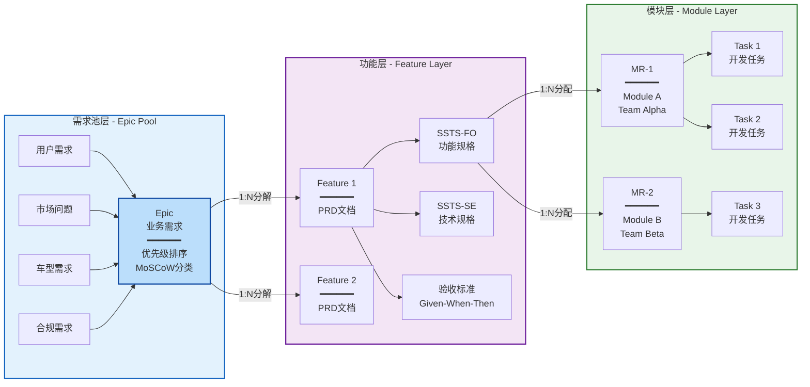

### 4.2 需求层级与数据模型

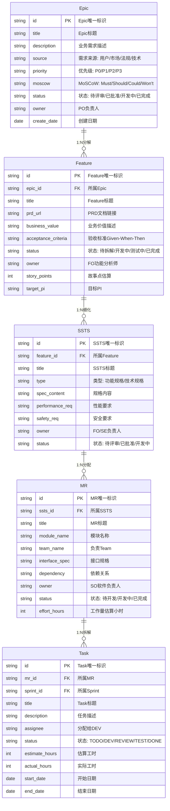

### 4.3 需求分解示例: AEB功能

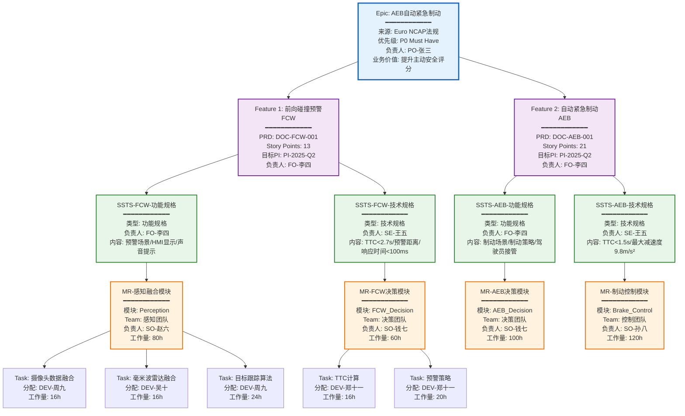

### 4.4 三层资产管理架构

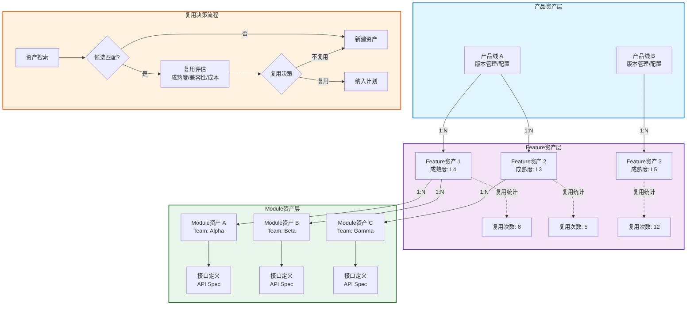

### 4.5 资产层级与数据模型

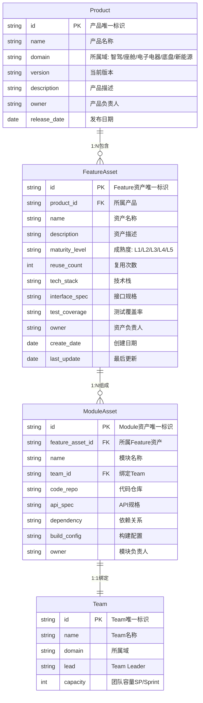

### 4.6 资产成熟度模型

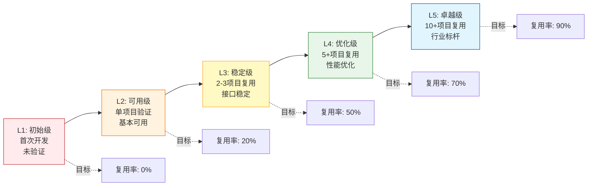

---

## 五、能力架构与核心功能

### 5.1 八大能力域全景

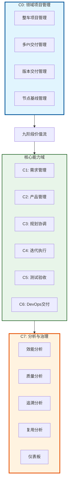

### 5.2 C1: 需求管理能力详设

#### 5.2.1 能力架构图

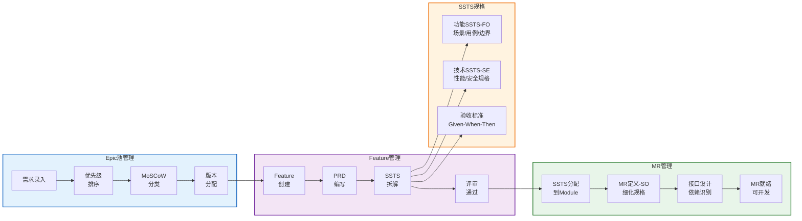

**核心功能**: 25个 | **覆盖阶段**: S1-S2 | **主要角色**: PO/FO/SE/SO

### 5.3 C2: 产品管理(资产)能力详设

#### 5.3.1 能力架构图

```mermaid
graph LR
    subgraph Search["资产检索与复用决策"]
        Input[需求<br/>输入] --> Search1[资产<br/>搜索]
        Search1 --> Match{候选<br/>匹配?}
        Match -->|是| Eval[复用评估<br/>成熟度/兼容性]
        Match -->|否| New1[新建<br/>资产]
        Eval --> Decision{复用<br/>决策}
        Decision -->|复用| Plan[纳入<br/>计划]
        Decision -->|不复用| New1
    end

    subgraph Assets["三层资产管理"]
        PA[产品资产库<br/>━━━━━━<br/>产品线管理<br/>版本规划]
        FA[Feature资产库<br/>━━━━━━<br/>资产入库<br/>成熟度评估]
        MA[Module资产库<br/>━━━━━━<br/>模块注册<br/>Team绑定]

        PA -->|1:N| FA
        FA -->|1:N| MA
    end

    subgraph Metrics["资产度量指标"]
        M1[复用率<br/>目标70%+]
        M2[L3+占比<br/>目标60%+]
        M3[复用收益<br/>成本节省]
    end

    style Search fill:#e3f2fd,stroke:#1565c0,stroke-width:2px
    style Assets fill:#f3e5f5,stroke:#6a1b9a,stroke-width:2px
    style Metrics fill:#e8f5e9,stroke:#2e7d32,stroke-width:2px
```

**核心功能**: 31个 | **覆盖阶段**: S1-S3 | **主要角色**: SO主导

### 5.4 C3: 规划协调能力详设

#### 5.4.1 能力架构图

```mermaid
graph LR
    subgraph Planning["PI Planning工作区"]
        Board[PI Planning<br/>Board] --> TeamA[Team A<br/>━━━━━━<br/>Sprint1: MR-A1<br/>Sprint2: MR-A2]
        Board --> TeamB[Team B<br/>━━━━━━<br/>Sprint1: MR-B1<br/>Sprint2: MR-B2]
        Board --> TeamC[Team C<br/>━━━━━━<br/>Sprint1: MR-C1<br/>Sprint2: MR-C2]

        TeamB -.->|依赖| TeamC
    end

    subgraph Capabilities["核心规划能力"]
        V[版本规划<br/>━━━━━━<br/>版本目标<br/>Feature分配]
        C[容量规划<br/>━━━━━━<br/>Team容量<br/>负载均衡]
        D[依赖管理<br/>━━━━━━<br/>依赖识别<br/>可视化]
        R[风险管理<br/>━━━━━━<br/>风险登记<br/>评估缓解]
    end

    style Planning fill:#e3f2fd,stroke:#1565c0,stroke-width:2px
    style Capabilities fill:#f3e5f5,stroke:#6a1b9a,stroke-width:2px
```

**核心功能**: 20个 | **覆盖阶段**: S3-S4 | **主要角色**: PM/TPM | **目标**: PI承诺达成率≥85%

### 5.5 C4: 迭代执行能力详设

#### 5.5.1 能力架构图

```mermaid
graph LR
    subgraph Sprint["Sprint管理"]
        SP1[Sprint Planning<br/>Backlog梳理] --> SP2[Sprint Execution<br/>Daily Standup]
        SP2 --> SP3[Sprint Review<br/>Demo演示]
        SP3 --> SP4[Sprint Retro<br/>改进Action]
        SP4 --> SP5[Sprint Goal<br/>Achieved]
    end

    subgraph Kanban["看板管理"]
        TODO[TODO] --> DEV[DEV]
        DEV --> REVIEW[REVIEW]
        REVIEW --> TEST[TEST]
        TEST --> FIX[FIX]
        FIX --> DONE[DONE]
    end

    subgraph Tools["支撑工具"]
        Task[Task管理<br/>创建/分配/流转]
        Burndown[燃尽图<br/>进度可视化/预测]
        Time[工时管理<br/>登记/统计/分析]
        Block[阻塞管理<br/>识别/上报/解决]
    end

    style Sprint fill:#e3f2fd,stroke:#1565c0,stroke-width:2px
    style Kanban fill:#f3e5f5,stroke:#6a1b9a,stroke-width:2px
    style Tools fill:#e8f5e9,stroke:#2e7d32,stroke-width:2px
```

**核心功能**: 20个 | **覆盖阶段**: S5 | **主要角色**: DL/DEV | **目标**: Sprint完成率≥90%

### 5.6 C5: 测试验收能力详设

#### 5.6.1 能力架构图

```mermaid
graph LR
    subgraph VModel["V型验证体系"]
        L1[Epic/PRD] --> L2[SSTS]
        L2 --> L3[MR]
        L3 --> L4[设计/编码]

        L4 --> R4[单元测试]
        R4 --> R3[集成测试]
        R3 --> R2[系统测试]
        R2 --> R1[验收测试]

        L1 -.->|追溯| R1
        L2 -.->|追溯| R2
        L3 -.->|追溯| R3
    end

    subgraph XiL["XiL验证体系"]
        MIL[MIL<br/>━━━━━━<br/>模型在环<br/>算法验证] --> SIL[SIL<br/>━━━━━━<br/>软件在环<br/>逻辑验证]
        SIL --> HIL[HIL<br/>━━━━━━<br/>硬件在环<br/>系统验证]
        HIL --> VIL[实车验证<br/>━━━━━━<br/>整车测试<br/>场景覆盖]
    end

    style VModel fill:#e3f2fd,stroke:#1565c0,stroke-width:2px
    style XiL fill:#f3e5f5,stroke:#6a1b9a,stroke-width:2px
```

**核心功能**: 29个 | **覆盖阶段**: S6-S7 | **主要角色**: QA | **目标**: 测试覆盖率≥80%, 缺陷逃逸率<3%

### 5.7 C6: DevOps交付能力详设

#### 5.7.1 能力架构图

```mermaid
graph LR
    subgraph Pipeline["CI/CD流水线"]
        P1[代码提交<br/>Git Push] --> P2[代码扫描<br/>SonarQube]
        P2 --> P3[编译构建<br/>CMake/Gradle]
        P3 --> P4[单测执行<br/>pytest/gtest]
        P4 --> P5[质量门禁<br/>覆盖率/复杂度]
        P5 --> P6[制品生成<br/>Docker/Binary]
        P6 --> P7[制品入库<br/>Artifactory]
    end

    subgraph Gates["质量门禁体系"]
        L1[Level 1<br/>开发环境<br/>编译通过<br/>单测≥80%]
        L2[Level 2<br/>测试环境<br/>集成测试通过<br/>无P1/P2缺陷]
        L3[Level 3<br/>预发布环境<br/>系统测试通过<br/>性能达标]

        L1 --> L2 --> L3
    end

    subgraph Support["支撑能力"]
        Code[代码管理<br/>Git/分支策略]
        Artifact[制品管理<br/>版本/依赖/晋级]
        Deploy[发布部署<br/>审批/灰度/验证]
        Env[环境管理<br/>申请/配置/监控]
    end

    style Pipeline fill:#e3f2fd,stroke:#1565c0,stroke-width:2px
    style Gates fill:#f3e5f5,stroke:#6a1b9a,stroke-width:2px
    style Support fill:#e8f5e9,stroke:#2e7d32,stroke-width:2px
```

**核心功能**: 26个 | **覆盖阶段**: S6, S8-S9 | **主要角色**: DevOps | **目标**: 构建成功率≥95%

### 5.8 C7: 分析与治理能力详设

#### 5.8.1 能力架构图

```mermaid
graph LR
    subgraph Analysis["多维度分析体系"]
        A1[效能分析<br/>━━━━━━<br/>交付周期<br/>吞吐量<br/>阻塞时间]
        A2[质量分析<br/>━━━━━━<br/>缺陷密度<br/>测试覆盖率<br/>逃逸率]
        A3[追溯分析<br/>━━━━━━<br/>需求→代码<br/>代码→测试<br/>变更影响]
        A4[复用分析<br/>━━━━━━<br/>复用率<br/>成熟度<br/>收益ROI]
    end

    subgraph Dashboard["仪表板体系"]
        D1[管理层<br/>仪表板<br/>━━━━━━<br/>项目健康度<br/>交付进度]
        D2[PM<br/>仪表板<br/>━━━━━━<br/>版本进度<br/>PI达成率]
        D3[Team<br/>仪表板<br/>━━━━━━<br/>Sprint燃尽<br/>速率趋势]
    end

    style Analysis fill:#e3f2fd,stroke:#1565c0,stroke-width:2px
    style Dashboard fill:#f3e5f5,stroke:#6a1b9a,stroke-width:2px
```

**核心功能**: 20个 | **覆盖阶段**: 全程 | **主要角色**: PM/管理层 | **目标**: 数据驱动决策

#### 5.8.2 用户旅程: 效能分析

```mermaid
journey
    title PM进行效能分析的用户旅程
    section 数据收集
      登录平台: 5: PM
      选择分析维度: 4: PM
      设置时间范围: 4: PM
    section 效能分析
      查看交付周期: 5: PM
      分析吞吐量趋势: 5: PM
      识别瓶颈环节: 3: PM
    section 决策优化
      生成分析报告: 5: PM
      制定改进措施: 4: PM
      跟踪改进效果: 4: PM
```

#### 5.8.3 核心功能列表

| 功能模块 | 核心功能 | 输入 | 输出 | 主要角色 |
|---------|---------|------|------|---------|
| **效能分析** | 交付周期分析 | 需求/任务/提交数据 | 周期趋势图/瓶颈识别 | PM/管理层 |
| | 吞吐量分析 | Sprint数据/Story Points | 速率趋势/稳定性分析 | PM/DL |
| | 阻塞时间分析 | 任务状态流转数据 | 阻塞统计/根因分析 | PM/DL |
| **质量分析** | 缺陷密度分析 | 缺陷数据/代码行数 | 缺陷密度趋势 | QA/DL |
| | 测试覆盖率分析 | 测试数据/代码覆盖 | 覆盖率报告/缺口识别 | QA |
| | 缺陷逃逸率分析 | 缺陷发现阶段数据 | 逃逸率统计/改进建议 | QA/管理层 |
| **追溯分析** | 需求追溯 | 需求ID | 需求→代码→测试链路 | FO/QA |
| | 变更影响分析 | 变更内容 | 影响范围/风险评估 | SE/SO |
| | 缺陷根因分析 | 缺陷ID | 缺陷→需求根因链路 | QA/DEV |
| **复用分析** | 资产复用率统计 | 资产使用数据 | 复用率趋势/目标达成 | SO/管理层 |
| | 成熟度分布分析 | 资产成熟度数据 | 成熟度分布/提升建议 | SO |
| | 复用收益分析 | 复用数据/成本数据 | 成本节省/ROI分析 | 管理层 |
| **仪表板** | 管理层仪表板 | 全平台数据 | 项目健康度/交付进度 | 管理层 |
| | PM仪表板 | 项目/PI数据 | 版本进度/PI达成率 | PM |
| | Team仪表板 | Team/Sprint数据 | Sprint燃尽/速率趋势 | DL/DEV |

---

## 六、全量功能架构与功能列表

### 6.1 分层功能架构

```mermaid
graph TB
    subgraph L1["L1: 管理框架层"]
        C0_1[整车项目管理]
        C0_2[多PI交付管理]
        C0_3[版本交付管理]
        C0_4[节点基线管理]
    end

    subgraph L2["L2: 核心能力层"]
        subgraph C1_Group["C1: 需求管理 (25个功能)"]
            C1_1[Epic池管理]
            C1_2[Feature管理]
            C1_3[SSTS管理]
            C1_4[MR管理]
        end

        subgraph C2_Group["C2: 产品管理 (31个功能)"]
            C2_1[资产检索]
            C2_2[资产规划]
            C2_3[资产复用]
            C2_4[成熟度管理]
        end

        subgraph C3_Group["C3: 规划协调 (20个功能)"]
            C3_1[版本规划]
            C3_2[PI Planning]
            C3_3[容量规划]
            C3_4[依赖管理]
        end

        subgraph C4_Group["C4: 迭代执行 (20个功能)"]
            C4_1[Sprint管理]
            C4_2[Task管理]
            C4_3[看板管理]
            C4_4[燃尽图]
        end

        subgraph C5_Group["C5: 测试验收 (29个功能)"]
            C5_1[V型验证]
            C5_2[XiL验证]
            C5_3[测试管理]
            C5_4[缺陷管理]
        end

        subgraph C6_Group["C6: DevOps (26个功能)"]
            C6_1[CI/CD]
            C6_2[质量门禁]
            C6_3[制品管理]
            C6_4[发布部署]
        end
    end

    subgraph L3["L3: 分析治理层"]
        C7_1[效能分析]
        C7_2[质量分析]
        C7_3[追溯分析]
        C7_4[复用分析]
        C7_5[仪表板]
    end

    L1 --> L2
    L2 --> L3

    style L1 fill:#e1f5fe,stroke:#01579b,stroke-width:3px
    style L2 fill:#e8f5e9,stroke:#1b5e20,stroke-width:2px
    style L3 fill:#fff3e0,stroke:#e65100,stroke-width:3px
    style C1_Group fill:#e3f2fd,stroke:#1565c0,stroke-width:2px
    style C2_Group fill:#f3e5f5,stroke:#6a1b9a,stroke-width:2px
    style C3_Group fill:#e8f5e9,stroke:#2e7d32,stroke-width:2px
    style C4_Group fill:#fff3e0,stroke:#ef6c00,stroke-width:2px
    style C5_Group fill:#fce4ec,stroke:#c2185b,stroke-width:2px
    style C6_Group fill:#e0f2f1,stroke:#00695c,stroke-width:2px
```

### 6.2 端到端核心功能流

> **完整功能列表**: 全部179个功能的详细列表请参考 [全量功能清单_C0-C7.md](./全量功能清单_C0-C7.md)

以下展示端到端研发协同的核心功能流，串联八大能力域的关键功能：

#### 6.2.1 端到端核心功能流程图

```mermaid
graph TB
    subgraph S1_S2["S1-S2: 市场洞察与需求分解"]
        C1F01[C1-F01<br/>Epic创建]
        C1F02[C1-F02<br/>Epic优先级排序]
        C1F05[C1-F05<br/>Feature创建]
        C1F07[C1-F07<br/>SSTS拆解]
        C1F13[C1-F13<br/>MR创建]

        C1F01 --> C1F02 --> C1F05 --> C1F07 --> C1F13
    end

    subgraph S3["S3: 资产规划"]
        C2F01[C2-F01<br/>资产搜索]
        C2F03[C2-F03<br/>复用评估]
        C2F07[C2-F07<br/>复用决策]

        C2F01 --> C2F03 --> C2F07
    end

    subgraph S4["S4: 项目立项与规划"]
        C0F01[C0-F01<br/>整车项目创建]
        C3F03[C3-F03<br/>PI Planning创建]
        C3F07[C3-F07<br/>MR分配到Team]
        C3F08[C3-F08<br/>Sprint规划]

        C0F01 --> C3F03 --> C3F07 --> C3F08
    end

    subgraph S5["S5: 迭代开发"]
        C4F02[C4-F02<br/>Sprint Planning]
        C4F03[C4-F03<br/>Task创建]
        C4F07[C4-F07<br/>看板管理]
        C6F01[C6-F01<br/>代码提交]

        C4F02 --> C4F03 --> C4F07 --> C6F01
    end

    subgraph S6["S6: 集成验证"]
        C6F06[C6-F06<br/>编译构建]
        C6F08[C6-F08<br/>质量门禁]
        C5F05[C5-F05<br/>集成测试]
        C5F09[C5-F09<br/>SIL验证]

        C6F06 --> C6F08 --> C5F05 --> C5F09
    end

    subgraph S7["S7: 测试验收"]
        C5F06[C5-F06<br/>系统测试]
        C5F10[C5-F10<br/>HIL验证]
        C5F07[C5-F07<br/>验收测试]

        C5F06 --> C5F10 --> C5F07
    end

    subgraph S8["S8: 制品晋级"]
        C6F09[C6-F09<br/>制品生成]
        C6F10[C6-F10<br/>制品入库]
        C6F13[C6-F13<br/>制品晋级]

        C6F09 --> C6F10 --> C6F13
    end

    subgraph S9["S9: 产品交付"]
        C6F14[C6-F14<br/>发布审批]
        C6F16[C6-F16<br/>全量发布]
        C0F06[C0-F06<br/>版本发布]

        C6F14 --> C6F16 --> C0F06
    end

    subgraph C7_Analysis["C7: 全程分析与治理"]
        C7F01[C7-F01<br/>交付周期分析]
        C7F04[C7-F04<br/>缺陷密度分析]
        C7F07[C7-F07<br/>需求追溯]
        C7F10[C7-F10<br/>资产复用率统计]
        C7F13[C7-F13<br/>管理层仪表板]
    end

    C1F13 --> C2F01
    C2F07 --> C0F01
    C3F08 --> C4F02
    C6F01 --> C6F06
    C5F09 --> C5F06
    C5F07 --> C6F09
    C6F13 --> C6F14

    C0F06 -.->|持续分析| C7F01
    C0F06 -.->|持续分析| C7F04
    C0F06 -.->|持续分析| C7F07
    C0F06 -.->|持续分析| C7F10
    C0F06 -.->|持续分析| C7F13

    style S1_S2 fill:#e3f2fd,stroke:#1565c0,stroke-width:2px
    style S3 fill:#f3e5f5,stroke:#6a1b9a,stroke-width:2px
    style S4 fill:#fff3e0,stroke:#ef6c00,stroke-width:2px
    style S5 fill:#e8f5e9,stroke:#2e7d32,stroke-width:2px
    style S6 fill:#fce4ec,stroke:#c2185b,stroke-width:2px
    style S7 fill:#e0f2f1,stroke:#00695c,stroke-width:2px
    style S8 fill:#fff9c4,stroke:#f57f17,stroke-width:2px
    style S9 fill:#f1f8e9,stroke:#558b2f,stroke-width:2px
    style C7_Analysis fill:#ffebee,stroke:#c62828,stroke-width:3px
```

#### 6.2.2 核心功能统计

| 价值流阶段 | 核心功能数 | 涉及能力域 | 关键输出 |
|-----------|-----------|-----------|---------|
| S1-S2: 市场洞察与需求分解 | 5个 | C1 | Epic → Feature → SSTS → MR |
| S3: 资产规划 | 3个 | C2 | 复用决策 |
| S4: 项目立项与规划 | 4个 | C0, C3 | PI Planning → Sprint计划 |
| S5: 迭代开发 | 4个 | C4, C6 | Sprint Backlog → 代码提交 |
| S6: 集成验证 | 4个 | C5, C6 | 构建产物 → SIL验证 |
| S7: 测试验收 | 3个 | C5 | 系统测试 → HIL验证 → 验收 |
| S8: 制品晋级 | 3个 | C6 | 制品生成 → 入库 → 晋级 |
| S9: 产品交付 | 3个 | C0, C6 | 发布审批 → 全量发布 |
| 全程分析 | 5个 | C7 | 效能/质量/追溯/复用/仪表板 |
| **合计** | **34个** | **C0-C7** | **端到端价值流** |

#### 6.2.3 全量功能统计汇总

| 能力域 | 功能数量 | 主要场景 | 价值流覆盖 | 核心价值 |
|--------|---------|---------|-----------|---------|
| C0: 领域项目管理 | 8个 | 场景1/2/3 | S4-S9 | 项目全生命周期管理 |
| C1: 需求管理 | 25个 | 场景1/2/3 | S1-S9 | 三层需求分解与追溯 |
| C2: 产品管理(资产) | 31个 | 场景2 | S3-S9 | 资产复用率70%+ |
| C3: 规划协调 | 20个 | 场景1/3 | S3-S5 | PI承诺达成率≥85% |
| C4: 迭代执行 | 20个 | 场景1/2/3/4 | S5 | Sprint完成率≥90% |
| C5: 测试验收 | 29个 | 场景1/2/3/4 | S6-S7 | 缺陷逃逸率<3% |
| C6: DevOps交付 | 26个 | 场景1/4 | S6-S9 | 构建成功率≥95% |
| C7: 分析与治理 | 20个 | 场景1/2/3/4 | S1-S9 | 数据驱动决策 |
| **合计** | **179个** | **4个场景** | **9个阶段** | **端到端价值流** |

---

## 总结

本文档完整呈现了整车软件研发端到端协同平台的业务方案，核心内容包括：

### ✅ 一、问题域与业务场景
- 整车软件研发核心挑战（需求管理、多域协同、资产复用、质量保障、交付效能）
- 典型业务场景（智能驾驶、智能座舱、多域协同、敏捷迭代）
- 目标用户与角色体系（产品线、项目线、交付线）

### ✅ 二、平台业务架构
- 整体业务架构（管理框架层、价值流层、能力域层、治理层）
- 核心设计理念（三层需求模型、三层资产模型、九阶段价值流、八大能力域、多角色协同）
- 适用领域与场景（智能驾驶、智能座舱、电子电器、底盘架构、新能源）

### ✅ 三、端到端研发协同价值流
- 九阶段价值流全景（S1市场洞察 → S9产品交付）
- 价值流与能力域映射
- 典型场景价值流示例（AEB功能开发全流程）

### ✅ 四、三层需求模型设计
- 三层需求分解架构（Epic → Feature/SSTS → Module/MR → Task）
- 需求层级与数据模型（完整ER图）
- 需求分解示例（AEB功能完整拆解）
- 三层资产管理架构（Product → Feature → Module）
- 资产层级与数据模型
- 资产成熟度模型（L1-L5）

### ✅ 五、能力架构与核心功能
- **C0: 领域项目管理** - 整车项目/多PI交付/版本交付/节点基线
- **C1: 需求管理** - Epic池/Feature/SSTS/MR管理，用户旅程，25个核心功能
- **C2: 产品管理(资产)** - 资产检索/复用决策/三层资产管理，用户旅程，31个核心功能
- **C3: 规划协调** - 版本规划/PI Planning/容量/依赖/风险管理，用户旅程，20个核心功能
- **C4: 迭代执行** - Sprint/Task/看板/燃尽图管理，用户旅程，20个核心功能
- **C5: 测试验收** - V型验证/XiL验证体系，用户旅程，29个核心功能
- **C6: DevOps交付** - CI/CD流水线/质量门禁/制品管理，用户旅程，26个核心功能
- **C7: 分析与治理** - 效能/质量/追溯/复用分析，用户旅程，20个核心功能

### ✅ 六、全量功能架构与功能列表
- **分层功能架构** - L1管理框架层、L2核心能力层、L3分析治理层
- **全量功能列表** - 171个功能（C0:8个、C1:25个、C2:31个、C3:20个、C4:20个、C5:29个、C6:26个、C7:20个）
- **功能映射** - 每个功能映射到具体场景、角色、价值流阶段
- **输入输出定义** - 每个功能的输入输出清晰定义

### 🎯 核心价值
- **端到端可视化** - 从市场洞察到产品交付全流程打通
- **资产复用率70%+** - 三层资产模型支撑高效复用，降低重复开发
- **多域协同** - 支持智驾/座舱/电子电器/底盘/新能源等多域协同开发
- **敏捷规模化** - 支持多团队PI Planning协同，PI承诺达成率≥85%
- **质量内建** - V型验证与XiL测试体系，缺陷逃逸率<3%
- **数据驱动** - 全面度量与分析体系，支撑管理决策优化

---

**文档版本**: V6.0 (Business-Focused Edition)
**最后更新**: 2025-01-14
**作者**: 平台架构组
**适用领域**: 智能驾驶 | 智能座舱 | 电子电器 | 底盘架构 | 新能源
