# 整车软件研发端到端协同平台 - 业务方案

> **面向智能驾驶、智能座舱、电子电器、底盘架构、新能源等领域的端到端研发协同平台**
>
> **版本**: V7.0 (Enterprise-Grade Business Solution Edition)  
> **日期**: 2026-01-18  
> **设计理念**: 价值流驱动 + 领域模型 + 流程协同 + 资产复用  
> **核心目标**: 构建高效、透明、协同的端到端整车软件研发管理平台

---

## 文档导航

- [一、问题域与业务场景](#一问题域与业务场景)
- [二、平台业务架构](#二平台业务架构)
- [三、研发价值流设计](#三研发价值流设计)
- [四、需求与资产模型](#四需求与资产模型)
- [五、能力架构与核心设计](#五能力架构与核心设计)
- [六、流程定义详解](#六流程定义详解)
- [七、能力域集成与联通](#七能力域集成与联通)
- [八、角色协同与职责](#八角色协同与职责)
- [九、平台核心价值](#九平台核心价值)

---

## 一、问题域与业务场景

### 1.1 整车软件研发核心挑战

```mermaid
mindmap
  root((整车软件研发<br/>核心挑战))
    需求管理
      需求来源多样化
        用户需求
        法规合规
        竞品对标
        技术演进
      需求变更频繁
        市场快速变化
        技术迭代加速
        用户反馈迭代
      需求追溯困难
        需求→代码断层
        变更影响不明
        验收标准模糊
      跨域协同难
        接口依赖复杂
        版本同步困难
    多域协同
      智能驾驶域
        感知算法
        决策规划
        控制执行
      智能座舱域
        HMI交互
        语音视觉
        娱乐系统
      电子电器域
        车身控制
        网关通信
        诊断OTA
      底盘域
        动力控制
        制动转向
        悬架调节
      新能源域
        电池管理
        电机控制
        充电管理
      跨域协同难
        接口依赖复杂
        版本同步困难
        集成测试周期长
    资产复用
      重复开发严重
        相似功能重复实现
        跨项目无法复用
        知识沉淀不足
      质量参差不齐
        缺乏统一标准
        成熟度不明确
        验证不充分
      复用成本高
        查找困难
        适配成本高
        信任度低
    质量保障
      测试覆盖不足
        单元测试缺失
        集成测试不充分
        回归测试耗时
      XiL验证复杂
        MIL模型验证
        SIL软件验证
        HIL硬件验证
        实车验证周期长
      缺陷管理混乱
        缺陷追溯困难
        修复验证不闭环
        质量度量缺失
    交付效能
      交付周期长
        需求→交付周期长
        版本发布频率低
        上线部署复杂
      协同效率低
        跨团队沟通成本高
        依赖阻塞频繁
        资源协调困难
      可视化不足
        进度不透明
        风险识别滞后
        决策缺乏数据支撑
```

### 1.2 典型业务场景

#### 场景1: 智能驾驶功能开发

```mermaid
graph LR
    S1_1[用户需求<br/>L2+级自动驾驶] --> S1_2[功能分解<br/>AEB/ACC/LKA等]
    S1_2 --> S1_3[算法开发<br/>感知/决策/控制]
    S1_3 --> S1_4[MIL/SIL/HIL<br/>验证]
    S1_4 --> S1_5[实车测试<br/>与标定]
    S1_5 --> S1_6[版本发布<br/>与OTA]

    S1_Pain1[痛点1: 算法迭代快<br/>需求变更频繁]
    S1_Pain2[痛点2: 多传感器融合<br/>集成测试复杂]
    S1_Pain3[痛点3: 安全合规要求高<br/>追溯验证困难]

    style S1_1 fill:#e3f2fd,stroke:#1565c0,stroke-width:2px
    style S1_2 fill:#e3f2fd,stroke:#1565c0,stroke-width:2px
    style S1_3 fill:#e3f2fd,stroke:#1565c0,stroke-width:2px
    style S1_4 fill:#e3f2fd,stroke:#1565c0,stroke-width:2px
    style S1_5 fill:#e3f2fd,stroke:#1565c0,stroke-width:2px
    style S1_6 fill:#e3f2fd,stroke:#1565c0,stroke-width:2px
    style S1_Pain1 fill:#ffebee,stroke:#c62828,stroke-width:1px,stroke-dasharray: 5 5
    style S1_Pain2 fill:#ffebee,stroke:#c62828,stroke-width:1px,stroke-dasharray: 5 5
    style S1_Pain3 fill:#ffebee,stroke:#c62828,stroke-width:1px,stroke-dasharray: 5 5
```

**平台解决方案**:
- ✅ **需求追溯**: 四层需求模型 + 完整追溯链
- ✅ **V型验证**: MIL/SIL/HIL/实车验证流程
- ✅ **合规管理**: 功能安全追溯 + 审计报告

#### 场景2: 智能座舱多项目复用

```mermaid
graph LR
    S2_1[项目A<br/>高端车型座舱] --> S2_2[HMI框架<br/>开发]
    S2_2 --> S2_3[语音/视觉<br/>手势交互]
    S2_1B[项目B<br/>中端车型座舱] --> S2_4{复用<br/>决策}
    S2_4 -->|复用| S2_5[资产适配<br/>与集成]
    S2_4 -->|新建| S2_6[重新<br/>开发]
    S2_5 --> S2_7[差异化<br/>定制]

    S2_Pain1[痛点1: 资产查找困难<br/>复用率低]
    S2_Pain2[痛点2: 成熟度不明<br/>质量风险高]
    S2_Pain3[痛点3: 接口不兼容<br/>适配成本高]

    style S2_1 fill:#f3e5f5,stroke:#6a1b9a,stroke-width:2px
    style S2_1B fill:#f3e5f5,stroke:#6a1b9a,stroke-width:2px
    style S2_2 fill:#f3e5f5,stroke:#6a1b9a,stroke-width:2px
    style S2_3 fill:#f3e5f5,stroke:#6a1b9a,stroke-width:2px
    style S2_4 fill:#f3e5f5,stroke:#6a1b9a,stroke-width:2px
    style S2_5 fill:#f3e5f5,stroke:#6a1b9a,stroke-width:2px
    style S2_6 fill:#f3e5f5,stroke:#6a1b9a,stroke-width:2px
    style S2_7 fill:#f3e5f5,stroke:#6a1b9a,stroke-width:2px
    style S2_Pain1 fill:#ffebee,stroke:#c62828,stroke-width:1px,stroke-dasharray: 5 5
    style S2_Pain2 fill:#ffebee,stroke:#c62828,stroke-width:1px,stroke-dasharray: 5 5
    style S2_Pain3 fill:#ffebee,stroke:#c62828,stroke-width:1px,stroke-dasharray: 5 5
```

**平台解决方案**:
- ✅ **AI推荐**: 语义搜索 + 智能匹配
- ✅ **成熟度评估**: TRL等级（L1-L5）+ 质量门禁
- ✅ **复用决策**: 兼容性评估 + ROI计算

#### 场景3: 多域协同开发

```mermaid
graph LR
    S3_1[整车功能<br/>智能泊车] --> S3_2[座舱域<br/>HMI显示]
    S3_1 --> S3_3[智驾域<br/>路径规划]
    S3_1 --> S3_4[底盘域<br/>转向制动]
    S3_1 --> S3_5[车身域<br/>车门雷达]

    S3_2 --> S3_6[接口定义<br/>与联调]
    S3_3 --> S3_6
    S3_4 --> S3_6
    S3_5 --> S3_6
    S3_6 --> S3_7[集成<br/>测试]
    S3_7 --> S3_8[整车<br/>验证]

    S3_Pain1[痛点1: 跨域依赖复杂<br/>协调成本高]
    S3_Pain2[痛点2: 版本同步困难<br/>集成周期长]
    S3_Pain3[痛点3: 问题定位困难<br/>责任界定模糊]

    style S3_1 fill:#e8f5e9,stroke:#2e7d32,stroke-width:2px
    style S3_2 fill:#e8f5e9,stroke:#2e7d32,stroke-width:2px
    style S3_3 fill:#e8f5e9,stroke:#2e7d32,stroke-width:2px
    style S3_4 fill:#e8f5e9,stroke:#2e7d32,stroke-width:2px
    style S3_5 fill:#e8f5e9,stroke:#2e7d32,stroke-width:2px
    style S3_6 fill:#e8f5e9,stroke:#2e7d32,stroke-width:2px
    style S3_7 fill:#e8f5e9,stroke:#2e7d32,stroke-width:2px
    style S3_8 fill:#e8f5e9,stroke:#2e7d32,stroke-width:2px
    style S3_Pain1 fill:#ffebee,stroke:#c62828,stroke-width:1px,stroke-dasharray: 5 5
    style S3_Pain2 fill:#ffebee,stroke:#c62828,stroke-width:1px,stroke-dasharray: 5 5
    style S3_Pain3 fill:#ffebee,stroke:#c62828,stroke-width:1px,stroke-dasharray: 5 5
```

**平台解决方案**:
- ✅ **依赖管理**: 依赖识别 → 依赖跟踪 → 冲突检测 → 协调机制
- ✅ **版本同步**: 基线管理 + 集成计划 + 集成看板
- ✅ **接口管理**: 接口定义 + Mock服务 + 契约测试

#### 场景4: 敏捷迭代与持续交付

```mermaid
graph LR
    S4_1[2周Sprint<br/>迭代] --> S4_2[每日构建<br/>与测试]
    S4_2 --> S4_3[持续集成<br/>CI]
    S4_3 --> S4_4[自动化<br/>测试]
    S4_4 --> S4_5[质量<br/>门禁]
    S4_5 --> S4_6[制品<br/>发布]
    S4_6 --> S4_7[灰度<br/>部署]

    S4_Pain1[痛点1: 构建失败率高<br/>反馈周期长]
    S4_Pain2[痛点2: 测试自动化不足<br/>回归测试耗时]
    S4_Pain3[痛点3: 发布流程复杂<br/>上线风险高]

    style S4_1 fill:#fff3e0,stroke:#ef6c00,stroke-width:2px
    style S4_2 fill:#fff3e0,stroke:#ef6c00,stroke-width:2px
    style S4_3 fill:#fff3e0,stroke:#ef6c00,stroke-width:2px
    style S4_4 fill:#fff3e0,stroke:#ef6c00,stroke-width:2px
    style S4_5 fill:#fff3e0,stroke:#ef6c00,stroke-width:2px
    style S4_6 fill:#fff3e0,stroke:#ef6c00,stroke-width:2px
    style S4_7 fill:#fff3e0,stroke:#ef6c00,stroke-width:2px
    style S4_Pain1 fill:#ffebee,stroke:#c62828,stroke-width:1px,stroke-dasharray: 5 5
    style S4_Pain2 fill:#ffebee,stroke:#c62828,stroke-width:1px,stroke-dasharray: 5 5
    style S4_Pain3 fill:#ffebee,stroke:#c62828,stroke-width:1px,stroke-dasharray: 5 5
```

**平台解决方案**:
- ✅ **CI/CD流水线**: 自动触发 + 并行执行 + 快速反馈
- ✅ **自动化测试**: 单元测试 + 集成测试 + 回归测试
- ✅ **灰度发布**: 分阶段发布 + 自动回滚 + 监控告警

### 1.3 平台定位与目标

```mermaid
graph TB
    subgraph 平台定位
        P1[端到端研发协同平台]
        P2[价值流驱动]
        P3[智能化辅助]
        P4[数据驱动决策]
    end
    
    subgraph 核心目标
        G1[缩短交付周期<br/>前置时间≤30天]
        G2[提升流动效率<br/>流程周期效率≥40%]
        G3[提高资产复用率<br/>复用率≥70%]
        G4[降低缺陷逃逸率<br/>逃逸率≤0.5%]
    end
    
    P1 --> G1
    P2 --> G2
    P3 --> G3
    P4 --> G4
    
    style P1 fill:#e1f5fe,stroke:#01579b,stroke-width:2px
    style P2 fill:#e1f5fe,stroke:#01579b,stroke-width:2px
    style P3 fill:#e1f5fe,stroke:#01579b,stroke-width:2px
    style P4 fill:#e1f5fe,stroke:#01579b,stroke-width:2px
    style G1 fill:#c8e6c9,stroke:#2e7d32,stroke-width:2px
    style G2 fill:#c8e6c9,stroke:#2e7d32,stroke-width:2px
    style G3 fill:#c8e6c9,stroke:#2e7d32,stroke-width:2px
    style G4 fill:#c8e6c9,stroke:#2e7d32,stroke-width:2px
```

**平台核心价值主张**:

| 维度 | 现状问题 | 平台方案 | 预期收益 |
|------|---------|---------|---------|
| **需求管理** | 需求追溯困难，变更影响分析耗时 | 四层需求分解 + 完整追溯链 | 需求变更响应时间缩短50% |
| **规划协调** | PI Planning耗时长，容量评估不准 | 智能分配 + 可视化规划 | PI Planning时间从5天缩短至2天 |
| **迭代执行** | 团队进度不透明，协同效率低 | 实时看板 + 燃尽图 + 日报 | 团队速率稳定性提升30% |
| **资产复用** | 资产查找困难，复用率低 | AI推荐 + 智能匹配 | 资产复用率从30%提升至70% |
| **价值交付** | 交付周期长，效能指标缺失 | 价值流度量 + 持续改进 | 前置时间缩短40% |

---

## 二、平台业务架构

### 2.1 四层整体架构

```mermaid
graph TB
    subgraph 管理框架层["🎯 管理框架层 (Management Layer)"]
        C0[C0: 领域项目管理<br/>━━━━━━━━━━━━<br/>整车项目管理 · 多PI交付管理<br/>版本交付管理 · 节点基线管理<br/>项目仪表板 · 项目归档]
    end

    subgraph 价值流层["🔄 价值流层 (Value Stream Layer)"]
        VS[九阶段研发价值流<br/>━━━━━━━━━━━━<br/>S1市场洞察 → S2需求分解 → S3资产规划<br/>S4项目立项 → S5迭代开发 → S6集成验证<br/>S7测试验收 → S8制品晋级 → S9产品交付]
    end

    subgraph 核心能力层["⚙️ 核心能力层 (Capability Layer)"]
        direction LR
        C1[C1: 需求管理<br/>━━━━━━━━<br/>Epic池管理<br/>Feature管理<br/>SSTS拆解<br/>MR管理<br/>需求追溯]
        C2["C2: 产品管理<br/>资产管理<br/>━━━━━━━━<br/>产品资产库<br/>Feature资产<br/>Module资产<br/>资产复用<br/>成熟度评估"]
        C3[C3: 规划协调<br/>━━━━━━━━<br/>版本规划<br/>PI Planning<br/>容量规划<br/>依赖管理<br/>风险管理]
        C4[C4: 迭代执行<br/>━━━━━━━━<br/>Sprint管理<br/>Task管理<br/>看板管理<br/>燃尽图<br/>团队协同]
        C5[C5: 测试验收<br/>━━━━━━━━<br/>MIL验证<br/>SIL验证<br/>HIL验证<br/>测试管理<br/>缺陷管理]
        C6[C6: DevOps<br/>━━━━━━━━<br/>代码管理<br/>CI/CD<br/>质量门禁<br/>制品管理<br/>发布部署]
    end

    subgraph 治理层["📊 治理层 (Governance Layer)"]
        C7[C7: 分析与治理<br/>━━━━━━━━━━━━<br/>效能分析 · 质量分析 · 追溯分析<br/>复用分析 · 仪表板 · 度量报告<br/>持续改进 · 最佳实践]
    end

    C0 ==> VS
    VS ==> C1 & C2 & C3 & C4 & C5 & C6
    C1 & C2 & C3 & C4 & C5 & C6 ==> C7

    style 管理框架层 fill:#e1f5fe,stroke:#01579b,stroke-width:3px
    style 价值流层 fill:#f3e5f5,stroke:#4a148c,stroke-width:3px
    style 核心能力层 fill:#e8f5e9,stroke:#1b5e20,stroke-width:3px
    style 治理层 fill:#fff3e0,stroke:#e65100,stroke-width:3px
```

### 2.2 核心设计理念

```mermaid
graph LR
    subgraph Design["平台五大核心设计理念"]
        D1[四层需求模型<br/>━━━━━━━━<br/>Epic → Feature/SSTS<br/>→ Module/MR → Task<br/>━━━━━━━━<br/>价值: 结构化分解<br/>完整追溯链路]

        D2[三层资产模型<br/>━━━━━━━━<br/>Product → Feature<br/>→ Module绑定Team<br/>━━━━━━━━<br/>价值: 复用率70%+<br/>降低重复开发]

        D3[九阶段价值流<br/>━━━━━━━━<br/>S1市场洞察<br/>→ S9产品交付<br/>━━━━━━━━<br/>价值: 端到端可视化<br/>流程标准化]

        D4[流程驱动系统<br/>━━━━━━━━<br/>PI Planning流程<br/>需求拆解流程<br/>Sprint规划流程<br/>━━━━━━━━<br/>价值: 高效协同<br/>过程可控]

        D5[多角色协同<br/>━━━━━━━━<br/>产品线: PO/FO/SE/SO<br/>项目线: PM/TPM<br/>交付线: DL/DEV/QA<br/>━━━━━━━━<br/>价值: 职责清晰<br/>高效协同]
    end

    style D1 fill:#e3f2fd,stroke:#1565c0,stroke-width:2px
    style D2 fill:#f3e5f5,stroke:#6a1b9a,stroke-width:2px
    style D3 fill:#e8f5e9,stroke:#2e7d32,stroke-width:2px
    style D4 fill:#fff3e0,stroke:#ef6c00,stroke-width:2px
    style D5 fill:#fce4ec,stroke:#c2185b,stroke-width:2px
```

**设计理念详解**:

1. **四层需求模型**: 从用户价值到可执行任务的层次化分解，确保需求可追溯、可验收
2. **三层资产模型**: 产品-功能-模块三层资产管理，支持跨项目复用和快速组装
3. **九阶段价值流**: 从市场洞察到产品交付的端到端价值流，识别瓶颈并持续优化
4. **流程驱动系统**: 关键业务流程模板化、自动化，提升协同效率
5. **多角色协同**: 清晰的角色定义和职责分工，支持矩阵式组织协同

---

## 三、研发价值流设计

### 3.1 九阶段价值流全景

```mermaid
graph LR
    S1[S1: 市场洞察<br/>━━━━━━<br/>用户调研<br/>竞品分析<br/>技术趋势] --> S2[S2: 需求分解<br/>━━━━━━<br/>Epic评审<br/>Feature拆解<br/>SSTS定义<br/>MR拆解]
    
    S2 --> S3[S3: 资产规划<br/>━━━━━━<br/>AI资产推荐<br/>复用评估<br/>架构设计]
    
    S3 --> S4[S4: 项目立项<br/>━━━━━━<br/>项目创建<br/>版本规划<br/>PI Planning]
    
    S4 --> S5[S5: 迭代开发<br/>━━━━━━<br/>Sprint Planning<br/>Task执行<br/>Daily Standup]
    
    S5 --> S6[S6: 集成验证<br/>━━━━━━<br/>代码集成<br/>自动化测试<br/>质量门禁]
    
    S6 --> S7[S7: 测试验收<br/>━━━━━━<br/>MIL/SIL/HIL<br/>缺陷管理<br/>验收测试]
    
    S7 --> S8[S8: 制品晋级<br/>━━━━━━<br/>制品构建<br/>版本发布<br/>环境部署]
    
    S8 --> S9[S9: 产品交付<br/>━━━━━━<br/>灰度发布<br/>OTA升级<br/>用户反馈]
    
    S9 -.反馈改进.-> S1

    style S1 fill:#e3f2fd,stroke:#1565c0,stroke-width:2px
    style S2 fill:#f3e5f5,stroke:#6a1b9a,stroke-width:2px
    style S3 fill:#e8f5e9,stroke:#2e7d32,stroke-width:2px
    style S4 fill:#fff3e0,stroke:#ef6c00,stroke-width:2px
    style S5 fill:#fce4ec,stroke:#c2185b,stroke-width:2px
    style S6 fill:#f1f8e9,stroke:#558b2f,stroke-width:2px
    style S7 fill:#fff9c4,stroke:#f57f17,stroke-width:2px
    style S8 fill:#ede7f6,stroke:#512da8,stroke-width:2px
    style S9 fill:#e0f2f1,stroke:#00695c,stroke-width:2px
```

### 3.2 价值流关键指标

```mermaid
graph TB
    subgraph 流动效率指标
        M1[前置时间<br/>Lead Time<br/>━━━━━━<br/>需求→交付<br/>目标: ≤30天]
        M2[流程周期效率<br/>PCE<br/>━━━━━━<br/>增值时间/总时间<br/>目标: ≥40%]
        M3[在制品数量<br/>WIP<br/>━━━━━━<br/>并行需求数<br/>目标: ≤10个/团队]
    end

    subgraph 质量指标
        Q1[需求完整率<br/>━━━━━━<br/>完整PRD/总需求<br/>目标: ≥95%]
        Q2[一次通过率<br/>━━━━━━<br/>通过测试/总测试<br/>目标: ≥85%]
        Q3[缺陷逃逸率<br/>━━━━━━<br/>生产缺陷/总缺陷<br/>目标: ≤0.5%]
    end

    subgraph 复用指标
        R1[资产复用率<br/>━━━━━━<br/>复用资产/总资产<br/>目标: ≥70%]
        R2[复用收益<br/>━━━━━━<br/>节省工时<br/>目标: ≥40%]
    end

    style M1 fill:#e3f2fd,stroke:#1565c0,stroke-width:2px
    style M2 fill:#e3f2fd,stroke:#1565c0,stroke-width:2px
    style M3 fill:#e3f2fd,stroke:#1565c0,stroke-width:2px
    style Q1 fill:#fff3e0,stroke:#ef6c00,stroke-width:2px
    style Q2 fill:#fff3e0,stroke:#ef6c00,stroke-width:2px
    style Q3 fill:#fff3e0,stroke:#ef6c00,stroke-width:2px
    style R1 fill:#e8f5e9,stroke:#2e7d32,stroke-width:2px
    style R2 fill:#e8f5e9,stroke:#2e7d32,stroke-width:2px
```

### 3.3 价值流分析方法

```mermaid
graph LR
    A1[价值流识别<br/>━━━━━━<br/>定义起点终点<br/>识别关键环节<br/>映射当前状态] --> A2[瓶颈分析<br/>━━━━━━<br/>前置时间分解<br/>等待时间识别<br/>流程周期效率]
    
    A2 --> A3[根因分析<br/>━━━━━━<br/>5-Why分析<br/>鱼骨图<br/>帕累托图]
    
    A3 --> A4[改进设计<br/>━━━━━━<br/>消除浪费<br/>并行化<br/>自动化]
    
    A4 --> A5[效果验证<br/>━━━━━━<br/>指标跟踪<br/>对比分析<br/>持续优化]
    
    A5 -.PDCA循环.-> A1

    style A1 fill:#e3f2fd,stroke:#1565c0,stroke-width:2px
    style A2 fill:#fff3e0,stroke:#ef6c00,stroke-width:2px
    style A3 fill:#fce4ec,stroke:#c2185b,stroke-width:2px
    style A4 fill:#e8f5e9,stroke:#2e7d32,stroke-width:2px
    style A5 fill:#f3e5f5,stroke:#6a1b9a,stroke-width:2px
```

---

## 四、需求与资产模型

### 4.1 四层需求模型

```mermaid
graph TB
    subgraph Epic层["用户需求层 (Epic)"]
        Epic1[Epic: L2+级自动驾驶<br/>━━━━━━━━━━━━<br/>来源: 产品规划<br/>负责人: PO<br/>优先级: P0<br/>价值: 用户体验提升]
    end

    subgraph Feature层["功能需求层 (Feature / SSTS)"]
        Feature1[Feature: 自适应巡航ACC<br/>━━━━━━━━━━━━<br/>PRD: 详细功能需求文档<br/>负责人: FO<br/>复杂度: 高]
        
        SSTS1[SSTS-1: 车辆识别与跟随<br/>━━━━━━━━━━━━<br/>功能: 前车识别、距离保持<br/>验收: 响应时间<100ms]
        
        SSTS2[SSTS-2: 车速自动调节<br/>━━━━━━━━━━━━<br/>功能: 自动加速、减速<br/>验收: 舒适度评分≥4.5]
    end

    subgraph Module层["模块需求层 (MR)"]
        MR1[MR: 雷达数据处理<br/>━━━━━━━━━━━━<br/>模块: 感知模块<br/>团队: 感知Team<br/>接口: 定义完整]
        
        MR2[MR: 决策控制算法<br/>━━━━━━━━━━━━<br/>模块: 决策模块<br/>团队: 决策Team<br/>接口: 定义完整]
    end

    subgraph Task层["任务层 (Task)"]
        Task1[Task: 雷达信号滤波<br/>━━━━━━━━━━━━<br/>估算: 3人天<br/>开发: DEV-A<br/>状态: In Progress]
        
        Task2[Task: 目标跟踪算法<br/>━━━━━━━━━━━━<br/>估算: 5人天<br/>开发: DEV-B<br/>状态: To Do]
    end

    Epic1 --> Feature1
    Feature1 --> SSTS1
    Feature1 --> SSTS2
    SSTS1 --> MR1
    SSTS2 --> MR2
    MR1 --> Task1
    MR2 --> Task2

    style Epic1 fill:#e3f2fd,stroke:#1565c0,stroke-width:3px
    style Feature1 fill:#f3e5f5,stroke:#6a1b9a,stroke-width:2px
    style SSTS1 fill:#fff3e0,stroke:#ef6c00,stroke-width:2px
    style SSTS2 fill:#fff3e0,stroke:#ef6c00,stroke-width:2px
    style MR1 fill:#e8f5e9,stroke:#2e7d32,stroke-width:2px
    style MR2 fill:#e8f5e9,stroke:#2e7d32,stroke-width:2px
    style Task1 fill:#fce4ec,stroke:#c2185b,stroke-width:2px
    style Task2 fill:#fce4ec,stroke:#c2185b,stroke-width:2px
```

**需求层级说明**:

| 层级 | 名称 | 定义 | 负责人 | 管理位置 |
|------|------|------|--------|---------|
| **L1** | Epic | 用户价值需求，来自市场、产品规划 | PO | 需求池（可编辑、评审） |
| **L2** | Feature | 产品功能，有PRD文档 | FO | 项目中（只读引用） |
| **L2** | SSTS | 软件系统技术规格，功能/技术/测试 | SE | 项目中（拆解自PRD） |
| **L3** | MR | 模块需求，分配给团队 | SO | 模块管理（Team视角） |
| **L4** | Task | 可执行任务，2-8小时 | DEV | Sprint Backlog |

### 4.2 三层资产模型

```mermaid
graph TB
    subgraph Product层["产品资产层"]
        PA1[产品资产: 智能座舱HMI框架<br/>━━━━━━━━━━━━━━━━<br/>成熟度: L4 - 量产验证<br/>复用次数: 5次<br/>质量评分: 4.8/5.0]
    end

    subgraph Feature层["功能资产层"]
        FA1[Feature资产: 语音识别<br/>━━━━━━━━━━━━<br/>成熟度: L5 - 大规模应用<br/>接口标准: 完整<br/>文档: 齐全]
        
        FA2[Feature资产: 手势控制<br/>━━━━━━━━━━━━<br/>成熟度: L3 - 小规模验证<br/>接口标准: 完整<br/>文档: 齐全]
    end

    subgraph Module层["模块资产层"]
        MA1[Module资产: ASR引擎<br/>━━━━━━━━━━━━<br/>所属Team: AI Team<br/>依赖: 语音库v2.1<br/>测试覆盖率: 85%]
        
        MA2[Module资产: NLP处理<br/>━━━━━━━━━━━━<br/>所属Team: AI Team<br/>依赖: BERT模型<br/>测试覆盖率: 90%]
        
        MA3[Module资产: 手势识别<br/>━━━━━━━━━━━━<br/>所属Team: CV Team<br/>依赖: OpenCV<br/>测试覆盖率: 80%]
    end

    PA1 --> FA1
    PA1 --> FA2
    FA1 --> MA1
    FA1 --> MA2
    FA2 --> MA3

    style PA1 fill:#e3f2fd,stroke:#1565c0,stroke-width:3px
    style FA1 fill:#f3e5f5,stroke:#6a1b9a,stroke-width:2px
    style FA2 fill:#f3e5f5,stroke:#6a1b9a,stroke-width:2px
    style MA1 fill:#e8f5e9,stroke:#2e7d32,stroke-width:2px
    style MA2 fill:#e8f5e9,stroke:#2e7d32,stroke-width:2px
    style MA3 fill:#e8f5e9,stroke:#2e7d32,stroke-width:2px
```

**资产成熟度等级（TRL）**:

| 等级 | 名称 | 定义 | 验证要求 |
|------|------|------|---------|
| **L1** | 概念验证 | 基本原理可行性验证 | 技术方案评审 |
| **L2** | 技术验证 | 关键技术点验证 | Demo演示 |
| **L3** | 小规模验证 | 单项目小规模应用 | 集成测试通过 |
| **L4** | 量产验证 | 多项目量产应用 | 实车验证通过 |
| **L5** | 大规模应用 | 5个以上项目复用 | 用户反馈良好 |

### 4.3 需求到资产的映射

```mermaid
graph LR
    subgraph 需求侧
        R1[Feature需求<br/>语音控制]
        R2[PRD文档<br/>功能描述]
    end

    subgraph AI推荐引擎
        AI[语义搜索<br/>━━━━━━<br/>多维度匹配<br/>相似度计算<br/>复用决策]
    end

    subgraph 资产侧
        A1[候选资产1<br/>语音识别<br/>━━━━━━<br/>匹配度: 95%<br/>TRL: L5]
        
        A2[候选资产2<br/>语音唤醒<br/>━━━━━━<br/>匹配度: 70%<br/>TRL: L4]
        
        A3[候选资产3<br/>语义理解<br/>━━━━━━<br/>匹配度: 85%<br/>TRL: L4]
    end

    subgraph 复用决策
        D1[兼容性评估<br/>━━━━━━<br/>接口兼容: ✓<br/>版本兼容: ✓<br/>平台兼容: ✓]
        
        D2[ROI计算<br/>━━━━━━<br/>开发成本: 20人天<br/>复用成本: 5人天<br/>ROI: 75%]
    end

    R1 & R2 --> AI
    AI --> A1 & A2 & A3
    A1 & A2 & A3 --> D1
    D1 --> D2
    D2 -.推荐.-> R1

    style R1 fill:#e3f2fd,stroke:#1565c0,stroke-width:2px
    style AI fill:#fff3e0,stroke:#ef6c00,stroke-width:2px
    style A1 fill:#c8e6c9,stroke:#2e7d32,stroke-width:2px
    style A2 fill:#e8f5e9,stroke:#2e7d32,stroke-width:2px
    style A3 fill:#e8f5e9,stroke:#2e7d32,stroke-width:2px
    style D1 fill:#f3e5f5,stroke:#6a1b9a,stroke-width:2px
    style D2 fill:#fce4ec,stroke:#c2185b,stroke-width:2px
```

---

## 五、能力架构与核心设计

### 5.1 八大核心能力域

```mermaid
graph TB
    subgraph C0["C0: 领域项目管理"]
        C0_1[项目管理<br/>━━━━━━<br/>创建配置监控<br/>多PI协调]
        C0_2[版本管理<br/>━━━━━━<br/>版本规划发布]
        C0_3[基线管理<br/>━━━━━━<br/>节点基线报告]
    end

    subgraph C1["C1: 需求管理"]
        C1_1[Epic管理<br/>━━━━━━<br/>需求池评审]
        C1_2[Feature管理<br/>━━━━━━<br/>PRD SSTS拆解]
        C1_3[MR管理<br/>━━━━━━<br/>模块需求分配]
        C1_4[需求服务<br/>━━━━━━<br/>变更追溯搜索]
    end

    subgraph C2["C2: 产品与资产管理"]
        C2_1[资产搜索<br/>━━━━━━<br/>AI推荐匹配]
        C2_2[资产评估<br/>━━━━━━<br/>TRL ROI评估]
        C2_3[三层资产<br/>━━━━━━<br/>Product/Feature/Module]
        C2_4[资产运营<br/>━━━━━━<br/>版本标签分类]
    end

    subgraph C3["C3: 规划协调"]
        C3_1[PI Planning<br/>━━━━━━<br/>Feature分配容量]
        C3_2[依赖管理<br/>━━━━━━<br/>识别跟踪解决]
        C3_3[风险管理<br/>━━━━━━<br/>识别评估缓解]
    end

    subgraph C4["C4: 迭代执行"]
        C4_1[Sprint管理<br/>━━━━━━<br/>规划执行回顾]
        C4_2[Task管理<br/>━━━━━━<br/>看板燃尽图]
        C4_3[团队协同<br/>━━━━━━<br/>Daily仪式]
    end

    subgraph C5["C5: 测试验收"]
        C5_1[XiL验证<br/>━━━━━━<br/>MIL SIL HIL 实车]
        C5_2[测试管理<br/>━━━━━━<br/>计划用例执行]
        C5_3[缺陷管理<br/>━━━━━━<br/>缺陷闭环跟踪]
    end

    subgraph C6["C6: DevOps交付"]
        C6_1[代码管理<br/>━━━━━━<br/>Code Review分支]
        C6_2[CI/CD<br/>━━━━━━<br/>构建测试部署]
        C6_3[制品管理<br/>━━━━━━<br/>版本晋级发布]
    end

    subgraph C7["C7: 分析与治理"]
        C7_1[效能分析<br/>━━━━━━<br/>交付周期吞吐量]
        C7_2[质量分析<br/>━━━━━━<br/>缺陷覆盖逃逸]
        C7_3[追溯分析<br/>━━━━━━<br/>需求变更根因]
        C7_4[仪表板<br/>━━━━━━<br/>管理层PM Team]
    end

    style C0 fill:#e1f5fe,stroke:#01579b,stroke-width:2px
    style C1 fill:#f3e5f5,stroke:#6a1b9a,stroke-width:2px
    style C2 fill:#fff9c4,stroke:#f57f17,stroke-width:2px
    style C3 fill:#e8f5e9,stroke:#2e7d32,stroke-width:2px
    style C4 fill:#fce4ec,stroke:#c2185b,stroke-width:2px
    style C5 fill:#fff3e0,stroke:#ef6c00,stroke-width:2px
    style C6 fill:#ede7f6,stroke:#512da8,stroke-width:2px
    style C7 fill:#e0f2f1,stroke:#00695c,stroke-width:2px
```

### 5.2 C1需求管理核心能力

```mermaid
graph TB
    subgraph Epic管理
        E1[Epic池管理<br/>━━━━━━<br/>创建评审优先级<br/>MoSCoW分类]
        E2[版本分配<br/>━━━━━━<br/>Epic分配到Version<br/>发布计划]
    end

    subgraph Feature管理
        F1[Feature拆解<br/>━━━━━━<br/>Epic分解Feature<br/>产品线视角]
        F2[PRD编写<br/>━━━━━━<br/>在线编辑上传<br/>版本管理]
        F3[SSTS拆解<br/>━━━━━━<br/>PRD拆解SSTS<br/>功能技术测试]
    end

    subgraph MR管理
        M1[SSTS分配<br/>━━━━━━<br/>分配到Module<br/>团队视角]
        M2[MR拆解<br/>━━━━━━<br/>模块需求细化<br/>接口定义]
        M3[就绪检查<br/>━━━━━━<br/>DoD检查<br/>可进入开发]
    end

    subgraph 需求服务
        S1[需求变更<br/>━━━━━━<br/>变更流程<br/>影响分析]
        S2[需求追溯<br/>━━━━━━<br/>Epic→Task<br/>完整链路]
        S3[需求搜索<br/>━━━━━━<br/>多条件搜索<br/>语义搜索]
    end

    E1 --> F1
    E2 --> F1
    F1 --> F2 --> F3
    F3 --> M1 --> M2 --> M3

    style E1 fill:#e3f2fd,stroke:#1565c0,stroke-width:2px
    style F2 fill:#fff3e0,stroke:#ef6c00,stroke-width:2px
    style F3 fill:#fff3e0,stroke:#ef6c00,stroke-width:2px
    style M2 fill:#e8f5e9,stroke:#2e7d32,stroke-width:2px
```

### 5.3 C2资产管理核心能力

```mermaid
graph TB
    subgraph AI资产推荐
        A1[语义搜索<br/>━━━━━━<br/>PRD关键词<br/>BERT嵌入]
        A2[智能匹配<br/>━━━━━━<br/>多维度打分<br/>Top-10推荐]
    end

    subgraph 资产评估
        E1[成熟度评估<br/>━━━━━━<br/>TRL等级L1-L5<br/>质量门禁]
        E2[兼容性评估<br/>━━━━━━<br/>接口平台版本<br/>依赖检查]
        E3[ROI计算<br/>━━━━━━<br/>开发VS复用<br/>收益分析]
    end

    subgraph 三层资产管理
        M1[Product资产<br/>━━━━━━<br/>产品级资产<br/>跨项目复用]
        M2[Feature资产<br/>━━━━━━<br/>功能级资产<br/>快速组装]
        M3[Module资产<br/>━━━━━━<br/>模块级资产<br/>Team绑定]
    end

    subgraph 资产运营
        O1[版本管理<br/>━━━━━━<br/>资产版本迭代<br/>向下兼容]
        O2[标签分类<br/>━━━━━━<br/>多维度标签<br/>便于搜索]
        O3[使用统计<br/>━━━━━━<br/>复用次数<br/>收益追踪]
    end

    A1 --> A2 --> E1
    E1 --> E2 --> E3
    E3 --> M1 & M2 & M3
    M1 & M2 & M3 --> O1 & O2 & O3

    style A1 fill:#fff3e0,stroke:#ef6c00,stroke-width:2px
    style A2 fill:#fff3e0,stroke:#ef6c00,stroke-width:2px
    style E1 fill:#f3e5f5,stroke:#6a1b9a,stroke-width:2px
    style E3 fill:#c8e6c9,stroke:#2e7d32,stroke-width:2px
```

### 5.4 C3规划协调核心能力

```mermaid
graph TB
    subgraph PI_Planning[PI Planning核心流程]
        P1[Feature分配<br/>━━━━━━<br/>WSJF优先级<br/>智能分配算法]
        P2[容量规划<br/>━━━━━━<br/>团队速率<br/>可用人天]
        P3[负载均衡<br/>━━━━━━<br/>容量可视化<br/>自动调整建议]
        P4[Sprint规划<br/>━━━━━━<br/>Feature→Sprint<br/>2周迭代]
    end

    subgraph 依赖管理
        D1[依赖识别<br/>━━━━━━<br/>团队间依赖<br/>接口依赖]
        D2[依赖跟踪<br/>━━━━━━<br/>状态同步<br/>冲突检测]
        D3[依赖解决<br/>━━━━━━<br/>协调机制<br/>风险预警]
    end

    subgraph 风险管理
        R1[风险识别<br/>━━━━━━<br/>技术资源依赖<br/>风险登记]
        R2[风险评估<br/>━━━━━━<br/>概率影响<br/>风险矩阵]
        R3[风险缓解<br/>━━━━━━<br/>缓解措施<br/>责任人]
    end

    P1 --> P2 --> P3 --> P4
    P4 --> D1 --> D2 --> D3
    D3 --> R1 --> R2 --> R3

    style P1 fill:#fff9c4,stroke:#f57f17,stroke-width:2px
    style P2 fill:#e8f5e9,stroke:#2e7d32,stroke-width:2px
    style P3 fill:#e8f5e9,stroke:#2e7d32,stroke-width:2px
    style D2 fill:#fce4ec,stroke:#c2185b,stroke-width:2px
    style R2 fill:#fff3e0,stroke:#ef6c00,stroke-width:2px
```

---

## 六、流程定义详解

### 6.1 PI Planning流程（10步）

```mermaid
graph TB
    START([流程开始]) --> P1[P1: PI创建<br/>━━━━━━<br/>角色: PM<br/>输入: 项目Epic列表<br/>输出: PI实例]
    
    P1 --> P2[P2: 目标设定<br/>━━━━━━<br/>角色: PM+PO<br/>输入: PI愿景<br/>输出: PI目标]
    
    P2 --> P3[P3: Feature分配<br/>━━━━━━<br/>角色: TPM<br/>输入: Feature池<br/>输出: Feature分配方案]
    
    P3 --> P4[P4: 容量规划<br/>━━━━━━<br/>角色: DL<br/>输入: 团队速率<br/>输出: 容量评估]
    
    P4 --> P5[P5: 负载均衡<br/>━━━━━━<br/>角色: TPM<br/>输入: 容量数据<br/>输出: 调整方案]
    
    P5 --> P6[P6: Sprint规划<br/>━━━━━━<br/>角色: DL<br/>输入: Feature分配<br/>输出: Sprint计划]
    
    P6 --> P7[P7: PI Board<br/>━━━━━━<br/>角色: PM+团队<br/>输入: Sprint计划<br/>输出: PI看板]
    
    P7 --> P8[P8: 依赖识别<br/>━━━━━━<br/>角色: 全体<br/>输入: PI看板<br/>输出: 依赖列表]
    
    P8 --> P9[P9: 风险识别<br/>━━━━━━<br/>角色: 全体<br/>输入: PI计划<br/>输出: 风险列表]
    
    P9 --> P10[P10: PI承诺<br/>━━━━━━<br/>角色: 团队<br/>输入: PI计划<br/>输出: 团队承诺]
    
    P10 --> END([流程结束])
    
    style START fill:#c8e6c9,stroke:#2e7d32,stroke-width:3px
    style P1 fill:#e1f5fe,stroke:#01579b,stroke-width:2px
    style P3 fill:#fff9c4,stroke:#f57f17,stroke-width:2px
    style P6 fill:#fff9c4,stroke:#f57f17,stroke-width:2px
    style P10 fill:#c8e6c9,stroke:#2e7d32,stroke-width:2px
    style END fill:#c8e6c9,stroke:#2e7d32,stroke-width:3px
```

**PI Planning流程关键点**:

| 步骤 | 步骤名称 | 角色 | 关键活动 | 检查点 | 输出 |
|------|---------|------|---------|--------|------|
| **P1** | PI创建 | PM | 设置PI名称时间范围 | PI信息完整 | PI实例 |
| **P2** | 目标设定 | PM+PO | 讨论PI业务目标 | 目标SMART | PI目标 |
| **P3** | Feature分配 | TPM | WSJF排序分配到团队 | 容量不超载 | Feature分配方案 |
| **P4** | 容量规划 | DL | 评估团队可用人天速率 | 容量合理 | 容量评估 |
| **P5** | 负载均衡 | TPM | 根据容量调整Feature | 负载均衡 | 调整方案 |
| **P6** | Sprint规划 | DL | 将Feature分配到Sprint | Sprint可交付 | Sprint计划 |
| **P7** | PI Board | PM+团队 | 展示PI全貌团队计划 | 可视化清晰 | PI看板 |
| **P8** | 依赖识别 | 全体 | 识别跨团队依赖 | 依赖明确 | 依赖列表 |
| **P9** | 风险识别 | 全体 | 识别技术资源风险 | 风险已记录 | 风险列表 |
| **P10** | PI承诺 | 团队 | 团队确认承诺 | 承诺明确 | 团队承诺 |

### 6.2 需求拆解流程（4步）

```mermaid
graph TB
    START([流程开始]) --> R1[R1: Epic评审<br/>━━━━━━<br/>角色: PO+团队<br/>输入: Epic<br/>输出: 评审通过的Epic]
    
    R1 --> R2[R2: Feature拆解<br/>━━━━━━<br/>角色: FO<br/>输入: Epic<br/>输出: Feature列表+PRD]
    
    R2 --> R3[R3: SSTS拆解<br/>━━━━━━<br/>角色: SE<br/>输入: PRD<br/>输出: SSTS列表]
    
    R3 --> R4[R4: MR拆解<br/>━━━━━━<br/>角色: SO<br/>输入: SSTS<br/>输出: MR列表]
    
    R4 --> END([流程结束])
    
    style START fill:#c8e6c9,stroke:#2e7d32,stroke-width:3px
    style R1 fill:#e3f2fd,stroke:#1565c0,stroke-width:2px
    style R2 fill:#f3e5f5,stroke:#6a1b9a,stroke-width:2px
    style R3 fill:#fff3e0,stroke:#ef6c00,stroke-width:2px
    style R4 fill:#e8f5e9,stroke:#2e7d32,stroke-width:2px
    style END fill:#c8e6c9,stroke:#2e7d32,stroke-width:3px
```

**需求拆解关键规则**:
- Epic在需求池中可编辑评审，引入项目后只读
- PRD可以在线编辑或上传文档
- SSTS分为功能型、技术型、测试型三类
- MR需明确接口定义和验收标准

### 6.3 Sprint规划流程（5步）

```mermaid
graph TB
    START([流程开始]) --> S1[S1: Backlog准备<br/>━━━━━━<br/>角色: PO+Team<br/>输入: Feature/MR<br/>输出: 就绪Backlog]
    
    S1 --> S2[S2: Task拆解<br/>━━━━━━<br/>角色: DEV<br/>输入: MR<br/>输出: Task列表]
    
    S2 --> S3[S3: Task估算<br/>━━━━━━<br/>角色: DEV<br/>输入: Task<br/>输出: 估算工时]
    
    S3 --> S4[S4: Task分配<br/>━━━━━━<br/>角色: DL<br/>输入: Task+估算<br/>输出: 分配方案]
    
    S4 --> S5[S5: Sprint承诺<br/>━━━━━━<br/>角色: Team<br/>输入: Sprint Plan<br/>输出: 团队承诺]
    
    S5 --> END([流程结束])
    
    style START fill:#c8e6c9,stroke:#2e7d32,stroke-width:3px
    style S2 fill:#fce4ec,stroke:#c2185b,stroke-width:2px
    style S3 fill:#fff9c4,stroke:#f57f17,stroke-width:2px
    style S5 fill:#c8e6c9,stroke:#2e7d32,stroke-width:2px
    style END fill:#c8e6c9,stroke:#2e7d32,stroke-width:3px
```

---

## 七、能力域集成与联通

### 7.1 端到端业务流集成

```mermaid
sequenceDiagram
    participant C0 as C0-项目
    participant C1 as C1-需求
    participant C2 as C2-资产
    participant C3 as C3-规划
    participant C4 as C4-执行
    participant C5 as C5-质量
    participant C6 as C6-发布
    participant C7 as C7-分析
    
    C0->>C1: 1.创建项目<br/>导入Epic
    C1->>C1: 2.Feature拆解<br/>PRD编写<br/>SSTS拆解
    C1->>C2: 3.触发资产推荐<br/>AI语义搜索
    C2->>C2: 4.复用评估<br/>TRL等级评分
    C2->>C3: 5.Feature就绪<br/>可分配到PI
    C3->>C3: 6.Feature分配<br/>PI Planning<br/>Sprint规划
    C3->>C4: 7.Sprint开始<br/>Backlog就绪
    C4->>C4: 8.Task执行<br/>Daily Standup
    C4->>C5: 9.提交测试<br/>MIL/SIL/HIL
    C5->>C5: 10.测试验证<br/>缺陷跟踪
    C5->>C6: 11.测试通过<br/>可发布
    C6->>C6: 12.CI/CD构建<br/>灰度发布
    C6->>C7: 13.发布完成<br/>收集度量数据
    C7->>C7: 14.效能分析<br/>持续改进
    C7->>C0: 15.反馈改进<br/>下一迭代
```

### 7.2 需求到开发的联通

```mermaid
graph LR
    subgraph 需求阶段-C1
        A1[Epic评审通过]
        A2[Feature拆解]
        A3[PRD编写评审]
        A4[SSTS拆解评审]
        
        A1 --> A2 --> A3 --> A4
    end
    
    subgraph 规划阶段-C3
        B1[Feature分配到PI<br/>WSJF算法]
        B2[PI Planning<br/>团队承诺]
        B3[Sprint规划<br/>Task拆解]
        
        B1 --> B2 --> B3
    end
    
    subgraph 执行阶段-C4
        C1[Backlog生成<br/>自动同步]
        C2[Task分配<br/>团队视角]
        C3[开发执行<br/>看板管理]
        
        C1 --> C2 --> C3
    end
    
    A4 -.就绪.-> B1
    B3 -.触发.-> C1
    
    style A4 fill:#c8e6c9,stroke:#2e7d32,stroke-width:2px
    style B1 fill:#fff9c4,stroke:#f57f17,stroke-width:2px
    style C1 fill:#e1f5fe,stroke:#01579b,stroke-width:2px
```

### 7.3 资产复用的联通

```mermaid
graph TB
    subgraph Feature设计-C1
        F1[Feature创建]
        F2[PRD编写]
    end
    
    subgraph 资产推荐-C2
        A1[触发AI搜索<br/>语义匹配]
        A2[候选资产<br/>Top-10]
        A3[复用评估<br/>TRL+ROI]
        A4[推荐列表<br/>匹配度评分]
    end
    
    subgraph 方案设计-C2
        D1[选择复用资产<br/>3个资产]
        D2[适配性设计<br/>接口适配]
        D3[架构集成<br/>版本兼容]
    end
    
    subgraph 开发执行-C4
        E1[资产引用<br/>依赖配置]
        E2[适配开发<br/>接口实现]
        E3[集成测试<br/>兼容性验证]
    end
    
    F1 & F2 --> A1
    A1 --> A2 --> A3 --> A4
    A4 --> D1 --> D2 --> D3
    D3 --> E1 --> E2 --> E3
    
    style A1 fill:#fff3e0,stroke:#ef6c00,stroke-width:2px
    style A3 fill:#c8e6c9,stroke:#2e7d32,stroke-width:2px
    style D3 fill:#e3f2fd,stroke:#1565c0,stroke-width:2px
    style E3 fill:#f3e5f5,stroke:#6a1b9a,stroke-width:2px
```

### 7.4 质量闭环的联通

```mermaid
graph LR
    subgraph 开发阶段-C4
        D1[代码提交<br/>Code Review]
        D2[本地测试<br/>单元测试]
    end
    
    subgraph CI/CD-C6
        I1[自动构建<br/>代码扫描]
        I2[自动测试<br/>集成测试]
        I3[质量门禁<br/>覆盖率/缺陷]
    end
    
    subgraph 测试阶段-C5
        T1[XiL验证<br/>MIL/SIL/HIL]
        T2[缺陷提交<br/>缺陷跟踪]
        T3[验收测试<br/>UAT]
    end
    
    subgraph 分析改进-C7
        A1[缺陷分析<br/>根因分析]
        A2[质量报告<br/>趋势分析]
        A3[改进措施<br/>PDCA循环]
    end
    
    D1 --> D2 --> I1
    I1 --> I2 --> I3
    I3 -.通过.-> T1
    I3 -.不通过.-> D1
    T1 --> T2 --> T3
    T2 -.缺陷数据.-> A1
    A1 --> A2 --> A3
    A3 -.反馈.-> D1
    
    style I3 fill:#fff3e0,stroke:#ef6c00,stroke-width:2px
    style T2 fill:#ffebee,stroke:#c62828,stroke-width:2px
    style A3 fill:#c8e6c9,stroke:#2e7d32,stroke-width:2px
```

---

## 八、角色协同与职责

### 8.1 组织结构与角色定义

```mermaid
graph TB
    subgraph Product["产品线角色"]
        PO[Product Owner<br/>产品负责人<br/>━━━━━━━━<br/>定义产品愿景<br/>管理Epic池<br/>优先级排序]

        FO[Feature Owner<br/>功能分析师<br/>━━━━━━━━<br/>功能需求分析<br/>编写PRD/SSTS<br/>验收标准定义]

        SE[System Engineer<br/>系统工程师<br/>━━━━━━━━<br/>系统架构设计<br/>技术规格定义<br/>性能安全规格]
        
        SO[Software Owner<br/>软件负责人<br/>━━━━━━━━<br/>模块架构设计<br/>资产管理<br/>技术决策]
    end

    subgraph Project["项目管理角色"]
        PM[Project Manager<br/>项目经理<br/>━━━━━━━━<br/>整车项目管理<br/>多PI协调<br/>风险管理]

        TPM[Technical PM<br/>Feature负责人<br/>━━━━━━━━<br/>Feature交付<br/>跨团队协调<br/>依赖管理]
    end

    subgraph Delivery["交付团队角色"]
        DL[Development Lead<br/>开发组长<br/>━━━━━━━━<br/>Sprint计划<br/>任务分配<br/>团队管理]

        DEV[Developer<br/>开发工程师<br/>━━━━━━━━<br/>代码开发<br/>单元测试<br/>Code Review]

        QA[QA Engineer<br/>测试工程师<br/>━━━━━━━━<br/>测试计划<br/>测试执行<br/>缺陷管理]
        
        DevOps[DevOps Engineer<br/>DevOps工程师<br/>━━━━━━━━<br/>CI/CD管理<br/>环境配置<br/>发布部署]
    end

    subgraph Management["管理层"]
        MGT[Management<br/>管理层<br/>━━━━━━━━<br/>战略决策<br/>资源分配<br/>效能监控]
    end

    style Product fill:#e3f2fd,stroke:#1565c0,stroke-width:2px
    style Project fill:#f3e5f5,stroke:#6a1b9a,stroke-width:2px
    style Delivery fill:#e8f5e9,stroke:#2e7d32,stroke-width:2px
    style Management fill:#fff3e0,stroke:#ef6c00,stroke-width:2px
```

### 8.2 典型协同场景

#### 场景1: PI Planning协同

```mermaid
graph LR
    PM[PM<br/>━━━━━━<br/>发起PI Planning<br/>设定PI目标]
    PO[PO<br/>━━━━━━<br/>提供Epic列表<br/>业务优先级]
    TPM[TPM<br/>━━━━━━<br/>Feature分配<br/>依赖识别]
    DL[DL<br/>━━━━━━<br/>容量评估<br/>Sprint规划]
    Team[Team<br/>━━━━━━<br/>评估承诺<br/>风险识别]
    
    PM --> PO --> TPM --> DL --> Team
    
    style PM fill:#e1f5fe,stroke:#01579b,stroke-width:2px
    style PO fill:#f3e5f5,stroke:#6a1b9a,stroke-width:2px
    style TPM fill:#fff9c4,stroke:#f57f17,stroke-width:2px
    style DL fill:#e8f5e9,stroke:#2e7d32,stroke-width:2px
    style Team fill:#fce4ec,stroke:#c2185b,stroke-width:2px
```

#### 场景2: 需求分解协同

```mermaid
graph LR
    PO[PO<br/>━━━━━━<br/>Epic创建<br/>Epic评审]
    FO[FO<br/>━━━━━━<br/>Feature拆解<br/>PRD编写]
    SE[SE<br/>━━━━━━<br/>SSTS拆解<br/>技术规格]
    SO[SO<br/>━━━━━━<br/>MR拆解<br/>模块设计]
    DL[DL<br/>━━━━━━<br/>Task拆解<br/>开发安排]
    
    PO --> FO --> SE --> SO --> DL
    
    style PO fill:#e3f2fd,stroke:#1565c0,stroke-width:2px
    style FO fill:#f3e5f5,stroke:#6a1b9a,stroke-width:2px
    style SE fill:#fff3e0,stroke:#ef6c00,stroke-width:2px
    style SO fill:#e8f5e9,stroke:#2e7d32,stroke-width:2px
    style DL fill:#fce4ec,stroke:#c2185b,stroke-width:2px
```

### 8.3 角色责任矩阵（RACI）

| 活动 | PM | PO | FO | SE | SO | TPM | DL | DEV | QA | DevOps |
|------|----|----|----|----|----|----|----|----|----|----|
| **Epic管理** | I | A | C | I | I | I | I | I | I | I |
| **Feature拆解** | I | R | A | C | I | I | I | I | I | I |
| **SSTS拆解** | I | C | R | A | C | I | I | I | I | I |
| **MR拆解** | I | I | C | C | A | I | R | C | I | I |
| **PI Planning** | A | C | I | I | I | R | C | C | I | I |
| **Sprint规划** | I | C | I | I | I | C | A | R | C | I |
| **开发执行** | I | I | I | I | C | I | R | A | I | I |
| **测试验收** | I | I | I | I | I | I | C | C | A | R |
| **发布部署** | C | I | I | I | I | I | I | I | C | A |
| **效能分析** | R | C | I | I | I | C | C | I | C | C |

**图例**: 
- **R** (Responsible): 执行者
- **A** (Accountable): 负责人
- **C** (Consulted): 顾问
- **I** (Informed): 知情人

---

## 九、平台核心价值

### 9.1 业务价值

```mermaid
graph TB
    subgraph 需求管理价值
        V1[变更响应速度提升50%<br/>━━━━━━━━━━━━<br/>四层需求模型<br/>完整追溯链路]
        V2[需求质量提升30%<br/>━━━━━━━━━━━━<br/>结构化拆解<br/>验收标准明确]
    end

    subgraph 规划协调价值
        V3[PI Planning时间缩短60%<br/>━━━━━━━━━━━━<br/>从5天到2天<br/>智能分配算法]
        V4[PI承诺达成率≥85%<br/>━━━━━━━━━━━━<br/>容量评估准确<br/>风险识别及时]
    end

    subgraph 资产复用价值
        V5[资产复用率≥70%<br/>━━━━━━━━━━━━<br/>AI智能推荐<br/>成熟度评估]
        V6[重复开发减少40%<br/>━━━━━━━━━━━━<br/>三层资产管理<br/>快速组装]
    end

    subgraph 交付效能价值
        V7[交付周期缩短40%<br/>━━━━━━━━━━━━<br/>前置时间≤30天<br/>流程自动化]
        V8[团队速率提升30%<br/>━━━━━━━━━━━━<br/>协同效率提升<br/>阻塞减少]
    end

    subgraph 质量保障价值
        V9[缺陷逃逸率≤0.5%<br/>━━━━━━━━━━━━<br/>V型验证<br/>质量门禁]
        V10[测试覆盖率≥80%<br/>━━━━━━━━━━━━<br/>自动化测试<br/>持续集成]
    end

    style V1 fill:#e3f2fd,stroke:#1565c0,stroke-width:2px
    style V3 fill:#fff9c4,stroke:#f57f17,stroke-width:2px
    style V5 fill:#e8f5e9,stroke:#2e7d32,stroke-width:2px
    style V7 fill:#fce4ec,stroke:#c2185b,stroke-width:2px
    style V9 fill:#fff3e0,stroke:#ef6c00,stroke-width:2px
```

### 9.2 核心竞争力

| 维度 | 平台能力 | 行业水平 | 提升幅度 |
|------|---------|---------|---------|
| **需求管理** | 四层需求模型 + 完整追溯 | 二层需求模型 | ⬆️ 50% |
| **资产复用** | AI推荐 + TRL评估 | 手工搜索 | ⬆️ 70% |
| **规划协调** | 智能分配 + 容量优化 | 人工分配 | ⬆️ 60% |
| **价值流** | 九阶段端到端可视化 | 局部可视化 | ⬆️ 40% |
| **流程协同** | 流程驱动 + 自动化 | 手工协调 | ⬆️ 50% |

### 9.3 成功案例预期

```mermaid
graph LR
    subgraph 智能驾驶项目
        C1[3个月交付<br/>L2+功能<br/>━━━━━━<br/>原需6个月<br/>缩短50%]
    end

    subgraph 智能座舱项目
        C2[复用率75%<br/>节省80人天<br/>━━━━━━<br/>原需200人天<br/>节省40%]
    end

    subgraph 多域协同项目
        C3[依赖冲突<5个<br/>协调时间2天<br/>━━━━━━<br/>原需2周<br/>效率提升5倍]
    end

    style C1 fill:#e3f2fd,stroke:#1565c0,stroke-width:2px
    style C2 fill:#e8f5e9,stroke:#2e7d32,stroke-width:2px
    style C3 fill:#fff9c4,stroke:#f57f17,stroke-width:2px
```

---

## 总结

### 平台核心定位

**整车软件研发端到端协同平台**是一个价值流驱动、智能化辅助、数据驱动决策的企业级研发管理平台，专注于解决汽车行业软件研发的五大核心挑战：

1. **需求管理复杂**: 四层需求模型 + 完整追溯链
2. **资产复用困难**: AI推荐 + TRL成熟度评估
3. **多域协同低效**: 依赖管理 + 版本同步
4. **质量保障薄弱**: V型验证 + 质量门禁
5. **交付周期长**: 价值流优化 + 流程自动化

### 核心优势

- ✅ **业务架构清晰**: 四层架构 + 九阶段价值流
- ✅ **模型设计严谨**: 四层需求 + 三层资产
- ✅ **流程协同高效**: PI Planning + Sprint规划
- ✅ **智能化辅助**: AI资产推荐 + 智能分配
- ✅ **数据驱动决策**: 全方位度量 + 持续改进

### 预期收益

| 维度 | 目标 |
|------|------|
| **交付周期** | 缩短40%，前置时间≤30天 |
| **资产复用** | 复用率≥70%，节省40%重复开发 |
| **质量保障** | 缺陷逃逸率≤0.5%，测试覆盖率≥80% |
| **协同效率** | PI Planning从5天到2天，团队速率提升30% |

---

**文档版本**: V7.0  
**最后更新**: 2026-01-18  
**维护者**: 平台架构组
