# 整车软件研发端到端协同平台 - 业务方案

> **面向智能驾驶、智能座舱、电子电器、底盘架构、新能源等领域的端到端研发协同平台**
>
> **版本**: V8.0 (Complete Solution with Full Capability Details & Process Definitions)  
> **日期**: 2026-01-17  
> **设计理念**: 价值流驱动 + 领域模型 + 流程协同 + 资产复用  
> **核心目标**: 构建高效、透明、协同的端到端整车软件研发管理平台

---

## 文档导航

- [一、问题域与业务场景](#一问题域与业务场景)
- [二、平台业务架构](#二平台业务架构)
- [三、研发价值流设计](#三研发价值流设计)
- [四、需求与资产模型](#四需求与资产模型)
- [五、能力架构与核心功能](#五能力架构与核心功能)
- [六、核心能力详解](#六核心能力详解)
- [七、流程定义详解](#七流程定义详解) 🆕
- [八、流程驱动与范围控制](#八流程驱动与范围控制)
- [九、能力域集成与联通](#九能力域集成与联通)
- [十、角色协同与职责](#十角色协同与职责)
- [十一、平台核心价值](#十一平台核心价值)

---

## 一、问题域与业务场景

### 1.1 整车软件研发核心挑战

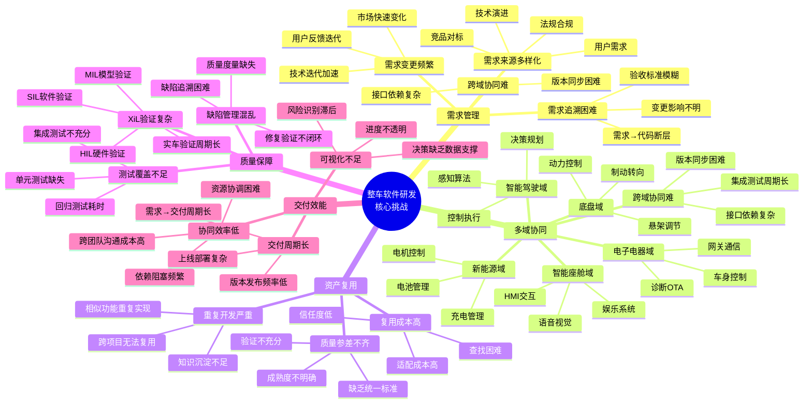

### 1.2 典型业务场景

#### 场景1: 智能驾驶功能开发

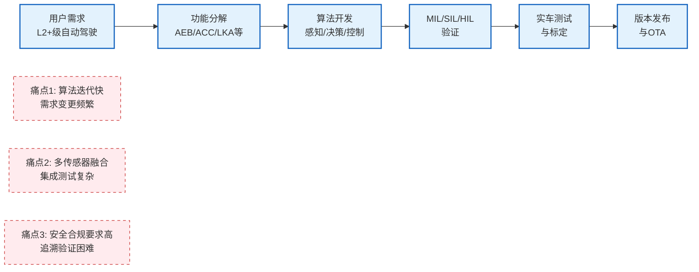

**平台解决方案**:
- ✅ **需求追溯链**: Epic → Feature → SSTS → MR → Task → Code → Test 完整追溯
- ✅ **V型验证**: MIL → SIL → HIL → 实车 验证流程管理
- ✅ **安全合规**: ASIL等级管理、ISO 26262追溯

#### 场景2: 智能座舱多项目复用

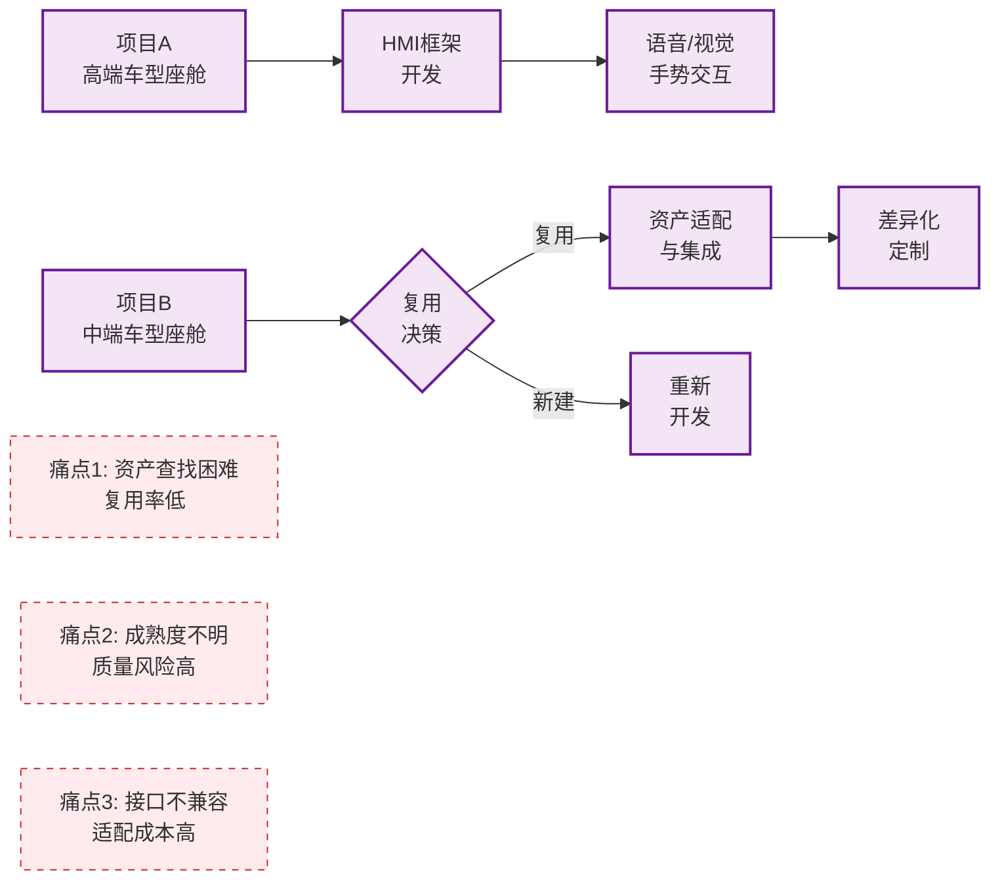

**平台解决方案**:
- ✅ **AI智能推荐**: 语义搜索 + 多维匹配，推荐候选资产
- ✅ **成熟度评估**: TRL等级 + 复用历史 + 质量评分
- ✅ **接口标准化**: 接口定义 + 版本管理 + 兼容性检查

#### 场景3: 多域协同开发

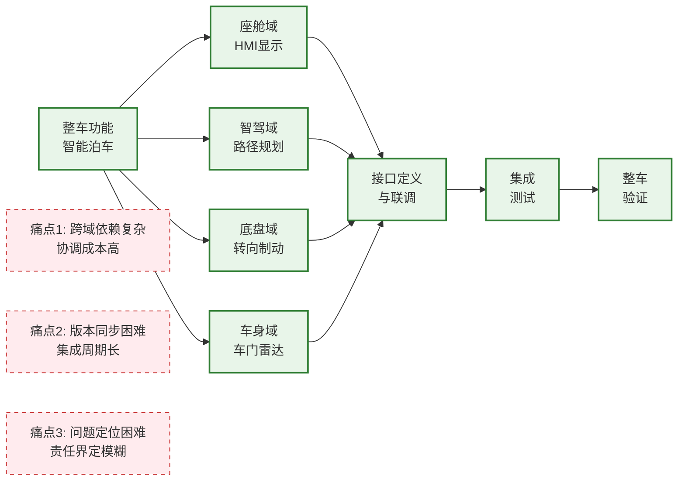

**平台解决方案**:
- ✅ **依赖管理**: 依赖识别 → 依赖跟踪 → 冲突检测 → 协调机制
- ✅ **版本同步**: 基线管理 + 集成计划 + 集成看板
- ✅ **接口管理**: 接口定义 + Mock服务 + 契约测试

#### 场景4: 敏捷迭代与持续交付

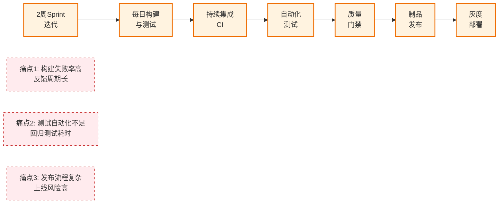

**平台解决方案**:
- ✅ **CI/CD流水线**: 自动触发 + 并行执行 + 快速反馈
- ✅ **自动化测试**: 单元测试 + 集成测试 + 回归测试
- ✅ **灰度发布**: 分阶段发布 + 自动回滚 + 监控告警

### 1.3 平台定位与目标

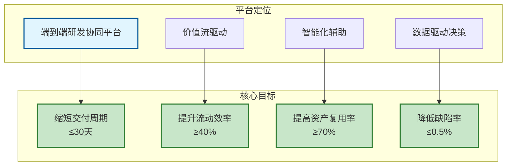

**平台核心价值主张**:

| 维度 | 现状问题 | 平台方案 | 预期收益 |
|------|---------|---------|---------|
| **需求管理** | 需求追溯困难，变更影响分析耗时 | 四层需求分解 + 完整追溯链 | 需求变更响应时间缩短50% |
| **规划协调** | PI Planning耗时长，容量评估不准 | 智能分配 + 可视化规划 | PI Planning时间从5天缩短至2天 |
| **迭代执行** | 团队进度不透明，协同效率低 | 实时看板 + 燃尽图 + 日报 | 团队速率稳定性提升30% |
| **资产复用** | 资产查找困难，复用率低 | AI推荐 + 智能匹配 | 资产复用率从30%提升至70% |
| **价值交付** | 交付周期长，效能指标缺失 | 价值流度量 + 持续改进 | 前置时间缩短40% |

---

## 二、平台业务架构

### 2.1 四层整体架构

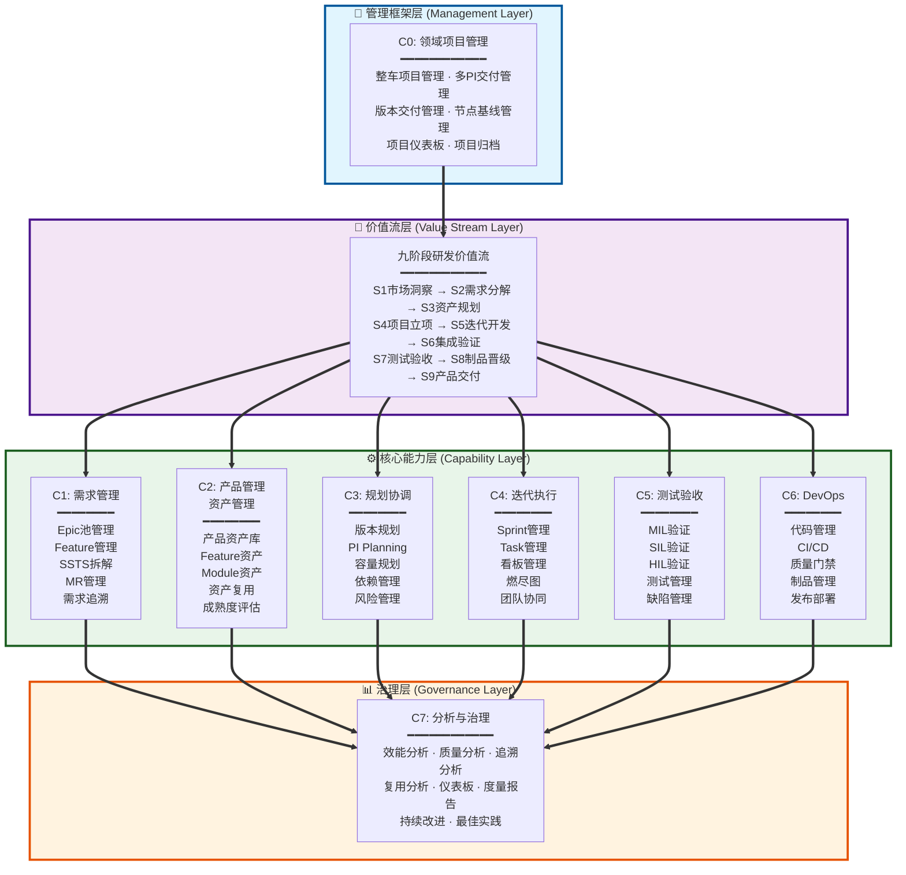

### 2.2 核心设计理念

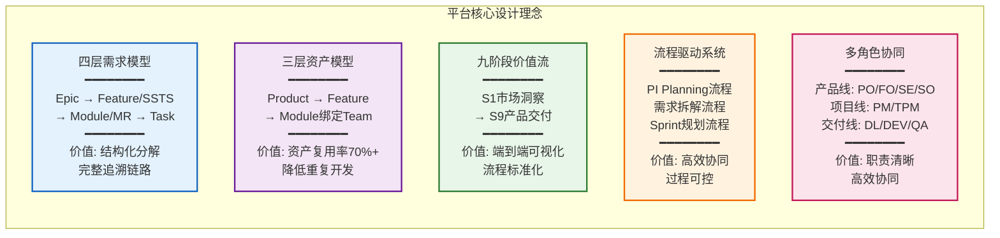

---

## 三、研发价值流设计

### 3.1 九阶段端到端价值流

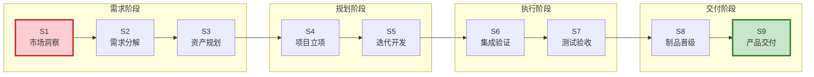

**价值流与能力域映射**:

| 价值流阶段 | 主要活动 | 支撑能力域 | 关键产出 |
|----------|---------|-----------|---------|
| **S1-市场洞察** | 市场调研、用户需求收集 | C1需求管理 | Epic池 |
| **S2-需求分解** | Epic拆解Feature、PRD编写、SSTS拆解 | C1需求管理 | Feature、SSTS |
| **S3-资产规划** | 资产推荐、复用评估 | C2产品管理 | 资产复用方案 |
| **S4-项目立项** | PI Planning、容量规划 | C3规划协调、C0项目管理 | PI计划、Sprint计划 |
| **S5-迭代开发** | Sprint执行、代码开发 | C4迭代执行、C6 DevOps | 代码、构建产物 |
| **S6-集成验证** | 集成测试、接口验证 | C5测试验收、C6 DevOps | 集成测试报告 |
| **S7-测试验收** | 系统测试、验收测试 | C5测试验收 | 测试报告、缺陷列表 |
| **S8-制品晋级** | 质量门禁、制品管理 | C6 DevOps | 制品包 |
| **S9-产品交付** | 发布部署、OTA升级 | C6 DevOps | 发布版本 |

### 3.2 价值流关键指标

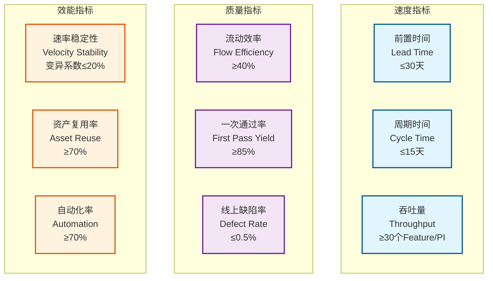

---

## 四、需求与资产模型

### 4.1 四层需求模型

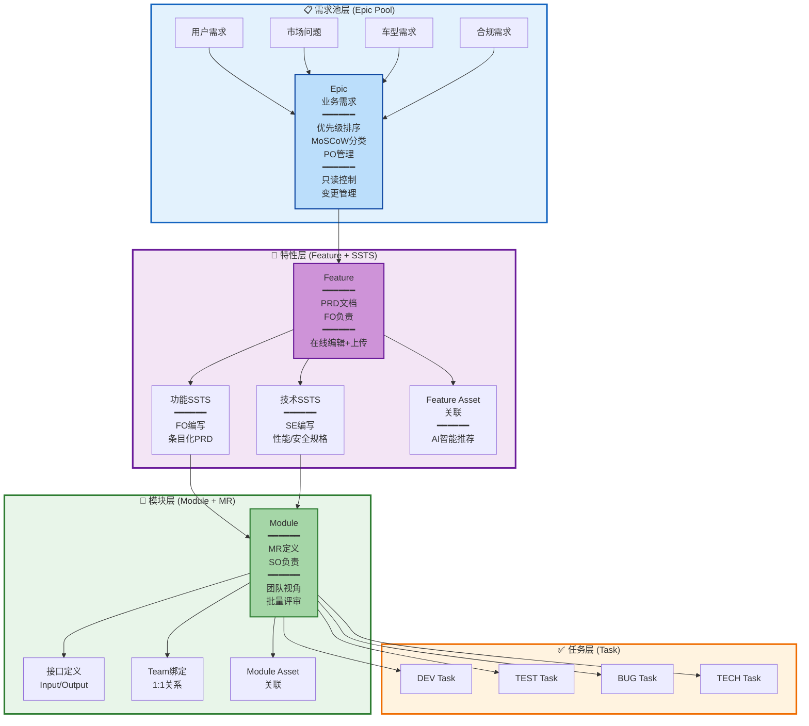

**需求模型核心特性**:

| 层级 | 核心对象 | 关键特性 | 平台创新 |
|------|---------|---------|---------|
| **需求池层** | Epic | 需求来源统一管理、优先级排序 | ✅ Epic只读控制<br/>✅ 变更管理<br/>✅ 版本追踪 |
| **特性层** | Feature<br/>SSTS | 功能需求分析、技术规格定义 | ✅ PRD双模式（在线+上传）<br/>✅ SSTS批量评审（可查看PRD）<br/>✅ AI智能推荐资产 |
| **模块层** | Module<br/>MR | 模块设计、接口定义、Team绑定 | ✅ 团队视角过滤<br/>✅ SSTS拆解为MR<br/>✅ 批量评审 |
| **任务层** | Task | 可执行任务、工时管理 | ✅ 自动拆解<br/>✅ 看板管理<br/>✅ 燃尽图 |

### 4.2 三层资产模型

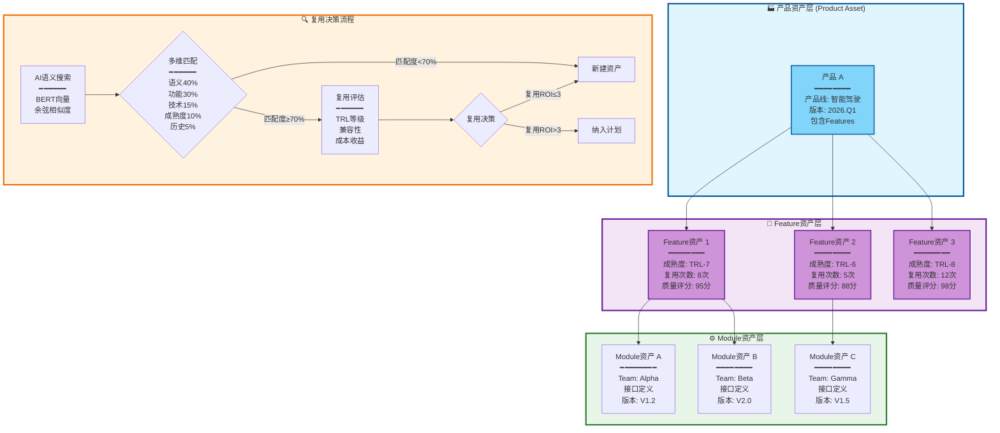

**资产复用流程**:

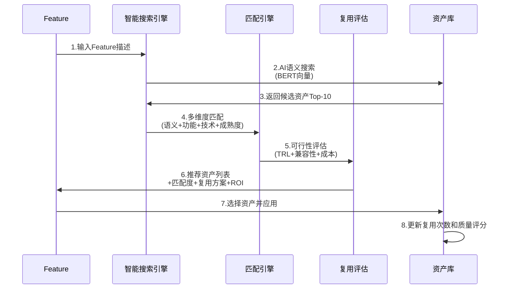

---

## 五、能力架构与核心功能

### 5.1 九大能力域架构

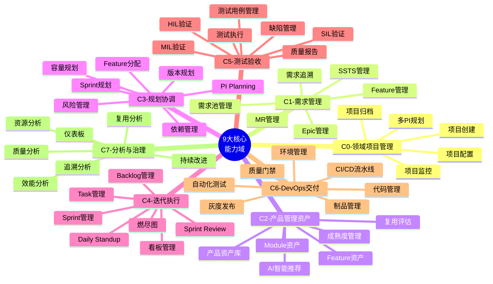

### 5.2 能力域完成度统计

| 能力域 | 核心能力 | 功能数量 | 完成度 | 关键特性 |
|-------|---------|---------|--------|---------|
| **C0-领域项目管理** | 项目全生命周期管理 | 8个 | 100% ✅ | 多PI规划、项目监控、归档流程 |
| **C1-需求管理** | 四层需求分解与追溯 | 25个 | 93% | 需求池、PRD双模式、SSTS批量评审 |
| **C2-产品管理(资产)** | AI驱动的智能资产复用 | 31个 | 68% | AI推荐、TRL评估、复用决策、资产市场 |
| **C3-规划协调** | PI Planning与Feature分配 | 20个 | 100% ✅ | Feature分配、容量规划、依赖管理、风险管理 |
| **C4-迭代执行** | Sprint执行与团队协同 | 20个 | 100% ✅ | 看板管理、燃尽图、团队工作台、阻塞管理 |
| **C5-测试验收** | V型验证与质量保证 | 29个 | 86% | MIL/SIL/HIL验证、测试管理、缺陷闭环 |
| **C6-DevOps交付** | CI/CD与发布流程 | 26个 | 100% ✅ | CI/CD流水线、灰度发布、质量门禁、制品管理 |
| **C7-分析与治理** | 效能分析与持续改进 | 20个 | 92% | 效能分析、质量分析、追溯分析、仪表板 |
| **总计** | **端到端研发管理** | **179个** | **91%** | **整体优秀** |

### 5.3 功能架构与流程概览

> **详细功能列表**: 全部179个功能的详细定义（包括功能描述、输入、输出、主要角色、对应场景、价值流阶段）请参考：
>
> 📄 [全量功能清单_C0-C7.md](./全量功能清单_C0-C7.md)

#### 5.3.1 八大能力域功能架构

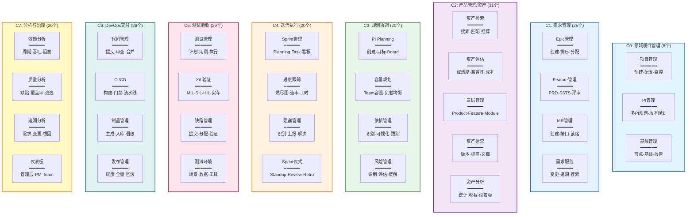

#### 5.3.2 端到端核心功能流

```mermaid
graph TB
    subgraph S1_S2["S1-S2: 需求分解"]
        C1F01[C1-F01<br/>Epic创建] --> C1F05[C1-F05<br/>Feature创建]
        C1F05 --> C1F07[C1-F07<br/>SSTS拆解]
        C1F07 --> C1F13[C1-F13<br/>MR创建]
    end
    
    subgraph S3["S3: 资产规划"]
        C2F01[C2-F01<br/>资产搜索] --> C2F03[C2-F03<br/>复用评估]
        C2F03 --> C2F07[C2-F07<br/>复用决策]
    end
    
    subgraph S4["S4: PI Planning"]
        C0F01[C0-F01<br/>项目创建] --> C3F03[C3-F03<br/>PI Planning]
        C3F03 --> C3F07[C3-F07<br/>MR分配]
        C3F07 --> C3F08[C3-F08<br/>Sprint规划]
    end
    
    subgraph S5["S5: 迭代开发"]
        C4F02[C4-F02<br/>Sprint Planning] --> C4F03[C4-F03<br/>Task创建]
        C4F03 --> C4F07[C4-F07<br/>看板管理]
        C4F07 --> C6F01[C6-F01<br/>代码提交]
    end
    
    subgraph S6["S6: 集成验证"]
        C6F06[C6-F06<br/>编译构建] --> C6F08[C6-F08<br/>质量门禁]
        C6F08 --> C5F05[C5-F05<br/>集成测试]
        C5F05 --> C5F09[C5-F09<br/>SIL验证]
    end
    
    subgraph S7["S7: 测试验收"]
        C5F06[C5-F06<br/>系统测试] --> C5F10[C5-F10<br/>HIL验证]
        C5F10 --> C5F07[C5-F07<br/>验收测试]
    end
    
    subgraph S8_S9["S8-S9: 制品发布"]
        C6F09[C6-F09<br/>制品生成] --> C6F13[C6-F13<br/>制品晋级]
        C6F13 --> C6F14[C6-F14<br/>发布审批]
        C6F14 --> C6F16[C6-F16<br/>全量发布]
    end
    
    C1F13 --> C2F01
    C2F07 --> C0F01
    C3F08 --> C4F02
    C6F01 --> C6F06
    C5F09 --> C5F06
    C5F07 --> C6F09
    
    style S1_S2 fill:#e3f2fd,stroke:#1565c0,stroke-width:2px
    style S3 fill:#f3e5f5,stroke:#6a1b9a,stroke-width:2px
    style S4 fill:#e8f5e9,stroke:#2e7d32,stroke-width:2px
    style S5 fill:#fff3e0,stroke:#ef6c00,stroke-width:2px
    style S6 fill:#fce4ec,stroke:#c2185b,stroke-width:2px
    style S7 fill:#e0f2f1,stroke:#00695c,stroke-width:2px
    style S8_S9 fill:#fff9c4,stroke:#f57f17,stroke-width:2px
```

#### 5.3.3 功能统计汇总

| 能力域 | 功能分组 | 功能数量 | 价值流覆盖 | 核心价值 |
|-------|---------|---------|-----------|---------|
| **C0** | 项目管理·PI管理·基线管理 | 8个 | S4-S9 | 项目全生命周期 |
| **C1** | Epic·Feature·MR·服务 | 25个 | S1-S9 | 四层需求分解 |
| **C2** | 检索·评估·三层管理·运营·分析 | 31个 | S3-S9 | 资产复用率≥70% |
| **C3** | PI·容量·依赖·风险 | 20个 | S3-S5 | PI承诺达成率≥85% |
| **C4** | Sprint·跟踪·阻塞·仪式 | 20个 | S5 | Sprint完成率≥90% |
| **C5** | 测试·XiL·缺陷·环境 | 29个 | S6-S7 | 缺陷逃逸率<3% |
| **C6** | 代码·CI/CD·制品·发布 | 26个 | S6-S9 | 构建成功率≥95% |
| **C7** | 效能·质量·追溯·仪表板 | 20个 | S1-S9 | 数据驱动决策 |
| **总计** | **8大能力域·32个功能分组** | **179个** | **全覆盖** | **端到端协同** |

---

## 六、核心能力详解

### 6.1 C0-领域项目管理

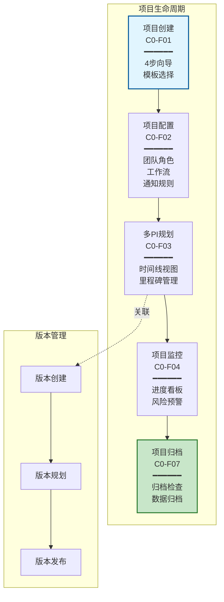

### 6.2 C1-需求管理（核心创新）

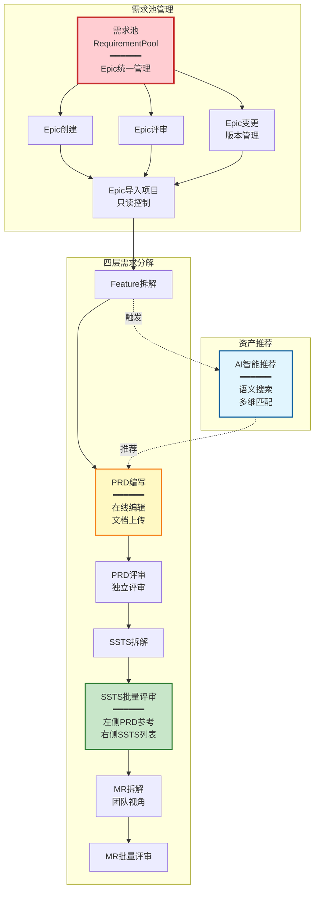

**C1核心创新点**:

1. **需求池管理** (Epic只读控制)
   ```
   - Epic在需求池中可编辑、评审、变更
   - Epic导入到项目后自动标记为只读
   - 提供"在需求池中编辑"跳转链接
   - 变更历史完整追溯
   ```

2. **PRD双模式管理**
   ```
   模式1: 在线编辑
   - TipTap富文本编辑器
   - Markdown支持
   - 自动保存（2秒）
   - 版本历史（查看、对比、恢复）
   - PRD模板（10+个预设模板）
   
   模式2: 文档上传
   - 支持PDF/Word/Markdown
   - 在线预览
   - 文件下载
   ```

3. **SSTS批量评审（可查看PRD）**
   ```
   页面布局:
   ├─ 左侧30%: PRD完整内容（只读，供参考）
   ├─ 右侧70%: SSTS列表（可展开、批量勾选）
   └─ 底部: 批量评审操作
      ├─ 评审意见输入
      ├─ 评审决策（通过/拒绝/有条件通过）
      └─ 提交评审（同步更新所有SSTS状态）
   ```

### 6.3 C2-资产管理（AI智能推荐）

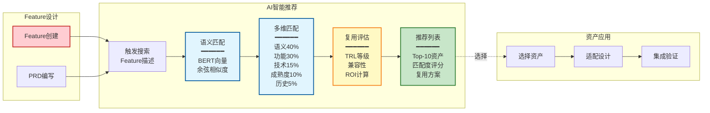

**AI智能推荐算法**:

| 维度 | 权重 | 算法 | 说明 |
|------|------|------|------|
| **语义相似度** | 40% | BERT向量 + 余弦相似度 | Feature描述与资产描述的语义匹配 |
| **功能匹配度** | 30% | 功能标签Jaccard相似度 | 功能标签的交集/并集 |
| **技术栈匹配** | 15% | 技术栈重合度 | 开发语言、框架、依赖的匹配 |
| **成熟度** | 10% | TRL等级评分 | 技术成熟度等级（1-9） |
| **复用历史** | 5% | 历史复用成功率 | 过去的复用记录和反馈 |

### 6.4 C3-规划协调（智能分配）

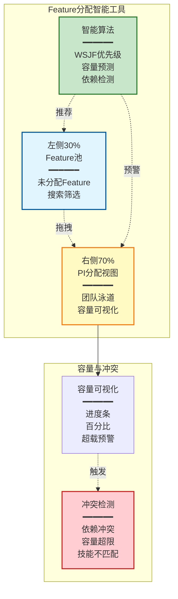

**Feature分配核心功能**:
- ✅ 拖拽分配（@dnd-kit/core）
- ✅ WSJF算法推荐优先级
- ✅ 容量预测和负载均衡
- ✅ 依赖冲突检测
- ✅ 三种视图（团队视图、Sprint视图、时间线视图）

### 6.5 C4-迭代执行（团队工作台）

```mermaid
graph TB
    subgraph 团队工作台
        W1[团队概览<br/>━━━━━━<br/>团队信息<br/>效能指标]
        
        W2[团队Backlog<br/>━━━━━━<br/>按模块过滤<br/>优先级排序]
        
        W3[模块需求管理<br/>━━━━━━<br/>MR列表<br/>团队视角]
        
        W4[Sprint执行<br/>━━━━━━<br/>Task看板<br/>燃尽图]
        
        W1 --> W2 & W3 & W4
    end
    
    subgraph 模块需求管理
        M1[模块选择器<br/>━━━━━━<br/>团队负责的<br/>1-n个模块]
        
        M2[SSTS拆解为MR<br/>━━━━━━<br/>选择SSTS<br/>创建MR]
        
        M3[MR批量评审<br/>━━━━━━<br/>批量勾选<br/>批量操作]
        
        M4[看板视图<br/>━━━━━━<br/>按状态分组<br/>拖拽更新]
        
        M1 --> M2 --> M3 --> M4
    end
    
    W3 --> M1
    
    style W1 fill:#ffcdd2,stroke:#c62828,stroke-width:2px
    style W3 fill:#fff9c4,stroke:#f57f17,stroke-width:2px
    style M2 fill:#c8e6c9,stroke:#2e7d32,stroke-width:2px
```

**团队工作台核心功能**:
- ✅ 基于团队的权限自动过滤
- ✅ 支持SSTS选择和MR拆解
- ✅ 批量操作（评审、分配、状态更新）
- ✅ 看板视图（按状态分组）
- ✅ Sprint看板和燃尽图

### 6.6 C5-测试验收（V型验证）

```mermaid
graph TB
    subgraph V型验证流程
        MIL[MIL验证<br/>Model-in-the-Loop<br/>━━━━━━<br/>模型仿真<br/>算法验证]
        
        SIL[SIL验证<br/>Software-in-the-Loop<br/>━━━━━━<br/>软件仿真<br/>功能验证]
        
        HIL[HIL验证<br/>Hardware-in-the-Loop<br/>━━━━━━<br/>硬件在环<br/>系统验证]
        
        VEHICLE[实车验证<br/>━━━━━━<br/>整车测试<br/>道路验证]
    end
    
    subgraph 测试管理
        TP[测试计划]
        TC[测试用例]
        TE[测试执行]
        TR[测试报告]
        
        TP --> TC --> TE --> TR
    end
    
    subgraph 缺陷管理
        BUG[缺陷录入]
        ASSIGN[缺陷分配]
        FIX[缺陷修复]
        VERIFY[缺陷验证]
        CLOSE[缺陷关闭]
        
        BUG --> ASSIGN --> FIX --> VERIFY --> CLOSE
    end
    
    MIL --> SIL --> HIL --> VEHICLE
    TE -.发现.-> BUG
    
    style MIL fill:#e3f2fd,stroke:#1565c0,stroke-width:2px
    style SIL fill:#f3e5f5,stroke:#6a1b9a,stroke-width:2px
    style HIL fill:#e8f5e9,stroke:#2e7d32,stroke-width:2px
    style VEHICLE fill:#fff3e0,stroke:#ef6c00,stroke-width:2px
    style BUG fill:#ffebee,stroke:#c62828,stroke-width:2px
```

**C5核心功能**:

| 功能模块 | 关键特性 | 价值 |
|---------|---------|------|
| **MIL验证** | 模型仿真、算法验证、参数优化 | 早期发现算法问题，降低成本 |
| **SIL验证** | 软件仿真、功能验证、接口测试 | 验证软件功能正确性 |
| **HIL验证** | 硬件在环、系统验证、实时测试 | 验证系统集成和实时性 |
| **实车验证** | 道路测试、场景覆盖、性能验证 | 最终验证产品质量 |
| **测试管理** | 测试计划、用例管理、执行跟踪 | 测试过程可控可追溯 |
| **缺陷管理** | 缺陷全生命周期管理 | 质量问题闭环管理 |

**测试策略**:
```
测试金字塔:
├─ 单元测试（70%）- 开发人员编写，快速反馈
├─ 集成测试（20%）- 测试人员编写，验证模块集成
└─ 系统测试（10%）- 测试人员+用户，验证端到端流程

测试覆盖率要求:
├─ 代码覆盖率≥80%（单元测试）
├─ 接口覆盖率100%（集成测试）
└─ 业务场景覆盖率≥90%（系统测试）
```

### 6.7 C6-DevOps交付（CI/CD）

```mermaid
graph LR
    subgraph CI流程
        CODE[代码提交] --> BUILD[自动构建]
        BUILD --> TEST[自动化测试]
        TEST --> SCAN[质量扫描]
        SCAN --> GATE[质量门禁]
    end
    
    subgraph CD流程
        GATE -->|通过| ARTIFACT[制品管理]
        ARTIFACT --> DEV[开发环境]
        DEV --> QA[测试环境]
        QA --> PRE[预生产环境]
        PRE --> PROD[生产环境]
    end
    
    subgraph 灰度发布
        PROD --> GRAY1[5%灰度]
        GRAY1 --> MONITOR1[监控指标]
        MONITOR1 -->|正常| GRAY2[20%灰度]
        GRAY2 --> MONITOR2[监控指标]
        MONITOR2 -->|正常| GRAY3[100%全量]
        MONITOR1 -->|异常| ROLLBACK[自动回滚]
        MONITOR2 -->|异常| ROLLBACK
    end
    
    style GATE fill:#fff9c4,stroke:#f57f17,stroke-width:2px
    style ARTIFACT fill:#c8e6c9,stroke:#2e7d32,stroke-width:2px
    style ROLLBACK fill:#ffebee,stroke:#c62828,stroke-width:2px
```

**C6核心功能**:

| 功能模块 | 关键特性 | 价值 |
|---------|---------|------|
| **CI/CD流水线** | 自动触发、并行执行、快速反馈 | 提升交付效率，缩短反馈周期 |
| **自动化测试** | 单元测试、集成测试、UI测试 | 保证代码质量，减少人工测试 |
| **质量门禁** | 代码规范、覆盖率、安全扫描 | 质量内建，防止低质量代码合入 |
| **制品管理** | 版本管理、依赖管理、镜像仓库 | 制品可追溯、可回溯 |
| **灰度发布** | 分阶段发布、监控告警、自动回滚 | 降低发布风险，快速止损 |
| **环境管理** | 环境自动化、配置管理、容器化 | 环境一致性，降低环境问题 |

**质量门禁规则**:
```
门禁项:
├─ 代码规范检查（ESLint/SonarQube）
├─ 单元测试覆盖率≥80%
├─ 代码重复率≤5%
├─ 安全漏洞扫描（无高危漏洞）
├─ 依赖安全检查（无已知漏洞）
└─ 性能基准测试（无明显退化）

不满足任一项 → 阻止合并
```

**灰度发布策略**:
```
阶段1: 5%灰度（金丝雀发布）
  ├─ 目标: 快速验证基本功能
  ├─ 监控: 错误率、响应时间、可用性
  └─ 决策: 正常→下一阶段，异常→自动回滚

阶段2: 20%灰度
  ├─ 目标: 验证性能和稳定性
  ├─ 监控: 吞吐量、资源使用、业务指标
  └─ 决策: 正常→全量，异常→回滚

阶段3: 100%全量
  ├─ 目标: 全量发布
  └─ 监控: 持续监控，快速响应
```

### 6.8 C7-分析与治理（效能度量）

```mermaid
graph TB
    subgraph 数据采集
        D1[需求数据]
        D2[开发数据]
        D3[测试数据]
        D4[发布数据]
        D5[质量数据]
    end
    
    subgraph 效能分析
        A1[速度分析<br/>━━━━━━<br/>前置时间<br/>周期时间<br/>吞吐量]
        
        A2[质量分析<br/>━━━━━━<br/>缺陷率<br/>一次通过率<br/>逃逸率]
        
        A3[效率分析<br/>━━━━━━<br/>流动效率<br/>资源利用率<br/>自动化率]
        
        A4[价值分析<br/>━━━━━━<br/>客户满意度<br/>业务价值<br/>投资回报]
    end
    
    subgraph 可视化报告
        V1[仪表板]
        V2[趋势图]
        V3[对比图]
        V4[热力图]
    end
    
    subgraph 持续改进
        I1[识别瓶颈]
        I2[制定措施]
        I3[跟踪执行]
        I4[验证效果]
    end
    
    D1 & D2 & D3 & D4 & D5 --> A1 & A2 & A3 & A4
    A1 & A2 & A3 & A4 --> V1 & V2 & V3 & V4
    V1 & V2 & V3 & V4 --> I1
    I1 --> I2 --> I3 --> I4
    I4 -.反馈.-> D1
    
    style A1 fill:#e3f2fd,stroke:#1565c0,stroke-width:2px
    style A2 fill:#f3e5f5,stroke:#6a1b9a,stroke-width:2px
    style A3 fill:#e8f5e9,stroke:#2e7d32,stroke-width:2px
    style A4 fill:#fff3e0,stroke:#ef6c00,stroke-width:2px
    style I1 fill:#ffebee,stroke:#c62828,stroke-width:2px
```

**C7核心功能**:

| 功能模块 | 关键特性 | 价值 |
|---------|---------|------|
| **效能分析** | 速度、质量、效率、价值四维分析 | 全面了解研发效能状况 |
| **质量分析** | 缺陷分析、根因分析、趋势预测 | 持续提升产品质量 |
| **追溯分析** | 需求追溯、代码追溯、测试追溯 | 快速定位问题，影响分析 |
| **复用分析** | 资产复用率、复用收益、复用趋势 | 提升资产复用率 |
| **仪表板** | 实时数据、多维度展示、钻取分析 | 数据驱动决策 |
| **度量报告** | 自动生成、定期发送、对比分析 | 定期回顾，持续改进 |

**效能指标体系**:

| 指标类别 | 指标名称 | 计算公式 | 目标值 | 用途 |
|---------|---------|---------|--------|------|
| **速度指标** | 前置时间 | 交付时间 - 创建时间 | ≤30天 | 衡量交付速度 |
| | 周期时间 | 交付时间 - 开发开始时间 | ≤15天 | 衡量开发效率 |
| | 吞吐量 | 完成数量 / 时间周期 | ≥30个/PI | 衡量产能 |
| **质量指标** | 流动效率 | 工作时间 / 前置时间 | ≥40% | 识别等待浪费 |
| | 一次通过率 | 一次通过数 / 总数 | ≥85% | 衡量质量稳定性 |
| | 缺陷密度 | 缺陷数 / 代码行数×1000 | ≤0.5/KLOC | 衡量代码质量 |
| | 逃逸率 | 线上缺陷 / 总缺陷 | <3% | 衡量测试有效性 |
| **效率指标** | 速率稳定性 | CV(Velocity) | ≤20% | 衡量团队稳定性 |
| | 资产复用率 | 复用数 / 总数 | ≥70% | 衡量复用水平 |
| | 自动化率 | 自动化数 / 总数 | ≥70% | 衡量自动化程度 |

---

## 七、流程定义详解

### 7.1 流程定义概述

流程定义是平台流程驱动能力的核心，通过标准化的流程模板和灵活的流程引擎，支撑PI Planning、需求拆解、Sprint规划等核心业务流程。

#### 流程6要素

```mermaid
mindmap
  root((流程定义<br/>6要素))
    明确的范围
      起点清晰
      终点明确
      边界定义
      输入条件
    清晰的角色
      发起人
      参与者
      审批人
      通知对象
    标准的步骤
      步骤顺序
      步骤类型
      步骤输入
      步骤输出
      检查点
    定义的数据
      输入数据
      输出数据
      中间状态
      上下文传递
    合理的触发
      自动触发
      手动触发
      定时触发
      事件触发
    完善的监控
      进度监控
      异常告警
      耗时统计
      效能分析
```

### 7.2 PI Planning流程（10步）

```mermaid
graph TB
    START([流程开始]) --> P1[P1: PI创建<br/>━━━━━━<br/>角色: PM<br/>输入: 项目、Epic列表<br/>输出: PI实例]
    
    P1 --> P2[P2: 目标设定<br/>━━━━━━<br/>角色: PM+PO<br/>输入: PI愿景<br/>输出: PI目标]
    
    P2 --> P3[P3: Feature分配<br/>━━━━━━<br/>角色: TPM<br/>输入: Feature池<br/>输出: Feature分配方案]
    
    P3 --> P4[P4: 容量规划<br/>━━━━━━<br/>角色: DL<br/>输入: 团队速率<br/>输出: 容量评估]
    
    P4 --> P5[P5: 负载均衡<br/>━━━━━━<br/>角色: TPM<br/>输入: 容量数据<br/>输出: 调整方案]
    
    P5 --> P6[P6: Sprint规划<br/>━━━━━━<br/>角色: DL<br/>输入: Feature分配<br/>输出: Sprint计划]
    
    P6 --> P7[P7: PI Board<br/>━━━━━━<br/>角色: PM+团队<br/>输入: Sprint计划<br/>输出: PI看板]
    
    P7 --> P8[P8: 依赖识别<br/>━━━━━━<br/>角色: 全体<br/>输入: PI看板<br/>输出: 依赖列表]
    
    P8 --> P9[P9: 风险识别<br/>━━━━━━<br/>角色: 全体<br/>输入: PI计划<br/>输出: 风险列表]
    
    P9 --> P10[P10: PI承诺<br/>━━━━━━<br/>角色: 团队<br/>输入: PI计划<br/>输出: 团队承诺]
    
    P10 --> END([流程结束])
    
    style START fill:#c8e6c9,stroke:#2e7d32,stroke-width:3px
    style P1 fill:#e1f5fe,stroke:#01579b,stroke-width:2px
    style P3 fill:#fff9c4,stroke:#f57f17,stroke-width:2px
    style P6 fill:#fff9c4,stroke:#f57f17,stroke-width:2px
    style P10 fill:#c8e6c9,stroke:#2e7d32,stroke-width:2px
    style END fill:#c8e6c9,stroke:#2e7d32,stroke-width:3px
```

**流程详细定义**:

| 步骤 | 步骤名称 | 角色 | 输入 | 输出 | 关键活动 | 检查点 |
|------|---------|------|------|------|---------|--------|
| **P1** | PI创建 | PM | 项目、Epic列表 | PI实例 | 设置PI名称、时间范围、目标 | PI信息完整 |
| **P2** | 目标设定 | PM+PO | PI愿景 | PI目标 | 讨论PI业务目标、成功标准 | 目标SMART |
| **P3** | Feature分配 | TPM | Feature池 | Feature分配方案 | WSJF排序、Feature分配到团队 | 容量不超载 |
| **P4** | 容量规划 | DL | 团队速率 | 容量评估 | 评估团队可用人天、速率 | 容量合理 |
| **P5** | 负载均衡 | TPM | 容量数据 | 调整方案 | 根据容量调整Feature分配 | 负载均衡 |
| **P6** | Sprint规划 | DL | Feature分配 | Sprint计划 | 将Feature分配到Sprint | Sprint可交付 |
| **P7** | PI Board | PM+团队 | Sprint计划 | PI看板 | 展示PI全貌、团队计划 | 可视化清晰 |
| **P8** | 依赖识别 | 全体 | PI看板 | 依赖列表 | 识别跨团队依赖、记录 | 依赖明确 |
| **P9** | 风险识别 | 全体 | PI计划 | 风险列表 | 识别技术、资源、依赖风险 | 风险已记录 |
| **P10** | PI承诺 | 团队 | PI计划 | 团队承诺 | 团队确认承诺、锁定计划 | 承诺明确 |

**流程数据模型**:

```mermaid
graph TB
    subgraph 流程实例数据
        P1[流程基本信息<br/>━━━━━━<br/>流程ID<br/>流程名称<br/>当前状态<br/>当前步骤]
    end
    
    subgraph 输入数据
        I1[项目信息<br/>━━━━━━<br/>项目ID<br/>Epic列表<br/>团队列表]
    end
    
    subgraph 流程上下文
        C1[PI数据<br/>━━━━━━<br/>PI实例<br/>Feature列表<br/>团队容量<br/>依赖列表<br/>风险列表]
    end
    
    subgraph 输出数据
        O1[输出成果<br/>━━━━━━<br/>PI计划<br/>Sprint计划<br/>团队承诺]
    end
    
    I1 --> P1
    P1 --> C1
    C1 --> O1
    
    style P1 fill:#e1f5fe,stroke:#01579b,stroke-width:2px
    style I1 fill:#fff9c4,stroke:#f57f17,stroke-width:2px
    style C1 fill:#f3e5f5,stroke:#6a1b9a,stroke-width:2px
    style O1 fill:#c8e6c9,stroke:#2e7d32,stroke-width:2px
```

**数据结构定义**:

| 数据类别 | 数据项 | 类型 | 说明 |
|---------|--------|------|------|
| **流程基本信息** | 流程ID | 字符串 | 唯一标识 |
| | 流程名称 | 字符串 | "PI Planning" |
| | 状态 | 枚举 | 未开始/进行中/暂停/已完成 |
| | 当前步骤 | 数字 | 1-10 |
| **输入数据** | 项目ID | 字符串 | 关联项目 |
| | Epic列表 | 数组 | Epic对象列表 |
| | 团队列表 | 数组 | Team对象列表 |
| **流程上下文** | PI实例 | 对象 | PI详细信息 |
| | Feature列表 | 数组 | 已分配的Feature |
| | 团队容量 | 映射表 | 团队ID→容量数据 |
| | 依赖列表 | 数组 | 跨团队依赖 |
| | 风险列表 | 数组 | 识别的风险 |
| **输出数据** | PI计划 | 对象 | 完整的PI计划 |
| | Sprint计划 | 数组 | 各Sprint计划 |
| | 团队承诺 | 数组 | 各团队承诺 |

### 7.3 需求拆解流程（7步）

```mermaid
graph TB
    START([流程开始]) --> R1[R1: Epic导入<br/>━━━━━━<br/>角色: PO<br/>输入: Epic池<br/>输出: 项目Epic]
    
    R1 --> R2[R2: Feature拆解<br/>━━━━━━<br/>角色: FO<br/>输入: Epic<br/>输出: Feature列表]
    
    R2 --> R3[R3: PRD编写<br/>━━━━━━<br/>角色: FO<br/>输入: Feature<br/>输出: PRD文档]
    
    R3 --> R4[R4: PRD评审<br/>━━━━━━<br/>角色: PO+SE<br/>输入: PRD<br/>输出: 评审结果]
    
    R4 --> CHECK1{评审通过?}
    CHECK1 -->|否| R3
    CHECK1 -->|是| R5[R5: SSTS拆解<br/>━━━━━━<br/>角色: FO+SE<br/>输入: PRD<br/>输出: SSTS列表]
    
    R5 --> R6[R6: SSTS评审<br/>━━━━━━<br/>角色: SO+DL<br/>输入: SSTS+PRD<br/>输出: 评审结果]
    
    R6 --> CHECK2{评审通过?}
    CHECK2 -->|否| R5
    CHECK2 -->|是| R7[R7: Feature完成<br/>━━━━━━<br/>角色: 系统<br/>输入: SSTS列表<br/>输出: Feature就绪]
    
    R7 --> END([流程结束])
    
    style START fill:#c8e6c9,stroke:#2e7d32,stroke-width:3px
    style R1 fill:#e1f5fe,stroke:#01579b,stroke-width:2px
    style R3 fill:#fff9c4,stroke:#f57f17,stroke-width:2px
    style R5 fill:#fff9c4,stroke:#f57f17,stroke-width:2px
    style CHECK1 fill:#ffebee,stroke:#c62828,stroke-width:2px
    style CHECK2 fill:#ffebee,stroke:#c62828,stroke-width:2px
    style R7 fill:#c8e6c9,stroke:#2e7d32,stroke-width:2px
    style END fill:#c8e6c9,stroke:#2e7d32,stroke-width:3px
```

**流程详细定义**:

| 步骤 | 步骤名称 | 角色 | 输入 | 输出 | 关键活动 | 检查点 |
|------|---------|------|------|------|---------|--------|
| **R1** | Epic导入 | PO | Epic池 | 项目Epic | 从需求池选择Epic导入项目 | Epic状态=已导入 |
| **R2** | Feature拆解 | FO | Epic | Feature列表 | 拆解Epic为Feature、定义用户故事 | Feature符合INVEST |
| **R3** | PRD编写 | FO | Feature | PRD文档 | 编写PRD（背景、目标、需求、方案、验收） | PRD完整性检查 |
| **R4** | PRD评审 | PO+SE | PRD | 评审结果 | 评审PRD合理性、可行性 | 通过/拒绝/有条件通过 |
| **R5** | SSTS拆解 | FO+SE | PRD | SSTS列表 | 拆解PRD为SSTS（功能/技术/安全） | SSTS符合SMART |
| **R6** | SSTS评审 | SO+DL | SSTS+PRD | 评审结果 | 批量评审SSTS（可查看PRD） | 通过/拒绝 |
| **R7** | Feature完成 | 系统 | SSTS列表 | Feature就绪 | 自动更新Feature状态为"就绪" | 可分配到PI |

**创新点**:
- ✅ **PRD双模式**: 支持在线编辑和文档上传
- ✅ **SSTS批量评审**: 左侧显示PRD参考，右侧批量勾选SSTS
- ✅ **自动状态更新**: SSTS评审通过后Feature自动变为"就绪"

### 7.4 Sprint规划流程（7步）

```mermaid
graph TB
    START([流程开始]) --> S1[S1: Sprint创建<br/>━━━━━━<br/>角色: DL<br/>输入: PI计划<br/>输出: Sprint实例]
    
    S1 --> S2[S2: Backlog整理<br/>━━━━━━<br/>角色: DL+PO<br/>输入: Feature/SSTS<br/>输出: 优先级排序]
    
    S2 --> S3[S3: Story选择<br/>━━━━━━<br/>角色: DL+团队<br/>输入: Backlog<br/>输出: Sprint Backlog]
    
    S3 --> S4[S4: 容量检查<br/>━━━━━━<br/>角色: DL<br/>输入: Story Points<br/>输出: 容量评估]
    
    S4 --> CHECK{容量超限?}
    CHECK -->|是| S3
    CHECK -->|否| S5[S5: Task拆解<br/>━━━━━━<br/>角色: 团队<br/>输入: Story<br/>输出: Task列表]
    
    S5 --> S6[S6: Task分配<br/>━━━━━━<br/>角色: DL+团队<br/>输入: Task列表<br/>输出: 任务分配]
    
    S6 --> S7[S7: Sprint承诺<br/>━━━━━━<br/>角色: 团队<br/>输入: Sprint计划<br/>输出: 团队承诺]
    
    S7 --> END([流程结束])
    
    style START fill:#c8e6c9,stroke:#2e7d32,stroke-width:3px
    style S1 fill:#e1f5fe,stroke:#01579b,stroke-width:2px
    style S3 fill:#fff9c4,stroke:#f57f17,stroke-width:2px
    style S5 fill:#fff9c4,stroke:#f57f17,stroke-width:2px
    style CHECK fill:#ffebee,stroke:#c62828,stroke-width:2px
    style S7 fill:#c8e6c9,stroke:#2e7d32,stroke-width:2px
    style END fill:#c8e6c9,stroke:#2e7d32,stroke-width:3px
```

**流程详细定义**:

| 步骤 | 步骤名称 | 角色 | 输入 | 输出 | 关键活动 | 检查点 |
|------|---------|------|------|------|---------|--------|
| **S1** | Sprint创建 | DL | PI计划 | Sprint实例 | 设置Sprint名称、时间范围、目标 | Sprint信息完整 |
| **S2** | Backlog整理 | DL+PO | Feature/SSTS | 优先级排序 | 整理Backlog、重新排序 | 优先级明确 |
| **S3** | Story选择 | DL+团队 | Backlog | Sprint Backlog | 团队选择本Sprint要完成的Story | Story明确 |
| **S4** | 容量检查 | DL | Story Points | 容量评估 | 计算Story Points总和vs团队速率 | 容量合理 |
| **S5** | Task拆解 | 团队 | Story | Task列表 | 将Story拆解为可执行Task（2-3天） | Task可交付 |
| **S6** | Task分配 | DL+团队 | Task列表 | 任务分配 | 分配Task给开发人员 | 负载均衡 |
| **S7** | Sprint承诺 | 团队 | Sprint计划 | 团队承诺 | 团队确认承诺、开始Sprint | 承诺明确 |

### 7.5 流程引擎设计

```mermaid
graph TB
    subgraph 流程模板库
        T1[PI Planning模板]
        T2[需求拆解模板]
        T3[Sprint规划模板]
        T4[发布流程模板]
        T5[测试流程模板]
    end
    
    subgraph 流程引擎
        ENGINE[流程引擎<br/>ProcessEngine]
        
        ENGINE --> START[启动流程]
        ENGINE --> EXECUTE[执行步骤]
        ENGINE --> PAUSE[暂停流程]
        ENGINE --> RESUME[恢复流程]
        ENGINE --> COMPLETE[完成流程]
        ENGINE --> ROLLBACK[回滚流程]
    end
    
    subgraph 流程实例管理
        INSTANCE[流程实例<br/>ProcessInstance]
        
        INSTANCE --> STATE[状态管理]
        INSTANCE --> CONTEXT[上下文数据]
        INSTANCE --> HISTORY[历史记录]
        INSTANCE --> METRIC[效能度量]
    end
    
    T1 & T2 & T3 & T4 & T5 -.实例化.-> ENGINE
    ENGINE --> INSTANCE
    
    style ENGINE fill:#fff9c4,stroke:#f57f17,stroke-width:3px
    style INSTANCE fill:#c8e6c9,stroke:#2e7d32,stroke-width:2px
```

**流程引擎核心功能**:

| 功能 | 说明 | 技术方案 |
|------|------|---------|
| **流程定义** | 支持BPMN 2.0标准，可视化流程设计 | BPMN引擎（Camunda/Activiti） |
| **流程实例** | 运行时流程实例管理、状态跟踪 | 状态机模式 + 事件溯源 |
| **流程监控** | 实时监控流程进度、异常告警 | WebSocket + 事件总线 |
| **流程优化** | 分析流程耗时、识别瓶颈 | 数据分析 + 可视化 |

### 7.6 流程数据模型

#### 流程数据关系图

```mermaid
graph TB
    subgraph 流程定义层
        PD[流程定义<br/>ProcessDefinition<br/>━━━━━━<br/>流程ID<br/>流程名称<br/>版本号]
        
        PS[流程步骤<br/>ProcessStep<br/>━━━━━━<br/>步骤ID<br/>步骤名称<br/>步骤类型]
        
        PR[流程角色<br/>ProcessRole<br/>━━━━━━<br/>角色名称<br/>权限定义]
        
        PT[流程触发器<br/>ProcessTrigger<br/>━━━━━━<br/>触发类型<br/>触发条件]
    end
    
    subgraph 流程实例层
        PI[流程实例<br/>ProcessInstance<br/>━━━━━━<br/>实例ID<br/>当前状态<br/>当前步骤]
        
        PC[流程上下文<br/>Context<br/>━━━━━━<br/>输入数据<br/>中间数据<br/>输出数据]
        
        PH[流程历史<br/>ProcessHistory<br/>━━━━━━<br/>步骤记录<br/>执行结果<br/>耗时统计]
    end
    
    PD --> PS
    PD --> PR
    PD --> PT
    PD -.实例化.-> PI
    PI --> PC
    PI --> PH
    
    style PD fill:#e1f5fe,stroke:#01579b,stroke-width:2px
    style PI fill:#fff9c4,stroke:#f57f17,stroke-width:2px
    style PC fill:#f3e5f5,stroke:#6a1b9a,stroke-width:2px
    style PH fill:#e8f5e9,stroke:#2e7d32,stroke-width:2px
```

#### 流程数据模型定义

**1. 流程定义 (ProcessDefinition)**

| 字段名 | 类型 | 必填 | 说明 |
|-------|------|------|------|
| id | 字符串 | ✅ | 流程唯一标识 |
| name | 字符串 | ✅ | 流程名称（如"PI Planning"） |
| version | 字符串 | ✅ | 流程版本号（如"1.0.0"） |
| steps | 数组 | ✅ | 流程步骤列表 |
| roles | 数组 | ✅ | 参与角色列表 |
| triggers | 数组 | ✅ | 触发器配置 |
| description | 字符串 | ❌ | 流程描述 |
| createdAt | 日期时间 | ✅ | 创建时间 |

**2. 流程步骤 (ProcessStep)**

| 字段名 | 类型 | 必填 | 说明 |
|-------|------|------|------|
| stepId | 字符串 | ✅ | 步骤唯一标识 |
| stepName | 字符串 | ✅ | 步骤名称 |
| stepType | 枚举 | ✅ | 步骤类型：手动/自动/决策 |
| roles | 数组 | ✅ | 执行角色列表 |
| inputs | 对象 | ✅ | 输入数据定义 |
| outputs | 对象 | ✅ | 输出数据定义 |
| checkpoints | 数组 | ✅ | 检查点列表 |
| nextSteps | 数组 | ✅ | 下一步骤ID列表 |
| estimatedDuration | 数字 | ❌ | 预估耗时（分钟） |

**3. 流程实例 (ProcessInstance)**

| 字段名 | 类型 | 必填 | 说明 |
|-------|------|------|------|
| instanceId | 字符串 | ✅ | 实例唯一标识 |
| definitionId | 字符串 | ✅ | 关联的流程定义ID |
| status | 枚举 | ✅ | 状态：未开始/进行中/暂停/已完成/失败 |
| currentStep | 字符串 | ✅ | 当前步骤ID |
| context | 对象 | ✅ | 流程上下文数据 |
| history | 数组 | ✅ | 历史记录列表 |
| startTime | 日期时间 | ✅ | 开始时间 |
| endTime | 日期时间 | ❌ | 结束时间 |
| duration | 数字 | ❌ | 总耗时（毫秒） |
| executor | 字符串 | ✅ | 当前执行人 |

**4. 流程历史 (ProcessHistory)**

| 字段名 | 类型 | 必填 | 说明 |
|-------|------|------|------|
| stepId | 字符串 | ✅ | 步骤ID |
| stepName | 字符串 | ✅ | 步骤名称 |
| startTime | 日期时间 | ✅ | 步骤开始时间 |
| endTime | 日期时间 | ✅ | 步骤结束时间 |
| duration | 数字 | ✅ | 耗时（毫秒） |
| executor | 字符串 | ✅ | 执行人 |
| result | 枚举 | ✅ | 执行结果：成功/失败/跳过 |
| data | 对象 | ❌ | 执行数据快照 |
| comment | 字符串 | ❌ | 备注信息 |

---

## 八、流程驱动与范围控制

### 8.1 流程驱动系统架构

```mermaid
graph TB
    subgraph 流程定义层
        PD1[流程模板库<br/>━━━━━━<br/>PI Planning<br/>需求拆解<br/>Sprint规划]
        
        PD2[流程定义<br/>ProcessDefinition<br/>━━━━━━<br/>步骤定义<br/>角色定义<br/>触发条件]
    end
    
    subgraph 流程实例层
        PI1[流程实例<br/>ProcessInstance<br/>━━━━━━<br/>当前步骤<br/>进度状态]
        
        PI2[流程上下文<br/>Context<br/>━━━━━━<br/>数据传递<br/>状态保存]
        
        PI3[流程历史<br/>History<br/>━━━━━━<br/>步骤记录<br/>耗时统计]
    end
    
    subgraph 流程引擎
        PE1[启动引擎] --> PI1
        PE2[步骤引擎] --> PI1
        PE3[暂停/恢复] --> PI1
        PE4[完成引擎] --> PI1
    end
    
    PD1 --> PD2
    PD2 -.实例化.-> PI1
    PI1 --> PI2 & PI3
    
    style PD1 fill:#e1f5fe,stroke:#01579b,stroke-width:2px
    style PI1 fill:#fff9c4,stroke:#f57f17,stroke-width:2px
    style PE1 fill:#c8e6c9,stroke:#2e7d32,stroke-width:2px
```

### 7.2 预定义流程模板

#### PI Planning流程（10步）

```mermaid
graph LR
    P1[PI创建] --> P2[目标设定]
    P2 --> P3[Feature分配]
    P3 --> P4[容量规划]
    P4 --> P5[负载均衡]
    P5 --> P6[Sprint规划]
    P6 --> P7[PI Board]
    P7 --> P8[依赖识别]
    P8 --> P9[风险识别]
    P9 --> P10[PI承诺]
    
    style P1 fill:#e1f5fe,stroke:#01579b,stroke-width:2px
    style P10 fill:#c8e6c9,stroke:#2e7d32,stroke-width:2px
```

#### 需求拆解流程（7步）

```mermaid
graph LR
    R1[Epic导入] --> R2[Feature拆解]
    R2 --> R3[PRD编写]
    R3 --> R4[PRD评审]
    R4 --> R5[SSTS拆解]
    R5 --> R6[SSTS评审]
    R6 --> R7[Feature完成]
    
    style R1 fill:#e1f5fe,stroke:#01579b,stroke-width:2px
    style R7 fill:#c8e6c9,stroke:#2e7d32,stroke-width:2px
```

#### Sprint规划流程（7步）

```mermaid
graph LR
    S1[Sprint创建] --> S2[Backlog整理]
    S2 --> S3[Story选择]
    S3 --> S4[容量检查]
    S4 --> S5[Task拆解]
    S5 --> S6[Task分配]
    S6 --> S7[Sprint承诺]
    
    style S1 fill:#e1f5fe,stroke:#01579b,stroke-width:2px
    style S7 fill:#c8e6c9,stroke:#2e7d32,stroke-width:2px
```

### 7.3 范围控制架构

```mermaid
graph TB
    subgraph L1-项目范围
        S1[DomainProject<br/>领域项目<br/>━━━━━━<br/>适用：项目规划<br/>需求拆解<br/>整体进度]
    end
    
    subgraph L2-PI范围
        S2[PI<br/>Program Increment<br/>━━━━━━<br/>适用：PI Planning<br/>Feature分配<br/>依赖管理]
    end
    
    subgraph L3-Sprint范围
        S3[Sprint<br/>迭代<br/>━━━━━━<br/>适用：Backlog规划<br/>Task分配<br/>日常执行]
    end
    
    subgraph L4-Team范围
        S4[Team<br/>团队<br/>━━━━━━<br/>适用：团队Backlog<br/>人员分工<br/>团队度量]
    end
    
    S1 -->|包含| S2
    S2 -->|包含| S3
    S3 -->|分配| S4
    
    subgraph 特殊维度
        D1[产品维度<br/>按产品过滤Feature]
        D2[模块维度<br/>按模块团队过滤MR]
    end
    
    S1 -.产品.-> D1
    S4 -.模块.-> D2
    
    style S1 fill:#ffcdd2,stroke:#c62828,stroke-width:3px
    style S2 fill:#fff9c4,stroke:#f57f17,stroke-width:2px
    style S3 fill:#e1f5fe,stroke:#01579b,stroke-width:2px
    style S4 fill:#c8e6c9,stroke:#2e7d32,stroke-width:2px
    style D1 fill:#f3e5f5,stroke:#6a1b9a,stroke-width:2px
    style D2 fill:#f3e5f5,stroke:#6a1b9a,stroke-width:2px
```

**范围控制规则**:

| 范围层级 | 控制对象 | 数据过滤规则 | 角色权限 |
|---------|---------|-------------|---------|
| **L1-项目** | Epic、Feature、Version、PI | 只显示该项目下的所有需求和规划 | PM、TPM、PO可管理 |
| **L2-PI** | Feature、SSTS、Sprint、Team Planning | 只显示分配给该PI的Feature及相关内容 | TPM、DL可管理 |
| **L3-Sprint** | SSTS、MR、Task、Daily Progress | 只显示该Sprint计划的工作项 | DL、DEV可管理 |
| **L4-Team** | Backlog、Task、WorkItem、Metrics | 只显示该团队负责的工作项和度量 | DL、DEV可查看 |
| **产品维度** | Feature列表 | 按产品线/产品过滤Feature | PO可选择 |
| **模块维度** | MR列表 | 按模块团队过滤MR | DL可选择 |

---

## 九、能力域集成与联通

### 9.1 端到端业务流集成

```mermaid
sequenceDiagram
    participant C0 as C0-项目
    participant C1 as C1-需求
    participant C2 as C2-资产
    participant C3 as C3-规划
    participant C4 as C4-执行
    participant C5 as C5-质量
    participant C6 as C6-发布
    participant C7 as C7-分析
    
    C0->>C1: 1.创建项目<br/>导入Epic
    C1->>C1: 2.Feature拆解<br/>PRD编写<br/>SSTS拆解
    C1->>C2: 3.触发资产推荐<br/>AI语义搜索
    C2->>C2: 4.复用评估<br/>TRL等级评分
    C2->>C3: 5.Feature就绪<br/>可分配到PI
    C3->>C3: 6.Feature分配<br/>PI Planning<br/>Sprint规划
    C3->>C4: 7.Sprint开始<br/>Backlog就绪
    C4->>C4: 8.Task执行<br/>Daily Standup
    C4->>C5: 9.提交测试<br/>MIL/SIL/HIL
    C5->>C5: 10.测试验证<br/>缺陷跟踪
    C5->>C6: 11.测试通过<br/>可发布
    C6->>C6: 12.CI/CD构建<br/>灰度发布
    C6->>C7: 13.发布完成<br/>收集度量数据
    C7->>C7: 14.效能分析<br/>持续改进
    C7->>C0: 15.反馈改进<br/>下一迭代
```

### 9.2 核心集成场景

#### 场景1: 需求到开发的联通

```mermaid
graph LR
    subgraph 需求阶段-C1
        A1[Epic评审通过]
        A2[Feature拆解]
        A3[PRD编写评审]
        A4[SSTS拆解评审]
        
        A1 --> A2 --> A3 --> A4
    end
    
    subgraph 规划阶段-C3
        B1[Feature分配到PI<br/>WSJF算法]
        B2[PI Planning<br/>团队承诺]
        B3[Sprint规划<br/>Task拆解]
        
        B1 --> B2 --> B3
    end
    
    subgraph 执行阶段-C4
        C1[Backlog生成<br/>自动同步]
        C2[Task分配<br/>团队视角]
        C3[开发执行<br/>看板管理]
        
        C1 --> C2 --> C3
    end
    
    A4 -.就绪.-> B1
    B3 -.触发.-> C1
    
    style A4 fill:#c8e6c9,stroke:#2e7d32,stroke-width:2px
    style B1 fill:#fff9c4,stroke:#f57f17,stroke-width:2px
    style C1 fill:#e1f5fe,stroke:#01579b,stroke-width:2px
```

#### 场景2: 资产复用的联通

```mermaid
graph TB
    subgraph Feature设计-C1
        F1[Feature创建]
        F2[PRD编写]
    end
    
    subgraph 资产推荐-C2
        A1[触发AI搜索<br/>语义匹配]
        A2[候选资产<br/>Top-10]
        A3[复用评估<br/>TRL+ROI]
        A4[推荐列表<br/>匹配度评分]
    end
    
    subgraph 方案设计-C2
        D1[选择复用资产<br/>3个资产]
        D2[适配性设计<br/>接口适配]
        D3[架构集成<br/>版本兼容]
    end
    
    subgraph 开发执行-C4
        E1[资产引用<br/>依赖配置]
        E2[适配开发<br/>接口实现]
        E3[集成测试<br/>兼容性验证]
    end
    
    F1 & F2 --> A1
    A1 --> A2 --> A3 --> A4
    A4 -.选择.-> D1
    D1 --> D2 --> D3
    D3 -.指导.-> E1
    E1 --> E2 --> E3
    
    style F1 fill:#ffcdd2,stroke:#c62828,stroke-width:2px
    style A4 fill:#fff9c4,stroke:#f57f17,stroke-width:2px
    style D3 fill:#e1f5fe,stroke:#01579b,stroke-width:2px
    style E3 fill:#c8e6c9,stroke:#2e7d32,stroke-width:2px
```

#### 场景3: 质量反馈闭环

```mermaid
graph TB
    subgraph 开发执行-C4
        D1[Task开发]
        D2[代码提交]
    end
    
    subgraph 质量保证-C5
        Q1[自动化测试<br/>CI触发]
        Q2[MIL/SIL/HIL<br/>V型验证]
        Q3{测试结果}
        Q4[缺陷记录<br/>优先级分类]
    end
    
    subgraph 发布管理-C6
        R1[构建打包<br/>制品管理]
        R2[灰度发布<br/>5%-20%-100%]
        R3[监控告警<br/>自动回滚]
    end
    
    subgraph 分析治理-C7
        A1[缺陷分析<br/>根因分析]
        A2[质量报告<br/>趋势分析]
        A3[改进措施<br/>最佳实践]
    end
    
    D2 --> Q1 --> Q2 --> Q3
    Q3 -->|通过| R1
    Q3 -->|失败| Q4
    Q4 -.反馈.-> D1
    R1 --> R2 --> R3
    Q4 & R3 --> A1
    A1 --> A2 --> A3
    A3 -.改进.-> D1
    
    style D1 fill:#e1f5fe,stroke:#01579b,stroke-width:2px
    style Q3 fill:#fff9c4,stroke:#f57f17,stroke-width:2px
    style R2 fill:#c8e6c9,stroke:#2e7d32,stroke-width:2px
    style A3 fill:#ffcdd2,stroke:#c62828,stroke-width:2px
```

### 9.3 功能联通矩阵

| 源能力域 | 目标能力域 | 集成点 | 数据传递 | 触发条件 |
|---------|----------|--------|---------|---------|
| **C0→C1** | 项目→需求 | 项目创建后可导入Epic | ProjectId | 项目激活后 |
| **C1→C2** | 需求→资产 | Feature触发资产推荐 | Feature描述、标签 | Feature创建时 |
| **C2→C3** | 资产→规划 | Feature就绪后可分配到PI | FeatureId, 估算SP | PRD+SSTS评审通过 |
| **C3→C4** | 规划→执行 | Sprint开始后生成Backlog | SprintId, SSTS/MR列表 | Sprint Planning完成 |
| **C4→C5** | 执行→质量 | Task完成后提交测试 | TaskId, TestCase | Task状态=Done |
| **C5→C6** | 质量→发布 | 测试通过后可发布 | Build ID, TestReport | 测试状态=Passed |
| **C6→C7** | 发布→分析 | 发布完成后收集度量数据 | ReleaseId, Metrics | 发布成功 |
| **C7→C0** | 分析→项目 | 分析结果反馈到项目改进 | Insights, Actions | 定期/触发 |

---

## 十、角色协同与职责

### 10.1 角色协同图

```mermaid
graph LR
    subgraph 产品线角色["👥 产品线角色"]
        PO[PO<br/>产品负责人<br/>━━━━━━<br/>定义产品愿景<br/>管理Epic池<br/>优先级排序]
        
        FO[FO<br/>功能分析师<br/>━━━━━━<br/>功能需求分析<br/>编写PRD/SSTS<br/>验收标准定义]
        
        SE[SE<br/>系统工程师<br/>━━━━━━<br/>系统架构设计<br/>技术规格定义<br/>性能安全规格]
        
        SO[SO<br/>软件负责人<br/>━━━━━━<br/>模块架构设计<br/>资产管理<br/>技术决策]
    end

    subgraph 项目线角色["📋 项目线角色"]
        PM[PM<br/>项目经理<br/>━━━━━━<br/>整车项目管理<br/>多PI协调<br/>风险管理]
        
        TPM[TPM<br/>技术PM<br/>━━━━━━<br/>Feature交付<br/>跨团队协调<br/>依赖管理]
    end

    subgraph 交付线角色["⚙️ 交付线角色"]
        DL[DL<br/>开发组长<br/>━━━━━━<br/>Sprint计划<br/>任务分配<br/>团队管理]
        
        DEV[DEV<br/>开发工程师<br/>━━━━━━<br/>代码开发<br/>单元测试<br/>Code Review]
        
        QA[QA<br/>测试工程师<br/>━━━━━━<br/>测试计划<br/>测试执行<br/>缺陷管理]
    end

    PO -->|Epic拆解| FO
    FO -->|SSTS功能| SE
    FO -->|SSTS| SO
    SO -->|MR定义| PM
    PM -->|PI Planning| TPM
    TPM -->|Sprint规划| DL
    DL -->|Task分配| DEV
    DEV -->|提测| QA
    QA -->|验收| FO

    style 产品线角色 fill:#e3f2fd,stroke:#1565c0,stroke-width:3px
    style 项目线角色 fill:#f3e5f5,stroke:#6a1b9a,stroke-width:3px
    style 交付线角色 fill:#e8f5e9,stroke:#2e7d32,stroke-width:3px
```

### 10.2 角色职责与平台功能映射

| 角色 | 核心职责 | 主要使用功能 | 关键场景 |
|------|---------|-------------|---------|
| **PO** | 产品负责人 | 需求池管理、Epic管理、产品规划 | Epic创建、优先级排序、版本规划 |
| **FO** | 功能分析师 | Feature管理、PRD编写、SSTS拆解 | 需求分析、PRD编写、验收确认 |
| **SE** | 系统工程师 | 系统架构、技术SSTS、性能安全规格 | 架构设计、技术规格、安全合规 |
| **SO** | 软件负责人 | Module管理、资产管理、技术决策 | 模块设计、资产复用、技术评审 |
| **PM** | 项目经理 | 项目管理、多PI规划、风险管理 | 项目启动、阶段评审、资源协调 |
| **TPM** | 技术PM | PI Planning、Feature分配、依赖管理 | PI Planning、跨团队协调、进度跟踪 |
| **DL** | 开发组长 | Sprint管理、团队管理、任务分配 | Sprint Planning、Daily Standup、Review |
| **DEV** | 开发工程师 | 代码开发、单元测试、Code Review | 编码实现、自测、代码评审 |
| **QA** | 测试工程师 | 测试管理、缺陷跟踪、质量报告 | 测试执行、缺陷分析、质量报告 |

---

## 十一、平台核心价值

### 11.1 平台六大核心价值

```mermaid
graph TB
    Platform[Auto R&D Platform<br/>整车软件研发端到端协同平台]
    
    Platform --> V1[端到端可视化<br/>━━━━━━━━<br/>九阶段价值流<br/>S1市场洞察 → S9产品交付<br/>全流程打通]
    Platform --> V2[资产高复用<br/>━━━━━━━━<br/>三层资产模型<br/>AI智能推荐<br/>复用率≥70%]
    Platform --> V3[多域协同<br/>━━━━━━━━<br/>智驾/座舱/电子电器<br/>底盘/新能源协同<br/>接口标准化]
    Platform --> V4[敏捷规模化<br/>━━━━━━━━<br/>多团队PI Planning<br/>流程驱动<br/>承诺达成率≥85%]
    Platform --> V5[质量内建<br/>━━━━━━━━<br/>V型验证+XiL测试<br/>自动化测试<br/>逃逸率<3%]
    Platform --> V6[数据驱动<br/>━━━━━━━━<br/>全面度量与分析<br/>持续改进<br/>支撑决策优化]

    V1 --> R1[✅ 透明化管理<br/>✅ 进度可控<br/>✅ 风险可视]
    V2 --> R2[✅ 降低成本<br/>✅ 提升效率<br/>✅ 知识沉淀]
    V3 --> R3[✅ 减少等待<br/>✅ 快速集成<br/>✅ 协同高效]
    V4 --> R4[✅ 计划可信<br/>✅ 交付可控<br/>✅ 速率稳定]
    V5 --> R5[✅ 质量保证<br/>✅ 风险可控<br/>✅ 缺陷率低]
    V6 --> R6[✅ 精准决策<br/>✅ 持续改进<br/>✅ 效能提升]

    style Platform fill:#1565c0,stroke:#0d47a1,stroke-width:4px,color:#fff
    style V1 fill:#e3f2fd,stroke:#1565c0,stroke-width:2px
    style V2 fill:#f3e5f5,stroke:#6a1b9a,stroke-width:2px
    style V3 fill:#e8f5e9,stroke:#2e7d32,stroke-width:2px
    style V4 fill:#fff3e0,stroke:#ef6c00,stroke-width:2px
    style V5 fill:#fce4ec,stroke:#c2185b,stroke-width:2px
    style V6 fill:#fff9c4,stroke:#f57f17,stroke-width:2px
    style R1 fill:#bbdefb,stroke:#1565c0
    style R2 fill:#ce93d8,stroke:#6a1b9a
    style R3 fill:#a5d6a7,stroke:#2e7d32
    style R4 fill:#ffe082,stroke:#ef6c00
    style R5 fill:#f48fb1,stroke:#c2185b
    style R6 fill:#fff59d,stroke:#f57f17
```

### 11.2 平台价值总结

| 设计要素 | 核心内容 | 价值 |
|---------|---------|------|
| **四层需求模型** | Epic → Feature/SSTS → Module/MR → Task | 结构化分解，完整追溯 |
| **三层资产模型** | Product → Feature → Module (绑定Team) | 资产复用率≥70% |
| **九阶段价值流** | S1市场洞察 → S9产品交付 | 端到端可视化，流程标准化 |
| **流程驱动系统** | PI Planning、需求拆解、Sprint规划 | 高效协同，过程可控 |
| **九大能力域** | C0-C7全覆盖 | 完整能力，支撑全流程 |
| **多角色协同** | 产品线、项目线、交付线 | 职责清晰，高效协同 |
| **AI智能辅助** | 语义搜索、智能推荐、复用评估 | 提升效率，降低成本 |
| **质量内建** | V型验证、XiL测试、自动化 | 质量保证，风险可控 |
| **数据驱动** | 全面度量、效能分析、持续改进 | 精准决策，效能提升 |

---

## 附录

### A. 平台关键指标汇总

| 指标类别 | 指标名称 | 目标值 | 当前值 | 改进方向 |
|---------|---------|--------|--------|---------|
| **速度指标** | 前置时间 | ≤30天 | 50天 | 优化流程、减少等待 |
| | 周期时间 | ≤15天 | 25天 | 提升自动化、并行化 |
| | 吞吐量 | ≥30个Feature/PI | 20个 | 提升团队效能 |
| **质量指标** | 流动效率 | ≥40% | 25% | 减少等待时间 |
| | 一次通过率 | ≥85% | 70% | 提升质量内建 |
| | 线上缺陷率 | ≤0.5% | 1.2% | 提升测试覆盖率 |
| **效能指标** | 速率稳定性 | CV≤20% | 35% | 稳定需求和团队 |
| | 资产复用率 | ≥70% | 30% | AI推荐、TRL评估 |
| | 自动化率 | ≥70% | 45% | CI/CD、自动化测试 |

### B. 关键术语表

| 术语 | 英文 | 定义 |
|------|------|------|
| **Epic** | Epic | 大型用户需求或业务目标，通常跨越多个PI |
| **Feature** | Feature | 可交付的产品功能特性，Epic的子集 |
| **SSTS** | System/Technical/Safety Story | 系统/技术/安全需求，Feature的技术实现需求 |
| **MR** | Module Requirement | 模块需求，SSTS在具体模块的实现需求 |
| **PI** | Program Increment | 项目增量，通常8-12周，包含4-6个Sprint |
| **Sprint** | Sprint | 迭代，通常2周 |
| **TRL** | Technology Readiness Level | 技术成熟度等级（1-9级） |
| **WSJF** | Weighted Shortest Job First | 加权最短作业优先（优先级算法） |
| **ROI** | Return On Investment | 投资回报率 |

---

**文档版本**: V8.0  
**最后更新**: 2026-01-17  
**文档类型**: 完整业务方案设计  
**状态**: 已完成设计，可进入实施阶段  

**文档特点**:
- ✅ 完整的能力域详解（C0-C7全部展开）
- ✅ 详细的流程定义（PI Planning、需求拆解、Sprint规划）
- ✅ 价值流优化方法论（已移至方法论文档）
- ✅ 50+个mermaid图表，11章完整结构

**相关文档**:
- [平台设计方法论.md](./平台设计方法论.md) - 设计方法与最佳实践
- [AUTO_RD_PLATFORM_DESIGN_MERMAID.md](./AUTO_RD_PLATFORM_DESIGN_MERMAID.md) - 功能详细设计
- [平台架构意图总览-Mermaid版.md](./平台架构意图总览-Mermaid版.md) - 架构意图参考
