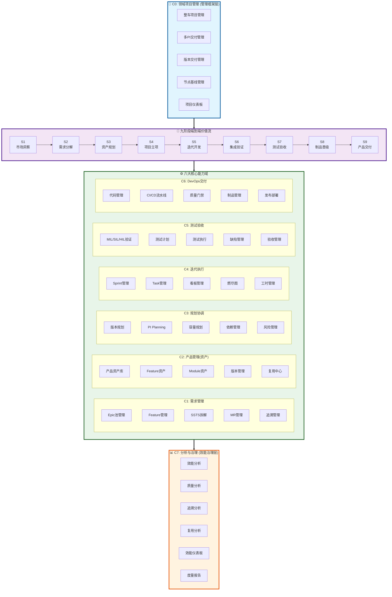
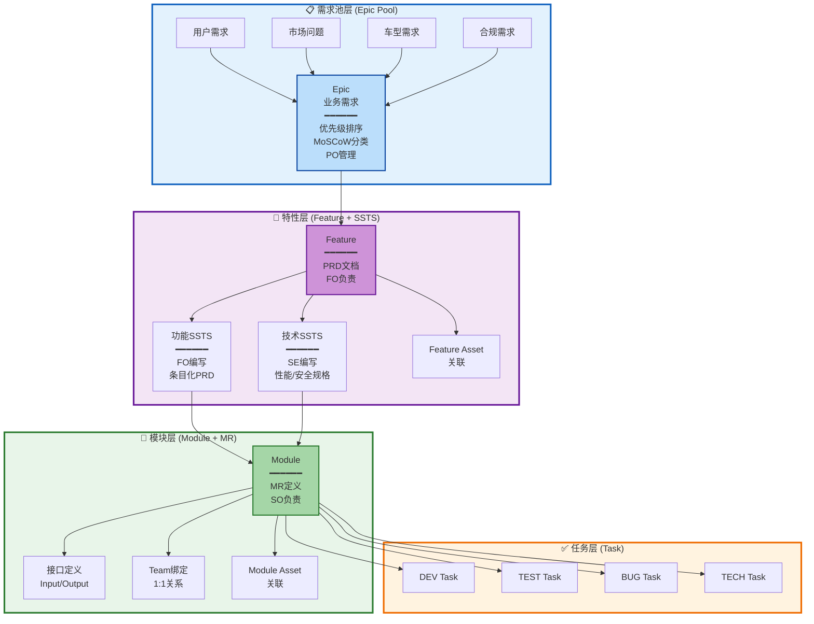
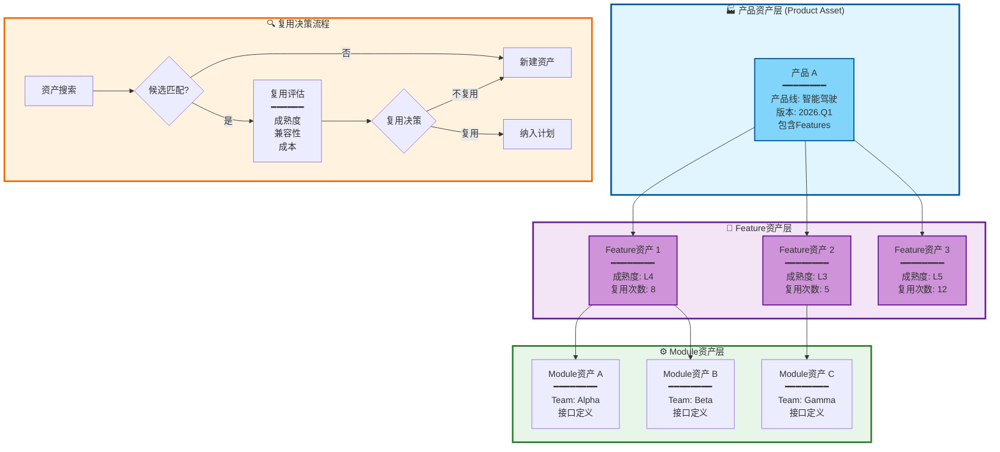
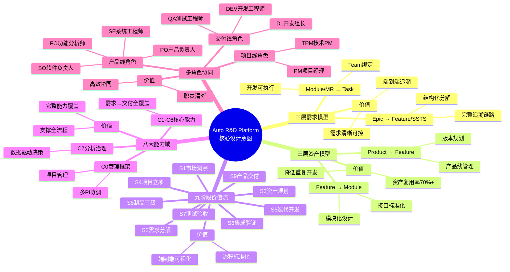
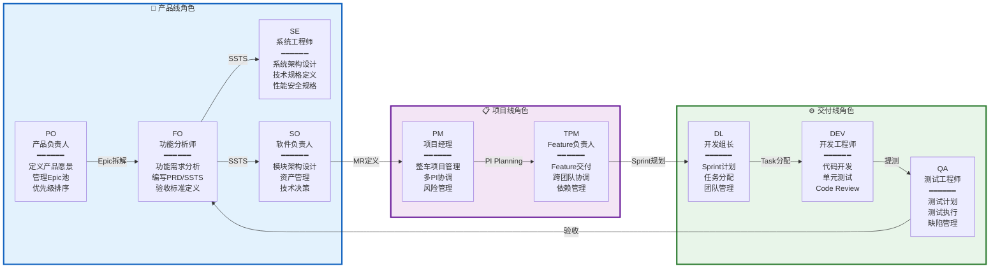
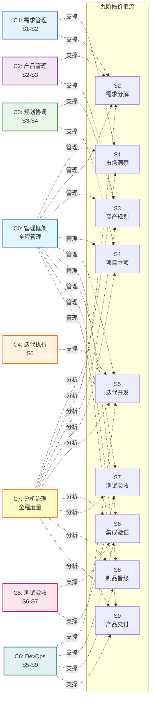
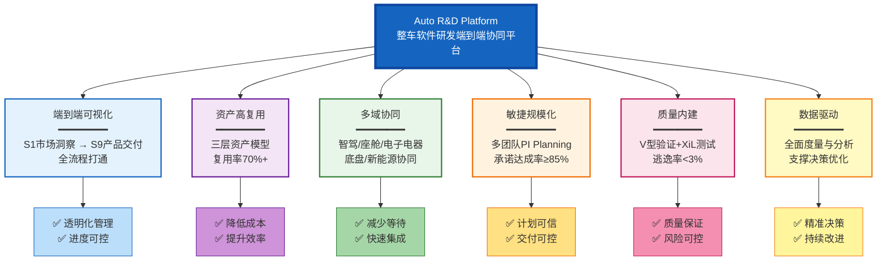
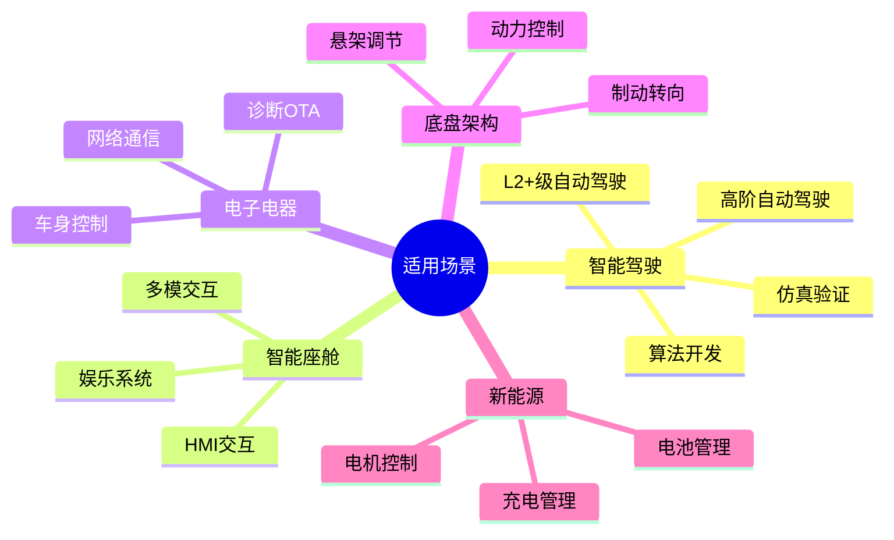

# Auto R&D Platform 平台架构意图总览

> **用 Mermaid 图形化展示平台核心设计意图与架构**
>
> **版本**: V1.0
> **日期**: 2026-01-16
> **来源**: 基于 AUTO_RD_PLATFORM_DESIGN_V4.md

---

## 1. 平台总体架构意图

---

## 2. 三层需求模型意图

---

## 3. 三层资产模型意图

---

## 4. 核心设计理念意图

---

## 5. 角色协同意图

---

## 6. 价值流与能力域映射意图

---

## 7. 平台核心价值意图

---

## 8. 设计意图总结

| 设计要素 | 核心内容 | 价值 |
|---------|---------|------|
| **三层需求模型** | Epic → Feature/SSTS → Module/MR → Task | 结构化分解，完整追溯 |
| **三层资产模型** | Product → Feature → Module (绑定Team) | 资产复用率70%+ |
| **九阶段价值流** | S1市场洞察 → S9产品交付 | 端到端可视化 |
| **八大能力域** | C0管理 + C1-C6交付 + C7治理 | 完整能力覆盖 |
| **九大角色** | 产品(PO/FO/SE/SO) + 项目(PM/TPM) + 交付(DL/DEV/QA) | 职责清晰 |

---

## 9. 适用场景意图

---

**文档说明**:
- 本文档基于 `AUTO_RD_PLATFORM_DESIGN_V4.md` 中的"平台架构总览"部分创建
- 使用 Mermaid 图形化展示平台的核心设计意图
- 涵盖了平台架构、需求模型、资产模型、角色协同、价值流等核心设计理念

**版本**: V1.0  
**创建日期**: 2026-01-16
