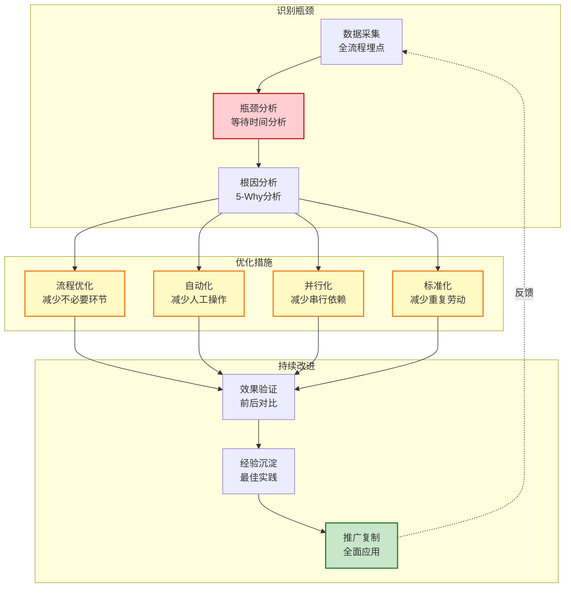
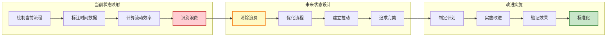
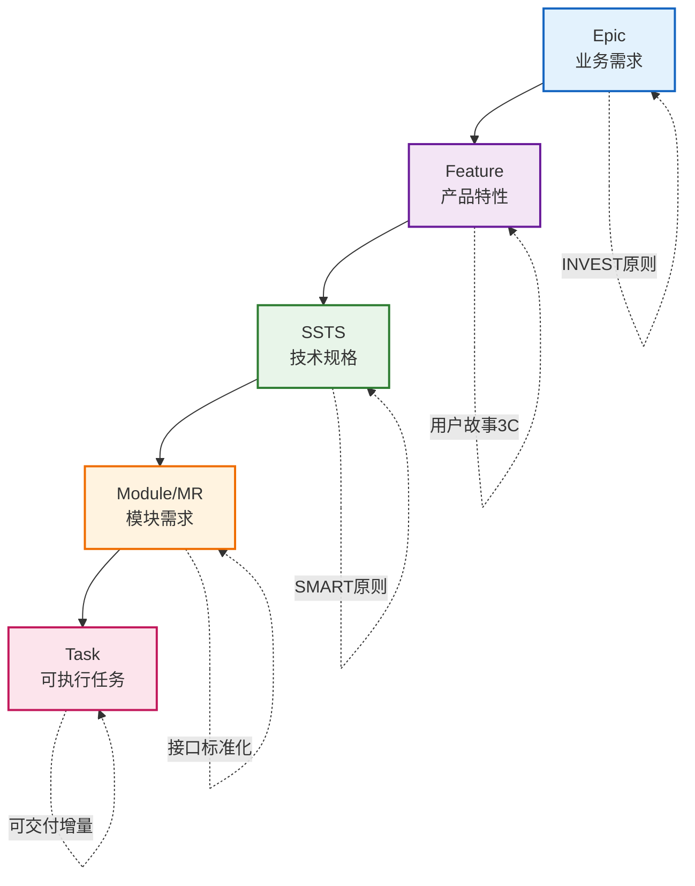
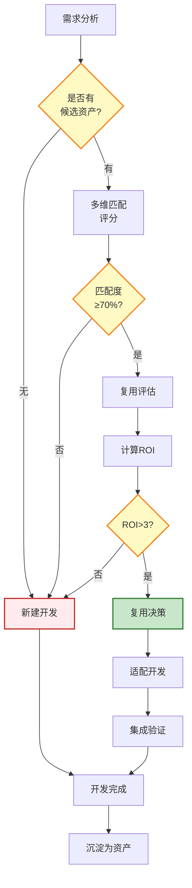
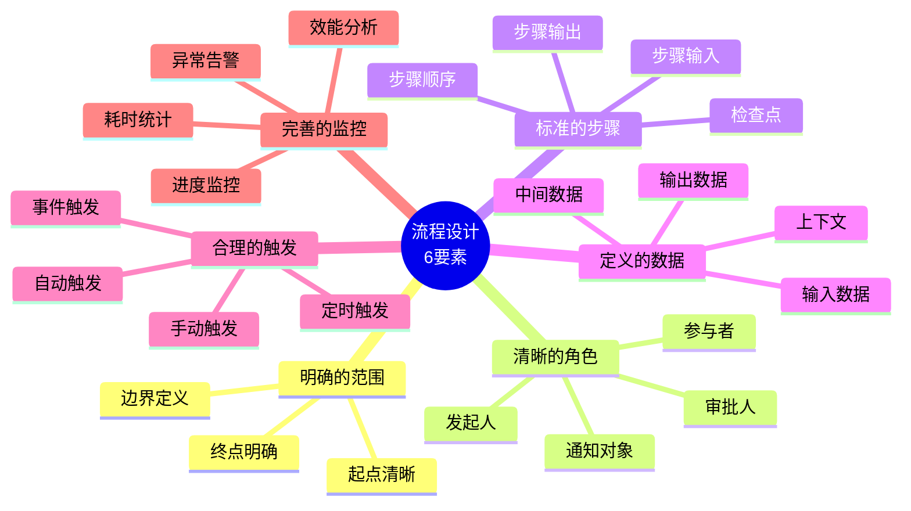
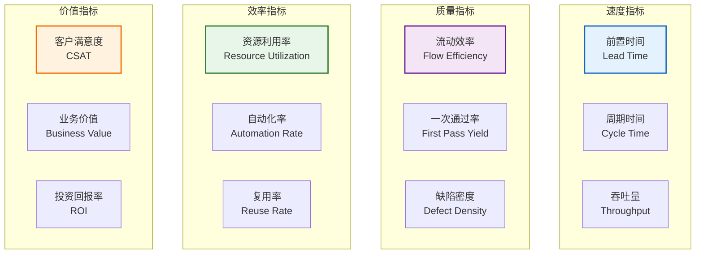
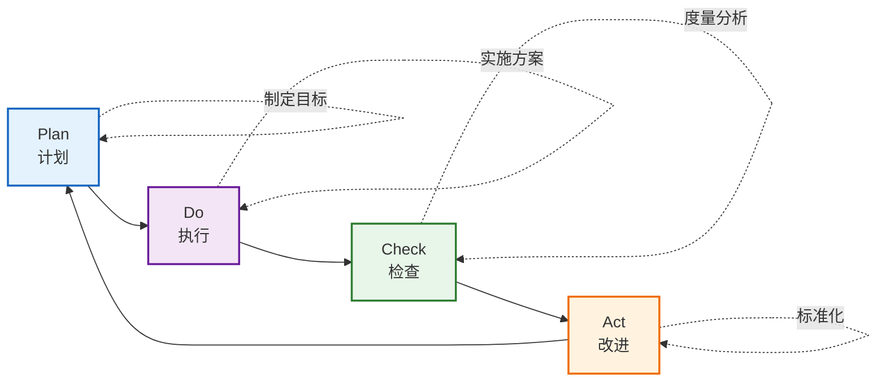

# Auto R&D Platform 设计方法论

> **文档类型**: 设计方法论与最佳实践  
> **版本**: V1.0  
> **日期**: 2026-01-17  
> **目的**: 提供平台设计、优化和持续改进的方法论指导

---

## 目录

- [一、价值流优化方法](#一价值流优化方法)
- [二、需求分解方法](#二需求分解方法)
- [三、资产复用决策](#三资产复用决策)
- [四、流程设计原则](#四流程设计原则)
- [五、效能度量体系](#五效能度量体系)

---

## 一、价值流优化方法

### 1.1 价值流瓶颈识别与优化



#### 方法步骤

**步骤1: 数据采集**
```
目标: 建立全流程数据采集体系
方法:
├─ 埋点设计
│  ├─ 需求阶段: Epic创建、Feature拆解、SSTS评审
│  ├─ 规划阶段: PI Planning、Sprint规划、任务分配
│  ├─ 执行阶段: 开发、测试、发布
│  └─ 反馈阶段: 缺陷、改进建议
├─ 数据收集
│  ├─ 时间戳（开始、结束、等待）
│  ├─ 状态变更（触发事件、责任人）
│  └─ 上下文信息（关联对象、依赖关系）
└─ 数据存储
   └─ 事件溯源（Event Sourcing）模式
```

**步骤2: 瓶颈分析**
```
目标: 识别价值流中的瓶颈环节
方法:
├─ 前置时间分析（Lead Time）
│  ├─ 计算各阶段前置时间
│  └─ 识别超时阶段（超过平均值1.5倍）
├─ 等待时间分析（Wait Time）
│  ├─ 计算等待时间占比
│  └─ 识别等待时间>50%的环节
├─ 流动效率分析（Flow Efficiency）
│  ├─ 计算流动效率 = 工作时间 / 前置时间
│  └─ 识别流动效率<40%的环节
└─ 吞吐量分析（Throughput）
   ├─ 计算各阶段吞吐量
   └─ 识别吞吐量最低的环节（瓶颈）
```

**步骤3: 根因分析**
```
目标: 找到瓶颈的根本原因
方法: 5-Why分析法

示例: Sprint规划耗时过长
Why 1: 为什么Sprint规划耗时3小时？
→ 因为需要讨论大量的需求细节

Why 2: 为什么需要讨论大量的需求细节？
→ 因为需求描述不清晰、验收标准不明确

Why 3: 为什么需求描述不清晰？
→ 因为需求分析阶段没有充分细化

Why 4: 为什么需求分析阶段没有充分细化？
→ 因为缺乏需求模板和检查清单

Why 5: 为什么缺乏需求模板和检查清单？
→ 因为没有建立需求规范和最佳实践

根因: 需求规范缺失
```

**步骤4: 优化措施**
```
优化策略:
├─ 流程优化
│  ├─ 合并重复环节
│  ├─ 简化审批流程
│  └─ 前置依赖检查
├─ 自动化
│  ├─ 自动触发（状态变更→通知→下一步）
│  ├─ 自动检查（代码规范、测试覆盖率）
│  └─ 自动生成（报告、文档、看板）
├─ 并行化
│  ├─ 识别无依赖任务
│  ├─ 拆解串行任务为并行子任务
│  └─ 建立并行看板（多团队协作）
└─ 标准化
   ├─ 模板化（需求模板、设计模板、代码模板）
   ├─ 规范化（命名规范、分支策略、发布流程）
   └─ 工具化（CLI工具、IDE插件、平台功能）
```

**步骤5: 效果验证**
```
验证指标:
├─ 前置时间缩短率（目标: ≥30%）
├─ 流动效率提升率（目标: ≥20%）
├─ 等待时间减少率（目标: ≥40%）
└─ 吞吐量增长率（目标: ≥15%）

验证方法:
├─ A/B对比（改进前后数据对比）
├─ 趋势分析（连续4周数据趋势）
└─ 统计检验（t检验，置信度95%）
```

### 1.2 价值流映射（VSM）



---

## 二、需求分解方法

### 2.1 四层需求分解法



**分解原则**:

| 层级 | 原则 | 检查清单 |
|------|------|---------|
| **Epic** | INVEST | Independent（独立）、Negotiable（可协商）、Valuable（有价值）、Estimable（可估算）、Small（小）、Testable（可测试） |
| **Feature** | 用户故事3C | Card（卡片）、Conversation（对话）、Confirmation（确认） |
| **SSTS** | SMART | Specific（具体）、Measurable（可度量）、Achievable（可实现）、Relevant（相关）、Time-bound（有时限） |
| **Module/MR** | 接口标准化 | 输入定义、输出定义、接口协议、异常处理 |
| **Task** | 可交付增量 | 2-3天完成、独立可测、增量价值 |

### 2.2 需求细化检查清单

**Epic检查清单**:
```
✅ 业务价值清晰
✅ 用户群体明确
✅ 成功标准定义
✅ 优先级评估（MoSCoW）
✅ 依赖关系识别
✅ 风险评估完成
✅ 初步估算完成（T-Shirt Size）
```

**Feature检查清单**:
```
✅ PRD文档完整（背景、目标、需求、方案、验收）
✅ 用户故事格式（作为...我想要...以便...）
✅ 验收标准明确（Given-When-Then）
✅ 非功能需求定义（性能、安全、可用性）
✅ UI/UX设计完成
✅ 依赖资产识别
✅ 估算完成（Story Points）
```

**SSTS检查清单**:
```
✅ 技术规格明确（接口、数据结构、算法）
✅ 性能指标定义（响应时间、吞吐量、并发）
✅ 安全规格定义（ASIL等级、加密、权限）
✅ 测试策略定义（单元、集成、系统）
✅ 依赖模块识别
✅ 技术风险评估
```

---

## 三、资产复用决策

### 3.1 复用决策流程



### 3.2 ROI计算方法

```
ROI = (节省成本 - 适配成本) / 适配成本

节省成本 = 新建成本 - 复用成本
新建成本 = 设计成本 + 开发成本 + 测试成本
复用成本 = 适配成本 + 集成成本 + 验证成本

示例:
新建成本 = 20人天（设计5 + 开发10 + 测试5）
适配成本 = 3人天
集成成本 = 2人天
验证成本 = 1人天
复用成本 = 6人天

ROI = (20 - 6) / 6 = 2.33

决策: ROI = 2.33 < 3，不建议复用（边界情况，需综合评估）
```

### 3.3 TRL评估标准

| TRL等级 | 描述 | 验证要求 | 是否推荐复用 |
|---------|------|---------|-------------|
| **TRL 1-3** | 基础研究、概念验证 | 理论分析、仿真验证 | ❌ 不推荐 |
| **TRL 4-5** | 实验室验证、原型开发 | 实验室测试、小规模试用 | ⚠️ 谨慎评估 |
| **TRL 6-7** | 系统验证、试点应用 | 系统测试、试点验证 | ✅ 可复用 |
| **TRL 8-9** | 系统完成、实际应用 | 实车验证、批量应用 | ✅ 强烈推荐 |

---

## 四、流程设计原则

### 4.1 流程设计6要素



### 4.2 流程优化原则

| 原则 | 说明 | 示例 |
|------|------|------|
| **简化** | 减少不必要的步骤 | 将3次审批合并为1次 |
| **自动化** | 用工具替代人工 | 自动代码检查替代人工Review |
| **并行化** | 无依赖步骤并行执行 | 前端和后端开发并行 |
| **标准化** | 建立标准和模板 | PRD模板、设计模板 |
| **可视化** | 流程进度可视 | 流程看板、进度条 |
| **可度量** | 关键指标可度量 | 前置时间、完成率 |

---

## 五、效能度量体系

### 5.1 四大类指标



### 5.2 指标定义与计算

#### 速度指标

**前置时间（Lead Time）**
```
定义: 从需求提出到需求交付的总时间
计算: Lead Time = 交付时间 - 创建时间
目标: ≤30天
分解:
├─ 需求分析时间
├─ 设计时间
├─ 开发时间
├─ 测试时间
└─ 发布时间
```

**周期时间（Cycle Time）**
```
定义: 从需求开始开发到交付的时间
计算: Cycle Time = 交付时间 - 开发开始时间
目标: ≤15天
```

**吞吐量（Throughput）**
```
定义: 单位时间内交付的需求数量
计算: Throughput = 完成数量 / 时间周期
目标: ≥30个Feature/PI
```

#### 质量指标

**流动效率（Flow Efficiency）**
```
定义: 工作时间占总前置时间的比例
计算: Flow Efficiency = 工作时间 / 前置时间 × 100%
目标: ≥40%

示例:
前置时间 = 30天
工作时间 = 12天（实际开发、测试时间）
等待时间 = 18天（评审等待、依赖阻塞等）
Flow Efficiency = 12 / 30 = 40%
```

**一次通过率（First Pass Yield）**
```
定义: 一次通过测试的比例
计算: FPY = 一次通过数量 / 总提交数量 × 100%
目标: ≥85%
```

**缺陷密度（Defect Density）**
```
定义: 每千行代码的缺陷数
计算: Defect Density = 缺陷数 / 代码行数 × 1000
目标: ≤0.5个/KLOC
```

---

## 六、最佳实践

### 6.1 需求管理最佳实践

1. **建立需求池** - 所有需求先进入需求池，统一评估和优先级排序
2. **Epic只读控制** - Epic导入项目后只读，变更需在需求池中进行
3. **PRD双模式** - 支持在线编辑和文档上传，满足不同场景
4. **批量评审** - SSTS批量评审时可查看PRD，提升评审效率

### 6.2 规划协调最佳实践

1. **WSJF优先级** - 使用WSJF算法计算优先级，数据驱动决策
2. **容量可视化** - 实时显示团队容量和负载，防止过载
3. **依赖前置** - 在PI Planning前识别和解决跨团队依赖
4. **承诺机制** - 团队PI承诺后锁定，变更需走变更流程

### 6.3 迭代执行最佳实践

1. **Daily Standup** - 每日站会，15分钟，同步进度和阻塞
2. **看板可视化** - 实时看板，按状态分组，拖拽更新
3. **燃尽图监控** - 燃尽图实时更新，提前识别风险
4. **Review & Retro** - Sprint结束Review演示，Retro总结改进

### 6.4 质量保证最佳实践

1. **V型验证** - MIL → SIL → HIL → 实车，层层验证
2. **自动化测试** - 单元测试覆盖率≥80%，集成测试自动化
3. **质量门禁** - 代码规范、测试覆盖率、安全扫描自动检查
4. **缺陷闭环** - 缺陷从发现→修复→验证→关闭，全流程追踪

---

## 七、持续改进

### 7.1 PDCA循环



### 7.2 改进文化

**改进原则**:
1. 🎯 **数据驱动** - 用数据说话，避免主观臆断
2. 🔄 **小步快跑** - 小范围试点，快速验证，逐步推广
3. 📊 **透明可视** - 改进进度和效果公开透明
4. 🏆 **激励机制** - 表彰改进贡献，分享成功经验
5. 📚 **知识沉淀** - 将改进经验沉淀为最佳实践

---

## 八、工具与模板

### 8.1 分析工具

| 工具 | 用途 | 输出 |
|------|------|------|
| **价值流映射** | 识别浪费和瓶颈 | VSM图、改进计划 |
| **鱼骨图** | 根因分析 | 因果关系图 |
| **5-Why分析** | 深挖根因 | 根因报告 |
| **帕累托图** | 识别关键问题 | 80/20图 |

### 8.2 模板库

| 模板 | 用途 | 关键要素 |
|------|------|---------|
| **Epic模板** | 业务需求描述 | 背景、价值、用户、验收标准 |
| **PRD模板** | 产品需求文档 | 背景、目标、需求、方案、验收 |
| **设计模板** | 技术设计文档 | 架构、接口、数据、流程 |
| **测试计划模板** | 测试策略 | 范围、方法、用例、环境 |

---

## 附录

### A. 参考资料

1. **精益思想** - James P. Womack, Daniel T. Jones
2. **加速：DevOps理论与实践** - Nicole Forsgren, Jez Humble, Gene Kim
3. **持续交付** - Jez Humble, David Farley
4. **用户故事地图** - Jeff Patton
5. **敏捷软件开发** - Robert C. Martin

### B. 相关文档

- [AUTO_RD_PLATFORM_SOLUTION_MERMAID.md](./AUTO_RD_PLATFORM_SOLUTION_MERMAID.md) - 平台业务方案
- [AUTO_RD_PLATFORM_DESIGN_MERMAID.md](./AUTO_RD_PLATFORM_DESIGN_MERMAID.md) - 平台功能设计
- [平台架构意图总览-Mermaid版.md](./平台架构意图总览-Mermaid版.md) - 平台架构意图

---

**文档维护**: 平台架构组  
**版本历史**:
- V1.0 (2026-01-17): 初始版本，包含价值流优化、需求分解、资产复用、流程设计、效能度量
