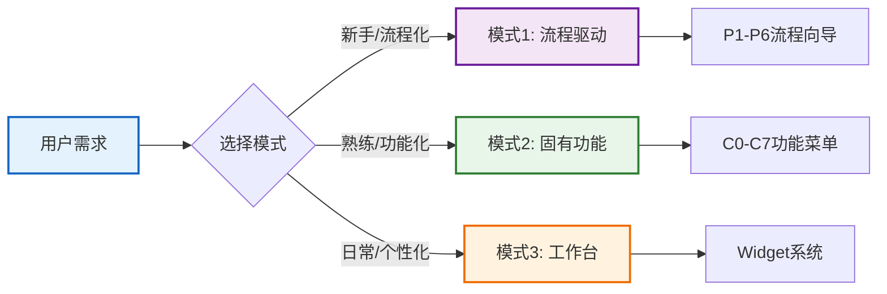
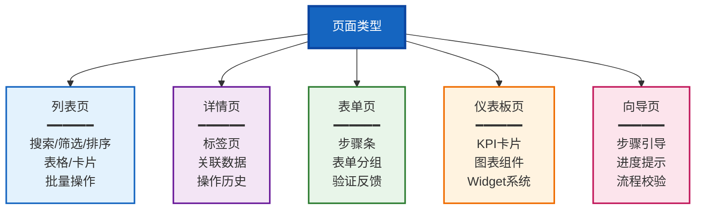

# 原型框架设计文档中心

> **整车软件研发平台 - 原型框架完整设计方案**  
> **版本**: V2.0  
> **最后更新**: 2026-01-16

---

## 📚 文档导航

### 核心设计文档

| 文档 | 说明 | 重要性 | 阅读时间 |
|-----|------|-------|---------|
| **[导航框架完整设计方案](./导航框架完整设计方案.md)** | 导航-页面-功能-数据的端到端设计 | ⭐⭐⭐⭐⭐ | 60分钟 |
| **[页面框架UI设计规范](./页面框架UI设计规范.md)** | UI/UX设计规范和组件设计 | ⭐⭐⭐⭐⭐ | 45分钟 |

### 导航设计系列

| 文档 | 说明 | 状态 |
|-----|------|------|
| [00-导航系统设计总览](./navigation-design/00-导航系统设计总览.md) | 导航系统整体概述 | ✅ |
| [01-导航系统总体设计](./navigation-design/01-导航系统总体设计.md) | 导航架构和模式切换 | ✅ |
| [02-模式1-流程驱动导航设计](./navigation-design/02-模式1-流程驱动导航设计.md) | 流程驱动导航详细设计 | ✅ |
| [03-模式2-固有功能导航设计](./navigation-design/03-模式2-固有功能导航设计.md) | 固有功能导航详细设计 | ✅ |
| [04-模式3-工作台导航设计](./navigation-design/04-模式3-工作台导航设计.md) | 工作台导航详细设计 | ✅ |
| [05-页面跳转关系设计](./navigation-design/05-页面跳转关系设计.md) | 页面跳转逻辑和关系 | ✅ |
| [06-菜单排布与交互设计](./navigation-design/06-菜单排布与交互设计.md) | 菜单布局和交互细节 | ✅ |
| [07-全局搜索与快捷操作](./navigation-design/07-全局搜索与快捷操作.md) | 搜索和快捷功能设计 | ✅ |

---

## 🎯 快速开始

### 角色阅读指南

#### 产品经理
**推荐阅读路径**:
1. 《导航框架完整设计方案》的"一、导航系统架构设计"
2. 《导航框架完整设计方案》的"三、导航-页面-功能映射"
3. `navigation-design/00-导航系统设计总览.md`

**关注重点**: 导航模式设计、功能映射、用户体验

#### UI/UX设计师
**推荐阅读路径**:
1. 《页面框架UI设计规范》全文
2. 《导航框架完整设计方案》的"二、页面框架设计"
3. `navigation-design/06-菜单排布与交互设计.md`

**关注重点**: 设计系统、页面模板、交互规范、响应式设计

#### 前端开发
**推荐阅读路径**:
1. 《导航框架完整设计方案》全文
2. 《页面框架UI设计规范》的"三、组件设计规范"
3. `navigation-design/05-页面跳转关系设计.md`

**关注重点**: 技术实现、路由配置、状态管理、组件开发

#### 架构师
**推荐阅读路径**:
1. 《导航框架完整设计方案》的"一、导航系统架构设计"
2. 《导航框架完整设计方案》的"四、数据流与状态管理"
3. 《导航框架完整设计方案》的"七、扩展性设计"

**关注重点**: 整体架构、数据流、扩展性、性能优化

---

## 📖 核心设计方案概览

### 《导航框架完整设计方案》

这是平台导航系统的**权威设计文档**，覆盖导航-页面-功能-数据的端到端设计。

**章节结构**:
```
一、导航系统架构设计
  ├─ 1.1 整体架构
  ├─ 1.2 导航层级体系
  └─ (完整的导航层级定义)

二、页面框架设计
  ├─ 2.1 页面框架布局
  └─ 2.2 页面类型体系
      ├─ 列表页 (List Page)
      ├─ 详情页 (Detail Page)
      ├─ 表单页 (Form Page)
      ├─ 仪表板页 (Dashboard Page)
      └─ 向导页 (Wizard Page)

三、导航-页面-功能映射
  ├─ 3.1 C1需求管理 - 完整映射示例
  ├─ 3.2 完整页面路由表
  └─ 3.3 页面-功能-数据映射矩阵

四、数据流与状态管理
  ├─ 4.1 数据流架构
  ├─ 4.2 状态管理设计
  └─ 4.3 数据缓存策略

五、交互设计规范
  ├─ 5.1 页面跳转规则
  └─ 5.2 页面加载与错误处理

六、技术实现指南
  ├─ 6.1 技术栈推荐
  ├─ 6.2 项目结构
  └─ 6.3 核心代码示例

七、扩展性设计
  ├─ 7.1 插件化架构
  ├─ 7.2 动态菜单配置
  └─ 7.3 主题定制
```

**核心价值**:
- ✅ 提供完整的导航系统架构设计
- ✅ 定义5种标准页面类型模板
- ✅ 建立导航-页面-功能-数据的完整映射
- ✅ 提供可落地的技术实现方案

### 《页面框架UI设计规范》

这是平台页面框架的**UI/UX设计规范**，定义了设计系统、组件设计和交互规范。

**章节结构**:
```
一、设计系统基础
  ├─ 1.1 设计原则
  └─ 1.2 视觉规范
      ├─ 颜色系统
      ├─ 字体系统
      ├─ 间距系统
      └─ 圆角与阴影

二、布局设计规范
  ├─ 2.1 栅格系统
  └─ 2.2 页面布局模板
      ├─ 标准列表页布局
      ├─ 标准详情页布局
      └─ 表单页布局

三、组件设计规范
  ├─ 3.1 数据表格设计
  ├─ 3.2 状态徽章组件
  └─ 3.3 优先级标签组件

四、交互设计规范
  ├─ 4.1 加载状态
  ├─ 4.2 空状态设计
  └─ 4.3 消息提示规范

五、动画与过渡
  ├─ 5.1 页面切换动画
  └─ 5.2 微交互动效

六、响应式设计
  ├─ 6.1 断点系统
  └─ 6.2 移动端适配

七、无障碍设计
  ├─ 7.1 键盘导航
  └─ 7.2 ARIA支持

八、性能优化
  ├─ 8.1 虚拟滚动
  └─ 8.2 图片懒加载
```

**核心价值**:
- ✅ 建立统一的设计系统和视觉规范
- ✅ 提供可复用的页面布局模板
- ✅ 定义标准组件设计规范
- ✅ 确保无障碍和响应式支持

---

## 🎨 设计系统亮点

### 三种导航模式



### 五种页面类型



### 完整的导航层级

```
L0: 应用外壳 (Shell)
 │
 ├─ L1: 顶部导航栏 (固定显示)
 │   ├─ Logo + 平台名称
 │   ├─ 模式切换器 [流程驱动 | 固有功能 | 工作台]
 │   ├─ 全局搜索 (Ctrl+K)
 │   ├─ 通知中心
 │   └─ 用户中心
 │
 ├─ L2: 左侧导航区 (动态切换)
 │   ├─ 模式1: 流程驱动导航 (P1-P6)
 │   ├─ 模式2: 固有功能导航 (C0-C7)
 │   └─ 模式3: 工作台导航 (Widget)
 │
 ├─ L3: 面包屑导航 (动态显示)
 │
 ├─ L4: 主内容区 (页面主体)
 │
 └─ L5: 右侧面板 (可选)
```

---

## 🚀 实施建议

### Phase 1: 基础框架 (2周)

**目标**: 搭建导航和页面基础框架

**任务清单**:
- [ ] 搭建项目基础结构
- [ ] 实现顶部导航栏
- [ ] 实现左侧导航切换
- [ ] 完成5种页面模板
- [ ] 建立设计系统（颜色、字体、间距）

**交付物**:
- ✅ 可运行的框架原型
- ✅ 设计系统文档
- ✅ 基础组件库

### Phase 2: 核心功能 (4周)

**目标**: 实现核心导航和页面功能

**任务清单**:
- [ ] 实现C1需求管理模块（作为示例）
- [ ] 实现P1-P4流程驱动页面
- [ ] 实现工作台基础功能
- [ ] 完成路由和状态管理
- [ ] 实现核心业务组件

**交付物**:
- ✅ C1模块完整实现
- ✅ P1-P4流程页面
- ✅ 基础工作台

### Phase 3: 完善优化 (2周)

**目标**: 完善细节和性能优化

**任务清单**:
- [ ] 补充P5-P6流程页面
- [ ] 完善C2-C7模块
- [ ] 性能优化（虚拟滚动、懒加载）
- [ ] 无障碍支持
- [ ] 移动端适配
- [ ] 测试和修复

**交付物**:
- ✅ 完整的平台原型
- ✅ 性能优化报告
- ✅ 测试报告

---

## 📊 关键指标

### 设计目标

| 指标 | 目标值 | 说明 |
|-----|-------|------|
| **页面加载时间** | < 2秒 | 首屏完全加载时间 |
| **交互响应时间** | < 200ms | 用户操作到反馈的时间 |
| **首屏渲染时间** | < 1秒 | FCP (First Contentful Paint) |
| **Lighthouse评分** | > 90分 | 性能、可访问性、最佳实践 |
| **移动端适配** | 100% | 核心功能移动端可用 |

### 覆盖范围

| 维度 | 覆盖率 | 说明 |
|-----|-------|------|
| **导航模式** | 3种 | 流程驱动、固有功能、工作台 |
| **页面类型** | 5种 | 列表、详情、表单、仪表板、向导 |
| **能力域** | 8个 | C0-C7完整覆盖 |
| **功能点** | 179个 | 平台全部功能 |
| **流程** | 6个 | P1-P6完整流程 |

---

## 🔗 相关文档

### 平台设计文档
- [平台业务方案 V6.2](../platform-design/AUTO_RD_PLATFORM_DESIGN_MERMAID.md)
- [全量功能清单 C0-C7](../platform-design/全量功能清单_C0-C7.md)
- [平台架构意图总览](../platform-design/平台架构意图总览-Mermaid版.md)

### 分析报告
- [方案与原型匹配度分析报告](../analysis-workspace/方案与原型匹配度分析报告.md)
- [功能覆盖度可视化分析](../analysis-workspace/功能覆盖度可视化分析.md)
- [改进实施路线图](../analysis-workspace/改进实施路线图.md)

### 页面设计文档
- [C0-领域项目管理](../page-design/C0-领域项目管理/)
- [C1-需求管理](../page-design/C1-需求管理/)
- [C3-规划协调](../page-design/C3-规划协调/)
- [C4-迭代执行](../page-design/C4-迭代执行/)

---

## 💡 使用建议

### 设计阶段

1. **先理解整体架构**: 阅读《导航框架完整设计方案》的前三章
2. **确定页面类型**: 根据功能需求选择合适的页面模板
3. **参考设计规范**: 使用《页面框架UI设计规范》中的设计系统
4. **设计具体页面**: 基于模板进行页面详细设计

### 开发阶段

1. **搭建基础框架**: 按照技术栈推荐搭建项目
2. **实现导航系统**: 按照导航层级体系实现
3. **开发页面模板**: 实现5种标准页面类型
4. **开发业务功能**: 基于模板开发具体功能页面

### 测试阶段

1. **功能测试**: 验证导航和页面功能正确性
2. **兼容性测试**: 测试不同浏览器和设备
3. **性能测试**: 验证加载时间和响应速度
4. **无障碍测试**: 验证键盘导航和屏幕阅读器

---

## 🤝 贡献指南

### 如何贡献

1. 发现问题或有改进建议
2. 在对应文档中标注
3. 提供详细的问题描述和改进方案
4. 联系设计团队进行讨论

### 文档更新流程

1. 提出更新需求
2. 设计团队评审
3. 更新文档内容
4. 版本号递增
5. 通知相关人员

---

## 📝 更新日志

### V2.0 (2026-01-16)
- ✅ 新增《导航框架完整设计方案》
- ✅ 新增《页面框架UI设计规范》
- ✅ 创建原型框架文档中心
- ✅ 整合所有导航设计文档

### V1.0 (2025-01-15)
- ✅ 创建导航系统设计系列文档（00-07）
- ✅ 完成三种导航模式设计
- ✅ 完成页面跳转关系设计

---

## 📧 联系方式

**设计团队**: Auto-RD平台设计组  
**邮箱**: design@auto-rd-platform.com  
**文档维护**: 平台架构组

---

**最后更新**: 2026-01-16  
**文档版本**: V2.0
