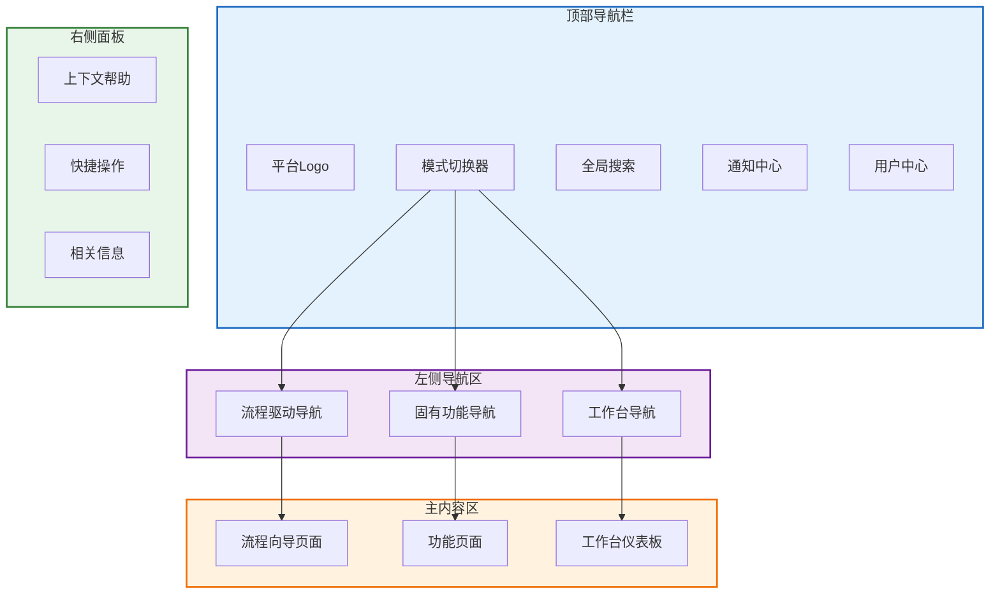

# 整车软件研发端到端协同平台 - 导航系统总体设计

> **版本**: V1.0  
> **日期**: 2025-01-14  
> **作者**: 平台架构组

---

## 一、导航系统设计理念

### 1.1 三种用户入口模式

基于179个功能和9个价值流阶段，平台支持三种用户入口模式，满足不同场景和角色的使用需求：

| 模式 | 适用场景 | 核心特点 | 目标用户 |
|------|---------|---------|---------|
| **模式1: 流程驱动** | 战略规划、PI Planning、方案设计 | 向导式步骤引导 | PM/TPM/PO/FO/SE |
| **模式2: 固有功能** | 需求分解、资产规划、开发实现、测试验证、发布交付 | 功能分组菜单 | SO/DL/DEV/QA/DevOps |
| **模式3: 工作台** | 日常工作、任务处理、信息获取 | Widget系统 | 全角色 |

### 1.2 设计原则

1. **角色导向** - 根据用户角色智能推荐入口模式
2. **场景适配** - 不同场景自动切换最优入口模式
3. **灵活切换** - 三种模式可随时切换，互不干扰
4. **一致体验** - 统一的视觉语言和交互模式
5. **渐进式** - 从简单到复杂，从引导到自主

---

## 二、导航架构设计

### 2.1 整体架构



### 2.2 导航层级结构

```
L1: 顶部导航栏（全局固定）
├── 平台Logo + 名称
├── 模式切换器（流程驱动 | 固有功能 | 工作台）
├── 全局搜索
├── 通知中心
└── 用户中心

L2: 左侧导航区（根据模式动态切换）
├── 模式1: 流程驱动导航
│   ├── 战略规划流程
│   ├── PI Planning流程
│   └── 方案设计流程
├── 模式2: 固有功能导航
│   ├── 需求管理
│   ├── 资产管理
│   ├── 规划协调
│   ├── 迭代执行
│   ├── 测试验收
│   ├── DevOps交付
│   └── 分析治理
└── 模式3: 工作台导航
    ├── 我的工作台
    ├── 团队工作台
    └── 项目工作台

L3: 主内容区（根据选择动态加载）
└── 页面内容 + 面包屑导航

L4: 右侧面板（可折叠）
├── 上下文帮助
├── 快捷操作
└── 相关信息
```

---

## 三、模式切换机制

### 3.1 智能推荐规则

| 触发条件 | 推荐模式 | 推荐理由 |
|---------|---------|---------|
| 用户角色=PM/TPM，进入"PI Planning" | 流程驱动 | PI Planning是典型的流程驱动场景 |
| 用户角色=DEV，进入"迭代开发" | 固有功能 | 开发人员更习惯功能菜单 |
| 用户首次登录 | 工作台 | 工作台提供全局概览 |
| 用户点击"创建活动"按钮 | 流程驱动 | 创建活动需要步骤引导 |
| 用户从通知中心进入 | 固有功能 | 直达具体功能页面 |

### 3.2 模式切换交互

```
顶部导航栏 - 模式切换器
┌─────────────────────────────────────┐
│ [流程驱动] [固有功能] [工作台]      │
│    ↑          ↑          ↑          │
│  当前模式   可切换     可切换        │
└─────────────────────────────────────┘

切换动画: 左侧导航区平滑过渡（300ms）
保留状态: 切换前的页面状态保存在浏览器历史中
```

---

## 四、导航设计文档结构

本导航系统设计包含以下详细文档：

1. **01-导航系统总体设计.md** (本文档)
2. **02-模式1-流程驱动导航设计.md** - 流程驱动模式详细设计
3. **03-模式2-固有功能导航设计.md** - 固有功能模式详细设计
4. **04-模式3-工作台导航设计.md** - 工作台模式详细设计
5. **05-页面跳转关系设计.md** - 页面间跳转逻辑
6. **06-菜单排布与交互设计.md** - 菜单布局和交互细节
7. **07-全局搜索与快捷操作.md** - 搜索和快捷功能

---

## 五、核心设计决策

### 5.1 为什么需要三种模式？

| 问题 | 解决方案 |
|------|---------|
| 新用户不知道从哪里开始 | 流程驱动模式提供向导式引导 |
| 熟练用户觉得流程太慢 | 固有功能模式提供快速访问 |
| 用户需要全局视图 | 工作台模式提供个性化仪表板 |
| 不同角色需求差异大 | 三种模式满足不同角色偏好 |

### 5.2 模式选择建议

| 角色 | 主要模式 | 次要模式 | 使用场景 |
|------|---------|---------|---------|
| PM/TPM | 流程驱动 | 工作台 | PI Planning、版本规划 |
| PO/FO | 流程驱动 | 固有功能 | 需求分解、PRD编写 |
| SE/SO | 固有功能 | 流程驱动 | 架构设计、资产规划 |
| DL/DEV | 固有功能 | 工作台 | 迭代开发、代码提交 |
| QA | 固有功能 | 工作台 | 测试执行、缺陷管理 |
| DevOps | 固有功能 | 工作台 | 流水线管理、发布部署 |
| 管理层 | 工作台 | 固有功能 | 查看仪表板、生成报告 |

---

**下一步**: 查看 [02-模式1-流程驱动导航设计.md](./02-模式1-流程驱动导航设计.md) 了解流程驱动模式的详细设计

