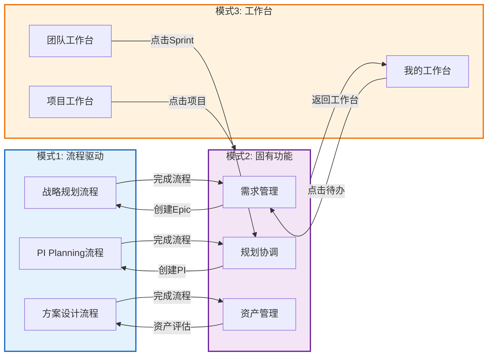

# 页面跳转关系设计

> **版本**: V1.0  
> **日期**: 2025-01-14  
> **说明**: 定义三种模式之间以及页面之间的跳转逻辑

---

## 一、跳转关系总览

### 1.1 三种模式之间的跳转



### 1.2 跳转触发场景

| 触发场景 | 源模式 | 目标模式 | 跳转方式 | 保留状态 |
|---------|-------|---------|---------|---------|
| 完成流程向导 | 流程驱动 | 固有功能 | 自动跳转 | 是 |
| 点击"创建活动"按钮 | 固有功能 | 流程驱动 | 弹窗选择流程 | 是 |
| 点击Widget中的待办 | 工作台 | 固有功能 | 直接跳转 | 是 |
| 点击顶部"返回工作台" | 固有功能 | 工作台 | 直接跳转 | 是 |
| 点击面包屑导航 | 任意 | 任意 | 直接跳转 | 是 |
| 全局搜索结果 | 任意 | 固有功能 | 直接跳转 | 否 |

---

## 二、流程驱动模式内部跳转

### 2.1 流程内步骤跳转

**跳转规则**:
1. **顺序跳转**: 点击[下一步]按钮，跳转到下一步
2. **返回跳转**: 点击[上一步]按钮，返回上一步
3. **跳过跳转**: 点击[跳过]按钮，跳过当前步骤（需确认）
4. **直接跳转**: 点击左侧导航的步骤，直接跳转（需满足前置条件）

**跳转示例 - P2: PI Planning流程**:
```
步骤1: 创建PI
  ↓ [下一步]
步骤2: PI目标设定
  ↓ [下一步]
步骤3: 容量评估
  ↓ [下一步]
步骤4: Feature分配
  ↓ [下一步]
步骤5: 依赖识别
  ↓ [下一步]
步骤6: 风险评估
  ↓ [下一步]
步骤7: Team承诺
  ↓ [下一步]
步骤8: PI确认
  ↓ [完成流程]
固有功能 > C3: 规划协调 > PI Board管理
```

### 2.2 流程间跳转

**跳转场景**:
- 战略规划流程完成 → 方案设计流程（如果需要设计评审）
- 方案设计流程完成 → 资产复用决策流程（如果需要资产复用）
- PI Planning流程完成 → Sprint规划流程（开始第一个Sprint）

**跳转方式**:
- 流程完成页面提供"下一步建议"
- 用户可选择进入建议流程或返回固有功能

---

## 三、固有功能模式内部跳转

### 3.1 功能页面跳转

**跳转规则**:
1. **列表→详情**: 点击列表项，跳转到详情页
2. **详情→编辑**: 点击[编辑]按钮，跳转到编辑页
3. **编辑→详情**: 点击[保存]按钮，返回详情页
4. **详情→关联**: 点击关联项，跳转到关联页面

**跳转示例 - C1: 需求管理**:
```
Epic列表页 (C1-F01)
  ↓ 点击Epic
Epic详情页
  ↓ 点击[创建Feature]
Feature创建页 (C1-F05)
  ↓ 点击[保存]
Feature详情页
  ↓ 点击[SSTS拆解]
SSTS拆解页 (C1-F07)
  ↓ 点击[保存]
SSTS列表页
  ↓ 点击SSTS
SSTS详情页
  ↓ 点击[创建MR]
MR创建页 (C1-F13)
```

### 3.2 跨能力域跳转

**跳转场景**:
| 源功能 | 目标功能 | 跳转触发 | 跳转方式 |
|-------|---------|---------|---------|
| C1-F13 (MR创建) | C2-F01 (资产搜索) | 点击[搜索资产] | 新标签页 |
| C1-F04 (Epic版本分配) | C3-F01 (版本规划) | 点击版本名称 | 当前页 |
| C3-F08 (Sprint规划) | C4-F02 (Sprint Planning) | 点击[开始Sprint] | 当前页 |
| C4-F03 (Task创建) | C6-F01 (代码提交) | 点击[提交代码] | 新标签页 |
| C5-F16 (缺陷提交) | C4-F03 (Task创建) | 点击[创建修复任务] | 当前页 |
| C6-F14 (发布审批) | C0-F06 (版本发布) | 审批通过 | 当前页 |

---

## 四、工作台模式内部跳转

### 4.1 Widget内跳转

**跳转规则**:
1. **Widget→功能页**: 点击Widget中的项目，跳转到对应功能页
2. **Widget→详情页**: 点击Widget底部[查看全部]，跳转到列表页
3. **Widget→流程页**: 点击Widget中的流程项，跳转到流程页

**跳转示例 - 我的工作台**:
```
Widget: 我的待办
  ↓ 点击待办项
固有功能 > C4: 迭代执行 > Task详情页

Widget: 我的日程
  ↓ 点击会议
固有功能 > C4: 迭代执行 > Daily Standup页

Widget: Sprint燃尽图
  ↓ 点击[查看全部]
固有功能 > C4: 迭代执行 > Sprint看板
```

### 4.2 工作台间跳转

**跳转方式**:
- 点击左侧导航的工作台名称，切换工作台
- 工作台内容平滑过渡（300ms动画）
- 保留上一个工作台的滚动位置

---

## 五、全局跳转机制

### 5.1 面包屑导航跳转

**面包屑格式**:
```
首页 > 模式名称 > 能力域/流程 > 功能分组 > 当前页面
```

**跳转规则**:
- 点击任意层级，跳转到对应页面
- 最后一级（当前页面）不可点击
- 悬停显示完整路径（如果被截断）

**示例**:
```
首页 > 固有功能 > C1: 需求管理 > Epic管理 > Epic详情
  ↑      ↑           ↑              ↑          ↑
  可点击  可点击      可点击          可点击      不可点击
```

### 5.2 全局搜索跳转

**搜索结果类型**:
| 结果类型 | 跳转目标 | 跳转方式 |
|---------|---------|---------|
| 功能 | 固有功能 > 对应功能页 | 当前页 |
| 流程 | 流程驱动 > 对应流程第一步 | 当前页 |
| Epic/Feature/SSTS/MR | 固有功能 > 详情页 | 当前页 |
| Task | 固有功能 > Task详情页 | 当前页 |
| 缺陷 | 固有功能 > 缺陷详情页 | 当前页 |
| 资产 | 固有功能 > 资产详情页 | 当前页 |

### 5.3 通知中心跳转

**通知类型与跳转**:
| 通知类型 | 跳转目标 | 跳转方式 |
|---------|---------|---------|
| @我的评论 | 固有功能 > 对应页面 | 当前页 |
| 任务分配 | 固有功能 > Task详情页 | 当前页 |
| 会议提醒 | 工作台 > 我的日程 | 当前页 |
| 审批通知 | 固有功能 > 审批页面 | 当前页 |
| 状态变更 | 固有功能 > 详情页 | 当前页 |
| 系统通知 | 固有功能 > 通知详情页 | 当前页 |

---

## 六、跳转状态管理

### 6.1 浏览器历史管理

**规则**:
- 每次跳转都记录到浏览器历史
- 支持浏览器前进/后退按钮
- 刷新页面保持当前状态

**URL格式**:
```
/mode/{模式}/domain/{能力域}/function/{功能编号}?params
/mode/process/flow/{流程编号}/step/{步骤编号}
/mode/workbench/type/{工作台类型}/layout/{布局ID}
```

**示例**:
```
固有功能 - Epic详情页:
/mode/function/domain/c1/function/f01?id=epic-123

流程驱动 - PI Planning步骤3:
/mode/process/flow/p2/step/3?pi=pi-456

工作台 - 我的工作台:
/mode/workbench/type/my/layout/default
```

### 6.2 页面状态保存

**保存内容**:
- 表单填写内容（草稿）
- 列表筛选条件
- 列表排序方式
- 列表分页位置
- 工作台布局配置

**保存方式**:
- 本地存储（LocalStorage）
- 会话存储（SessionStorage）
- 服务器存储（用户配置）

---

## 七、跳转动画与反馈

### 7.1 跳转动画

**页面切换动画**:
- 同模式内跳转: 淡入淡出（200ms）
- 跨模式跳转: 左侧导航平滑过渡（300ms）+ 主内容区淡入（200ms）
- 返回跳转: 右滑动画（300ms）

### 7.2 加载反馈

**加载状态**:
- 页面加载中: 显示骨架屏（Skeleton）
- 数据加载中: 显示加载动画（Spinner）
- 加载失败: 显示错误提示 + 重试按钮

---

**下一步**: 查看 [06-菜单排布与交互设计.md](./06-菜单排布与交互设计.md)

