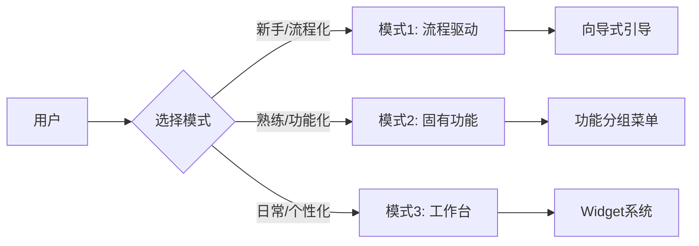

# 导航系统设计文档

> **整车软件研发端到端协同平台 - 导航系统设计**  
> **版本**: V1.0  
> **最后更新**: 2025-01-15

---

## 📚 文档目录

### 核心文档

| 文档 | 说明 | 状态 |
|------|------|------|
| [00-导航系统设计总览](./00-导航系统设计总览.md) | 导航系统整体架构和设计理念 | ✅ 完成 |
| [01-导航系统总体设计](./01-导航系统总体设计.md) | 导航系统的详细设计方案 | ✅ 完成 |

### 三种导航模式

| 文档 | 说明 | 适用场景 | 状态 |
|------|------|---------|------|
| [02-模式1-流程驱动导航设计](./02-模式1-流程驱动导航设计.md) | 基于研发流程的导航设计 | 战略规划、PI Planning、方案设计 | ✅ 完成 |
| [03-模式2-固有功能导航设计](./03-模式2-固有功能导航设计.md) | 基于功能模块的导航设计 | 需求分解、资产规划、开发实现 | ✅ 完成 |
| [04-模式3-工作台导航设计](./04-模式3-工作台导航设计.md) | 个性化工作台的导航设计 | 日常工作、任务处理、信息获取 | ✅ 完成 |

### 详细设计

| 文档 | 说明 | 状态 |
|------|------|------|
| [05-页面跳转关系设计](./05-页面跳转关系设计.md) | 页面间的跳转逻辑和关系 | ✅ 完成 |
| [06-菜单排布与交互设计](./06-菜单排布与交互设计.md) | 菜单的布局和交互细节 | ✅ 完成 |
| [07-全局搜索与快捷操作](./07-全局搜索与快捷操作.md) | 搜索功能和快捷键设计 | ✅ 完成 |

---

## 🚀 快速开始

### 第一次阅读？

**推荐阅读路径**:
```
1. 阅读 00-导航系统设计总览.md (10分钟)
   ↓
2. 阅读 01-导航系统总体设计.md (20分钟)
   ↓
3. 根据需要选择阅读 02-04 三种模式 (各15分钟)
   ↓
4. 深入了解 05-07 详细设计 (各10分钟)
```

### 按角色阅读

#### 产品经理
- **必读**: 00, 01
- **推荐**: 02, 03, 04
- **选读**: 05

#### UI/UX设计师
- **必读**: 00, 01, 06
- **推荐**: 07
- **选读**: 02, 03, 04

#### 前端开发
- **必读**: 00, 01, 05
- **推荐**: 02, 03, 04, 06
- **选读**: 07

#### 测试工程师
- **必读**: 00, 01, 05
- **推荐**: 02, 03, 04
- **选读**: 06, 07

---

## 🎯 核心设计理念

### 三种导航模式



### 设计原则

1. **角色导向** - 根据用户角色智能推荐入口模式
2. **场景适配** - 不同场景自动切换最优入口模式
3. **灵活切换** - 三种模式可随时切换，互不干扰
4. **一致体验** - 统一的视觉语言和交互模式
5. **渐进式** - 从简单到复杂，从引导到自主

---

## 📊 文档统计

- **总文档数**: 8个
- **完成状态**: 100% ✅
- **总字数**: 约 50,000 字
- **预计阅读时间**: 约 2 小时

---

## 🔗 相关文档

### 平台设计文档
- [平台设计主线](../../平台设计主线/AUTO_RD_PLATFORM_DESIGN_V4.md)
- [领域建模总览](../../domain-model/00-领域建模总览.md)
- [角色协作流程总览](../../collaboration-flow/00-角色协作流程总览.md)

### 页面设计文档
- [C1-需求管理页面设计](../../page-design/C1-需求管理/README.md)

---

## 📝 更新日志

### V1.0 (2025-01-15)
- ✅ 创建导航系统设计总览文档
- ✅ 完成三种导航模式的详细设计
- ✅ 完成页面跳转关系设计
- ✅ 完成菜单排布与交互设计
- ✅ 完成全局搜索与快捷操作设计

---

## 💡 使用建议

### 设计阶段
1. 先阅读总览文档，了解整体架构
2. 根据设计需求，选择合适的导航模式
3. 参考具体的设计文档，完成详细设计
4. 确保新设计符合导航系统的设计原则

### 开发阶段
1. 理解三种导航模式的实现逻辑
2. 参考页面跳转关系设计，实现路由
3. 参考菜单排布与交互设计，实现UI
4. 参考全局搜索设计，实现搜索功能

### 测试阶段
1. 验证三种导航模式的切换逻辑
2. 测试页面跳转的正确性
3. 测试菜单交互的流畅性
4. 测试搜索功能的准确性

---

## 🤝 贡献指南

如果您发现文档中的问题或有改进建议，请：

1. 在文档中标注问题位置
2. 提供详细的问题描述
3. 如有可能，提供改进建议
4. 联系设计团队进行讨论

---

**设计团队**: Auto-RD平台设计组  
**联系方式**: design@auto-rd-platform.com

