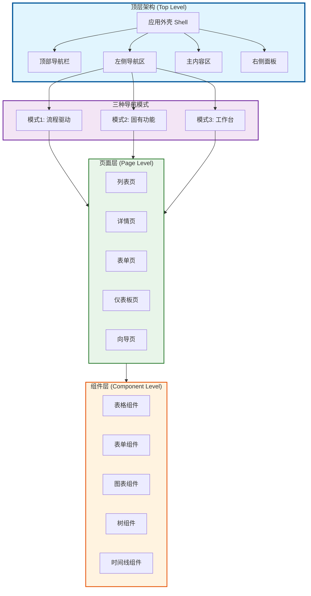
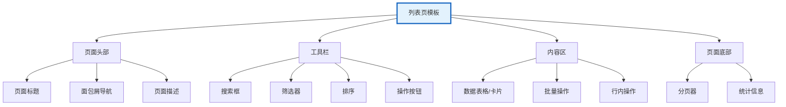
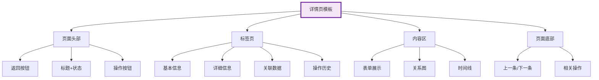
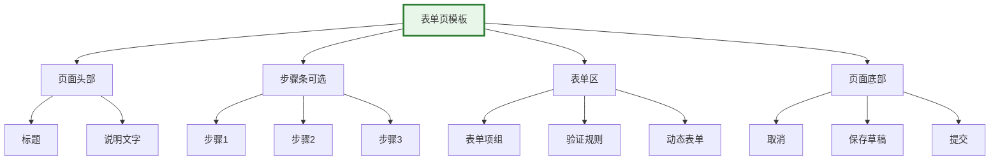
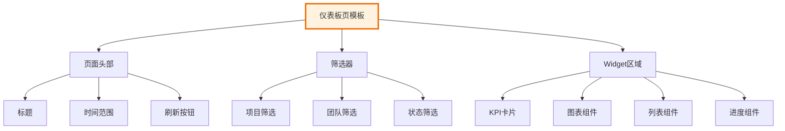
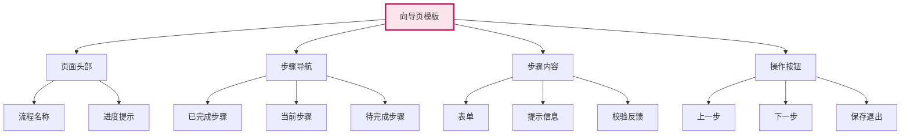
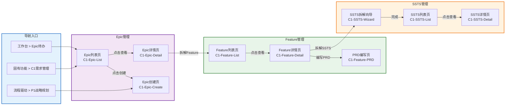
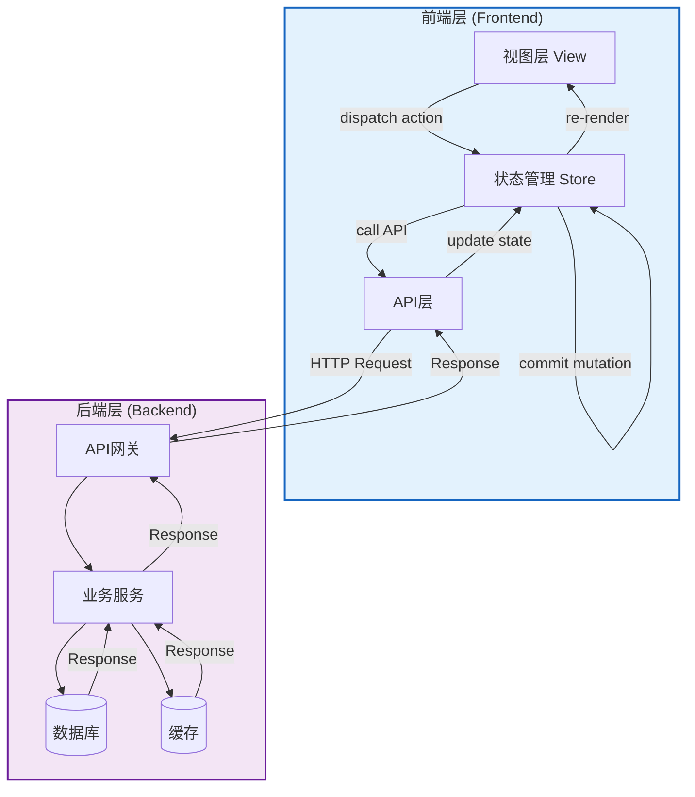
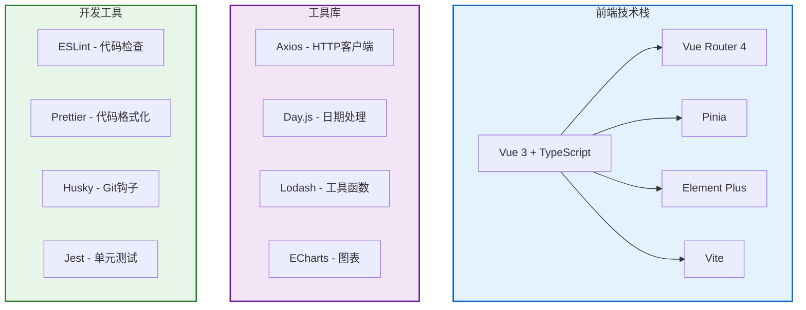

# 整车软件研发平台 - 导航框架完整设计方案

> **版本**: V2.0  
> **日期**: 2026-01-16  
> **定位**: 平台导航系统的权威设计文档  
> **覆盖**: 导航-页面-功能-数据的端到端设计

---

## 📖 文档导航

- [一、导航系统架构设计](#一导航系统架构设计)
- [二、页面框架设计](#二页面框架设计)
- [三、导航-页面-功能映射](#三导航-页面-功能映射)
- [四、数据流与状态管理](#四数据流与状态管理)
- [五、交互设计规范](#五交互设计规范)
- [六、技术实现指南](#六技术实现指南)
- [七、扩展性设计](#七扩展性设计)

---

## 一、导航系统架构设计

### 1.1 整体架构



### 1.2 导航层级体系

```
L0: 应用外壳 (Shell)
│   ├─ 全局状态管理
│   ├─ 路由管理
│   ├─ 权限控制
│   └─ 主题管理
│
L1: 顶部导航栏 (Top Navigation Bar) - 固定显示
│   ├─ Logo + 平台名称
│   ├─ 模式切换器 [流程驱动 | 固有功能 | 工作台]
│   ├─ 全局搜索 (Ctrl+K)
│   ├─ 通知中心 (Badge)
│   ├─ 快捷操作 (New/Create)
│   └─ 用户中心 (头像 + 菜单)
│
L2: 左侧导航区 (Side Navigation) - 根据模式动态切换
│   │
│   ├─ 模式1: 流程驱动导航 (Process-Driven)
│   │   ├─ 我的流程
│   │   ├─ P1: 战略规划流程
│   │   ├─ P2: 特性设计流程
│   │   ├─ P3: 方案设计流程
│   │   ├─ P4: 团队迭代流程
│   │   ├─ P5: 测试验证流程 (新增)
│   │   └─ P6: 发布交付流程 (新增)
│   │
│   ├─ 模式2: 固有功能导航 (Function-Based)
│   │   ├─ ⭐ 我的收藏 (可折叠)
│   │   ├─ 🕐 最近使用 (可折叠)
│   │   ├─ 📋 C0: 领域项目管理
│   │   ├─ 📝 C1: 需求管理
│   │   ├─ 🏛️ C2: 产品管理(资产)
│   │   ├─ 🎯 C3: 规划协调
│   │   ├─ 🏃 C4: 迭代执行
│   │   ├─ 🧪 C5: 测试验收
│   │   ├─ 🚀 C6: DevOps交付
│   │   └─ 📊 C7: 分析与治理
│   │
│   └─ 模式3: 工作台导航 (Workspace-Based)
│       ├─ 我的工作台
│       ├─ 团队工作台
│       ├─ 项目工作台
│       └─ 管理工作台
│
L3: 面包屑导航 (Breadcrumb) - 动态显示当前路径
│   └─ 首页 > 需求管理 > Feature管理 > ADAS-F001
│
L4: 主内容区 (Main Content Area) - 页面主体
│   ├─ 页面标题 + 操作栏
│   ├─ 页面内容
│   └─ 页面底部操作
│
L5: 右侧面板 (Right Panel) - 可选，可折叠
│   ├─ 上下文帮助
│   ├─ 快捷操作
│   ├─ 相关信息
│   └─ 活动记录
```

---

## 二、页面框架设计

### 2.1 页面框架布局

```
┌─────────────────────────────────────────────────────────────────────────────┐
│ L1: 顶部导航栏 (Top Navigation Bar) - 高度: 64px                              │
│ ┌──────┬──────────────────┬─────────┬────┬────┬────┐                        │
│ │ Logo │ [流程|功能|工作台] │ [搜索框] │[通知]│[新建]│[用户]│                        │
│ └──────┴──────────────────┴─────────┴────┴────┴────┘                        │
├─────────────────────────────────────────────────────────────────────────────┤
│                                                                             │
│ ┌──────────────┬──────────────────────────────────────────┬───────────────┐│
│ │              │                                          │               ││
│ │ L2: 左侧导航  │ L4: 主内容区 (Main Content Area)          │ L5: 右侧面板  ││
│ │              │                                          │               ││
│ │ (宽度: 240px) │ ┌──────────────────────────────────────┐ │ (宽度: 320px) ││
│ │              │ │ L3: 面包屑 (Breadcrumb)               │ │ (可折叠)      ││
│ │ 一级菜单      │ │ 首页 > 需求 > Feature列表            │ │               ││
│ │  - 二级菜单   │ └──────────────────────────────────────┘ │ 上下文帮助    ││
│ │    - 三级菜单 │                                          │               ││
│ │              │ ┌──────────────────────────────────────┐ │ 快捷操作      ││
│ │ (可展开/折叠) │ │ 页面标题区                            │ │               ││
│ │              │ │ ┌────────┬────────┬──────────────┐   │ │ 相关信息      ││
│ │              │ │ │[标题]  │[操作按钮]│[筛选/排序]    │   │ │               ││
│ │              │ │ └────────┴────────┴──────────────┘   │ │ 活动记录      ││
│ │              │ └──────────────────────────────────────┘ │               ││
│ │              │                                          │               ││
│ │              │ ┌──────────────────────────────────────┐ │               ││
│ │              │ │                                      │ │               ││
│ │              │ │ 页面内容区                            │ │               ││
│ │              │ │                                      │ │               ││
│ │              │ │ (自适应高度，支持滚动)                 │ │               ││
│ │              │ │                                      │ │               ││
│ │              │ │                                      │ │               ││
│ │              │ │                                      │ │               ││
│ │              │ └──────────────────────────────────────┘ │               ││
│ │              │                                          │               ││
│ │              │ ┌──────────────────────────────────────┐ │               ││
│ │              │ │ 页面底部操作栏                         │ │               ││
│ │              │ │ [上一页] [保存] [下一步] [取消]        │ │               ││
│ │              │ └──────────────────────────────────────┘ │               ││
│ │              │                                          │               ││
│ └──────────────┴──────────────────────────────────────────┴───────────────┘│
└─────────────────────────────────────────────────────────────────────────────┘

响应式设计:
- 桌面端 (≥1440px): 三栏布局 (左侧240px + 主内容区flex + 右侧320px)
- 平板端 (768-1439px): 两栏布局 (左侧可折叠 + 主内容区flex)
- 移动端 (<768px): 单栏布局 (抽屉式左侧菜单 + 主内容区全宽)
```

### 2.2 页面类型体系

#### 2.2.1 列表页 (List Page)



**标准列表页结构**:
```vue
<template>
  <div class="page-container list-page">
    <!-- 页面头部 -->
    <page-header
      :title="pageTitle"
      :breadcrumb="breadcrumbItems"
      :actions="headerActions"
    />
    
    <!-- 工具栏 -->
    <toolbar
      :search-placeholder="searchPlaceholder"
      :filters="filterConfig"
      :sort-options="sortOptions"
      @search="handleSearch"
      @filter="handleFilter"
      @sort="handleSort"
    >
      <template #actions>
        <el-button type="primary" @click="handleCreate">
          <i class="el-icon-plus"></i> 创建
        </el-button>
        <el-button @click="handleImport">导入</el-button>
        <el-button @click="handleExport">导出</el-button>
      </template>
    </toolbar>
    
    <!-- 内容区 -->
    <div class="content-area">
      <!-- 数据表格 -->
      <data-table
        :columns="tableColumns"
        :data="tableData"
        :loading="loading"
        :selection="true"
        @selection-change="handleSelectionChange"
        @row-click="handleRowClick"
      >
        <!-- 行内操作 -->
        <template #actions="{ row }">
          <el-button type="text" @click="handleView(row)">查看</el-button>
          <el-button type="text" @click="handleEdit(row)">编辑</el-button>
          <el-button type="text" @click="handleDelete(row)">删除</el-button>
        </template>
      </data-table>
      
      <!-- 批量操作 -->
      <batch-actions
        v-if="selectedRows.length > 0"
        :count="selectedRows.length"
        @batch-delete="handleBatchDelete"
        @batch-export="handleBatchExport"
      />
    </div>
    
    <!-- 页面底部 -->
    <page-footer>
      <el-pagination
        :current-page="pagination.page"
        :page-size="pagination.pageSize"
        :total="pagination.total"
        @current-change="handlePageChange"
        @size-change="handleSizeChange"
      />
    </page-footer>
  </div>
</template>
```

#### 2.2.2 详情页 (Detail Page)



**标准详情页结构**:
```vue
<template>
  <div class="page-container detail-page">
    <!-- 页面头部 -->
    <page-header
      :show-back="true"
      @back="handleBack"
    >
      <template #title>
        <div class="title-with-status">
          <h2>{{ detailData.title }}</h2>
          <status-badge :status="detailData.status" />
        </div>
      </template>
      
      <template #actions>
        <el-button @click="handleEdit">编辑</el-button>
        <el-button @click="handleDelete">删除</el-button>
        <el-dropdown>
          <el-button>更多操作<i class="el-icon-arrow-down"></i></el-button>
          <template #dropdown>
            <el-dropdown-menu>
              <el-dropdown-item @click="handleClone">克隆</el-dropdown-item>
              <el-dropdown-item @click="handleExport">导出</el-dropdown-item>
            </el-dropdown-menu>
          </template>
        </el-dropdown>
      </template>
    </page-header>
    
    <!-- 标签页 -->
    <el-tabs v-model="activeTab" @tab-click="handleTabClick">
      <el-tab-pane label="基本信息" name="basic">
        <detail-form :data="detailData" :readonly="true" />
      </el-tab-pane>
      
      <el-tab-pane label="详细信息" name="detail">
        <detail-content :data="detailData" />
      </el-tab-pane>
      
      <el-tab-pane label="关联数据" name="relations">
        <relation-view :data="relatedData" />
      </el-tab-pane>
      
      <el-tab-pane label="操作历史" name="history">
        <activity-timeline :data="historyData" />
      </el-tab-pane>
    </el-tabs>
    
    <!-- 页面底部 -->
    <page-footer>
      <el-button @click="handlePrevious">上一条</el-button>
      <el-button @click="handleNext">下一条</el-button>
    </page-footer>
  </div>
</template>
```

#### 2.2.3 表单页 (Form Page)



**标准表单页结构**:
```vue
<template>
  <div class="page-container form-page">
    <!-- 页面头部 -->
    <page-header
      :title="formTitle"
      :description="formDescription"
      :show-back="true"
      @back="handleBack"
    />
    
    <!-- 步骤条 (可选) -->
    <el-steps
      v-if="showSteps"
      :active="currentStep"
      finish-status="success"
    >
      <el-step title="基本信息" />
      <el-step title="详细配置" />
      <el-step title="确认提交" />
    </el-steps>
    
    <!-- 表单区 -->
    <el-form
      ref="formRef"
      :model="formData"
      :rules="formRules"
      label-width="120px"
      class="form-content"
    >
      <!-- 表单项组1 -->
      <form-section title="基本信息">
        <el-form-item label="名称" prop="name">
          <el-input v-model="formData.name" placeholder="请输入名称" />
        </el-form-item>
        
        <el-form-item label="类型" prop="type">
          <el-select v-model="formData.type" placeholder="请选择类型">
            <el-option label="类型1" value="type1" />
            <el-option label="类型2" value="type2" />
          </el-select>
        </el-form-item>
      </form-section>
      
      <!-- 表单项组2 -->
      <form-section title="详细信息">
        <el-form-item label="描述" prop="description">
          <el-input
            v-model="formData.description"
            type="textarea"
            :rows="4"
            placeholder="请输入描述"
          />
        </el-form-item>
      </form-section>
    </el-form>
    
    <!-- 页面底部 -->
    <page-footer fixed>
      <el-button @click="handleCancel">取消</el-button>
      <el-button @click="handleSaveDraft">保存草稿</el-button>
      <el-button type="primary" @click="handleSubmit">提交</el-button>
    </page-footer>
  </div>
</template>
```

#### 2.2.4 仪表板页 (Dashboard Page)



#### 2.2.5 向导页 (Wizard Page)



---

## 三、导航-页面-功能映射

### 3.1 C1需求管理 - 完整映射示例



### 3.2 完整页面路由表

```typescript
// 路由配置示例
const routes: RouteConfig[] = [
  // ===== C0: 领域项目管理 =====
  {
    path: '/project',
    component: Layout,
    meta: { title: '项目管理', icon: 'project' },
    children: [
      {
        path: 'list',
        name: 'ProjectList',
        component: () => import('@/views/C0-Project/ProjectList.vue'),
        meta: { 
          title: '项目列表',
          breadcrumb: ['首页', '项目管理', '项目列表'],
          permissions: ['project:view'],
          pageType: 'list'
        }
      },
      {
        path: 'detail/:id',
        name: 'ProjectDetail',
        component: () => import('@/views/C0-Project/ProjectDetail.vue'),
        meta: { 
          title: '项目详情',
          breadcrumb: ['首页', '项目管理', '项目详情'],
          permissions: ['project:view'],
          pageType: 'detail'
        }
      },
      {
        path: 'create',
        name: 'ProjectCreate',
        component: () => import('@/views/C0-Project/ProjectCreate.vue'),
        meta: { 
          title: '创建项目',
          breadcrumb: ['首页', '项目管理', '创建项目'],
          permissions: ['project:create'],
          pageType: 'form'
        }
      }
    ]
  },
  
  // ===== C1: 需求管理 =====
  {
    path: '/requirements',
    component: Layout,
    meta: { title: '需求管理', icon: 'requirement' },
    children: [
      // Epic管理
      {
        path: 'epic/list',
        name: 'EpicList',
        component: () => import('@/views/C1-Requirements/Epic/EpicList.vue'),
        meta: { 
          title: 'Epic列表',
          breadcrumb: ['首页', '需求管理', 'Epic管理', 'Epic列表'],
          permissions: ['epic:view'],
          pageType: 'list',
          relatedFunctions: ['C1-F01', 'C1-F02', 'C1-F03', 'C1-F04']
        }
      },
      {
        path: 'epic/detail/:id',
        name: 'EpicDetail',
        component: () => import('@/views/C1-Requirements/Epic/EpicDetail.vue'),
        meta: { 
          title: 'Epic详情',
          breadcrumb: ['首页', '需求管理', 'Epic管理', 'Epic详情'],
          permissions: ['epic:view'],
          pageType: 'detail',
          relatedFunctions: ['C1-F01']
        }
      },
      {
        path: 'epic/create',
        name: 'EpicCreate',
        component: () => import('@/views/C1-Requirements/Epic/EpicCreate.vue'),
        meta: { 
          title: '创建Epic',
          breadcrumb: ['首页', '需求管理', 'Epic管理', '创建Epic'],
          permissions: ['epic:create'],
          pageType: 'form',
          relatedFunctions: ['C1-F01']
        }
      },
      
      // Feature管理
      {
        path: 'feature/list',
        name: 'FeatureList',
        component: () => import('@/views/C1-Requirements/Feature/FeatureList.vue'),
        meta: { 
          title: 'Feature列表',
          breadcrumb: ['首页', '需求管理', 'Feature管理', 'Feature列表'],
          permissions: ['feature:view'],
          pageType: 'list',
          relatedFunctions: ['C1-F05', 'C1-F06']
        }
      },
      {
        path: 'feature/detail/:id',
        name: 'FeatureDetail',
        component: () => import('@/views/C1-Requirements/Feature/FeatureDetail.vue'),
        meta: { 
          title: 'Feature详情',
          breadcrumb: ['首页', '需求管理', 'Feature管理', 'Feature详情'],
          permissions: ['feature:view'],
          pageType: 'detail',
          relatedFunctions: ['C1-F05']
        }
      },
      {
        path: 'feature/prd/:id',
        name: 'FeaturePRD',
        component: () => import('@/views/C1-Requirements/Feature/FeaturePRD.vue'),
        meta: { 
          title: 'PRD编写',
          breadcrumb: ['首页', '需求管理', 'Feature管理', 'PRD编写'],
          permissions: ['feature:edit'],
          pageType: 'form',
          relatedFunctions: ['C1-F06']
        }
      },
      
      // SSTS管理
      {
        path: 'ssts/list',
        name: 'SSTSList',
        component: () => import('@/views/C1-Requirements/SSTS/SSTSList.vue'),
        meta: { 
          title: 'SSTS列表',
          breadcrumb: ['首页', '需求管理', 'SSTS管理', 'SSTS列表'],
          permissions: ['ssts:view'],
          pageType: 'list',
          relatedFunctions: ['C1-F07', 'C1-F08', 'C1-F09']
        }
      },
      {
        path: 'ssts/wizard/:featureId',
        name: 'SSTSWizard',
        component: () => import('@/views/C1-Requirements/SSTS/SSTSWizard.vue'),
        meta: { 
          title: 'SSTS拆解向导',
          breadcrumb: ['首页', '需求管理', 'SSTS管理', 'SSTS拆解'],
          permissions: ['ssts:create'],
          pageType: 'wizard',
          relatedFunctions: ['C1-F07']
        }
      },
      
      // MR管理
      {
        path: 'mr/list',
        name: 'MRList',
        component: () => import('@/views/C1-Requirements/MR/MRList.vue'),
        meta: { 
          title: 'MR列表',
          breadcrumb: ['首页', '需求管理', 'MR管理', 'MR列表'],
          permissions: ['mr:view'],
          pageType: 'list',
          relatedFunctions: ['C1-F13', 'C1-F14', 'C1-F15']
        }
      }
    ]
  },
  
  // ===== 流程驱动路由 =====
  {
    path: '/process',
    component: Layout,
    meta: { title: '流程驱动', icon: 'process' },
    children: [
      {
        path: 'p1-strategic/:id?',
        name: 'P1Strategic',
        component: () => import('@/views/Process/P1Strategic/index.vue'),
        meta: { 
          title: 'P1: 战略规划流程',
          breadcrumb: ['首页', '流程驱动', 'P1战略规划'],
          permissions: ['process:p1'],
          pageType: 'wizard',
          processSteps: [
            { step: 1, name: 'Epic创建', function: 'C1-F01' },
            { step: 2, name: 'Epic优先级排序', function: 'C1-F02' },
            { step: 3, name: 'MoSCoW分类', function: 'C1-F03' },
            { step: 4, name: '版本规划', function: 'C1-F04' },
            { step: 5, name: '战略规划确认', function: 'C0-F05' }
          ]
        }
      },
      {
        path: 'p2-feature/:id?',
        name: 'P2Feature',
        component: () => import('@/views/Process/P2Feature/index.vue'),
        meta: { 
          title: 'P2: 特性设计流程',
          breadcrumb: ['首页', '流程驱动', 'P2特性设计'],
          permissions: ['process:p2'],
          pageType: 'wizard'
        }
      },
      // ... 其他流程
    ]
  },
  
  // ===== 工作台路由 =====
  {
    path: '/workspace',
    component: Layout,
    meta: { title: '工作台', icon: 'workspace' },
    children: [
      {
        path: 'my',
        name: 'MyWorkspace',
        component: () => import('@/views/Workspace/MyWorkspace.vue'),
        meta: { 
          title: '我的工作台',
          breadcrumb: ['首页', '我的工作台'],
          pageType: 'dashboard'
        }
      },
      {
        path: 'team/:teamId',
        name: 'TeamWorkspace',
        component: () => import('@/views/Workspace/TeamWorkspace.vue'),
        meta: { 
          title: '团队工作台',
          breadcrumb: ['首页', '团队工作台'],
          pageType: 'dashboard'
        }
      }
    ]
  }
];
```

### 3.3 页面-功能-数据映射矩阵

| 页面 | 路由 | 功能编号 | 主要实体 | API端点 | 权限 |
|-----|------|---------|---------|---------|------|
| **Epic列表页** | `/requirements/epic/list` | C1-F01, C1-F02, C1-F03, C1-F04 | Epic | GET /api/epics | epic:view |
| **Epic详情页** | `/requirements/epic/detail/:id` | C1-F01 | Epic, Feature | GET /api/epics/:id | epic:view |
| **Epic创建页** | `/requirements/epic/create` | C1-F01 | Epic | POST /api/epics | epic:create |
| **Feature列表页** | `/requirements/feature/list` | C1-F05, C1-F06 | Feature | GET /api/features | feature:view |
| **Feature详情页** | `/requirements/feature/detail/:id` | C1-F05 | Feature, SSTS | GET /api/features/:id | feature:view |
| **PRD编写页** | `/requirements/feature/prd/:id` | C1-F06 | Feature, PRD | PUT /api/features/:id/prd | feature:edit |
| **SSTS列表页** | `/requirements/ssts/list` | C1-F07, C1-F08, C1-F09 | SSTS | GET /api/ssts | ssts:view |
| **SSTS拆解向导** | `/requirements/ssts/wizard/:featureId` | C1-F07 | Feature, SSTS | POST /api/ssts/batch | ssts:create |
| **MR列表页** | `/requirements/mr/list` | C1-F13, C1-F14 | MR, Module | GET /api/mrs | mr:view |
| **P1战略规划流程** | `/process/p1-strategic/:id?` | C1-F01~F04, C0-F05 | Epic, Version | Multiple | process:p1 |
| **我的工作台** | `/workspace/my` | - | User, Task, Epic, Feature | GET /api/workspace/my | - |

---

## 四、数据流与状态管理

### 4.1 数据流架构



### 4.2 状态管理设计

```typescript
// Vuex/Pinia Store结构
interface RootState {
  // 用户状态
  user: {
    profile: UserProfile;
    permissions: string[];
    preferences: UserPreferences;
  };
  
  // 应用状态
  app: {
    theme: 'light' | 'dark';
    locale: string;
    collapsed: boolean; // 侧边栏折叠状态
    navigationMode: 'process' | 'function' | 'workspace';
  };
  
  // 导航状态
  navigation: {
    currentPath: string;
    breadcrumb: BreadcrumbItem[];
    history: string[]; // 访问历史
    favorites: string[]; // 收藏的页面
    recentVisited: RecentItem[]; // 最近访问
  };
  
  // 业务数据缓存
  cache: {
    epics: Map<string, Epic>;
    features: Map<string, Feature>;
    ssts: Map<string, SSTS>;
    mrs: Map<string, MR>;
    // ... 其他实体
  };
  
  // 列表页状态
  listState: {
    [pageKey: string]: {
      filters: any;
      sorting: any;
      pagination: PaginationState;
      selectedRows: any[];
    };
  };
  
  // 表单状态
  formState: {
    [formKey: string]: {
      data: any;
      isDirty: boolean;
      errors: ValidationErrors;
    };
  };
}

// Store模块示例
export const epicStore = defineStore('epic', {
  state: () => ({
    list: [] as Epic[],
    current: null as Epic | null,
    loading: false,
    filters: {
      keyword: '',
      status: [],
      priority: [],
      owner: []
    },
    pagination: {
      page: 1,
      pageSize: 20,
      total: 0
    }
  }),
  
  getters: {
    filteredList: (state) => {
      return state.list.filter(epic => {
        // 应用筛选逻辑
        return true;
      });
    },
    
    epicById: (state) => (id: string) => {
      return state.list.find(e => e.id === id);
    }
  },
  
  actions: {
    async fetchList(params?: any) {
      this.loading = true;
      try {
        const response = await epicAPI.getList({
          ...this.filters,
          ...this.pagination,
          ...params
        });
        this.list = response.data;
        this.pagination.total = response.total;
      } finally {
        this.loading = false;
      }
    },
    
    async fetchDetail(id: string) {
      this.loading = true;
      try {
        const response = await epicAPI.getDetail(id);
        this.current = response.data;
      } finally {
        this.loading = false;
      }
    },
    
    async create(data: CreateEpicDTO) {
      const response = await epicAPI.create(data);
      this.list.unshift(response.data);
      return response.data;
    },
    
    async update(id: string, data: UpdateEpicDTO) {
      const response = await epicAPI.update(id, data);
      const index = this.list.findIndex(e => e.id === id);
      if (index !== -1) {
        this.list[index] = response.data;
      }
      return response.data;
    },
    
    updateFilters(filters: any) {
      this.filters = { ...this.filters, ...filters };
      this.pagination.page = 1; // 重置页码
      this.fetchList();
    }
  }
});
```

### 4.3 数据缓存策略

```typescript
// 缓存管理器
class CacheManager {
  private cache = new Map<string, CacheEntry>();
  
  // 缓存配置
  private config = {
    // 实体缓存时间(秒)
    ttl: {
      epic: 300, // 5分钟
      feature: 300,
      ssts: 300,
      mr: 300,
      project: 600, // 10分钟
      user: 1800 // 30分钟
    },
    
    // 最大缓存条目数
    maxSize: 1000
  };
  
  set(key: string, value: any, entityType: string) {
    const ttl = this.config.ttl[entityType] || 300;
    const expireAt = Date.now() + ttl * 1000;
    
    this.cache.set(key, {
      value,
      expireAt,
      entityType
    });
    
    // 清理过期缓存
    this.cleanup();
  }
  
  get(key: string): any | null {
    const entry = this.cache.get(key);
    
    if (!entry) return null;
    
    if (Date.now() > entry.expireAt) {
      this.cache.delete(key);
      return null;
    }
    
    return entry.value;
  }
  
  invalidate(pattern: string | RegExp) {
    const keys = Array.from(this.cache.keys());
    keys.forEach(key => {
      if (typeof pattern === 'string') {
        if (key.includes(pattern)) {
          this.cache.delete(key);
        }
      } else {
        if (pattern.test(key)) {
          this.cache.delete(key);
        }
      }
    });
  }
  
  private cleanup() {
    if (this.cache.size <= this.config.maxSize) return;
    
    // 删除最早过期的条目
    const entries = Array.from(this.cache.entries());
    entries.sort((a, b) => a[1].expireAt - b[1].expireAt);
    
    const toDelete = entries.slice(0, this.cache.size - this.config.maxSize);
    toDelete.forEach(([key]) => this.cache.delete(key));
  }
}
```

---

## 五、交互设计规范

### 5.1 页面跳转规则

#### 5.1.1 跳转方式分类

```typescript
// 页面跳转类型
enum NavigationType {
  PUSH = 'push',       // 新增历史记录
  REPLACE = 'replace', // 替换当前记录
  GO = 'go',           // 前进/后退
  REDIRECT = 'redirect' // 重定向
}

// 跳转配置接口
interface NavigationConfig {
  type: NavigationType;
  target: string | RouteLocationRaw;
  query?: Record<string, any>;
  params?: Record<string, any>;
  preserveState?: boolean; // 是否保留当前页面状态
  confirm?: {
    message: string;
    title?: string;
  };
}

// 页面跳转服务
class NavigationService {
  // 跳转到列表页
  toList(entity: string, query?: any) {
    return this.navigate({
      type: NavigationType.PUSH,
      target: `/${entity}/list`,
      query
    });
  }
  
  // 跳转到详情页
  toDetail(entity: string, id: string, preserveListState = true) {
    return this.navigate({
      type: NavigationType.PUSH,
      target: `/${entity}/detail/${id}`,
      preserveState: preserveListState
    });
  }
  
  // 跳转到创建页
  toCreate(entity: string, defaults?: any) {
    return this.navigate({
      type: NavigationType.PUSH,
      target: `/${entity}/create`,
      query: { defaults: JSON.stringify(defaults) }
    });
  }
  
  // 跳转到编辑页
  toEdit(entity: string, id: string, confirm = false) {
    const config: NavigationConfig = {
      type: NavigationType.PUSH,
      target: `/${entity}/edit/${id}`
    };
    
    if (confirm) {
      config.confirm = {
        message: '确定要离开当前页面吗？未保存的更改将丢失。',
        title: '确认离开'
      };
    }
    
    return this.navigate(config);
  }
  
  // 返回上一页
  goBack(fallback?: string) {
    if (window.history.length > 1) {
      router.go(-1);
    } else if (fallback) {
      router.push(fallback);
    }
  }
  
  private async navigate(config: NavigationConfig) {
    // 检查是否需要确认
    if (config.confirm) {
      const confirmed = await ElMessageBox.confirm(
        config.confirm.message,
        config.confirm.title || '确认',
        {
          confirmButtonText: '确定',
          cancelButtonText: '取消',
          type: 'warning'
        }
      ).catch(() => false);
      
      if (!confirmed) return;
    }
    
    // 保存当前页面状态
    if (config.preserveState) {
      this.savePageState();
    }
    
    // 执行跳转
    switch (config.type) {
      case NavigationType.PUSH:
        return router.push(config.target);
      case NavigationType.REPLACE:
        return router.replace(config.target);
      case NavigationType.REDIRECT:
        window.location.href = config.target as string;
        break;
    }
  }
  
  private savePageState() {
    // 保存当前页面的滚动位置、筛选条件等
    const currentRoute = router.currentRoute.value;
    const state = {
      scrollTop: document.documentElement.scrollTop,
      filters: store.state.listState[currentRoute.name]?.filters,
      // ... 其他状态
    };
    
    sessionStorage.setItem(
      `page_state_${currentRoute.fullPath}`,
      JSON.stringify(state)
    );
  }
}
```

#### 5.1.2 跳转场景示例

```typescript
// 场景1: 列表页 → 详情页 → 编辑页 → 返回详情页
class EpicListPage {
  handleRowClick(row: Epic) {
    // 跳转到详情页，保留列表页状态
    navigationService.toDetail('epic', row.id, true);
  }
}

class EpicDetailPage {
  handleEdit() {
    const route = useRoute();
    // 跳转到编辑页
    navigationService.toEdit('epic', route.params.id);
  }
}

class EpicEditPage {
  handleSave() {
    // 保存成功后，返回详情页并刷新
    navigationService.toDetail('epic', this.epicId);
  }
  
  handleCancel() {
    // 取消编辑，返回详情页
    navigationService.goBack();
  }
}

// 场景2: 流程页面跳转
class P1StrategicProcess {
  currentStep = 1;
  
  handleNext() {
    if (this.currentStep < 5) {
      this.currentStep++;
      // 保存当前步骤到URL参数
      router.replace({
        query: { step: this.currentStep }
      });
    } else {
      // 完成流程，跳转到Epic列表
      ElMessage.success('战略规划流程已完成');
      navigationService.toList('requirements/epic');
    }
  }
  
  handlePrevious() {
    if (this.currentStep > 1) {
      this.currentStep--;
      router.replace({
        query: { step: this.currentStep }
      });
    }
  }
}
```

### 5.2 页面加载与错误处理

```typescript
// 页面加载状态管理
class PageLoadingManager {
  private loadingStack: string[] = [];
  
  startLoading(key: string) {
    this.loadingStack.push(key);
    this.updateLoadingState();
  }
  
  stopLoading(key: string) {
    const index = this.loadingStack.indexOf(key);
    if (index !== -1) {
      this.loadingStack.splice(index, 1);
    }
    this.updateLoadingState();
  }
  
  private updateLoadingState() {
    const isLoading = this.loadingStack.length > 0;
    // 更新全局loading状态
    store.commit('app/setLoading', isLoading);
  }
}

// 错误处理服务
class ErrorHandlingService {
  handle(error: any, context?: string) {
    // 网络错误
    if (error.message === 'Network Error') {
      ElMessage.error('网络连接失败，请检查网络设置');
      return;
    }
    
    // HTTP错误
    if (error.response) {
      const status = error.response.status;
      const message = error.response.data?.message;
      
      switch (status) {
        case 400:
          ElMessage.error(message || '请求参数错误');
          break;
        case 401:
          ElMessage.error('登录已过期，请重新登录');
          router.push('/login');
          break;
        case 403:
          ElMessage.error('没有权限访问该资源');
          break;
        case 404:
          ElMessage.error('请求的资源不存在');
          break;
        case 500:
          ElMessage.error('服务器错误，请稍后重试');
          break;
        default:
          ElMessage.error(message || '操作失败');
      }
      
      // 记录错误日志
      this.logError(error, context);
    }
  }
  
  private logError(error: any, context?: string) {
    // 发送错误日志到服务器
    console.error('[Error]', context, error);
  }
}
```

### 5.3 响应式设计规范

```scss
// 断点定义
$breakpoints: (
  mobile: 768px,
  tablet: 1024px,
  desktop: 1440px,
  wide: 1920px
);

// 响应式混合宏
@mixin mobile {
  @media (max-width: #{map-get($breakpoints, mobile) - 1}) {
    @content;
  }
}

@mixin tablet {
  @media (min-width: #{map-get($breakpoints, mobile)}) and 
         (max-width: #{map-get($breakpoints, desktop) - 1}) {
    @content;
  }
}

@mixin desktop {
  @media (min-width: #{map-get($breakpoints, desktop)}) {
    @content;
  }
}

// 页面布局响应式
.page-container {
  display: flex;
  height: 100vh;
  
  .side-navigation {
    width: 240px;
    transition: width 0.3s;
    
    @include mobile {
      position: fixed;
      left: -240px;
      z-index: 1000;
      
      &.open {
        left: 0;
      }
    }
    
    @include tablet {
      width: 200px;
    }
  }
  
  .main-content {
    flex: 1;
    overflow: auto;
    
    @include mobile {
      width: 100%;
    }
  }
  
  .right-panel {
    width: 320px;
    
    @include mobile {
      display: none;
    }
    
    @include tablet {
      width: 280px;
    }
  }
}
```

---

## 六、技术实现指南

### 6.1 技术栈推荐



### 6.2 项目结构

```
auto-rd-platform-frontend/
├── public/                    # 静态资源
│   ├── favicon.ico
│   └── index.html
│
├── src/
│   ├── assets/               # 资源文件
│   │   ├── images/
│   │   ├── icons/
│   │   └── styles/
│   │       ├── variables.scss    # 样式变量
│   │       ├── mixins.scss       # 样式混合
│   │       └── global.scss       # 全局样式
│   │
│   ├── components/           # 公共组件
│   │   ├── Layout/          # 布局组件
│   │   │   ├── Shell.vue
│   │   │   ├── TopNavigation.vue
│   │   │   ├── SideNavigation.vue
│   │   │   ├── MainContent.vue
│   │   │   └── RightPanel.vue
│   │   │
│   │   ├── Common/          # 通用组件
│   │   │   ├── PageHeader.vue
│   │   │   ├── Toolbar.vue
│   │   │   ├── DataTable.vue
│   │   │   ├── FormSection.vue
│   │   │   ├── StatusBadge.vue
│   │   │   └── Breadcrumb.vue
│   │   │
│   │   └── Business/        # 业务组件
│   │       ├── EpicCard.vue
│   │       ├── FeatureTree.vue
│   │       ├── SSTSForm.vue
│   │       └── MRTimeline.vue
│   │
│   ├── views/               # 页面视图
│   │   ├── C0-Project/     # C0领域项目管理
│   │   │   ├── ProjectList.vue
│   │   │   ├── ProjectDetail.vue
│   │   │   └── ProjectCreate.vue
│   │   │
│   │   ├── C1-Requirements/ # C1需求管理
│   │   │   ├── Epic/
│   │   │   │   ├── EpicList.vue
│   │   │   │   ├── EpicDetail.vue
│   │   │   │   └── EpicCreate.vue
│   │   │   ├── Feature/
│   │   │   ├── SSTS/
│   │   │   └── MR/
│   │   │
│   │   ├── C2-ProductAssets/ # C2产品管理
│   │   ├── C3-Planning/      # C3规划协调
│   │   ├── C4-Iteration/     # C4迭代执行
│   │   ├── C5-Testing/       # C5测试验收
│   │   ├── C6-DevOps/        # C6 DevOps
│   │   ├── C7-Analytics/     # C7分析治理
│   │   │
│   │   ├── Process/          # 流程驱动页面
│   │   │   ├── P1Strategic/
│   │   │   ├── P2Feature/
│   │   │   ├── P3Solution/
│   │   │   ├── P4Iteration/
│   │   │   ├── P5Testing/
│   │   │   └── P6Release/
│   │   │
│   │   └── Workspace/        # 工作台页面
│   │       ├── MyWorkspace.vue
│   │       ├── TeamWorkspace.vue
│   │       └── ProjectWorkspace.vue
│   │
│   ├── router/              # 路由配置
│   │   ├── index.ts
│   │   ├── routes/
│   │   │   ├── c0-project.ts
│   │   │   ├── c1-requirements.ts
│   │   │   ├── c2-assets.ts
│   │   │   ├── process.ts
│   │   │   └── workspace.ts
│   │   └── guards.ts        # 路由守卫
│   │
│   ├── stores/              # 状态管理
│   │   ├── modules/
│   │   │   ├── user.ts
│   │   │   ├── app.ts
│   │   │   ├── navigation.ts
│   │   │   ├── epic.ts
│   │   │   ├── feature.ts
│   │   │   └── ...
│   │   └── index.ts
│   │
│   ├── api/                 # API接口
│   │   ├── http.ts         # HTTP客户端配置
│   │   ├── endpoints/
│   │   │   ├── epic.ts
│   │   │   ├── feature.ts
│   │   │   ├── ssts.ts
│   │   │   └── ...
│   │   └── types.ts        # API类型定义
│   │
│   ├── composables/         # 组合式函数
│   │   ├── useNavigation.ts
│   │   ├── usePermission.ts
│   │   ├── useTable.ts
│   │   ├── useForm.ts
│   │   └── ...
│   │
│   ├── directives/          # 自定义指令
│   │   ├── permission.ts
│   │   ├── loading.ts
│   │   └── ...
│   │
│   ├── utils/               # 工具函数
│   │   ├── format.ts
│   │   ├── validate.ts
│   │   ├── cache.ts
│   │   └── ...
│   │
│   ├── types/               # 类型定义
│   │   ├── entities/
│   │   │   ├── epic.ts
│   │   │   ├── feature.ts
│   │   │   └── ...
│   │   ├── enums.ts
│   │   └── global.d.ts
│   │
│   ├── App.vue
│   └── main.ts
│
├── tests/                   # 测试文件
│   ├── unit/
│   └── e2e/
│
├── .env.development        # 开发环境配置
├── .env.production         # 生产环境配置
├── .eslintrc.js           # ESLint配置
├── .prettierrc            # Prettier配置
├── tsconfig.json          # TypeScript配置
├── vite.config.ts         # Vite配置
└── package.json
```

### 6.3 核心代码示例

#### 6.3.1 路由守卫实现

```typescript
// router/guards.ts
import type { NavigationGuardNext, RouteLocationNormalized } from 'vue-router';
import { useUserStore } from '@/stores/modules/user';
import { ElMessage } from 'element-plus';

// 权限检查守卫
export function permissionGuard(
  to: RouteLocationNormalized,
  from: RouteLocationNormalized,
  next: NavigationGuardNext
) {
  const userStore = useUserStore();
  const requiredPermissions = to.meta.permissions as string[] | undefined;
  
  if (!requiredPermissions || requiredPermissions.length === 0) {
    next();
    return;
  }
  
  const hasPermission = requiredPermissions.every(permission =>
    userStore.permissions.includes(permission)
  );
  
  if (hasPermission) {
    next();
  } else {
    ElMessage.error('没有权限访问该页面');
    next({ name: 'Home' });
  }
}

// 页面标题守卫
export function titleGuard(
  to: RouteLocationNormalized,
  from: RouteLocationNormalized,
  next: NavigationGuardNext
) {
  const title = to.meta.title as string | undefined;
  document.title = title ? `${title} - Auto R&D Platform` : 'Auto R&D Platform';
  next();
}

// 导航模式守卫
export function navigationModeGuard(
  to: RouteLocationNormalized,
  from: RouteLocationNormalized,
  next: NavigationGuardNext
) {
  const appStore = useAppStore();
  
  // 根据路由自动切换导航模式
  if (to.path.startsWith('/process')) {
    appStore.setNavigationMode('process');
  } else if (to.path.startsWith('/workspace')) {
    appStore.setNavigationMode('workspace');
  } else {
    appStore.setNavigationMode('function');
  }
  
  next();
}
```

#### 6.3.2 列表页Composable

```typescript
// composables/useTable.ts
import { ref, reactive, computed } from 'vue';
import type { Ref } from 'vue';

interface TableOptions<T> {
  fetchData: (params: any) => Promise<{ data: T[]; total: number }>;
  defaultPageSize?: number;
}

export function useTable<T>(options: TableOptions<T>) {
  const { fetchData, defaultPageSize = 20 } = options;
  
  // 状态
  const loading = ref(false);
  const data: Ref<T[]> = ref([]);
  const selectedRows: Ref<T[]> = ref([]);
  
  const pagination = reactive({
    page: 1,
    pageSize: defaultPageSize,
    total: 0
  });
  
  const filters = reactive({});
  const sorting = reactive({
    prop: '',
    order: ''
  });
  
  // 计算属性
  const hasSelection = computed(() => selectedRows.value.length > 0);
  
  // 方法
  async function loadData() {
    loading.value = true;
    try {
      const response = await fetchData({
        page: pagination.page,
        pageSize: pagination.pageSize,
        filters: filters,
        sort: sorting
      });
      
      data.value = response.data;
      pagination.total = response.total;
    } finally {
      loading.value = false;
    }
  }
  
  function handlePageChange(page: number) {
    pagination.page = page;
    loadData();
  }
  
  function handleSizeChange(size: number) {
    pagination.pageSize = size;
    pagination.page = 1;
    loadData();
  }
  
  function handleFilterChange(newFilters: any) {
    Object.assign(filters, newFilters);
    pagination.page = 1;
    loadData();
  }
  
  function handleSortChange({ prop, order }: any) {
    sorting.prop = prop;
    sorting.order = order;
    loadData();
  }
  
  function handleSelectionChange(rows: T[]) {
    selectedRows.value = rows;
  }
  
  function clearSelection() {
    selectedRows.value = [];
  }
  
  function refresh() {
    loadData();
  }
  
  // 初始加载
  loadData();
  
  return {
    // 状态
    loading,
    data,
    selectedRows,
    pagination,
    filters,
    sorting,
    
    // 计算属性
    hasSelection,
    
    // 方法
    loadData,
    handlePageChange,
    handleSizeChange,
    handleFilterChange,
    handleSortChange,
    handleSelectionChange,
    clearSelection,
    refresh
  };
}
```

---

## 七、扩展性设计

### 7.1 插件化架构

```typescript
// 插件接口定义
interface Plugin {
  name: string;
  version: string;
  install: (app: App, options?: any) => void;
}

// 插件管理器
class PluginManager {
  private plugins: Map<string, Plugin> = new Map();
  
  register(plugin: Plugin) {
    if (this.plugins.has(plugin.name)) {
      console.warn(`Plugin ${plugin.name} already registered`);
      return;
    }
    
    this.plugins.set(plugin.name, plugin);
  }
  
  install(app: App) {
    this.plugins.forEach(plugin => {
      plugin.install(app);
    });
  }
}

// 页面扩展插件示例
const pageExtensionPlugin: Plugin = {
  name: 'page-extension',
  version: '1.0.0',
  install(app) {
    // 注册全局组件
    app.component('PageExtension', PageExtensionComponent);
    
    // 注册全局方法
    app.config.globalProperties.$pageExtension = {
      register: (config: PageExtensionConfig) => {
        // 注册页面扩展
      }
    };
  }
};
```

### 7.2 动态菜单配置

```typescript
// 菜单配置接口
interface MenuConfig {
  id: string;
  label: string;
  icon?: string;
  path?: string;
  permission?: string[];
  children?: MenuConfig[];
  meta?: Record<string, any>;
}

// 动态菜单管理器
class DynamicMenuManager {
  private menus: MenuConfig[] = [];
  
  // 加载菜单配置
  async loadMenus(): Promise<MenuConfig[]> {
    // 从服务器加载菜单配置
    const response = await api.get('/api/menus/config');
    this.menus = response.data;
    return this.menus;
  }
  
  // 添加自定义菜单
  addMenu(menu: MenuConfig, parentId?: string) {
    if (parentId) {
      const parent = this.findMenu(parentId);
      if (parent) {
        parent.children = parent.children || [];
        parent.children.push(menu);
      }
    } else {
      this.menus.push(menu);
    }
  }
  
  // 删除菜单
  removeMenu(menuId: string) {
    // 实现删除逻辑
  }
  
  // 查找菜单
  private findMenu(menuId: string): MenuConfig | null {
    // 实现查找逻辑
    return null;
  }
}
```

### 7.3 主题定制

```typescript
// 主题配置接口
interface ThemeConfig {
  primary: string;
  success: string;
  warning: string;
  danger: string;
  info: string;
  
  // 布局配置
  layout: {
    headerHeight: number;
    sidebarWidth: number;
    sidebarCollapsedWidth: number;
  };
  
  // 字体配置
  font: {
    family: string;
    size: {
      base: number;
      small: number;
      large: number;
    };
  };
}

// 主题管理器
class ThemeManager {
  private currentTheme: ThemeConfig;
  
  // 应用主题
  applyTheme(theme: ThemeConfig) {
    this.currentTheme = theme;
    
    // 设置CSS变量
    Object.entries(theme).forEach(([key, value]) => {
      if (typeof value === 'string') {
        document.documentElement.style.setProperty(
          `--theme-${key}`,
          value
        );
      }
    });
    
    // 保存到本地存储
    localStorage.setItem('theme', JSON.stringify(theme));
  }
  
  // 加载主题
  loadTheme(): ThemeConfig {
    const saved = localStorage.getItem('theme');
    return saved ? JSON.parse(saved) : this.getDefaultTheme();
  }
  
  private getDefaultTheme(): ThemeConfig {
    return {
      primary: '#1890ff',
      success: '#52c41a',
      warning: '#faad14',
      danger: '#f5222d',
      info: '#1890ff',
      layout: {
        headerHeight: 64,
        sidebarWidth: 240,
        sidebarCollapsedWidth: 64
      },
      font: {
        family: '-apple-system, BlinkMacSystemFont, "Segoe UI", Roboto',
        size: {
          base: 14,
          small: 12,
          large: 16
        }
      }
    };
  }
}
```

---

## 八、总结

### 8.1 关键设计原则

1. **一致性** - 统一的设计语言和交互模式
2. **可扩展** - 插件化架构，易于添加新功能
3. **高性能** - 合理的缓存策略和懒加载
4. **易维护** - 清晰的项目结构和代码规范
5. **用户友好** - 流畅的交互体验和明确的反馈

### 8.2 实施建议

**Phase 1: 基础框架搭建** (2周)
- ✅ 搭建项目基础结构
- ✅ 实现顶部导航和左侧导航
- ✅ 完成基础页面模板

**Phase 2: 核心功能实现** (4周)
- ✅ 实现C1需求管理模块
- ✅ 实现流程驱动P1-P4
- ✅ 实现工作台功能

**Phase 3: 完善与优化** (2周)
- ✅ 性能优化
- ✅ 细节打磨
- ✅ 测试和修复

### 8.3 成功指标

- 页面加载时间 < 2秒
- 交互响应时间 < 200ms
- 首屏渲染时间 < 1秒
- Lighthouse评分 > 90分

---

**文档版本**: V2.0  
**更新日期**: 2026-01-16  
**维护团队**: 平台架构组
