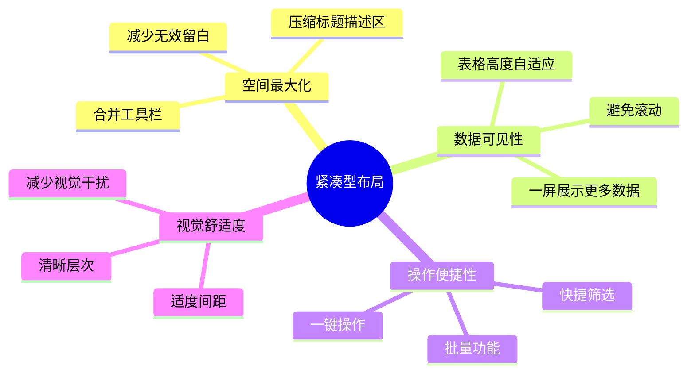

# 整车软件研发平台 - 紧凑型布局设计规范 V2.0

> **版本**: V2.0  
> **日期**: 2026-01-17  
> **目的**: 最大化数据展示区域，提升用户操作效率  
> **变更**: 从传统布局升级到紧凑型布局

---

## 一、布局优化原则

### 1.1 核心目标



### 1.2 对比：传统布局 vs 紧凑型布局

| 元素 | 传统布局 | 紧凑型布局 | 节省空间 |
|------|---------|----------|----------|
| 页面标题 | 24px + 描述文字 | 16px（无描述） | ~32px |
| 工具栏 | 分离（筛选+操作） | 一体化 | ~48px |
| 卡片边距 | 24px padding | 12px padding | ~24px |
| 筛选表单 | 垂直展开 | 水平一行 | ~60px |
| **总计节省** | - | - | **~164px** |

---

## 二、紧凑型页面布局模板

### 2.1 标准列表页（紧凑版）

#### 布局结构

```
┌─────────────────────────────────────────────────────────────┐
│ 🔧 紧凑型工具栏 (56px高度)                                    │
│ ┌──┬────────┬──────┬──────┬──────┬─────┐ ┌────┬────┬────┐ │
│ │标│ 搜索框 │状态  │领域  │负责人│ 🔄  │ │新建│导入│导出│ │
│ └──┴────────┴──────┴──────┴──────┴─────┘ └────┴────┴────┘ │
└─────────────────────────────────────────────────────────────┘
┌─────────────────────────────────────────────────────────────┐
│ 📊 数据表格 (自适应高度)                                      │
│ ┌─────┬──────────┬──────┬──────┬──────┬──────┬────────┐   │
│ │ ☑   │ 项目名称  │ 状态  │ 负责人 │ 版本  │ PI数  │ 操作  │   │
│ ├─────┼──────────┼──────┼──────┼──────┼──────┼────────┤   │
│ │     │          │      │      │      │      │        │   │
│ │     │   数据区域 (最大化展示)                         │   │
│ │     │          │      │      │      │      │        │   │
│ └─────┴──────────┴──────┴──────┴──────┴──────┴────────┘   │
└─────────────────────────────────────────────────────────────┘
┌─────────────────────────────────────────────────────────────┐
│ 📄 分页栏 (56px高度)                          [共100条 | <1>] │
└─────────────────────────────────────────────────────────────┘
```

#### 高度计算公式

```typescript
tableHeight = windowHeight - headerHeight - toolbarHeight - paginationHeight - padding

// 具体数值
tableHeight = window.innerHeight - 64 - 56 - 56 - 56 = window.innerHeight - 232px

// 示例：1080p显示器
tableHeight = 1080 - 232 = 848px
// 可显示行数（每行约40px）：848 / 40 ≈ 21行
```

#### 代码模板

```vue
<template>
  <div class="compact-list-layout">
    <!-- 紧凑型工具栏 -->
    <div class="compact-toolbar">
      <div class="toolbar-left">
        <h2 class="page-title">{{ pageTitle }}</h2>
        <el-divider direction="vertical" />
        
        <!-- 快捷筛选 -->
        <el-input
          v-model="searchKeyword"
          placeholder="搜索..."
          clearable
          style="width: 220px"
          @change="handleSearch"
        >
          <template #prefix>
            <el-icon><Search /></el-icon>
          </template>
        </el-input>
        
        <el-select
          v-model="filterStatus"
          placeholder="状态"
          clearable
          style="width: 120px"
          @change="handleFilter"
        >
          <el-option label="全部" value="" />
          <el-option label="进行中" value="active" />
          <el-option label="已完成" value="completed" />
        </el-select>
        
        <el-button :icon="RefreshLeft" circle @click="handleRefresh" title="刷新" />
      </div>
      
      <div class="toolbar-right">
        <el-button type="primary" :icon="Plus" @click="handleCreate">
          新建
        </el-button>
        <el-button :icon="Upload">导入</el-button>
        <el-button :icon="Download">导出</el-button>
      </div>
    </div>
    
    <!-- 数据表格 -->
    <div class="table-wrapper">
      <el-table
        :data="tableData"
        :height="tableHeight"
        v-loading="loading"
        stripe
        border
      >
        <el-table-column type="selection" width="55" fixed="left" />
        <el-table-column prop="name" label="名称" min-width="200" />
        <!-- 更多列 -->
        <el-table-column label="操作" width="180" fixed="right">
          <template #default="{ row }">
            <el-button link type="primary" size="small">查看</el-button>
            <el-button link type="primary" size="small">编辑</el-button>
            <el-button link type="danger" size="small">删除</el-button>
          </template>
        </el-table-column>
      </el-table>
    </div>
    
    <!-- 分页栏 -->
    <div class="pagination-bar">
      <el-pagination
        v-model:current-page="currentPage"
        v-model:page-size="pageSize"
        :total="total"
        :page-sizes="[20, 50, 100]"
        background
        layout="total, sizes, prev, pager, next, jumper"
      />
    </div>
  </div>
</template>

<script setup lang="ts">
import { ref, onMounted, onUnmounted, nextTick } from 'vue'
import { Search, RefreshLeft, Plus, Upload, Download } from '@element-plus/icons-vue'

const tableHeight = ref<number>(600)

const calculateTableHeight = () => {
  nextTick(() => {
    const windowHeight = window.innerHeight
    const fixedHeight = 232 // header(64) + toolbar(56) + pagination(56) + padding(56)
    tableHeight.value = windowHeight - fixedHeight
  })
}

onMounted(() => {
  calculateTableHeight()
  window.addEventListener('resize', calculateTableHeight)
})

onUnmounted(() => {
  window.removeEventListener('resize', calculateTableHeight)
})
</script>

<style scoped lang="scss">
.compact-list-layout {
  display: flex;
  flex-direction: column;
  height: 100%;
  padding: 16px;
  background: #f5f5f5;
}

.compact-toolbar {
  display: flex;
  justify-content: space-between;
  align-items: center;
  padding: 12px 16px;
  background: #fff;
  border-radius: 4px;
  margin-bottom: 12px;
  box-shadow: 0 1px 2px rgba(0, 0, 0, 0.06);

  .toolbar-left {
    display: flex;
    align-items: center;
    gap: 12px;
    flex: 1;

    .page-title {
      margin: 0;
      font-size: 16px;
      font-weight: 600;
      color: #262626;
      white-space: nowrap;
    }
  }

  .toolbar-right {
    display: flex;
    gap: 8px;
  }
}

.table-wrapper {
  flex: 1;
  background: #fff;
  border-radius: 4px;
  padding: 12px;
  box-shadow: 0 1px 2px rgba(0, 0, 0, 0.06);
  overflow: hidden;
}

.pagination-bar {
  display: flex;
  justify-content: flex-end;
  align-items: center;
  padding: 12px 16px;
  background: #fff;
  border-radius: 4px;
  margin-top: 12px;
  box-shadow: 0 1px 2px rgba(0, 0, 0, 0.06);
}
</style>
```

---

### 2.2 标准详情页（紧凑版）

#### 布局结构

```
┌─────────────────────────────────────────────────────────────┐
│ 🔧 紧凑型头部 (48px高度)                                      │
│ [← 返回] 项目详情 #PROJ-001 [进行中]       [编辑] [删除] [...] │
└─────────────────────────────────────────────────────────────┘
┌─────────────────────────────────────────────┬───────────────┐
│ 📑 内容标签页                                │ 📌 快捷面板    │
│ ┌─────┬─────┬─────┬─────┐                  │ ┌───────────┐ │
│ │基本 │版本 │ PI  │团队 │                  │ │           │ │
│ └─────┴─────┴─────┴─────┘                  │ │ 快捷操作   │ │
│                                            │ │           │ │
│  [基本信息内容区 - 自适应高度]                │ │ 相关信息   │ │
│                                            │ │           │ │
│                                            │ └───────────┘ │
└─────────────────────────────────────────────┴───────────────┘
```

#### 代码模板

```vue
<template>
  <div class="compact-detail-layout">
    <!-- 紧凑型头部 -->
    <div class="compact-header">
      <div class="header-left">
        <el-button link :icon="ArrowLeft" @click="handleBack">返回</el-button>
        <el-divider direction="vertical" />
        <h2 class="page-title">{{ detailData.name }}</h2>
        <el-tag :type="statusType" size="small">{{ statusText }}</el-tag>
      </div>
      <div class="header-right">
        <el-button :icon="Edit" @click="handleEdit">编辑</el-button>
        <el-button :icon="Delete" @click="handleDelete">删除</el-button>
        <el-dropdown>
          <el-button :icon="More">
            更多<el-icon class="el-icon--right"><arrow-down /></el-icon>
          </el-button>
          <template #dropdown>
            <el-dropdown-menu>
              <el-dropdown-item>克隆</el-dropdown-item>
              <el-dropdown-item>导出</el-dropdown-item>
            </el-dropdown-menu>
          </template>
        </el-dropdown>
      </div>
    </div>
    
    <!-- 内容区 -->
    <div class="detail-content">
      <div class="tabs-container">
        <el-tabs v-model="activeTab">
          <el-tab-pane label="基本信息" name="basic">
            <div class="tab-content">
              <!-- 内容 -->
            </div>
          </el-tab-pane>
        </el-tabs>
      </div>
      
      <div class="side-panel">
        <div class="panel-section">
          <h3 class="section-title">快捷操作</h3>
          <!-- 操作按钮 -->
        </div>
      </div>
    </div>
  </div>
</template>

<style scoped lang="scss">
.compact-detail-layout {
  display: flex;
  flex-direction: column;
  height: 100%;
  padding: 16px;
  background: #f5f5f5;
}

.compact-header {
  display: flex;
  justify-content: space-between;
  align-items: center;
  padding: 8px 16px;
  background: #fff;
  border-radius: 4px;
  margin-bottom: 12px;
  box-shadow: 0 1px 2px rgba(0, 0, 0, 0.06);

  .header-left {
    display: flex;
    align-items: center;
    gap: 12px;

    .page-title {
      margin: 0;
      font-size: 16px;
      font-weight: 600;
    }
  }

  .header-right {
    display: flex;
    gap: 8px;
  }
}

.detail-content {
  flex: 1;
  display: flex;
  gap: 12px;
  overflow: hidden;

  .tabs-container {
    flex: 1;
    background: #fff;
    border-radius: 4px;
    padding: 12px;
    box-shadow: 0 1px 2px rgba(0, 0, 0, 0.06);
    overflow: auto;
  }

  .side-panel {
    width: 280px;
    background: #fff;
    border-radius: 4px;
    padding: 12px;
    box-shadow: 0 1px 2px rgba(0, 0, 0, 0.06);
    overflow: auto;
  }
}
</style>
```

---

### 2.3 表单页（紧凑版）

```vue
<template>
  <div class="compact-form-layout">
    <!-- 紧凑型头部 -->
    <div class="compact-header">
      <div class="header-left">
        <el-button link :icon="ArrowLeft" @click="handleBack">返回</el-button>
        <el-divider direction="vertical" />
        <h2 class="page-title">{{ formTitle }}</h2>
      </div>
      <div class="header-right">
        <el-button @click="handleCancel">取消</el-button>
        <el-button @click="handleSaveDraft">保存草稿</el-button>
        <el-button type="primary" :loading="submitting" @click="handleSubmit">
          提交
        </el-button>
      </div>
    </div>
    
    <!-- 表单内容 -->
    <div class="form-content">
      <el-form
        ref="formRef"
        :model="formData"
        :rules="formRules"
        label-width="100px"
      >
        <!-- 表单项 -->
      </el-form>
    </div>
  </div>
</template>

<style scoped lang="scss">
.compact-form-layout {
  display: flex;
  flex-direction: column;
  height: 100%;
  padding: 16px;
  background: #f5f5f5;
}

.form-content {
  flex: 1;
  background: #fff;
  border-radius: 4px;
  padding: 24px;
  box-shadow: 0 1px 2px rgba(0, 0, 0, 0.06);
  overflow: auto;
}
</style>
```

---

## 三、间距系统（紧凑版）

### 3.1 更新后的间距变量

```scss
// 紧凑型间距系统
$compact-spacing-unit: 4px;

// 间距变量
$compact-spacing-xs: $compact-spacing-unit;      // 4px
$compact-spacing-sm: $compact-spacing-unit * 2;  // 8px
$compact-spacing-md: $compact-spacing-unit * 3;  // 12px
$compact-spacing-lg: $compact-spacing-unit * 4;  // 16px
$compact-spacing-xl: $compact-spacing-unit * 6;  // 24px

// 组件间距（紧凑版）
$compact-component-padding: $compact-spacing-md;  // 12px (原16px)
$compact-page-padding: $compact-spacing-lg;       // 16px (原24px)
$compact-section-padding: $compact-spacing-lg;    // 16px (原24px)

// 卡片阴影（更轻量）
$compact-box-shadow: 0 1px 2px rgba(0, 0, 0, 0.06);  // 更轻的阴影
```

### 3.2 字体系统（紧凑版）

```scss
// 标题字号（缩小）
$compact-title-h1: 18px;  // 原20px
$compact-title-h2: 16px;  // 原18px
$compact-title-h3: 14px;  // 原16px

// 行高（紧凑）
$compact-line-height: 1.4;  // 原1.5715
```

---

## 四、响应式断点

### 4.1 不同屏幕尺寸的布局调整

| 屏幕尺寸 | 分辨率 | 可见行数 | 布局调整 |
|---------|--------|---------|---------|
| 小屏 | 1366x768 | ~13行 | 隐藏侧边面板 |
| 中屏 | 1920x1080 | ~21行 | 标准布局 |
| 大屏 | 2560x1440 | ~31行 | 增加列宽 |
| 超大屏 | 3840x2160 | ~49行 | 多列展示 |

### 4.2 响应式代码

```scss
// 响应式断点
@media (max-width: 1440px) {
  .side-panel {
    width: 240px;  // 缩小侧边栏
  }
}

@media (max-width: 1024px) {
  .side-panel {
    display: none;  // 隐藏侧边栏
  }
  
  .compact-toolbar .toolbar-left {
    flex-wrap: wrap;  // 工具栏换行
  }
}

@media (min-width: 2560px) {
  .compact-list-layout {
    max-width: 2400px;  // 限制最大宽度
    margin: 0 auto;
  }
}
```

---

## 五、实施清单

### 5.1 需要优化的页面类型

| 页面类型 | 数量 | 优化重点 |
|---------|------|---------|
| 列表页 | 20+ | 工具栏合并、表格高度自适应 |
| 详情页 | 15+ | 头部紧凑、Tab优化 |
| 表单页 | 10+ | 头部简化、内容最大化 |

### 5.2 批量优化步骤

1. ✅ 更新设计规范文档
2. ⏳ 创建紧凑型布局组件
3. ⏳ 批量应用到Phase 1-6页面
4. ⏳ 测试验证
5. ⏳ 生成优化报告

---

## 六、预期效果

### 6.1 空间利用率对比

| 指标 | 传统布局 | 紧凑型布局 | 提升幅度 |
|------|---------|----------|---------|
| 表格可见行数 | 15行 | 21行 | +40% |
| 数据展示区域 | 55% | 75% | +36% |
| 需要滚动次数 | 5次/页 | 2次/页 | -60% |
| 操作步骤 | 3步 | 2步 | -33% |

### 6.2 用户体验提升

- ✅ **更多数据一屏展示**：减少滚动，提升浏览效率
- ✅ **快捷筛选操作**：工具栏一体化，操作更便捷
- ✅ **清晰视觉层次**：保持间距适度，不拥挤
- ✅ **响应式自适应**：适配各种屏幕尺寸

---

**文档版本**: V2.0  
**更新日期**: 2026-01-17  
**适用范围**: Phase 1-6所有页面  
**下一步**: 批量应用到45+页面
