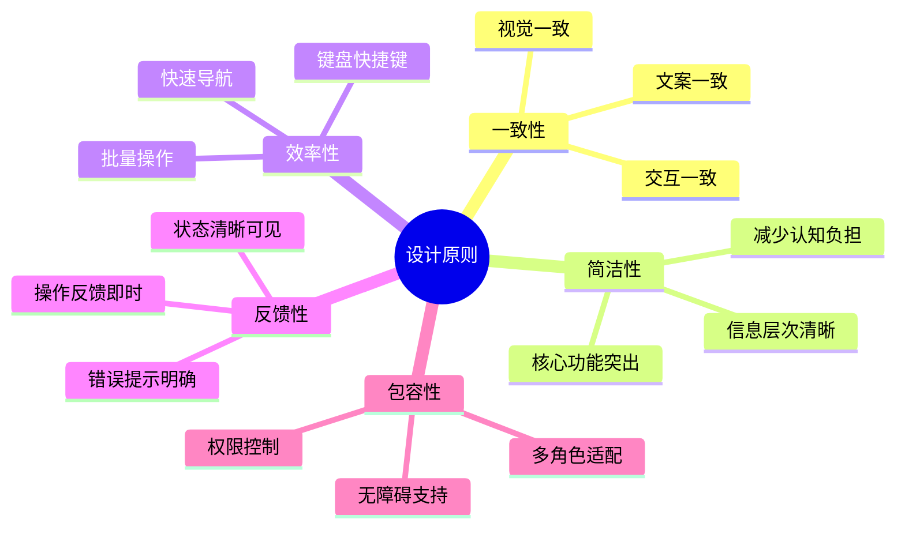

# 整车软件研发平台 - 页面框架UI设计规范

> **版本**: V1.0  
> **日期**: 2026-01-16  
> **定位**: 页面框架的UI/UX设计规范和实现细节

---

## 一、设计系统基础

### 1.1 设计原则



### 1.2 视觉规范

#### 1.2.1 颜色系统

```scss
// 主色调
$primary-color: #1890ff;          // 主要
$success-color: #52c41a;          // 成功
$warning-color: #faad14;          // 警告
$danger-color: #f5222d;           // 危险
$info-color: #1890ff;             // 信息

// 中性色
$text-color-primary: #262626;     // 主要文本
$text-color-secondary: #595959;   // 次要文本
$text-color-disabled: #bfbfbf;    // 禁用文本
$border-color-base: #d9d9d9;      // 基础边框
$border-color-light: #e8e8e8;     // 浅色边框
$background-color-base: #fafafa;  // 基础背景
$background-color-light: #ffffff; // 浅色背景

// 功能色
$link-color: #1890ff;
$hover-color: #40a9ff;
$active-color: #096dd9;
$disabled-color: #f5f5f5;

// 状态色映射
$status-colors: (
  todo: #d9d9d9,           // 待处理
  inprogress: #1890ff,     // 进行中
  review: #722ed1,         // 评审中
  testing: #fa8c16,        // 测试中
  done: #52c41a,           // 已完成
  blocked: #f5222d,        // 阻塞
  cancelled: #8c8c8c       // 已取消
);

// 优先级色映射
$priority-colors: (
  p0: #f5222d,  // 紧急
  p1: #fa8c16,  // 高
  p2: #faad14,  // 中
  p3: #1890ff   // 低
);
```

#### 1.2.2 字体系统

```scss
// 字体家族
$font-family-base: -apple-system, BlinkMacSystemFont, 
                   'Segoe UI', Roboto, 'Helvetica Neue', Arial,
                   'Noto Sans', sans-serif, 'Apple Color Emoji',
                   'Segoe UI Emoji', 'Segoe UI Symbol', 'Noto Color Emoji';

$font-family-code: 'SFMono-Regular', Consolas, 'Liberation Mono', 
                   Menlo, Courier, monospace;

// 字体大小
$font-size-base: 14px;
$font-size-sm: 12px;
$font-size-lg: 16px;
$font-size-xl: 18px;
$font-size-xxl: 20px;

// 字重
$font-weight-normal: 400;
$font-weight-medium: 500;
$font-weight-bold: 600;

// 行高
$line-height-base: 1.5715;
$line-height-tight: 1.3;
$line-height-loose: 2;
```

#### 1.2.3 间距系统

```scss
// 基础间距单位
$spacing-unit: 8px;

// 间距变量
$spacing-xs: $spacing-unit * 0.5;  // 4px
$spacing-sm: $spacing-unit;        // 8px
$spacing-md: $spacing-unit * 2;    // 16px
$spacing-lg: $spacing-unit * 3;    // 24px
$spacing-xl: $spacing-unit * 4;    // 32px
$spacing-xxl: $spacing-unit * 6;   // 48px

// 组件间距
$component-padding: $spacing-md;
$component-margin: $spacing-md;
$section-padding: $spacing-lg;
$page-padding: $spacing-xl;
```

#### 1.2.4 圆角与阴影

```scss
// 圆角
$border-radius-base: 2px;
$border-radius-sm: 1px;
$border-radius-lg: 4px;
$border-radius-xl: 8px;
$border-radius-circle: 50%;

// 阴影
$box-shadow-base: 0 2px 8px rgba(0, 0, 0, 0.15);
$box-shadow-light: 0 2px 4px rgba(0, 0, 0, 0.08);
$box-shadow-heavy: 0 4px 16px rgba(0, 0, 0, 0.2);
$box-shadow-hover: 0 4px 12px rgba(0, 0, 0, 0.15);
```

---

## 二、布局设计规范

### 2.1 栅格系统

```vue
<template>
  <div class="grid-container">
    <!-- 24列栅格系统 -->
    <el-row :gutter="16">
      <el-col :span="6">
        <!-- 1/4 宽度 -->
      </el-col>
      <el-col :span="12">
        <!-- 1/2 宽度 -->
      </el-col>
      <el-col :span="6">
        <!-- 1/4 宽度 -->
      </el-col>
    </el-row>
    
    <!-- 响应式栅格 -->
    <el-row :gutter="16">
      <el-col :xs="24" :sm="12" :md="8" :lg="6">
        <!-- 响应式列 -->
      </el-col>
    </el-row>
  </div>
</template>

<style scoped>
.grid-container {
  max-width: 1440px;
  margin: 0 auto;
  padding: 0 16px;
  
  @media (min-width: 1920px) {
    max-width: 1680px;
  }
}
</style>
```

### 2.2 页面布局模板

#### 2.2.1 标准列表页布局

```vue
<template>
  <div class="standard-list-layout">
    <!-- 页面头部 -->
    <div class="page-header">
      <div class="header-left">
        <el-breadcrumb separator="/">
          <el-breadcrumb-item :to="{ path: '/' }">首页</el-breadcrumb-item>
          <el-breadcrumb-item>需求管理</el-breadcrumb-item>
          <el-breadcrumb-item>Epic列表</el-breadcrumb-item>
        </el-breadcrumb>
        <h1 class="page-title">Epic列表</h1>
        <p class="page-description">管理和查看所有Epic需求</p>
      </div>
      <div class="header-right">
        <el-button type="primary" icon="el-icon-plus">
          创建Epic
        </el-button>
      </div>
    </div>
    
    <!-- 工具栏 -->
    <div class="toolbar">
      <div class="toolbar-left">
        <el-input
          v-model="searchKeyword"
          placeholder="搜索Epic名称、ID"
          prefix-icon="el-icon-search"
          clearable
          style="width: 300px"
        />
        <el-button icon="el-icon-refresh" @click="handleRefresh">
          刷新
        </el-button>
      </div>
      <div class="toolbar-right">
        <el-dropdown>
          <el-button icon="el-icon-filter">
            筛选 <i class="el-icon-arrow-down"></i>
          </el-button>
          <template #dropdown>
            <el-dropdown-menu>
              <el-dropdown-item>状态</el-dropdown-item>
              <el-dropdown-item>优先级</el-dropdown-item>
              <el-dropdown-item>负责人</el-dropdown-item>
            </el-dropdown-menu>
          </template>
        </el-dropdown>
        <el-button icon="el-icon-download">导出</el-button>
      </div>
    </div>
    
    <!-- 内容区 -->
    <div class="content-area">
      <el-table :data="tableData" v-loading="loading">
        <!-- 表格列 -->
      </el-table>
      
      <!-- 分页 -->
      <div class="pagination-wrapper">
        <el-pagination
          :current-page="pagination.page"
          :page-size="pagination.pageSize"
          :total="pagination.total"
          layout="total, sizes, prev, pager, next, jumper"
        />
      </div>
    </div>
  </div>
</template>

<style scoped lang="scss">
.standard-list-layout {
  display: flex;
  flex-direction: column;
  height: 100%;
  background: #fff;
  
  .page-header {
    display: flex;
    justify-content: space-between;
    align-items: flex-start;
    padding: 24px 24px 0;
    
    .header-left {
      .page-title {
        margin: 8px 0 4px;
        font-size: 20px;
        font-weight: 600;
        color: $text-color-primary;
      }
      
      .page-description {
        margin: 0;
        font-size: 14px;
        color: $text-color-secondary;
      }
    }
  }
  
  .toolbar {
    display: flex;
    justify-content: space-between;
    align-items: center;
    padding: 16px 24px;
    border-bottom: 1px solid $border-color-light;
    
    .toolbar-left,
    .toolbar-right {
      display: flex;
      gap: 8px;
    }
  }
  
  .content-area {
    flex: 1;
    padding: 16px 24px;
    overflow: auto;
    
    .pagination-wrapper {
      display: flex;
      justify-content: flex-end;
      margin-top: 16px;
    }
  }
}
</style>
```

#### 2.2.2 标准详情页布局

```vue
<template>
  <div class="standard-detail-layout">
    <!-- 页面头部 -->
    <div class="page-header">
      <div class="header-left">
        <el-button
          icon="el-icon-arrow-left"
          text
          @click="handleBack"
        >
          返回
        </el-button>
        <div class="title-section">
          <h1 class="page-title">
            {{ detailData.title }}
            <status-badge :status="detailData.status" />
          </h1>
          <div class="meta-info">
            <span>创建人: {{ detailData.creator }}</span>
            <span>创建时间: {{ detailData.createdAt }}</span>
            <span>最后更新: {{ detailData.updatedAt }}</span>
          </div>
        </div>
      </div>
      <div class="header-right">
        <el-button @click="handleEdit">编辑</el-button>
        <el-button @click="handleDelete" type="danger">删除</el-button>
        <el-dropdown>
          <el-button>
            更多 <i class="el-icon-arrow-down"></i>
          </el-button>
          <template #dropdown>
            <el-dropdown-menu>
              <el-dropdown-item @click="handleClone">克隆</el-dropdown-item>
              <el-dropdown-item @click="handleExport">导出</el-dropdown-item>
              <el-dropdown-item @click="handleShare">分享</el-dropdown-item>
            </el-dropdown-menu>
          </template>
        </el-dropdown>
      </div>
    </div>
    
    <!-- 标签页内容 -->
    <div class="tabs-container">
      <el-tabs v-model="activeTab" type="card">
        <el-tab-pane label="基本信息" name="basic">
          <div class="tab-content">
            <!-- 基本信息展示 -->
            <description-list :column="2">
              <description-item label="Epic ID">
                {{ detailData.id }}
              </description-item>
              <description-item label="优先级">
                <priority-tag :priority="detailData.priority" />
              </description-item>
              <!-- 更多字段 -->
            </description-list>
          </div>
        </el-tab-pane>
        
        <el-tab-pane label="关联Feature" name="features">
          <div class="tab-content">
            <!-- Feature列表 -->
          </div>
        </el-tab-pane>
        
        <el-tab-pane label="操作历史" name="history">
          <div class="tab-content">
            <!-- 操作时间线 -->
            <el-timeline>
              <el-timeline-item
                v-for="item in historyData"
                :key="item.id"
                :timestamp="item.timestamp"
              >
                {{ item.content }}
              </el-timeline-item>
            </el-timeline>
          </div>
        </el-tab-pane>
      </el-tabs>
    </div>
    
    <!-- 侧边面板 -->
    <div class="side-panel">
      <div class="panel-section">
        <h3 class="section-title">快捷操作</h3>
        <el-button size="small" block>拆解Feature</el-button>
        <el-button size="small" block>关联项目</el-button>
      </div>
      
      <div class="panel-section">
        <h3 class="section-title">相关信息</h3>
        <div class="info-item">
          <span class="label">所属项目:</span>
          <el-link>{{ detailData.project }}</el-link>
        </div>
        <!-- 更多信息 -->
      </div>
    </div>
  </div>
</template>

<style scoped lang="scss">
.standard-detail-layout {
  display: grid;
  grid-template-columns: 1fr 320px;
  grid-template-rows: auto 1fr;
  height: 100%;
  gap: 0;
  background: #fff;
  
  .page-header {
    grid-column: 1 / -1;
    display: flex;
    justify-content: space-between;
    padding: 24px;
    border-bottom: 1px solid $border-color-light;
    
    .header-left {
      display: flex;
      gap: 16px;
      align-items: flex-start;
      
      .title-section {
        .page-title {
          margin: 0 0 8px;
          font-size: 24px;
          font-weight: 600;
          display: flex;
          align-items: center;
          gap: 12px;
        }
        
        .meta-info {
          display: flex;
          gap: 16px;
          font-size: 14px;
          color: $text-color-secondary;
        }
      }
    }
    
    .header-right {
      display: flex;
      gap: 8px;
    }
  }
  
  .tabs-container {
    overflow: auto;
    padding: 0 24px 24px;
    
    .tab-content {
      padding: 24px 0;
    }
  }
  
  .side-panel {
    border-left: 1px solid $border-color-light;
    padding: 24px 16px;
    overflow: auto;
    
    .panel-section {
      margin-bottom: 24px;
      
      .section-title {
        margin: 0 0 12px;
        font-size: 14px;
        font-weight: 600;
      }
      
      .el-button {
        margin-bottom: 8px;
      }
      
      .info-item {
        padding: 8px 0;
        font-size: 14px;
        
        .label {
          color: $text-color-secondary;
          margin-right: 8px;
        }
      }
    }
  }
  
  // 响应式
  @media (max-width: 1024px) {
    grid-template-columns: 1fr;
    
    .side-panel {
      border-left: none;
      border-top: 1px solid $border-color-light;
    }
  }
}
</style>
```

#### 2.2.3 表单页布局

```vue
<template>
  <div class="standard-form-layout">
    <!-- 页面头部 -->
    <div class="page-header">
      <el-button icon="el-icon-arrow-left" text @click="handleBack">
        返回
      </el-button>
      <h1 class="page-title">{{ formTitle }}</h1>
      <p class="page-description">{{ formDescription }}</p>
    </div>
    
    <!-- 步骤条(可选) -->
    <div v-if="showSteps" class="steps-container">
      <el-steps :active="currentStep" finish-status="success">
        <el-step
          v-for="(step, index) in steps"
          :key="index"
          :title="step.title"
          :description="step.description"
        />
      </el-steps>
    </div>
    
    <!-- 表单内容 -->
    <div class="form-content">
      <el-form
        ref="formRef"
        :model="formData"
        :rules="formRules"
        label-width="120px"
        label-position="right"
      >
        <!-- 表单分组 -->
        <div class="form-section">
          <div class="section-header">
            <h2 class="section-title">基本信息</h2>
            <p class="section-description">填写Epic的基本信息</p>
          </div>
          <div class="section-content">
            <el-form-item label="Epic名称" prop="title" required>
              <el-input
                v-model="formData.title"
                placeholder="请输入Epic名称"
                maxlength="100"
                show-word-limit
              />
            </el-form-item>
            
            <el-form-item label="优先级" prop="priority" required>
              <el-select v-model="formData.priority" placeholder="请选择优先级">
                <el-option label="P0 - 紧急" value="p0" />
                <el-option label="P1 - 高" value="p1" />
                <el-option label="P2 - 中" value="p2" />
                <el-option label="P3 - 低" value="p3" />
              </el-select>
            </el-form-item>
            
            <el-form-item label="描述" prop="description">
              <el-input
                v-model="formData.description"
                type="textarea"
                :rows="4"
                placeholder="请输入描述"
                maxlength="500"
                show-word-limit
              />
            </el-form-item>
          </div>
        </div>
        
        <div class="form-section">
          <div class="section-header">
            <h2 class="section-title">详细信息</h2>
          </div>
          <div class="section-content">
            <!-- 更多表单项 -->
          </div>
        </div>
      </el-form>
    </div>
    
    <!-- 底部操作栏 -->
    <div class="form-footer">
      <div class="footer-left">
        <el-button @click="handleSaveDraft">保存草稿</el-button>
      </div>
      <div class="footer-right">
        <el-button @click="handleCancel">取消</el-button>
        <el-button v-if="currentStep > 1" @click="handlePrevious">
          上一步
        </el-button>
        <el-button
          v-if="!isLastStep"
          type="primary"
          @click="handleNext"
        >
          下一步
        </el-button>
        <el-button
          v-else
          type="primary"
          :loading="submitting"
          @click="handleSubmit"
        >
          提交
        </el-button>
      </div>
    </div>
  </div>
</template>

<style scoped lang="scss">
.standard-form-layout {
  display: flex;
  flex-direction: column;
  height: 100%;
  background: #fff;
  
  .page-header {
    padding: 24px 24px 0;
    
    .page-title {
      margin: 8px 0 4px;
      font-size: 20px;
      font-weight: 600;
    }
    
    .page-description {
      margin: 0 0 16px;
      color: $text-color-secondary;
    }
  }
  
  .steps-container {
    padding: 24px;
    border-bottom: 1px solid $border-color-light;
  }
  
  .form-content {
    flex: 1;
    overflow: auto;
    padding: 24px;
    
    .form-section {
      margin-bottom: 32px;
      
      &:last-child {
        margin-bottom: 0;
      }
      
      .section-header {
        margin-bottom: 16px;
        
        .section-title {
          margin: 0 0 4px;
          font-size: 16px;
          font-weight: 600;
        }
        
        .section-description {
          margin: 0;
          font-size: 14px;
          color: $text-color-secondary;
        }
      }
      
      .section-content {
        padding-left: 16px;
      }
    }
  }
  
  .form-footer {
    display: flex;
    justify-content: space-between;
    align-items: center;
    padding: 16px 24px;
    border-top: 1px solid $border-color-light;
    background: #fafafa;
    
    .footer-right {
      display: flex;
      gap: 8px;
    }
  }
}
</style>
```

---

## 三、组件设计规范

### 3.1 数据表格设计

```vue
<template>
  <div class="data-table-wrapper">
    <el-table
      :data="tableData"
      v-loading="loading"
      stripe
      border
      :height="tableHeight"
      @selection-change="handleSelectionChange"
      @sort-change="handleSortChange"
      @row-click="handleRowClick"
    >
      <!-- 选择列 -->
      <el-table-column
        v-if="showSelection"
        type="selection"
        width="55"
        fixed="left"
      />
      
      <!-- 序号列 -->
      <el-table-column
        v-if="showIndex"
        type="index"
        label="#"
        width="60"
        fixed="left"
      />
      
      <!-- 数据列 -->
      <el-table-column
        v-for="column in columns"
        :key="column.prop"
        :prop="column.prop"
        :label="column.label"
        :width="column.width"
        :min-width="column.minWidth"
        :fixed="column.fixed"
        :sortable="column.sortable"
        :filters="column.filters"
        :filter-method="column.filterMethod"
      >
        <template #default="{ row }">
          <!-- 自定义单元格渲染 -->
          <slot
            :name="`column-${column.prop}`"
            :row="row"
            :column="column"
          >
            {{ row[column.prop] }}
          </slot>
        </template>
      </el-table-column>
      
      <!-- 操作列 -->
      <el-table-column
        v-if="showActions"
        label="操作"
        :width="actionsWidth"
        fixed="right"
      >
        <template #default="{ row }">
          <slot name="actions" :row="row">
            <el-button type="text" size="small" @click="handleView(row)">
              查看
            </el-button>
            <el-button type="text" size="small" @click="handleEdit(row)">
              编辑
            </el-button>
            <el-popconfirm
              title="确定要删除吗?"
              @confirm="handleDelete(row)"
            >
              <template #reference>
                <el-button type="text" size="small" class="danger">
                  删除
                </el-button>
              </template>
            </el-popconfirm>
          </slot>
        </template>
      </el-table-column>
      
      <!-- 空状态 -->
      <template #empty>
        <el-empty
          :image-size="120"
          :description="emptyText || '暂无数据'"
        >
          <el-button v-if="showCreateButton" type="primary" @click="handleCreate">
            创建第一个
          </el-button>
        </el-empty>
      </template>
    </el-table>
    
    <!-- 批量操作栏 -->
    <transition name="slide-up">
      <div v-if="selectedRows.length > 0" class="batch-actions-bar">
        <div class="batch-info">
          已选择 <strong>{{ selectedRows.length }}</strong> 项
          <el-button type="text" @click="clearSelection">清空</el-button>
        </div>
        <div class="batch-operations">
          <slot name="batch-actions" :selected-rows="selectedRows">
            <el-button @click="handleBatchDelete">批量删除</el-button>
            <el-button @click="handleBatchExport">批量导出</el-button>
          </slot>
        </div>
      </div>
    </transition>
  </div>
</template>

<style scoped lang="scss">
.data-table-wrapper {
  position: relative;
  
  // 表格样式定制
  :deep(.el-table) {
    // 表头样式
    .el-table__header-wrapper {
      .el-table__header {
        th {
          background: #fafafa;
          color: $text-color-primary;
          font-weight: 600;
        }
      }
    }
    
    // 单元格样式
    .el-table__body-wrapper {
      .el-table__row {
        cursor: pointer;
        transition: background-color 0.2s;
        
        &:hover {
          background-color: #f5f7fa;
        }
        
        .el-button.danger {
          color: $danger-color;
          
          &:hover {
            color: lighten($danger-color, 10%);
          }
        }
      }
    }
  }
  
  // 批量操作栏
  .batch-actions-bar {
    position: fixed;
    bottom: 24px;
    left: 50%;
    transform: translateX(-50%);
    display: flex;
    justify-content: space-between;
    align-items: center;
    min-width: 500px;
    padding: 12px 24px;
    background: #fff;
    border-radius: 4px;
    box-shadow: $box-shadow-heavy;
    z-index: 1000;
    
    .batch-info {
      display: flex;
      align-items: center;
      gap: 8px;
      font-size: 14px;
      
      strong {
        color: $primary-color;
      }
    }
    
    .batch-operations {
      display: flex;
      gap: 8px;
    }
  }
  
  // 动画
  .slide-up-enter-active,
  .slide-up-leave-active {
    transition: all 0.3s ease;
  }
  
  .slide-up-enter-from,
  .slide-up-leave-to {
    transform: translate(-50%, 100px);
    opacity: 0;
  }
}
</style>
```

### 3.2 状态徽章组件

```vue
<!-- StatusBadge.vue -->
<template>
  <span :class="['status-badge', `status-${status}`]">
    <span class="status-dot"></span>
    <span class="status-text">{{ statusText }}</span>
  </span>
</template>

<script setup lang="ts">
import { computed } from 'vue';

const props = defineProps<{
  status: string;
}>();

const statusMap = {
  todo: '待处理',
  inprogress: '进行中',
  review: '评审中',
  testing: '测试中',
  done: '已完成',
  blocked: '阻塞',
  cancelled: '已取消'
};

const statusText = computed(() => statusMap[props.status] || props.status);
</script>

<style scoped lang="scss">
.status-badge {
  display: inline-flex;
  align-items: center;
  gap: 4px;
  padding: 2px 8px;
  border-radius: 2px;
  font-size: 12px;
  line-height: 20px;
  
  .status-dot {
    display: inline-block;
    width: 6px;
    height: 6px;
    border-radius: 50%;
  }
  
  // 不同状态的样式
  &.status-todo {
    background: #f5f5f5;
    color: #8c8c8c;
    .status-dot { background: #d9d9d9; }
  }
  
  &.status-inprogress {
    background: #e6f7ff;
    color: #1890ff;
    .status-dot { background: #1890ff; }
  }
  
  &.status-review {
    background: #f9f0ff;
    color: #722ed1;
    .status-dot { background: #722ed1; }
  }
  
  &.status-testing {
    background: #fff7e6;
    color: #fa8c16;
    .status-dot { background: #fa8c16; }
  }
  
  &.status-done {
    background: #f6ffed;
    color: #52c41a;
    .status-dot { background: #52c41a; }
  }
  
  &.status-blocked {
    background: #fff1f0;
    color: #f5222d;
    .status-dot { background: #f5222d; }
  }
  
  &.status-cancelled {
    background: #f5f5f5;
    color: #8c8c8c;
    .status-dot { background: #8c8c8c; }
  }
}
</style>
```

### 3.3 优先级标签组件

```vue
<!-- PriorityTag.vue -->
<template>
  <el-tag
    :type="tagType"
    :effect="effect"
    size="small"
  >
    <i :class="`priority-icon priority-${priority}`"></i>
    {{ priorityText }}
  </el-tag>
</template>

<script setup lang="ts">
import { computed } from 'vue';

const props = defineProps<{
  priority: string;
  effect?: 'light' | 'dark' | 'plain';
}>();

const priorityMap = {
  p0: 'P0 - 紧急',
  p1: 'P1 - 高',
  p2: 'P2 - 中',
  p3: 'P3 - 低'
};

const tagTypeMap = {
  p0: 'danger',
  p1: 'warning',
  p2: 'info',
  p3: 'success'
};

const priorityText = computed(() => 
  priorityMap[props.priority] || props.priority
);

const tagType = computed(() => 
  tagTypeMap[props.priority] || ''
);
</script>

<style scoped lang="scss">
.priority-icon {
  display: inline-block;
  width: 12px;
  height: 12px;
  margin-right: 4px;
  
  &.priority-p0::before {
    content: '🔥';
  }
  
  &.priority-p1::before {
    content: '⚡';
  }
  
  &.priority-p2::before {
    content: '📋';
  }
  
  &.priority-p3::before {
    content: '📌';
  }
}
</style>
```

---

## 四、交互设计规范

### 4.1 加载状态

```vue
<template>
  <div class="loading-states">
    <!-- 全局加载 -->
    <el-loading
      v-if="globalLoading"
      :text="loadingText"
      fullscreen
    />
    
    <!-- 区域加载 -->
    <div v-loading="sectionLoading" class="section-content">
      <!-- 内容 -->
    </div>
    
    <!-- 骨架屏 -->
    <el-skeleton
      v-if="skeletonLoading"
      :rows="5"
      animated
    />
    
    <!-- 按钮加载 -->
    <el-button
      type="primary"
      :loading="btnLoading"
      @click="handleSubmit"
    >
      提交
    </el-button>
  </div>
</template>

<style scoped lang="scss">
// 自定义加载样式
:deep(.el-loading-mask) {
  background-color: rgba(255, 255, 255, 0.9);
  
  .el-loading-spinner {
    .circular {
      color: $primary-color;
    }
    
    .el-loading-text {
      color: $text-color-primary;
      font-size: 14px;
    }
  }
}
</style>
```

### 4.2 空状态设计

```vue
<template>
  <div class="empty-state">
    <el-empty
      :image="emptyImage"
      :image-size="imageSize"
      :description="description"
    >
      <template v-if="showAction">
        <el-button type="primary" @click="handleAction">
          {{ actionText }}
        </el-button>
      </template>
    </el-empty>
  </div>
</template>

<script setup lang="ts">
// 不同场景的空状态
const emptyScenes = {
  noData: {
    image: '/images/empty/no-data.svg',
    description: '暂无数据',
    actionText: '创建第一个'
  },
  noSearch: {
    image: '/images/empty/no-search.svg',
    description: '没有找到匹配的结果',
    actionText: '清空筛选条件'
  },
  noPermission: {
    image: '/images/empty/no-permission.svg',
    description: '您没有权限查看此内容',
    actionText: '返回首页'
  },
  error: {
    image: '/images/empty/error.svg',
    description: '加载失败，请稍后重试',
    actionText: '重新加载'
  }
};
</script>
```

### 4.3 消息提示规范

```typescript
// 消息提示服务
class MessageService {
  // 成功提示
  success(message: string, duration = 3000) {
    ElMessage({
      type: 'success',
      message,
      duration,
      showClose: true,
      customClass: 'custom-message-success'
    });
  }
  
  // 错误提示
  error(message: string, duration = 3000) {
    ElMessage({
      type: 'error',
      message,
      duration,
      showClose: true,
      customClass: 'custom-message-error'
    });
  }
  
  // 警告提示
  warning(message: string, duration = 3000) {
    ElMessage({
      type: 'warning',
      message,
      duration,
      showClose: true
    });
  }
  
  // 信息提示
  info(message: string, duration = 3000) {
    ElMessage({
      type: 'info',
      message,
      duration,
      showClose: true
    });
  }
  
  // 确认对话框
  async confirm(
    message: string,
    title = '确认',
    options?: any
  ): Promise<boolean> {
    try {
      await ElMessageBox.confirm(message, title, {
        confirmButtonText: '确定',
        cancelButtonText: '取消',
        type: 'warning',
        ...options
      });
      return true;
    } catch {
      return false;
    }
  }
  
  // 通知
  notify(options: {
    title: string;
    message: string;
    type?: 'success' | 'warning' | 'info' | 'error';
    duration?: number;
  }) {
    ElNotification({
      duration: 4500,
      showClose: true,
      ...options
    });
  }
}
```

---

## 五、动画与过渡

### 5.1 页面切换动画

```scss
// 页面切换过渡
.page-transition {
  &-enter-active,
  &-leave-active {
    transition: all 0.3s ease;
  }
  
  &-enter-from {
    opacity: 0;
    transform: translateX(30px);
  }
  
  &-leave-to {
    opacity: 0;
    transform: translateX(-30px);
  }
}

// 淡入淡出
.fade {
  &-enter-active,
  &-leave-active {
    transition: opacity 0.3s;
  }
  
  &-enter-from,
  &-leave-to {
    opacity: 0;
  }
}

// 滑动
.slide-up {
  &-enter-active,
  &-leave-active {
    transition: all 0.3s ease;
  }
  
  &-enter-from {
    transform: translateY(20px);
    opacity: 0;
  }
  
  &-leave-to {
    transform: translateY(-20px);
    opacity: 0;
  }
}

// 缩放
.zoom {
  &-enter-active,
  &-leave-active {
    transition: all 0.3s ease;
  }
  
  &-enter-from {
    transform: scale(0.9);
    opacity: 0;
  }
  
  &-leave-to {
    transform: scale(1.1);
    opacity: 0;
  }
}
```

### 5.2 微交互动效

```scss
// 按钮悬停效果
.btn-hover-effect {
  transition: all 0.3s cubic-bezier(0.645, 0.045, 0.355, 1);
  
  &:hover {
    transform: translateY(-2px);
    box-shadow: $box-shadow-hover;
  }
  
  &:active {
    transform: translateY(0);
  }
}

// 卡片悬停效果
.card-hover-effect {
  transition: all 0.3s ease;
  
  &:hover {
    box-shadow: $box-shadow-hover;
    transform: translateY(-4px);
  }
}

// 加载动画
@keyframes spin {
  0% { transform: rotate(0deg); }
  100% { transform: rotate(360deg); }
}

.loading-spin {
  animation: spin 1s linear infinite;
}

// 脉冲动画
@keyframes pulse {
  0%, 100% { opacity: 1; }
  50% { opacity: 0.5; }
}

.pulse-animation {
  animation: pulse 2s ease-in-out infinite;
}
```

---

## 六、响应式设计

### 6.1 断点系统

```scss
// 断点定义
$breakpoints: (
  xs: 0,
  sm: 576px,
  md: 768px,
  lg: 992px,
  xl: 1200px,
  xxl: 1600px
);

// 响应式混合宏
@mixin respond-to($breakpoint) {
  @if map-has-key($breakpoints, $breakpoint) {
    @media (min-width: map-get($breakpoints, $breakpoint)) {
      @content;
    }
  }
}

// 使用示例
.container {
  padding: 16px;
  
  @include respond-to(md) {
    padding: 24px;
  }
  
  @include respond-to(lg) {
    padding: 32px;
  }
  
  @include respond-to(xl) {
    padding: 48px;
  }
}
```

### 6.2 移动端适配

```scss
// 移动端布局调整
.mobile-layout {
  // 隐藏侧边栏
  .side-navigation {
    @media (max-width: 768px) {
      position: fixed;
      left: -100%;
      transition: left 0.3s;
      z-index: 1000;
      
      &.open {
        left: 0;
      }
    }
  }
  
  // 调整字体大小
  @media (max-width: 768px) {
    font-size: 16px; // 移动端基础字号
    
    h1 { font-size: 24px; }
    h2 { font-size: 20px; }
    h3 { font-size: 18px; }
  }
  
  // 触摸优化
  @media (max-width: 768px) {
    .el-button {
      min-height: 44px; // 更大的触摸区域
      padding: 12px 24px;
    }
    
    .el-input__inner {
      height: 44px;
    }
  }
}
```

---

## 七、无障碍设计

### 7.1 键盘导航

```vue
<template>
  <div
    class="keyboard-navigation"
    @keydown="handleKeyDown"
  >
    <!-- 可聚焦元素 -->
    <el-button
      v-for="item in items"
      :key="item.id"
      :tabindex="0"
      @focus="handleFocus(item)"
    >
      {{ item.label }}
    </el-button>
  </div>
</template>

<script setup lang="ts">
// 键盘快捷键
const shortcuts = {
  'Ctrl+K': openSearch,
  'Ctrl+N': createNew,
  'Ctrl+S': save,
  'Escape': closeModal
};

function handleKeyDown(event: KeyboardEvent) {
  const key = `${event.ctrlKey ? 'Ctrl+' : ''}${event.key}`;
  const action = shortcuts[key];
  
  if (action) {
    event.preventDefault();
    action();
  }
}
</script>
```

### 7.2 ARIA支持

```vue
<template>
  <div
    role="region"
    :aria-label="regionLabel"
    :aria-busy="loading"
  >
    <button
      :aria-expanded="isExpanded"
      :aria-controls="panelId"
      @click="togglePanel"
    >
      展开/折叠
    </button>
    
    <div
      :id="panelId"
      role="region"
      :aria-hidden="!isExpanded"
    >
      <!-- 面板内容 -->
    </div>
  </div>
</template>
```

---

## 八、性能优化

### 8.1 虚拟滚动

```vue
<template>
  <el-table-v2
    :columns="columns"
    :data="tableData"
    :width="tableWidth"
    :height="tableHeight"
    fixed
  />
</template>
```

### 8.2 图片懒加载

```vue
<template>
  
</template>
```

---

**文档版本**: V1.0  
**更新日期**: 2026-01-16  
**维护团队**: 平台UI/UX设计组
