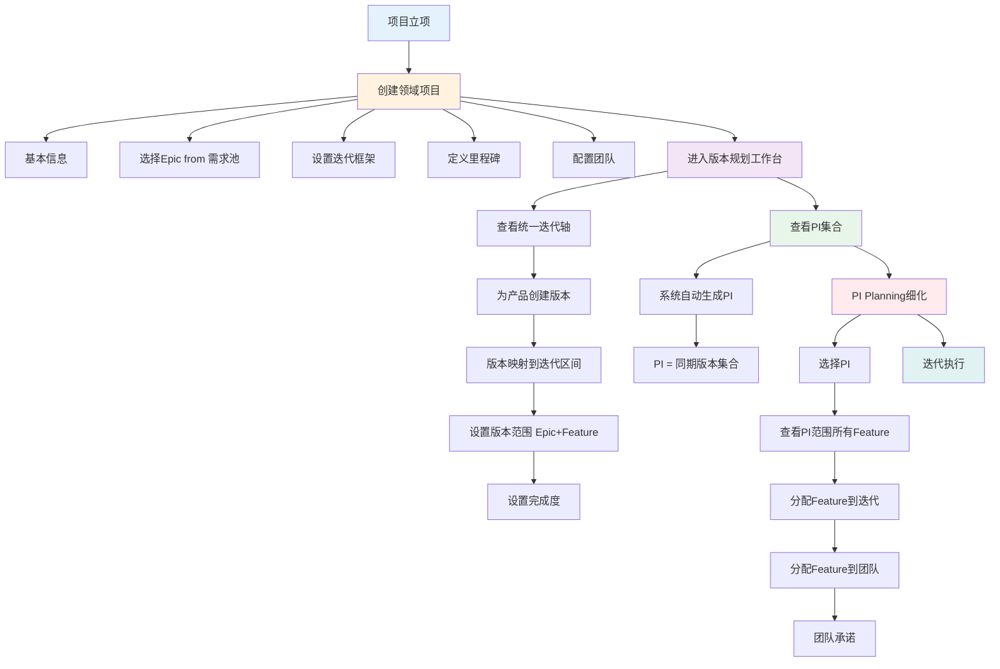

# 领域项目管理 - 差距分析与新目标方案

> **文档版本**: V2.0  
> **创建时间**: 2026-01-20  
> **更新原因**: 基于实际测试反馈和业务理解调整方案

---

## 一、问题与差距分析

### 1.1 实际测试发现的问题

#### 问题1：团队配置无数据支持 ❌

**现状**：
- 项目创建第3步"团队配置"中，团队列表为空
- 无法选择团队和成员

**原因**：
- 缺少团队基础数据（Mock数据）
- 缺少团队管理模块

**影响**：
- 项目无法完整创建
- 无法分配Epic到团队

---

#### 问题2：页面流程衔接问题 ❌

**现状**：
- 项目创建成功后，没有自动跳转到项目列表
- 无法验证项目是否创建成功

**原因**：
- 缺少创建成功后的跳转逻辑
- 缺少成功提示和引导

**影响**：
- 用户体验不连贯
- 无法快速进入下一步操作

---

### 1.2 业务理解的重大变化

#### 变化1：层级结构调整 ⭐⭐⭐⭐⭐

**原设计**：
```
项目
├── PI框架（12周×4个PI）
├── 里程碑（3-5个）
├── 版本（V1.0、V1.1、V2.0）
└── PI（PI-1、PI-2、PI-3、PI-4）
```

**新需求**：
```
1级：项目 + 多个交付节点（里程碑）
    ├── 工程样车（EP）: 2025-06-30
    ├── PP车（PP）: 2025-09-30
    └── 量产车（SOP）: 2025-12-31

2级：多产品版本交付节点 ⭐ 核心层级
    产品A：
    ├── V1.0 (EP) - 迭代1-3
    ├── V1.1 (PP) - 迭代4-6
    └── V2.0 (SOP) - 迭代7-9
    
    产品B：
    ├── V1.0 (EP) - 迭代1-3
    └── V1.1 (PP) - 迭代4-6

3级：各模块的版本交付节点
    产品A V1.0：
    ├── 模块1：Feature Set 1
    ├── 模块2：Feature Set 2
    └── 模块3：Feature Set 3
```

**关键差异**：

| 维度 | 原设计 | 新需求 | 变化影响 |
|------|--------|--------|----------|
| **核心层级** | PI规划 | 多产品版本规划 | PI从独立概念变成版本集合 |
| **迭代轴** | PI内6个Sprint | 项目全局迭代轴 | 迭代是全局的，不属于某个PI |
| **版本-迭代关系** | 版本→PI→Sprint | 版本→迭代区间 | 直接映射，无中间层 |
| **PI概念** | 独立规划单元 | 多版本集合 | PI=同期交付的多个版本 |

---

#### 变化2：2级计划成为核心 ⭐⭐⭐⭐⭐

**核心工作台**：多产品版本规划工作台

**功能定位**：
```
统一的迭代轴
├── 迭代1 (2周)
├── 迭代2 (2周)
├── 迭代3 (2周)
├── ...
└── 迭代N (2周)

映射多个产品版本到迭代轴：
产品A V1.0 ━━━━━━━━━━━━━━ (迭代1-3)
产品A V1.1               ━━━━━━━━━━━━━━ (迭代4-6)
产品B V1.0 ━━━━━━━━━━━━━━ (迭代1-3)
产品C V1.0      ━━━━━━━━━━━━━━ (迭代2-4)
```

**关键特性**：
- ✅ 横向：统一的迭代时间轴
- ✅ 纵向：多个产品版本
- ✅ 映射：版本 → 迭代区间
- ✅ 对齐：版本结束日期 ≈ 里程碑日期
- ✅ 可视化：甘特图展示

---

#### 变化3：PI概念重新定义 ⭐⭐⭐⭐

**原定义**：
```
PI = 独立的规划增量
- 固定12周周期
- 独立创建和规划
- 关联1-2个版本
- 与里程碑对齐
```

**新定义**：
```
PI = 同期交付的多个版本的集合
- PI不是独立创建的，是"生成的"
- PI周期 = 版本交付周期
- PI范围 = 所有同期版本的范围总和
- PI Planning = 对这些版本进行细化
```

**示例**：
```
PI-1（工程样车PI）：
├── 产品A V1.0（迭代1-3）
├── 产品B V1.0（迭代1-3）
└── 对齐里程碑：工程样车（2025-06-30）

PI-2（PP车PI）：
├── 产品A V1.1（迭代4-6）
├── 产品B V1.1（迭代4-6）
├── 产品C V1.0（迭代4-6）
└── 对齐里程碑：PP车（2025-09-30）
```

---

#### 变化4：PI Planning定位变化 ⭐⭐⭐⭐

**原定位**：
```
PI Planning = PI规划的一部分
- 在PI创建后执行
- 进行Epic/Feature分解
- 团队承诺
```

**新定位**：
```
PI Planning = 执行细化阶段
- 输入：已规划好的版本（含Epic/Feature）
- 任务：将Feature细化到具体迭代和团队
- 输出：Sprint Backlog
```

**流程变化**：

```
原流程：
项目创建 → PI创建 → PI Planning → 迭代

新流程：
项目创建 → 多产品版本规划 → PI Planning细化 → 迭代
              ↑ 核心工作        ↑ 执行细化
```

---

## 二、现有页面评估

### 2.1 可复用页面 ✅

| 页面 | 路由 | 复用程度 | 需要调整 |
|------|------|---------|---------|
| **项目列表** | `/function/c0-project/list` | 100% | 仅需增加跳转到版本规划工作台的入口 |
| **项目创建** | `/function/c0-project/create` | 80% | • 修复团队配置数据<br>• 简化PI框架设置<br>• 创建成功后跳转 |
| **项目详情** | `/function/c0-project/detail/:id` | 90% | 增加"进入版本规划工作台"按钮 |
| **需求池** | `/function/c1-requirement/pool` | 100% | 无需调整，Phase 1已实现 |
| **产品管理** | `/function/c0-project/project/:projectId/products` | 100% | 无需调整，Phase 1已实现 |
| **版本规划V2** | `/function/c0-project/version/planning-v2` | 70% | 改造为单产品版本规划页面，集成到工作台 |

---

### 2.2 需要新建页面 🆕

| 页面 | 说明 | 优先级 | 理由 |
|------|------|--------|------|
| **多产品版本规划工作台** | 核心页面，统一迭代轴 + 多产品版本映射 | P0 ⭐⭐⭐⭐⭐ | 新业务理解的核心页面 |
| **版本创建向导** | 创建单个产品版本 | P0 ⭐⭐⭐⭐⭐ | 在工作台中快速创建版本 |
| **PI集合视图** | 查看PI（自动生成的版本集合） | P1 ⭐⭐⭐⭐ | 查看和管理PI |
| **团队管理** | 管理团队和成员 | P0 ⭐⭐⭐⭐⭐ | 支持项目创建的团队配置 |

---

### 2.3 可以删除/合并的页面 ❌

| 页面 | 路由 | 建议 | 理由 |
|------|------|------|------|
| **PI创建** | `/function/c0-project/pi/create` | ❌ 删除 | PI不再独立创建，而是从版本自动生成 |
| **Epic分配** | `/function/c0-project/version/epic-allocation` | ❌ 删除 | 合并到版本规划工作台 |
| **Feature分配** | `/function/c0-project/version/feature-allocation` | ❌ 删除 | 合并到版本规划工作台 |
| **版本列表** | `/function/c0-project/version/list` | ⚠️ 保留但简化 | 改为只读查看，不在此创建版本 |
| **PI版本规划工作台** | `/function/c0-project/version/plan-board` | ⚠️ 重命名 | 改名为"多产品版本规划工作台" |

---

## 三、新目标方案

### 3.1 新的业务流程



---

### 3.2 新的导航结构

```
C0: 领域项目管理
├── 项目管理
│   ├── 项目列表                    ✅ 保留
│   ├── 创建项目                    ✅ 保留（需调整）
│   └── 项目详情                    ✅ 保留
│
├── 版本规划 ⭐ 核心模块
│   ├── 多产品版本规划工作台          🆕 新建（P0核心页面）
│   └── 版本列表（只读）             ✅ 保留简化
│
├── PI管理
│   ├── PI集合视图                  🆕 新建（查看自动生成的PI）
│   └── ❌ 删除"创建PI"页面
│
├── 团队管理 ⭐ 新增模块
│   ├── 团队列表                    🆕 新建
│   └── 团队配置                    🆕 新建
│
└── ❌ 删除"分配管理"子菜单

C1: 需求管理
├── 需求池                         ✅ 保留（Phase 1已实现）
├── Epic管理                       ✅ 保留
├── Feature管理                    ✅ 保留
├── SSTS管理                       ✅ 保留
└── MR管理                         ✅ 保留

C3: 规划协调
├── PI Planning工作台               ✅ 保留（调整为细化阶段）
└── 依赖管理                       ✅ 保留
```

---

### 3.3 核心页面详细设计

#### 页面1：多产品版本规划工作台 ⭐⭐⭐⭐⭐

**路由**：`/function/c0-project/version-planning-workspace/:projectId`

**页面布局**：

```
┌────────────────────────────────────────────────────────────┐
│ 多产品版本规划工作台 - 岚图H56项目                           │
│ [返回项目详情] [保存规划] [生成PI集合] [进入PI Planning]    │
├────────────────────────────────────────────────────────────┤
│                                                             │
│ 顶部：项目信息栏                                            │
│ ┌─────────────────────────────────────────────────────┐   │
│ │ 项目周期：2025-02-01 ~ 2026-01-31 (52周)             │   │
│ │ 迭代配置：2周/迭代，共26个迭代                        │   │
│ │ 里程碑：EP(迭代12) | PP(迭代18) | SOP(迭代26)        │   │
│ └─────────────────────────────────────────────────────┘   │
│                                                             │
│ 中部：迭代轴 + 产品版本映射（甘特图）                       │
│ ┌─────────────────────────────────────────────────────┐   │
│ │ 迭代轴：[1][2][3][4][5][6]...[12]...[18]...[26]     │   │
│ │         ↑EP           ↑PP             ↑SOP          │   │
│ │                                                      │   │
│ │ 产品A-ADAS ECU                                       │   │
│ │   V1.0 ████████████████ (迭代1-6, EP)               │   │
│ │   V1.1                 ████████████ (迭代7-12, PP)  │   │
│ │                                                      │   │
│ │ 产品B-座舱HMI                                        │   │
│ │   V1.0 ████████████████ (迭代1-6, EP)               │   │
│ │   V1.1                 ████████████ (迭代7-12, PP)  │   │
│ │                                                      │   │
│ │ 产品C-网关                                           │   │
│ │   V1.0      ████████████████ (迭代3-8, EP)          │   │
│ │                                                      │   │
│ │ [+ 添加产品版本]                                     │   │
│ └─────────────────────────────────────────────────────┘   │
│                                                             │
│ 底部：版本详情面板（选中版本时显示）                        │
│ ┌─────────────────────────────────────────────────────┐   │
│ │ 当前选中：产品A V1.0                                 │   │
│ │ ├─ 迭代区间：迭代1-6 (2025-02-01 ~ 2025-04-11)      │   │
│ │ ├─ 对齐里程碑：工程样车（EP）                        │   │
│ │ ├─ Epic范围：3个Epic，160 SP                        │   │
│ │ └─ 完成度：80%                                       │   │
│ │                                                      │   │
│ │ [编辑版本] [查看Epic详情] [删除版本]                 │   │
│ └─────────────────────────────────────────────────────┘   │
└────────────────────────────────────────────────────────────┘
```

**核心功能**：

1. **迭代轴展示**
   - 横向时间轴，显示所有迭代
   - 标注里程碑位置
   - 支持缩放和滚动

2. **版本映射**
   - 拖拽版本条到迭代轴
   - 调整版本的起止迭代
   - 自动对齐里程碑

3. **版本创建**
   - 点击"添加产品版本"打开向导
   - 选择产品、设置版本信息
   - 选择迭代区间
   - 分配Epic和设置完成度

4. **PI自动生成**
   - 点击"生成PI集合"按钮
   - 系统根据里程碑自动生成PI
   - PI包含同期所有版本

**数据结构**：

```typescript
interface VersionPlanningWorkspace {
  projectId: string
  projectInfo: {
    name: string
    startDate: string
    endDate: string
    iterationWeeks: number  // 2周
    totalIterations: number // 26个
  }
  
  milestones: Milestone[]
  
  iterationAxis: {
    iterations: Iteration[]  // 26个迭代
  }
  
  productVersions: ProductVersion[]  // 所有产品版本
  
  piCollection: PI[]  // 自动生成的PI集合
}

interface ProductVersion {
  versionId: string
  productId: string
  productName: string
  versionNumber: string
  
  // 迭代映射
  startIteration: number  // 起始迭代（如1）
  endIteration: number    // 结束迭代（如6）
  
  // 里程碑对齐
  alignedMilestoneId: string
  
  // 范围
  epicIds: string[]
  completionPercentage: number
  totalStoryPoints: number
}
```

---

#### 页面2：版本创建向导（弹窗/抽屉）

**触发方式**：在版本规划工作台点击"添加产品版本"

**步骤1：基本信息**
```
┌─────────────────────────────────────────┐
│ 创建产品版本 - 步骤1/3                   │
├─────────────────────────────────────────┤
│ 选择产品：                               │
│ [下拉选择] 产品A - ADAS ECU ▼           │
│                                          │
│ 版本号：                                 │
│ [输入框] V1.0                            │
│                                          │
│ 版本名称：                               │
│ [输入框] 工程样车版本                    │
│                                          │
│ 版本类型：                               │
│ ⭕ 主版本  ⭕ 次版本  ⭕ 补丁版本        │
│                                          │
│ [取消]                      [下一步] │
└─────────────────────────────────────────┘
```

**步骤2：迭代映射**
```
┌─────────────────────────────────────────┐
│ 创建产品版本 - 步骤2/3                   │
├─────────────────────────────────────────┤
│ 选择迭代区间：                           │
│                                          │
│ 迭代轴：                                 │
│ [1][2][3][4][5][6][7][8][9][10]...     │
│  ↑起始迭代        ↑结束迭代             │
│                                          │
│ 起始迭代：[滑块] 1                       │
│ 结束迭代：[滑块] 6                       │
│                                          │
│ 计算结果：                               │
│ • 迭代数：6个                            │
│ • 周期：12周                             │
│ • 开始日期：2025-02-01                   │
│ • 结束日期：2025-04-25                   │
│                                          │
│ 对齐里程碑：                             │
│ [下拉选择] 工程样车（2025-06-30）▼      │
│ 对齐状态：🟡 版本早于里程碑66天         │
│                                          │
│ [上一步] [取消]              [下一步] │
└─────────────────────────────────────────┘
```

**步骤3：Epic分配与完成度**
```
┌─────────────────────────────────────────┐
│ 创建产品版本 - 步骤3/3                   │
├─────────────────────────────────────────┤
│ 从项目Epic池选择Epic：                   │
│                                          │
│ ☑ ADAS-E001 | L2+核心功能 | 100 SP     │
│    完成度：[滑块80%] 80%                │
│    本版本SP：80                          │
│                                          │
│ ☑ CABIN-E001 | 基础HMI | 80 SP         │
│    完成度：[滑块100%] 100%              │
│    本版本SP：80                          │
│                                          │
│ ☐ EEA-E001 | 以太网架构 | 120 SP       │
│                                          │
│ 版本总计：160 SP                         │
│                                          │
│ [精细化Feature]                          │
│                                          │
│ [上一步] [取消]          [创建版本] │
└─────────────────────────────────────────┘
```

---

#### 页面3：PI集合视图

**路由**：`/function/c0-project/pi-collection/:projectId`

**页面说明**：
- 查看系统自动生成的PI集合
- PI由同期版本自动组成
- 不支持手动创建PI

**页面布局**：

```
┌────────────────────────────────────────────────────────────┐
│ PI集合视图 - 岚图H56项目                                    │
│ [返回项目详情] [刷新PI集合] [进入PI Planning]              │
├────────────────────────────────────────────────────────────┤
│                                                             │
│ PI-1：工程样车PI                                            │
│ ┌─────────────────────────────────────────────────────┐   │
│ │ 时间：2025-02-01 ~ 2025-04-25 (迭代1-6)             │   │
│ │ 里程碑：工程样车（EP）- 2025-06-30                   │   │
│ │                                                      │   │
│ │ 包含版本：                                           │   │
│ │ • 产品A V1.0 (80%)                                   │   │
│ │ • 产品B V1.0 (100%)                                  │   │
│ │                                                      │   │
│ │ Epic范围：5个Epic                                    │   │
│ │ 总Story Points：240 SP                              │   │
│ │                                                      │   │
│ │ [查看详情] [进入PI Planning]                         │   │
│ └─────────────────────────────────────────────────────┘   │
│                                                             │
│ PI-2：PP车PI                                               │
│ ┌─────────────────────────────────────────────────────┐   │
│ │ 时间：2025-04-26 ~ 2025-07-18 (迭代7-12)            │   │
│ │ 里程碑：PP车（PP）- 2025-09-30                       │   │
│ │                                                      │   │
│ │ 包含版本：                                           │   │
│ │ • 产品A V1.1 (100%)                                  │   │
│ │ • 产品B V1.1 (80%)                                   │   │
│ │ • 产品C V1.0 (100%)                                  │   │
│ │                                                      │   │
│ │ Epic范围：7个Epic                                    │   │
│ │ 总Story Points：350 SP                              │   │
│ │                                                      │   │
│ │ [查看详情] [进入PI Planning]                         │   │
│ └─────────────────────────────────────────────────────┘   │
└────────────────────────────────────────────────────────────┘
```

**PI自动生成规则**：

```typescript
function generatePICollection(project: Project): PI[] {
  const pis: PI[] = []
  
  // 按里程碑分组版本
  const versionsByMilestone = groupVersionsByMilestone(project.versions)
  
  for (const [milestone, versions] of versionsByMilestone) {
    const pi: PI = {
      piId: generateId(),
      piNumber: `PI-${pis.length + 1}`,
      piName: `${milestone.name}PI`,
      
      // PI时间 = 所有版本的并集
      startDate: min(versions.map(v => v.startDate)),
      endDate: max(versions.map(v => v.endDate)),
      
      // PI里程碑
      alignedMilestone: milestone,
      
      // PI范围 = 所有版本的范围总和
      versions: versions,
      epics: union(versions.map(v => v.epics)),
      totalStoryPoints: sum(versions.map(v => v.totalStoryPoints))
    }
    
    pis.push(pi)
  }
  
  return pis
}
```

---

### 3.4 项目创建页面调整

**调整点1：简化PI框架设置**

原步骤：
```
步骤3：设置PI规划框架
- PI周期：12周
- Sprint周期：2周
- PI数量：4个
```

新步骤：
```
步骤3：设置迭代框架
- 迭代周期：2周 ⭐ （不再叫Sprint）
- 总迭代数：26个 ⭐ （自动计算）
```

**调整点2：团队配置增加Mock数据**

```typescript
// Mock团队数据
const mockTeams = [
  {
    teamId: 'TEAM-001',
    teamName: 'ADAS团队',
    teamLead: { userId: 'USER-001', userName: '李娜' },
    members: [
      { userId: 'USER-002', userName: '王强', role: 'Dev' },
      { userId: 'USER-003', userName: '张敏', role: 'QA' }
    ],
    capacity: 100, // SP/迭代
    domain: '智能驾驶'
  },
  {
    teamId: 'TEAM-002',
    teamName: '座舱团队',
    teamLead: { userId: 'USER-004', userName: '刘涛' },
    members: [
      { userId: 'USER-005', userName: '陈静', role: 'Dev' },
      { userId: 'USER-006', userName: '赵勇', role: 'QA' }
    ],
    capacity: 80,
    domain: '智能座舱'
  },
  {
    teamId: 'TEAM-003',
    teamName: '网关团队',
    teamLead: { userId: 'USER-007', userName: '周杰' },
    members: [
      { userId: 'USER-008', userName: '吴磊', role: 'Dev' }
    ],
    capacity: 60,
    domain: '电子电器架构'
  }
]
```

**调整点3：创建成功后跳转**

```typescript
async function handleFinishCreate(projectData) {
  try {
    const project = await projectStore.createProject(projectData)
    
    ElMessage.success('项目创建成功！')
    
    // 跳转到项目详情
    await router.push(`/function/c0-project/detail/${project.id}`)
    
    // 或者询问用户下一步
    ElMessageBox.confirm(
      '项目创建成功！是否进入版本规划工作台？',
      '下一步操作',
      {
        confirmButtonText: '进入版本规划',
        cancelButtonText: '返回项目列表',
        type: 'success'
      }
    ).then(() => {
      router.push(`/function/c0-project/version-planning-workspace/${project.id}`)
    }).catch(() => {
      router.push('/function/c0-project/list')
    })
  } catch (error) {
    ElMessage.error('项目创建失败')
  }
}
```

---

## 四、实施路线图

### 4.1 Phase 1修复（紧急）⚠️

**目标**：让现有功能可用

| 任务 | 工作量 | 优先级 | 交付物 |
|------|--------|--------|--------|
| 补充团队Mock数据 | 2小时 | P0 | mock/teams.json |
| 修复项目创建跳转 | 1小时 | P0 | ProjectCreate.vue更新 |
| 项目列表显示新建项目 | 1小时 | P0 | 数据刷新逻辑 |

**预计总时间**：4小时

---

### 4.2 Phase 2核心页面（关键）⭐⭐⭐⭐⭐

**目标**：实现多产品版本规划工作台

| 任务 | 工作量 | 优先级 | 交付物 |
|------|--------|--------|--------|
| 设计工作台数据模型 | 4小时 | P0 | TypeScript接口定义 |
| 实现迭代轴组件 | 6小时 | P0 | IterationAxis.vue |
| 实现版本映射甘特图 | 8小时 | P0 | VersionGantt.vue |
| 版本创建向导 | 6小时 | P0 | VersionCreateWizard.vue |
| 工作台主页面 | 8小时 | P0 | VersionPlanningWorkspace.vue |
| 集成测试 | 4小时 | P0 | E2E测试 |

**预计总时间**：36小时（4-5天）

---

### 4.3 Phase 3 PI集合与PI Planning（重要）⭐⭐⭐⭐

**目标**：实现PI自动生成和PI Planning细化

| 任务 | 工作量 | 优先级 | 交付物 |
|------|--------|--------|--------|
| PI自动生成算法 | 4小时 | P1 | generatePICollection函数 |
| PI集合视图页面 | 6小时 | P1 | PICollectionView.vue |
| PI Planning工作台改造 | 8小时 | P1 | 调整为细化阶段 |
| Feature到迭代/团队分配 | 6小时 | P1 | 拖拽分配界面 |

**预计总时间**：24小时（3天）

---

### 4.4 Phase 4清理优化（优化）⭐⭐⭐

**目标**：删除不需要的页面，优化导航

| 任务 | 工作量 | 优先级 | 交付物 |
|------|--------|--------|--------|
| 删除PI创建页面 | 0.5小时 | P2 | 删除文件 |
| 删除Epic/Feature分配页面 | 0.5小时 | P2 | 删除文件 |
| 更新导航菜单 | 1小时 | P2 | FunctionNav.vue更新 |
| 更新路由配置 | 1小时 | P2 | router/index.ts更新 |
| 文档更新 | 2小时 | P2 | 更新设计文档 |

**预计总时间**：5小时（1天）

---

## 五、关键决策点

### 决策1：PI是创建还是生成？⭐⭐⭐⭐⭐

**选项A**：PI独立创建（原设计）
- 优点：灵活，可以单独规划PI
- 缺点：与版本规划脱节，重复工作

**选项B**：PI自动生成（新方案）✅ **推荐**
- 优点：版本规划完成后，PI自然形成
- 缺点：失去PI独立规划的灵活性

**决策**：采用选项B，PI从版本自动生成

**理由**：
1. 版本规划已经明确了范围和时间
2. PI本质是多版本的集合
3. 减少重复工作
4. 符合实际业务理解

---

### 决策2：迭代轴是全局还是局部？⭐⭐⭐⭐⭐

**选项A**：局部迭代轴（每个PI有自己的Sprint）
- 优点：PI独立性强
- 缺点：不同PI的Sprint难以对齐

**选项B**：全局迭代轴（项目级统一迭代）✅ **推荐**
- 优点：所有团队统一节奏，易于协调
- 缺点：灵活性降低

**决策**：采用选项B，全局统一迭代轴

**理由**：
1. 多产品版本需要统一迭代节奏
2. 便于跨产品协调和依赖管理
3. 符合SAFe框架的固定节奏理念

---

### 决策3：版本规划工作台放在哪里？⭐⭐⭐⭐

**选项A**：作为项目详情的Tab页
**选项B**：独立页面 ✅ **推荐**
**选项C**：作为全局工作区

**决策**：采用选项B，独立页面

**理由**：
1. 工作台功能复杂，需要足够空间
2. 用户需要专注规划，避免干扰
3. 便于分享和协作

---

## 六、总结

### 6.1 核心变化

| 维度 | 原设计 | 新方案 | 影响 |
|------|--------|--------|------|
| **核心工作** | PI规划 | 多产品版本规划 | 工作重心转移 |
| **PI概念** | 独立规划单元 | 版本集合 | PI从主角变配角 |
| **迭代** | PI内的Sprint | 全局统一迭代 | 迭代轴成为核心 |
| **工作台** | 无 | 版本规划工作台 | 新增核心页面 |

### 6.2 实施优先级

```
P0紧急修复（4小时）：
├── 补充团队数据
├── 修复创建跳转
└── 项目列表刷新

P0核心页面（4-5天）⭐：
└── 多产品版本规划工作台

P1重要功能（3天）：
├── PI集合视图
└── PI Planning改造

P2优化清理（1天）：
└── 删除不需要的页面
```

### 6.3 建议下一步

**立即行动**：
1. ✅ 确认新方案与业务理解一致
2. ⚠️ 修复P0紧急问题（团队数据、跳转）
3. 🎯 开始实施版本规划工作台

**近期计划**：
1. 完成核心工作台开发
2. 测试端到端流程
3. 收集用户反馈
4. 迭代优化

---

**文档版本**: V2.0  
**创建日期**: 2026-01-20  
**状态**: ✅ **待确认**

---

**END OF DOCUMENT**
